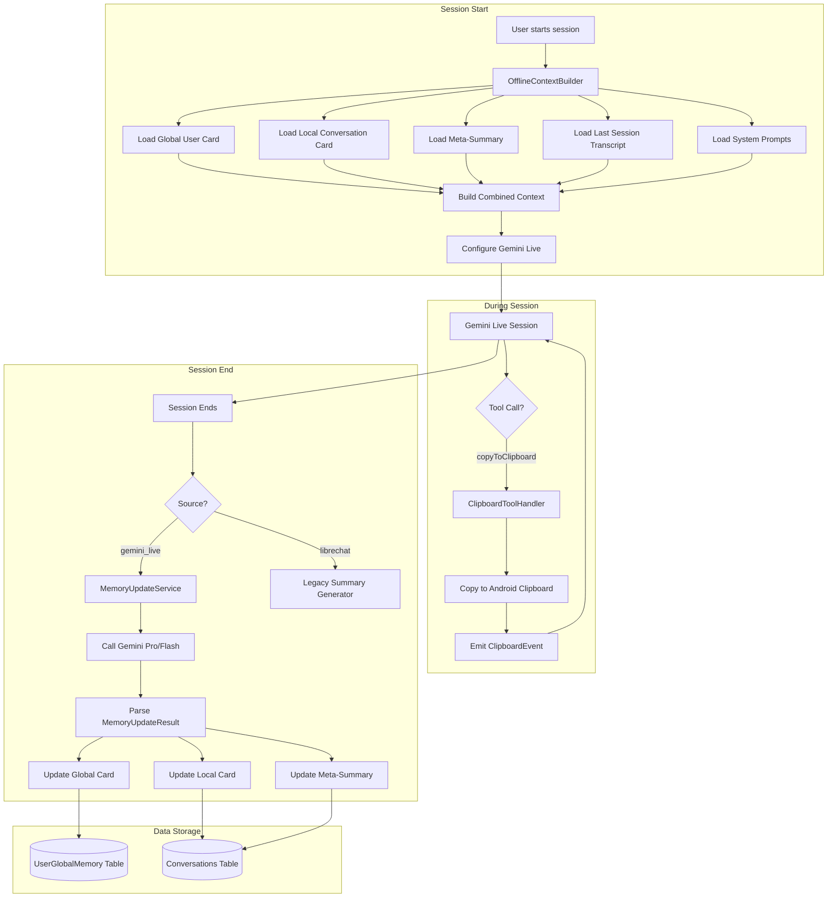

# Design Document: Advanced Offline Context Pipeline

## Overview

The Advanced Offline Context Pipeline replaces the current simple summary-based memory system with a sophisticated structured memory architecture. The system uses User Cards (Global and Local), Meta-Summaries, and a Clipboard Tool to provide contextual continuity across voice conversation sessions.

### Key Components

1. **OfflineContextBuilder** - Assembles memory data into a single prompt for Gemini Live at session start
2. **MemoryUpdateService** - Uses Gemini Pro/Flash to update memory structures after session end
3. **SystemPrompts** - Centralized configuration for all system prompts
4. **Clipboard Tool** - Gemini Live Function Calling tool for clipboard operations
5. **Domain Models** - GlobalUserCard, LocalConversationCard, MemoryUpdateResult

### Design Principles

- **Separation of Concerns**: LibreChat and Offline conversations use different memory approaches
- **Graceful Degradation**: Memory update failures don't crash the app
- **Token Efficiency**: Context is structured to maximize information within token limits
- **Centralized Configuration**: All prompts in one place for easy maintenance

## Architecture



## Components and Interfaces

### 1. Domain Models

```kotlin
// Global User Card - persistent facts across all conversations
@Serializable
data class GlobalUserCard(
    val userName: String? = null,
    val preferences: List<String> = emptyList(),
    val knownLanguages: List<String> = emptyList(),
    val professionalBackground: String? = null,
    val generalFacts: Map<String, String> = emptyMap()
)

// Local Conversation Card - facts specific to one conversation
@Serializable
data class LocalConversationCard(
    val currentTopic: String? = null,
    val projectState: String? = null,
    val userGoals: List<String> = emptyList(),
    val agreedFacts: List<String> = emptyList(),
    val pendingQuestions: List<String> = emptyList()
)

// Result from Memory Update LLM call
@Serializable
data class MemoryUpdateResult(
    @SerialName("session_summary")
    val sessionSummary: String,
    val updatedGlobalCard: GlobalUserCard,
    val updatedLocalCard: LocalConversationCard,
    val updatedMetaSummary: String
)
```

### 2. Global Memory Storage (DataStore)

Instead of a SQLite table, Global User Card is stored using Android DataStore for simplicity and performance:

```kotlin
// GlobalMemoryDataStore - uses Preferences DataStore
class GlobalMemoryDataStore(private val context: Context) {
    private val dataStore = context.dataStore
    
    companion object {
        private val USER_CARD_JSON_KEY = stringPreferencesKey("user_card_json")
        private val Context.dataStore by preferencesDataStore(name = "global_memory")
    }
    
    suspend fun getGlobalUserCard(): GlobalUserCard
    suspend fun saveGlobalUserCard(card: GlobalUserCard)
    fun observeGlobalUserCard(): Flow<GlobalUserCard>
}

### 3. Database Entities

```kotlin
// Updated ConversationEntity (removed customSummaryPrompt, copySummaryToClipboard)
@Entity(tableName = "conversations")
data class ConversationEntity(
    @PrimaryKey
    val id: String,
    val title: String?,
    @ColumnInfo(name = "created_at")
    val createdAt: Long,
    @ColumnInfo(name = "last_session_at")
    val lastSessionAt: Long,
    @ColumnInfo(name = "session_count")
    val sessionCount: Int = 0,
    @ColumnInfo(name = "total_duration_seconds")
    val totalDurationSeconds: Int = 0,
    @ColumnInfo(name = "document_count")
    val documentCount: Int = 0,
    @ColumnInfo(name = "meta_summary")
    val metaSummary: String? = null,
    val source: String = "gemini_live",
    val metadata: String? = null,
    // NEW: Local conversation card
    @ColumnInfo(name = "local_card_json")
    val localCardJson: String? = null,
    // NEW: Last updated timestamp for memory
    @ColumnInfo(name = "last_updated_at")
    val lastUpdatedAt: Long = System.currentTimeMillis(),
    // NEW: Memory update in progress flag
    @ColumnInfo(name = "memory_update_pending")
    val memoryUpdatePending: Boolean = false
)
```

### 4. OfflineContextBuilder

```kotlin
class OfflineContextBuilder(
    private val conversationRepository: ConversationRepository,
    private val sessionRepository: SessionRepository,
    private val globalMemoryDataStore: GlobalMemoryDataStore,
    private val systemPrompts: SystemPrompts,
    private val json: Json
) {
    companion object {
        // APPROVED LIMIT: 30k characters = ~7.5k tokens
        // With 128k token window in Gemini 2.5 Flash Live, this is ~6% of input
        // Safe value leaving room for >1h conversation
        const val MAX_CONTEXT_LENGTH = 30000 // characters
        const val MAX_TRANSCRIPT_LENGTH = 15000 // characters for last transcript
    }
    
    suspend fun buildContext(conversationId: String): String
    suspend fun getContextStats(conversationId: String): ContextStats
}
```

### 5. MemoryUpdateService

```kotlin
class MemoryUpdateService(
    private val geminiClient: GenerativeModel,
    private val conversationRepository: ConversationRepository,
    private val globalMemoryDataStore: GlobalMemoryDataStore,
    private val systemPrompts: SystemPrompts,
    private val json: Json
) {
    suspend fun updateMemoryAfterSession(
        conversationId: String,
        newTranscript: String
    ): Result<MemoryUpdateResult>
    
    internal fun parseMemoryUpdateResult(jsonText: String): MemoryUpdateResult
    internal fun cleanJsonBlock(text: String): String
}
```

### 6. Gemini Live Session Configuration

```kotlin
// Session configuration with context window compression for long conversations
fun createLiveSessionConfig(contextString: String, tools: List<Tool>): LiveServerConfig {
    return LiveServerConfig(
        generationConfig = GenerationConfig(
            // Critical for long conversations (>1 hour):
            // Enables automatic context compression when approaching token limit
            contextWindowCompression = ContextWindowCompression(
                // Optional: trigger at 100k tokens (default is ~80% of 128k)
                triggerTokens = 100000
            )
        ),
        systemInstruction = Content(
            parts = listOf(TextPart(contextString)) // Max ~7.5k tokens
        ),
        tools = tools
    )
}
```

### 7. SystemPrompts

```kotlin
object SystemPrompts {
    // Tools instruction for Gemini Live
    val toolsInstruction: String
    
    // Summary prompt for LibreChat conversations
    val libreChatSummaryPrompt: String
    
    // Memory update instruction (internal, not user-editable)
    // Includes explicit limit: "Keep total Meta-Summary under 1000 words.
    // If exceeding limit, condense the earliest parts of the narrative while
    // preserving the most recent events in full detail."
    val memoryUpdateInstruction: String
    
    // Default system prompt for conversations
    val defaultSystemPrompt: String
}
```

### 8. Clipboard Tool

```kotlin
// Tool definition for Gemini Live
fun copyToClipboardToolDefinition(): JsonObject

// Tool handler
class ClipboardToolHandler(
    private val context: Context,
    private val eventEmitter: ClipboardEventEmitter
) {
    fun handleCopyToClipboard(text: String): ToolResponse
}

// Event for UI feedback
data class ClipboardEvent(
    val text: String,
    val timestamp: Long = System.currentTimeMillis()
)
```

### 9. Memory Update Lock (Race Condition Prevention)

To prevent race conditions when user quickly starts a new session after ending one:

```kotlin
// UI displays "Zapisuję wspomnienia..." instead of conversation title
// when memoryUpdatePending = true

class ConversationLockManager(
    private val conversationRepository: ConversationRepository
) {
    // Called at session end, before starting memory update
    suspend fun lockConversation(conversationId: String) {
        conversationRepository.setMemoryUpdatePending(conversationId, true)
    }
    
    // Called after memory update completes (success or failure)
    suspend fun unlockConversation(conversationId: String) {
        conversationRepository.setMemoryUpdatePending(conversationId, false)
    }
    
    // Check if conversation can be started
    suspend fun canStartSession(conversationId: String): Boolean {
        val conversation = conversationRepository.getConversation(conversationId)
        return conversation?.memoryUpdatePending != true
    }
}

// UI behavior:
// - If memoryUpdatePending == true: show "Zapisuję wspomnienia..." and disable Start button
// - If memoryUpdatePending == false: show normal title and enable Start button
```

## Data Models

### Storage Changes

**Global User Card** - stored in Android DataStore (Preferences):
- Key: `user_card_json`
- Value: Serialized GlobalUserCard JSON

**Conversations Table** - Room database changes:
```sql
-- Modified conversations table (conceptual - actual change via Room)
ALTER TABLE conversations ADD COLUMN local_card_json TEXT;
ALTER TABLE conversations ADD COLUMN last_updated_at INTEGER NOT NULL DEFAULT 0;
ALTER TABLE conversations ADD COLUMN memory_update_pending INTEGER NOT NULL DEFAULT 0;
ALTER TABLE conversations DROP COLUMN custom_summary_prompt;
ALTER TABLE conversations DROP COLUMN copy_summary_to_clipboard;
```

### JSON Schemas

**GlobalUserCard:**
```json
{
  "userName": "string | null",
  "preferences": ["string"],
  "knownLanguages": ["string"],
  "professionalBackground": "string | null",
  "generalFacts": { "key": "value" }
}
```

**LocalConversationCard:**
```json
{
  "currentTopic": "string | null",
  "projectState": "string | null",
  "userGoals": ["string"],
  "agreedFacts": ["string"],
  "pendingQuestions": ["string"]
}
```

## Correctness Properties

*A property is a characteristic or behavior that should hold true across all valid executions of a system-essentially, a formal statement about what the system should do. Properties serve as the bridge between human-readable specifications and machine-verifiable correctness guarantees.*

Based on the prework analysis, the following properties have been identified. Redundant properties have been consolidated.

### Property 1: Global User Card Round-Trip Serialization
*For any* valid GlobalUserCard object, serializing to JSON and then deserializing SHALL produce an equivalent object.
**Validates: Requirements 1.4**

### Property 2: Local Conversation Card Round-Trip Serialization
*For any* valid LocalConversationCard object, serializing to JSON and then deserializing SHALL produce an equivalent object.
**Validates: Requirements 2.5**

### Property 3: Context Builder Includes All Memory Components
*For any* conversation with non-null Global User Card, Local Conversation Card, and Meta-Summary, the built context string SHALL contain all three components with appropriate section delimiters.
**Validates: Requirements 1.1, 2.1, 3.1, 5.1, 5.4**

### Property 4: Context Builder Handles Null Fields Gracefully
*For any* conversation with null localCardJson or null metaSummary, the Context Builder SHALL treat them as empty/default values and produce a valid context string without errors.
**Validates: Requirements 2.4, 3.4**

### Property 5: Context Truncation Preserves Cards and Meta-Summary
*For any* context that exceeds MAX_CONTEXT_LENGTH, the truncated result SHALL contain the complete Global User Card, Local Conversation Card, and Meta-Summary, with only the Last Session Transcript being truncated.
**Validates: Requirements 5.2**

### Property 6: Clipboard Tool Response Format
*For any* text input to the copyToClipboard tool handler, the response SHALL be a valid ToolResponse with status "success" or "error".
**Validates: Requirements 4.3**

### Property 7: Clipboard Event Emission
*For any* successful clipboard operation, the system SHALL emit a ClipboardEvent containing the copied text.
**Validates: Requirements 4.4**

### Property 8: Memory Update Error Handling
*For any* invalid JSON response from the LLM, the MemoryUpdateService SHALL return a failure Result without throwing an exception, preserving existing memory state.
**Validates: Requirements 6.1, 6.3, 6.4**

### Property 9: Conversation Source Determines Summary Approach
*For any* conversation, the summary approach used SHALL be determined by the source field: "gemini_live" uses MemoryUpdateService, "librechat" uses legacy summary generator.
**Validates: Requirements 9.1, 9.2, 9.3, 9.4**

### Property 10: SystemPrompts Provides Non-Null Defaults
*For any* prompt type requested from SystemPrompts, the returned value SHALL be non-null and non-empty.
**Validates: Requirements 10.2, 10.3, 10.4, 10.5**

### Property 11: Memory Update Uses Global Instruction
*For any* offline conversation memory update, the instruction prompt used SHALL be the global memoryUpdateInstruction from SystemPrompts, not a per-conversation prompt.
**Validates: Requirements 8.3**

### Property 12: Context Window Compression Configuration
*For any* Gemini Live session initialization, the configuration sent to the server SHALL include the contextWindowCompression object with appropriate triggerTokens setting.
**Validates: Requirements 5.4, 5.5**

### Property 13: Memory Update Lock Prevents Race Conditions
*For any* conversation with memoryUpdatePending = true, the canStartSession() method SHALL return false, preventing new session start until memory update completes.
**Validates: Requirements 6.5**

## Error Handling

### Memory Update Failures

1. **Invalid JSON Response**: Log error, return Result.failure(), preserve existing memory
2. **Network Unavailable**: Queue task via WorkManager for retry when network returns
3. **Parsing Errors**: Use lenient JSON parsing, log malformed sections, extract what's possible
4. **Timeout**: Return failure after reasonable timeout (30 seconds), don't block UI

### Context Building Failures

1. **Database Errors**: Return empty context, log error, session can still start
2. **Null Conversation**: Return empty context with warning log
3. **Serialization Errors**: Skip problematic section, include others

### Clipboard Tool Failures

1. **Clipboard Service Unavailable**: Return error response to Gemini, emit error event
2. **Empty Text**: Return error response, don't attempt clipboard operation

## Testing Strategy

### Dual Testing Approach

The testing strategy combines unit tests for specific examples and property-based tests for universal properties.

### Property-Based Testing

**Library**: [Kotest](https://kotest.io/) with Property Testing module

**Configuration**: Each property test runs minimum 100 iterations.

**Properties to Test**:

1. **GlobalUserCard Round-Trip** (Property 1)
   - Generate random GlobalUserCard instances
   - Serialize to JSON, deserialize back
   - Assert equality

2. **LocalConversationCard Round-Trip** (Property 2)
   - Generate random LocalConversationCard instances
   - Serialize to JSON, deserialize back
   - Assert equality

3. **Context Builder Completeness** (Property 3)
   - Generate random memory components
   - Build context
   - Assert all components present with delimiters

4. **Null Field Handling** (Property 4)
   - Generate conversations with null fields
   - Build context
   - Assert no exceptions, valid output

5. **Truncation Preservation** (Property 5)
   - Generate oversized contexts
   - Truncate
   - Assert Cards and Meta-Summary intact

6. **Clipboard Response Format** (Property 6)
   - Generate random text inputs
   - Call handler
   - Assert valid response structure

7. **Clipboard Event Emission** (Property 7)
   - Generate random clipboard operations
   - Assert event emitted with correct text

8. **Error Handling** (Property 8)
   - Generate malformed JSON strings
   - Call parser
   - Assert Result.failure() returned, no exceptions

9. **Source-Based Routing** (Property 9)
   - Generate conversations with different sources
   - Assert correct handler invoked

10. **SystemPrompts Defaults** (Property 10)
    - Access all prompt types
    - Assert non-null, non-empty

11. **Global Instruction Usage** (Property 11)
    - Trigger memory update
    - Assert global instruction used

12. **Context Compression Config** (Property 12)
    - Create session config
    - Assert contextWindowCompression present

13. **Memory Update Lock** (Property 13)
    - Set memoryUpdatePending = true
    - Assert canStartSession() returns false

### Unit Tests

- Database entity creation and queries
- Specific edge cases (empty strings, special characters)
- Integration with Android clipboard service (mocked)
- WorkManager task queuing
- DataStore read/write operations

### Test Annotations

Each property-based test MUST include a comment referencing the design document:
```kotlin
/**
 * **Feature: advanced-offline-context-pipeline, Property 1: Global User Card Round-Trip Serialization**
 */
```

