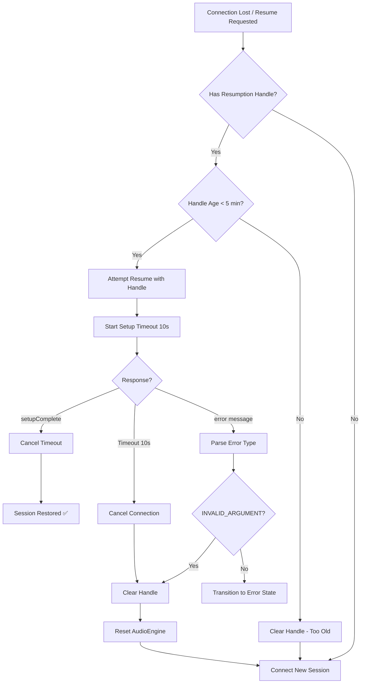

# Design Document - Audio Concurrency Fixes

## Overview

This document describes the technical design for fixing audio concurrency bugs in the AudioEngine component. The fixes focus on proper synchronization, resource management, and correct operation ordering to eliminate audio artifacts (pops, clicks, overlapping audio).

## Architecture

### Component Diagram

```
┌─────────────────────────────────────────────────────────────────────┐
│                        VoiceClientManager                            │
│  ┌─────────────────────┐    ┌─────────────────────────────────────┐ │
│  │ eventProcessingMutex│    │        processEvent()               │ │
│  │     (existing)      │───▶│  - Synchronizes state transitions   │ │
│  └─────────────────────┘    │  - Executes side effects            │ │
│                             └─────────────────────────────────────┘ │
└─────────────────────────────────────────────────────────────────────┘
                                        │
                                        ▼
┌─────────────────────────────────────────────────────────────────────┐
│                          AudioEngine                                 │
│                                                                      │
│  ┌──────────────────┐  ┌──────────────────┐  ┌──────────────────┐  │
│  │  audioTrackMutex │  │  audioQueueMutex │  │ playbackStateMutex│  │
│  │    (existing)    │  │    (existing)    │  │     (NEW)        │  │
│  └────────┬─────────┘  └────────┬─────────┘  └────────┬─────────┘  │
│           │                     │                     │            │
│           ▼                     ▼                     ▼            │
│  ┌──────────────────────────────────────────────────────────────┐  │
│  │                    Playback Operations                        │  │
│  │  - startPlayback()  - stopPlayback()  - interruptPlayback()  │  │
│  │  - queueAudio()     - clearAudioQueue()                      │  │
│  └──────────────────────────────────────────────────────────────┘  │
│                                                                      │
│  ┌──────────────────────────────────────────────────────────────┐  │
│  │                    Recording Operations                       │  │
│  │  - startRecording() - stopRecording() - pauseRecording()     │  │
│  │  - resumeRecording()                                          │  │
│  └──────────────────────────────────────────────────────────────┘  │
└─────────────────────────────────────────────────────────────────────┘
```

### Synchronization Strategy

**Three-Mutex Design:**

1. **audioTrackMutex** (existing) - Protects AudioTrack instance operations
2. **audioQueueMutex** (existing) - Protects audio queue operations  
3. **playbackStateMutex** (NEW) - Protects playback state transitions (start/stop)

**Lock Ordering (to prevent deadlocks):**
```
playbackStateMutex → audioTrackMutex → audioQueueMutex
```

## Detailed Design

### 1. Single AudioTrack Instance Management (Requirement 1)

**Problem:** `startPlayback()` can create duplicate AudioTrack instances.

**Solution:** Add guard check at start of `startPlayback()`:

```kotlin
// AudioEngine.kt - startPlayback()
fun startPlayback() {
    // CRITICAL: Check if already playing - prevent duplicate AudioTrack
    if (_isPlaying.value) {
        Log.w(TAG, "startPlayback: Already playing, ignoring duplicate call")
        return
    }
    
    // CRITICAL: Check if AudioTrack already exists
    if (audioTrack != null) {
        Log.w(TAG, "startPlayback: AudioTrack already exists, reusing")
        if (audioTrack?.playState != AudioTrack.PLAYSTATE_PLAYING) {
            try {
                audioTrack?.play()
            } catch (e: Exception) {
                Log.e(TAG, "Error resuming existing AudioTrack", e)
            }
        }
        _isPlaying.value = true
        startPlaybackLoop()
        return
    }
    
    // ... existing AudioTrack creation code ...
}
```

### 2. Playback State Mutex (Requirements 1, 5, 7)

**Problem:** Race conditions between startPlayback/stopPlayback calls.

**Solution:** Add new mutex for playback state transitions:

```kotlin
// AudioEngine.kt - new field
private val playbackStateMutex = Mutex()

// startPlayback() - wrap in mutex
suspend fun startPlaybackSafe() {
    playbackStateMutex.withLock {
        startPlaybackInternal()
    }
}

// stopPlayback() - wrap in mutex  
suspend fun stopPlaybackSafe() {
    playbackStateMutex.withLock {
        stopPlaybackInternal()
    }
}
```

**Note:** Keep synchronous versions for backward compatibility, add `*Safe` variants for critical paths.

### 3. Synchronized stopPlayback (Requirements 2, 6, 7)

**Problem:** `stopPlayback()` clears queue in separate coroutine, doesn't flush AudioTrack.

**Solution:** Make stopPlayback synchronous and complete:

```kotlin
// AudioEngine.kt - stopPlayback()
fun stopPlayback() {
    if (!_isPlaying.value) {
        Log.w(TAG, "Playback not started")
        return
    }
    
    try {
        _isPlaying.value = false
        
        // 1. Cancel playback coroutine FIRST
        playbackJob?.cancel()
        playbackJob = null
        
        // 2. Clear queue SYNCHRONOUSLY (not in separate coroutine)
        runBlocking {
            audioQueueMutex.withLock {
                val queueSize = audioQueue.size
                audioQueue.clear()
                Log.d(TAG, "Cleared $queueSize chunks from queue")
            }
        }
        
        // 3. Stop, FLUSH, then release AudioTrack
        audioTrackMutex.withLock {
            try {
                audioTrack?.stop()
                audioTrack?.flush()  // CRITICAL: Flush before release
                audioTrack?.release()
            } catch (e: Exception) {
                Log.e(TAG, "Error stopping AudioTrack", e)
            }
            audioTrack = null
        }
        
        _botAudioLevel.value = 0f
        listener?.onPlaybackStopped()
        
        Log.i(TAG, "Playback stopped")
    } catch (e: Exception) {
        Log.e(TAG, "Error stopping playback", e)
    }
}
```

### 4. Enhanced clearAudioQueue (Requirement 3)

**Problem:** `clearAudioQueue()` doesn't flush AudioTrack buffer.

**Solution:** Add AudioTrack flush to clearAudioQueue:

```kotlin
// AudioEngine.kt - clearAudioQueue()
fun clearAudioQueue() {
    // Increment generation ID to invalidate in-flight chunks
    val newGenId = currentGenerationId.incrementAndGet()
    Log.i(TAG, "clearAudioQueue: New generation ID = $newGenId")
    
    scope.launch(Dispatchers.Default) {
        try {
            // 1. Clear the queue
            audioQueueMutex.withLock {
                val queueSize = audioQueue.size
                audioQueue.clear()
                Log.i(TAG, "Cleared audio queue ($queueSize chunks discarded)")
            }
            
            // 2. Flush AudioTrack buffer (if playing)
            audioTrackMutex.withLock {
                val track = audioTrack
                if (track != null && track.state == AudioTrack.STATE_INITIALIZED) {
                    try {
                        track.pause()
                        track.flush()
                        track.play()
                        Log.i(TAG, "AudioTrack buffer flushed")
                    } catch (e: Exception) {
                        Log.w(TAG, "Error flushing AudioTrack: ${e.message}")
                    }
                }
            }
        } catch (e: Exception) {
            Log.e(TAG, "Error clearing audio queue: ${e.message}", e)
        }
    }
}
```

### 5. Playback Coroutine Cancellation (Requirement 7)

**Problem:** Playback coroutine may continue after stopPlayback.

**Solution:** Use Job reference and proper cancellation:

```kotlin
// AudioEngine.kt - playback loop
private fun startPlaybackLoop() {
    // Cancel any existing playback job
    playbackJob?.cancel()
    
    playbackJob = scope.launch(Dispatchers.Default) {
        try {
            Log.i(TAG, "Playback loop started")
            
            while (isActive && _isPlaying.value) {
                // ... existing loop code ...
            }
            
            Log.i(TAG, "Playback loop ended normally")
        } catch (e: CancellationException) {
            Log.d(TAG, "Playback loop cancelled (normal)")
            // Don't re-throw - this is expected during stopPlayback
        } catch (e: Exception) {
            Log.e(TAG, "Error in playback loop", e)
        } finally {
            // Cleanup on any exit
            _botAudioLevel.value = 0f
        }
    }
}
```

### 6. Improved interruptPlayback (Requirement 8)

**Current implementation is good but can be improved:**

```kotlin
// AudioEngine.kt - interruptPlayback()
fun interruptPlayback() {
    // 1. Increment generation FIRST (atomic, immediate)
    val newId = currentGenerationId.incrementAndGet()
    Log.i(TAG, "🛑 Interrupting playback (New GenID: $newId)")
    
    // 2. Flush AudioTrack SYNCHRONOUSLY
    try {
        audioTrackMutex.withLock {
            val track = audioTrack
            if (track != null && track.state == AudioTrack.STATE_INITIALIZED) {
                track.pause()
                track.flush()
                track.play()
                Log.i(TAG, "✅ AudioTrack flushed")
            }
        }
    } catch (e: Exception) {
        Log.e(TAG, "Error flushing AudioTrack: ${e.message}", e)
    }
    
    // 3. Clear queue asynchronously (already invalidated by generation ID)
    scope.launch(Dispatchers.Default) {
        audioQueueMutex.withLock {
            val queueSize = audioQueue.size
            audioQueue.clear()
            if (queueSize > 0) {
                Log.i(TAG, "🛑 Cleared $queueSize chunks from queue")
            }
        }
    }
}
```

**Note:** Current implementation doesn't use mutex for AudioTrack access - this is a bug.

## Data Flow

### Normal Playback Flow

```
1. BotAudioReceived event
   │
   ▼
2. State Machine: Listening → Speaking
   │
   ▼
3. Side Effects: [StartPlayback, QueueAudio]
   │
   ├──▶ StartPlayback
   │    │
   │    ▼
   │    AudioEngine.startPlayback()
   │    - Check _isPlaying (guard)
   │    - Check audioTrack exists (guard)
   │    - Create AudioTrack
   │    - Start playback loop
   │
   └──▶ QueueAudio
        │
        ▼
        AudioEngine.queueAudio(data)
        - Get current generation ID
        - Add AudioChunk to queue (with mutex)
```

### Interruption Flow

```
1. User speaks (Interrupted event)
   │
   ▼
2. State Machine: Speaking → Listening
   │
   ▼
3. Side Effects: [ClearAudioQueue, StopPlayback, ...]
   │
   ├──▶ ClearAudioQueue
   │    │
   │    ▼
   │    AudioEngine.clearAudioQueue()
   │    - Increment generation ID (atomic)
   │    - Clear queue (with mutex)
   │    - Flush AudioTrack buffer (with mutex)
   │
   └──▶ StopPlayback
        │
        ▼
        AudioEngine.stopPlayback()
        - Set _isPlaying = false
        - Cancel playback job
        - Clear queue (synchronous)
        - Stop, flush, release AudioTrack
```

## Implementation Tasks

### Task 1: Add Playback Guards (Requirement 1)
- File: `AudioEngine.kt`
- Method: `startPlayback()`
- Add: Guard checks for `_isPlaying` and `audioTrack != null`

### Task 2: Fix stopPlayback Synchronization (Requirements 2, 6, 7)
- File: `AudioEngine.kt`
- Method: `stopPlayback()`
- Changes:
  - Clear queue synchronously (not in coroutine)
  - Add `flush()` before `release()`
  - Use mutex for AudioTrack operations

### Task 3: Enhance clearAudioQueue (Requirement 3)
- File: `AudioEngine.kt`
- Method: `clearAudioQueue()`
- Add: AudioTrack flush after clearing queue

### Task 4: Fix interruptPlayback Mutex (Requirement 8)
- File: `AudioEngine.kt`
- Method: `interruptPlayback()`
- Add: Use `audioTrackMutex` for AudioTrack operations

### Task 5: Add Playback State Mutex (Requirement 5)
- File: `AudioEngine.kt`
- Add: `playbackStateMutex` field
- Add: `startPlaybackSafe()` and `stopPlaybackSafe()` methods

## Testing Strategy

### Unit Tests

1. **Test: Duplicate startPlayback calls**
   - Call startPlayback() twice rapidly
   - Verify only one AudioTrack created

2. **Test: stopPlayback clears queue**
   - Queue 10 audio chunks
   - Call stopPlayback()
   - Verify queue is empty

3. **Test: clearAudioQueue flushes AudioTrack**
   - Start playback with audio
   - Call clearAudioQueue()
   - Verify AudioTrack.flush() was called

4. **Test: Generation ID invalidation**
   - Queue audio with genId=1
   - Call interruptPlayback() (genId=2)
   - Queue more audio with genId=2
   - Verify old chunks are skipped

### Integration Tests

1. **Test: Rapid bot responses**
   - Send 5 bot audio chunks in 100ms
   - Verify no overlapping audio

2. **Test: Interrupt during playback**
   - Start bot audio
   - Trigger interruption after 500ms
   - Verify audio stops within 100ms

### Manual Tests

1. Bot speaks for 10 seconds - smooth audio
2. Interrupt bot mid-sentence - immediate stop
3. Rapid conversation - no pops/clicks
4. Pause during bot speech - clean stop

## Risks and Mitigations

| Risk | Impact | Mitigation |
|------|--------|------------|
| Deadlock from mutex ordering | High | Strict lock ordering: playbackState → audioTrack → audioQueue |
| Performance impact from synchronization | Medium | Use fine-grained locks, minimize critical sections |
| Breaking existing functionality | High | Keep synchronous methods, add *Safe variants |
| AudioTrack state errors | Medium | Defensive checks before all AudioTrack operations |

## Success Criteria

1. ✅ No duplicate AudioTrack instances
2. ✅ No pops, clicks, or audio artifacts
3. ✅ Interruption stops audio within 100ms
4. ✅ No ConcurrentModificationException crashes
5. ✅ All existing tests pass
6. ✅ Manual testing confirms smooth audio

---

## Part 2: Session Lifecycle & Resumption Fixes

### Overview

This section addresses critical connection stability issues where the app hangs during session resumption due to unhandled server-side timeouts, missing error parsing, and invalid resumption handle reuse.

**Problem Summary:**
- Gemini API expires sessions after 5-10 minutes server-side
- App only checks 2-hour client-side timeout
- No error message handling from Gemini API
- No setup timeout detection (waits indefinitely)
- Resumption handle not cleared on automatic restart

### Session Resumption Architecture

```
┌─────────────────────────────────────────────────────────────────────┐
│                     VoiceClientManager                               │
│                                                                      │
│  ┌─────────────────────────────────────────────────────────────┐   │
│  │                  Connection State Machine                    │   │
│  │                                                              │   │
│  │   ┌──────┐    ┌────────────┐    ┌──────────┐    ┌───────┐  │   │
│  │   │ Idle │───▶│ Connecting │───▶│ Listening │◀──▶│Speaking│  │   │
│  │   └──────┘    └────────────┘    └──────────┘    └───────┘  │   │
│  │       ▲            │                  │                     │   │
│  │       │            ▼                  ▼                     │   │
│  │       │      ┌──────────┐       ┌──────────┐               │   │
│  │       └──────│  Error   │◀──────│  Paused  │               │   │
│  │              └──────────┘       └──────────┘               │   │
│  └─────────────────────────────────────────────────────────────┘   │
│                                                                      │
│  ┌─────────────────────────────────────────────────────────────┐   │
│  │              Session Resumption Logic (NEW)                  │   │
│  │                                                              │   │
│  │  ┌─────────────────┐  ┌─────────────────┐  ┌─────────────┐ │   │
│  │  │ setupTimeoutJob │  │ errorMessageParser│  │fallbackLogic│ │   │
│  │  │   (10 seconds)  │  │ (Gemini errors)  │  │(smart retry)│ │   │
│  │  └─────────────────┘  └─────────────────┘  └─────────────┘ │   │
│  └─────────────────────────────────────────────────────────────┘   │
└─────────────────────────────────────────────────────────────────────┘
```

### Resumption Flow Diagram



### Detailed Design

#### 1. Enhanced Error Message Handling (Bug #1 Fix)

**Problem:** Gemini sends error messages that are ignored, causing infinite waiting.

**Solution:** Parse error messages in `handleTextMessage()`:

```kotlin
// VoiceClientManager.kt or WebSocketClient.kt
private fun handleTextMessage(text: String) {
    val json = JSONObject(text)
    
    // NEW: Check for error field FIRST
    if (json.has("error")) {
        val error = json.getJSONObject("error")
        val code = error.optString("code", "UNKNOWN")
        val message = error.optString("message", "Unknown error")
        
        Log.e(TAG, "🚨 Gemini Error: code=$code, message=$message")
        
        handleGeminiError(code, message)
        return
    }
    
    // ... existing message handling ...
}

private fun handleGeminiError(code: String, message: String) {
    when (code) {
        "INVALID_ARGUMENT" -> {
            // Session handle is invalid/expired
            Log.w(TAG, "Session handle invalid - falling back to new session")
            fallbackToNewSession()
        }
        "RESOURCE_EXHAUSTED" -> {
            // Rate limited
            processEvent(VoiceEvent.WebSocketError("Rate limited: $message", isRecoverable = true))
        }
        "UNAVAILABLE" -> {
            // Service temporarily unavailable
            processEvent(VoiceEvent.WebSocketError("Service unavailable: $message", isRecoverable = true))
        }
        else -> {
            // Unknown error
            processEvent(VoiceEvent.WebSocketError("Gemini error: $message", isRecoverable = false))
        }
    }
}
```

#### 2. Setup Timeout Watchdog (Bug #2 Fix)

**Problem:** App waits indefinitely for `setupComplete` that never arrives.

**Solution:** Add 10-second timeout after sending setup message:

```kotlin
// VoiceClientManager.kt
private var setupTimeoutJob: Job? = null
private const val SETUP_TIMEOUT_MS = 10_000L

private fun startSetupTimeout() {
    setupTimeoutJob?.cancel()
    setupTimeoutJob = scope?.launch {
        delay(SETUP_TIMEOUT_MS)
        Log.e(TAG, "⏰ Setup timeout - no setupComplete received in ${SETUP_TIMEOUT_MS}ms")
        handleSetupTimeout()
    }
}

private fun cancelSetupTimeout() {
    setupTimeoutJob?.cancel()
    setupTimeoutJob = null
}

private fun handleSetupTimeout() {
    Log.w(TAG, "Setup timeout - attempting fallback to new session")
    
    // Close current connection
    webSocketClient.disconnect()
    
    // Clear potentially invalid handle
    sessionStateManager.clearSessionHandle()
    
    // Try new session
    fallbackToNewSession()
}

// In connect() or when sending setup message:
private fun sendSetupMessage(setupMessage: String) {
    webSocketClient.send(setupMessage)
    startSetupTimeout()  // NEW: Start watchdog
}

// In handleTextMessage when setupComplete received:
if (json.has("setupComplete")) {
    cancelSetupTimeout()  // NEW: Cancel watchdog
    processEvent(VoiceEvent.SetupComplete)
}
```

#### 3. Smart Fallback Strategy (Bug #4 & #5 Fix)

**Problem:** Automatic restarts reuse invalid handles, causing infinite reconnection loops.

**Solution:** Implement smart fallback with handle validation:

```kotlin
// SessionStateManager.kt - Add handle age tracking
data class SessionHandle(
    val handle: String,
    val createdAt: Long = System.currentTimeMillis(),
    val resumable: Boolean = true
) {
    fun isExpired(): Boolean {
        // Gemini expires handles after ~5-10 minutes
        // Use conservative 5-minute threshold
        val ageMs = System.currentTimeMillis() - createdAt
        return ageMs > 5 * 60 * 1000L
    }
}

// VoiceClientManager.kt
private fun fallbackToNewSession() {
    Log.i(TAG, "🔄 Falling back to new session")
    
    scope?.launch {
        // 1. Clear invalid handle
        sessionStateManager.clearSessionHandle()
        
        // 2. CRITICAL: Reset AudioEngine to prevent stale audio
        audioEngine.stopPlayback()
        audioEngine.clearAudioQueue()
        
        // 3. Reset reconnection counter
        reconnectionManager.resetAttempts()
        
        // 4. Small delay to let resources clean up
        delay(500)
        
        // 5. Start fresh session (no resumption handle)
        start(currentThreadSettings, forceNewSession = true)
    }
}

// Modified start() to support forced new session
fun start(threadSettings: ThreadSettings?, forceNewSession: Boolean = false) {
    // ... existing setup ...
    
    val resumptionHandle = if (forceNewSession) {
        null  // Don't use handle even if available
    } else {
        sessionStateManager.getSessionHandle()?.takeIf { !it.isExpired() }?.handle
    }
    
    // ... rest of start logic ...
}
```

#### 4. Integration with AudioEngine on Fallback

**Critical:** When session resumption fails, AudioEngine must be reset to prevent audio from failed session leaking into new session.

```kotlin
// VoiceClientManager.kt
private suspend fun recoverFromFailedResumption() {
    Log.i(TAG, "🔧 Recovering from failed resumption")
    
    // 1. Clear stale session handle
    sessionStateManager.clearSessionHandle()
    
    // 2. CRITICAL: Reset AudioEngine completely
    // This ensures no audio from failed session context leaks
    audioEngine.stopPlayback()
    audioEngine.clearAudioQueue()  // Also increments generation ID
    
    // 3. Reset state machine to Idle
    processEvent(VoiceEvent.StopRequested)
    
    // 4. Small delay for cleanup
    delay(300)
    
    // 5. Start new session
    start(currentThreadSettings, forceNewSession = true)
}
```

#### 5. State Machine Updates

Add new events and transitions for resumption handling:

```kotlin
// VoiceEvent.kt - Add new events
sealed class VoiceEvent {
    // ... existing events ...
    
    // NEW: Resumption-specific events
    data class ResumptionFailed(val reason: String) : VoiceEvent()
    object SetupTimeout : VoiceEvent()
    data class GeminiError(val code: String, val message: String) : VoiceEvent()
}

// VoiceSessionStateMachine.kt - Handle new events in Connecting state
private fun reduceConnecting(
    state: VoiceSessionState.Connecting,
    event: VoiceEvent
): ReduceResult {
    return when (event) {
        // ... existing cases ...
        
        is VoiceEvent.SetupTimeout -> {
            Log.w(TAG, "Setup timeout in Connecting state")
            ReduceResult(
                newState = VoiceSessionState.Idle,
                sideEffects = listOf(
                    SideEffect.Disconnect(),
                    SideEffect.ClearSessionHandle,
                    SideEffect.ClearAudioQueue,
                    SideEffect.ShowError("Connection timeout - retrying"),
                    SideEffect.StartNewSession  // NEW side effect
                )
            )
        }
        
        is VoiceEvent.ResumptionFailed -> {
            Log.w(TAG, "Resumption failed: ${event.reason}")
            ReduceResult(
                newState = VoiceSessionState.Idle,
                sideEffects = listOf(
                    SideEffect.Disconnect(),
                    SideEffect.ClearSessionHandle,
                    SideEffect.StopPlayback,
                    SideEffect.ClearAudioQueue,
                    SideEffect.StartNewSession
                )
            )
        }
        
        // ... rest of cases ...
    }
}
```

### Implementation Tasks (Session Resumption)

#### Task 6: Add Error Message Parsing
- File: `VoiceClientManager.kt` or `WebSocketClient.kt`
- Method: `handleTextMessage()`
- Add: Parse "error" field, call `handleGeminiError()`

#### Task 7: Add Setup Timeout Watchdog
- File: `VoiceClientManager.kt`
- Add: `setupTimeoutJob`, `startSetupTimeout()`, `cancelSetupTimeout()`
- Modify: Start timeout when sending setup, cancel on setupComplete

#### Task 8: Implement Smart Fallback
- File: `SessionStateManager.kt`
- Add: `SessionHandle` data class with `isExpired()`
- File: `VoiceClientManager.kt`
- Add: `fallbackToNewSession()`, `recoverFromFailedResumption()`
- Modify: `start()` to accept `forceNewSession` parameter

#### Task 9: Add State Machine Events
- File: `VoiceEvent.kt`
- Add: `ResumptionFailed`, `SetupTimeout`, `GeminiError`
- File: `VoiceSessionStateMachine.kt`
- Add: Handle new events in `reduceConnecting()`

#### Task 10: Add StartNewSession Side Effect
- File: `SideEffect.kt`
- Add: `StartNewSession` side effect
- File: `SideEffectExecutor.kt`
- Add: Execute `StartNewSession` by calling `start(forceNewSession = true)`

### Testing Strategy (Session Resumption)

#### Unit Tests

1. **Test: Error message parsing**
   - Send mock error JSON with INVALID_ARGUMENT
   - Verify `fallbackToNewSession()` is called

2. **Test: Setup timeout triggers**
   - Start connection, don't send setupComplete
   - Verify timeout fires after 10 seconds

3. **Test: Handle expiration check**
   - Create handle with old timestamp
   - Verify `isExpired()` returns true

4. **Test: Fallback resets AudioEngine**
   - Call `fallbackToNewSession()`
   - Verify `stopPlayback()` and `clearAudioQueue()` called

#### Integration Tests

1. **Test: Resume after 3 minutes pause**
   - Pause session for 3 minutes
   - Resume - should succeed with handle

2. **Test: Resume after 6 minutes pause**
   - Pause session for 6 minutes
   - Resume - should fallback to new session

3. **Test: Gemini rejects handle**
   - Mock Gemini error response
   - Verify app recovers with new session

### Manual Tests

1. Pause for 2 minutes, resume - should restore session
2. Pause for 7 minutes, resume - should start new session (no hang)
3. Kill network during connection - should timeout and retry
4. Rapid pause/resume cycles - no crashes or hangs

---

## Combined Success Criteria

### Audio Fixes
1. ✅ No duplicate AudioTrack instances
2. ✅ No pops, clicks, or audio artifacts
3. ✅ Interruption stops audio within 100ms
4. ✅ No ConcurrentModificationException crashes

### Session Resumption Fixes
5. ✅ No infinite "Connecting..." state after pause
6. ✅ Graceful fallback to new session when handle expires
7. ✅ Setup timeout prevents indefinite waiting
8. ✅ Gemini error messages are parsed and handled
9. ✅ AudioEngine is reset on session fallback

### Overall
10. ✅ All existing tests pass
11. ✅ Manual testing confirms smooth operation
