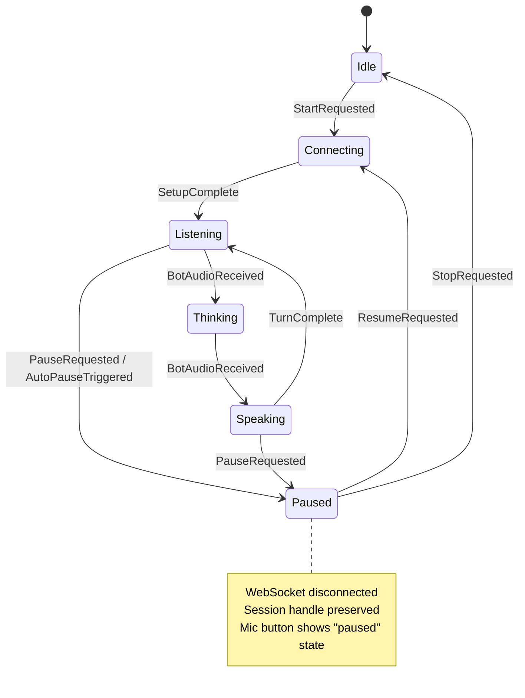

# Design Document: Audio Playback and Pause Fixes

## Overview

This design addresses critical issues with audio playback and pause/resume functionality discovered during Phase 3 integration testing. The main problems are:

1. **MicToggled event does nothing** - The state machine processes MicToggled but only toggles a flag without side effects
2. **StandaloneCoroutine cancellation treated as error** - Normal coroutine cancellation during stopPlayback is logged as error
3. **No proper pause/resume via mic button** - Button should pause/resume session, not toggle mic on/off
4. **Audio buffering issues** - Need proper generation ID tracking for interruption handling

The solution involves:
- Changing UserMicButton to call pause/resume instead of toggleMic
- Removing MicToggled event handling (mic is always on during active session)
- Fixing CancellationException handling in AudioEngine
- Ensuring audio generation ID is properly used for interruption

## Architecture



### Key Changes

1. **UserMicButton behavior change**:
   - Currently: Calls `toggleMic()` → sends `MicToggled` event → toggles `isMicEnabled` flag
   - New: Calls `pauseSession()`/`resumeSession()` → sends `PauseRequested`/`ResumeRequested` → transitions state

2. **Remove MicToggled handling**:
   - Remove `MicToggled` event from state machine
   - Mic is always enabled during active session (Listening, Thinking, Speaking)
   - Mic is disabled only when session is paused or stopped

3. **CancellationException handling**:
   - Catch `CancellationException` in AudioEngine playback loop
   - Log as debug instead of error
   - Don't call `onError` callback for cancellation

## Components and Interfaces

### UserMicButton Changes

```kotlin
// Current implementation
@Composable
fun UserMicButton(
    onClick: () -> Unit,  // Currently calls toggleMic()
    micEnabled: Boolean,
    ...
)

// New implementation - onClick should call pauseSession/resumeSession
// micEnabled should reflect isPaused state (false when paused)
```

### VoiceClientManager Changes

```kotlin
// Remove toggleMic() method
// Add or modify:

/**
 * Pause the current session.
 * Disconnects WebSocket but preserves session handle for resumption.
 */
fun pauseSession() {
    processEvent(VoiceEvent.PauseRequested)
}

/**
 * Resume a paused session.
 * Reconnects WebSocket using saved session handle.
 */
fun resumeSession() {
    val handle = sessionResumptionHandle
    if (handle != null) {
        // Build setup message with session handle
        val setupMessage = buildSetupMessageWithHandle(handle)
        processEvent(VoiceEvent.ResumeRequested(url, setupMessage))
    } else {
        // No handle, start fresh
        start(currentThreadSettings)
    }
}

/**
 * Toggle between paused and active state.
 * Called by mic button - replaces toggleMic().
 */
fun togglePause() {
    when (_sessionState.value) {
        is VoiceSessionState.Paused -> resumeSession()
        is VoiceSessionState.Listening,
        is VoiceSessionState.Speaking,
        is VoiceSessionState.Thinking -> pauseSession()
        else -> Log.w(TAG, "Cannot toggle pause in state: ${_sessionState.value}")
    }
}
```

### AudioEngine Changes

```kotlin
// In playback loop, catch CancellationException separately:
playbackJob = scope.launch(Dispatchers.Default) {
    try {
        while (isActive && _isPlaying.value) {
            // ... playback logic
        }
    } catch (e: CancellationException) {
        // Normal cancellation during stopPlayback - not an error
        Log.d(TAG, "Playback coroutine cancelled (normal)")
        throw e  // Re-throw to properly cancel
    } catch (e: Exception) {
        Log.e(TAG, "Error in playback loop", e)
        listener?.onError(AudioEngineError.PlaybackFailed(e.message ?: "Unknown error"))
    }
    Log.i(TAG, "Playback loop ended")
}
```

### State Machine Changes

Remove MicToggled handling from Listening and Speaking states:

```kotlin
// In reduceListening - REMOVE this case:
// is VoiceEvent.MicToggled -> {
//     ReduceResult(
//         newState = state.copy(isMicEnabled = !state.isMicEnabled),
//         sideEffects = emptyList()
//     )
// }

// In reduceSpeaking - REMOVE this case:
// is VoiceEvent.MicToggled -> {
//     ReduceResult(
//         newState = state.copy(isMicEnabled = !state.isMicEnabled),
//         sideEffects = emptyList()
//     )
// }
```

Add StopPlayback to PauseRequested side effects in Speaking state:

```kotlin
// In reduceSpeaking, add PauseRequested handling:
is VoiceEvent.PauseRequested -> {
    ReduceResult(
        newState = VoiceSessionState.Paused(canResume = true),
        sideEffects = listOf(
            SideEffect.StopPlayback,      // Stop bot audio
            SideEffect.ClearAudioQueue,   // Clear pending audio
            SideEffect.StopRecording,
            SideEffect.StopAutoPauseTimer,
            SideEffect.Disconnect(code = 1000, reason = "User paused"),
            SideEffect.UpdateServiceNotification,
            SideEffect.UpdatePicovoiceState
        )
    )
}
```

## Data Models

### VoiceEvent Changes

```kotlin
// Remove MicToggled from VoiceEvent sealed class
// MicToggled is no longer needed - mic is always on during active session

sealed class VoiceEvent {
    // ... existing events ...
    
    // REMOVE: object MicToggled : VoiceEvent()
}
```

### VoiceSessionState Changes

No changes needed - Paused state already exists with correct structure:

```kotlin
data class Paused(
    val canResume: Boolean = true,
    val resumptionHandle: String? = null
) : VoiceSessionState()
```

### VoiceUiState Changes

Update UI state mapping to show paused state correctly:

```kotlin
// In VoiceUiStateMapper
fun mapToUiState(sessionState: VoiceSessionState, ...): VoiceUiState {
    return when (sessionState) {
        is VoiceSessionState.Paused -> VoiceUiState(
            isConnected = false,
            isPaused = true,
            isMicEnabled = false,  // Show mic as disabled when paused
            canResume = sessionState.canResume,
            // ...
        )
        // ...
    }
}
```

## Correctness Properties

*A property is a characteristic or behavior that should hold true across all valid executions of a system-essentially, a formal statement about what the system should do. Properties serve as the bridge between human-readable specifications and machine-verifiable correctness guarantees.*

### Property 1: Audio chunks are queued in FIFO order
*For any* sequence of audio chunks queued via `queueAudio()`, the playback loop SHALL dequeue and play them in the same order they were queued.
**Validates: Requirements 1.1, 5.1, 5.2**

### Property 2: Interruption clears queue and increments generation
*For any* audio queue state, calling `interruptPlayback()` SHALL result in an empty queue and an incremented generation ID.
**Validates: Requirements 1.2, 5.4**

### Property 3: Only matching generation audio is played
*For any* audio chunk with generation ID different from current generation, `queueAudio()` SHALL silently drop the chunk without adding it to the queue.
**Validates: Requirements 1.3, 5.5**

### Property 4: PauseRequested transitions active states to Paused
*For any* active session state (Listening, Speaking, Thinking), processing `PauseRequested` event SHALL transition to `Paused` state with `canResume=true`.
**Validates: Requirements 2.1, 6.1**

### Property 5: ResumeRequested transitions Paused to Connecting
*For any* `Paused` state with `canResume=true`, processing `ResumeRequested` event SHALL transition to `Connecting` state.
**Validates: Requirements 2.2, 6.2**

### Property 6: Paused state produces correct side effects
*For any* transition to `Paused` state, the side effects SHALL include `StopRecording`, `Disconnect`, and `UpdateServiceNotification`. When transitioning from `Speaking`, side effects SHALL also include `StopPlayback` and `ClearAudioQueue`.
**Validates: Requirements 2.5, 6.3**

### Property 7: Resume uses session handle
*For any* resume operation, if a session handle exists, the `Connect` side effect SHALL include the session handle in the setup message.
**Validates: Requirements 2.4, 4.2, 8.4**

### Property 8: Auto-pause preserves session handle
*For any* `AutoPauseTriggered` event, the resulting side effects SHALL NOT include `ClearSessionHandle`.
**Validates: Requirements 4.1, 4.5**

### Property 9: CancellationException is not reported as error
*For any* `CancellationException` thrown in AudioEngine playback loop, the `onError` callback SHALL NOT be invoked.
**Validates: Requirements 7.1, 7.2, 7.4, 7.5**

### Property 10: Non-cancellation exceptions are reported as errors
*For any* exception other than `CancellationException` in AudioEngine, the `onError` callback SHALL be invoked with appropriate error message.
**Validates: Requirements 7.3**

### Property 11: Pause disconnects WebSocket with code 1000
*For any* `PauseRequested` event, the `Disconnect` side effect SHALL have code 1000.
**Validates: Requirements 8.1**

### Property 12: Paused state maps to correct UI state
*For any* `Paused` session state, the mapped `VoiceUiState` SHALL have `isPaused=true` and `isMicEnabled=false`.
**Validates: Requirements 2.3, 4.3**

## Error Handling

### CancellationException Handling

The AudioEngine playback loop must distinguish between:
1. **CancellationException** - Normal cancellation when `stopPlayback()` is called. Should be logged as debug and re-thrown.
2. **Other exceptions** - Actual errors that should be reported via `onError` callback.

```kotlin
try {
    // playback loop
} catch (e: CancellationException) {
    Log.d(TAG, "Playback cancelled (normal)")
    throw e  // Re-throw to properly cancel coroutine
} catch (e: Exception) {
    Log.e(TAG, "Playback error", e)
    listener?.onError(AudioEngineError.PlaybackFailed(e.message ?: "Unknown"))
}
```

### Pause/Resume Error Handling

- If resume fails (no session handle), fall back to starting a new session
- If WebSocket connection fails during resume, transition to Error state
- Log all pause/resume operations for debugging

## Testing Strategy

### Unit Tests

1. **State machine transitions**:
   - Test PauseRequested from Listening → Paused
   - Test PauseRequested from Speaking → Paused (with StopPlayback)
   - Test ResumeRequested from Paused → Connecting
   - Test AutoPauseTriggered preserves session handle

2. **AudioEngine**:
   - Test CancellationException is not reported as error
   - Test other exceptions are reported as error
   - Test generation ID filtering in queueAudio

3. **UI State Mapping**:
   - Test Paused state maps to isPaused=true, isMicEnabled=false

### Property-Based Tests

Using Kotest property testing library:

1. **Property 4: PauseRequested transitions**
   - Generate random active states (Listening, Speaking, Thinking)
   - Process PauseRequested
   - Assert new state is Paused with canResume=true

2. **Property 5: ResumeRequested transitions**
   - Generate Paused states with canResume=true
   - Process ResumeRequested
   - Assert new state is Connecting

3. **Property 6: Paused side effects**
   - Generate transitions to Paused from various states
   - Assert required side effects are present

4. **Property 9: CancellationException handling**
   - Generate CancellationException scenarios
   - Assert onError is not called

5. **Property 11: Disconnect code**
   - Generate PauseRequested events
   - Assert Disconnect side effect has code 1000
