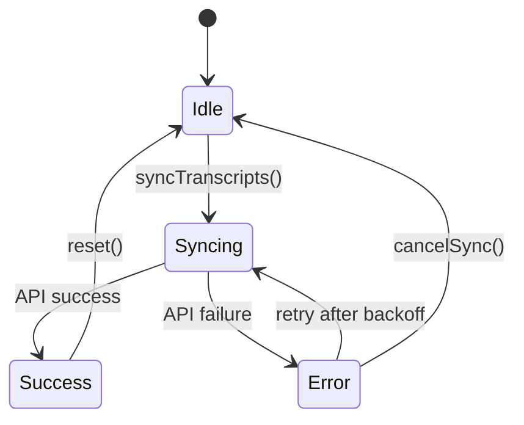
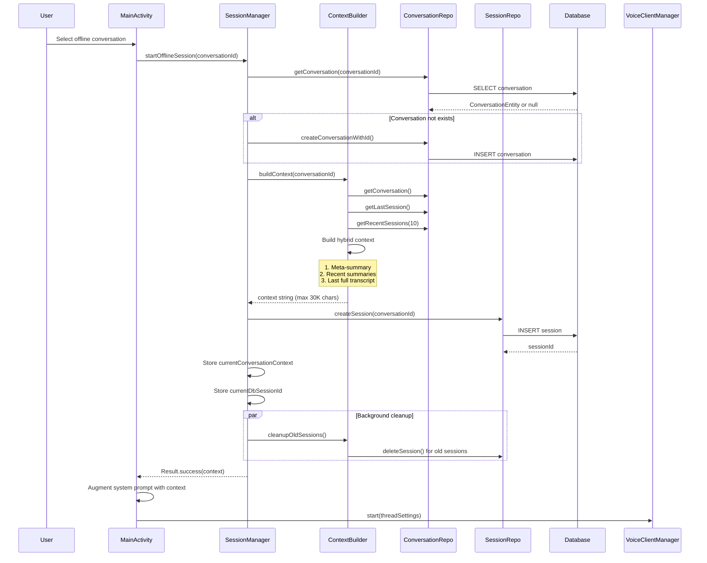
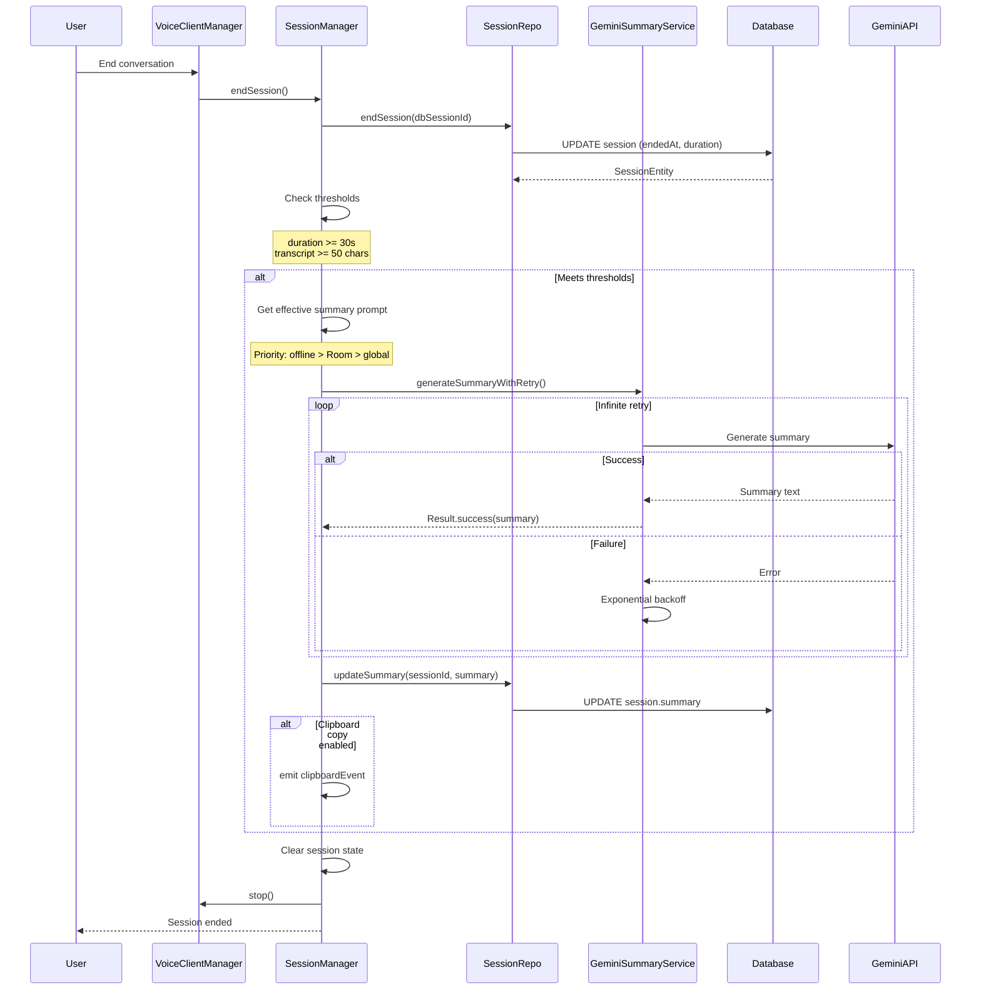
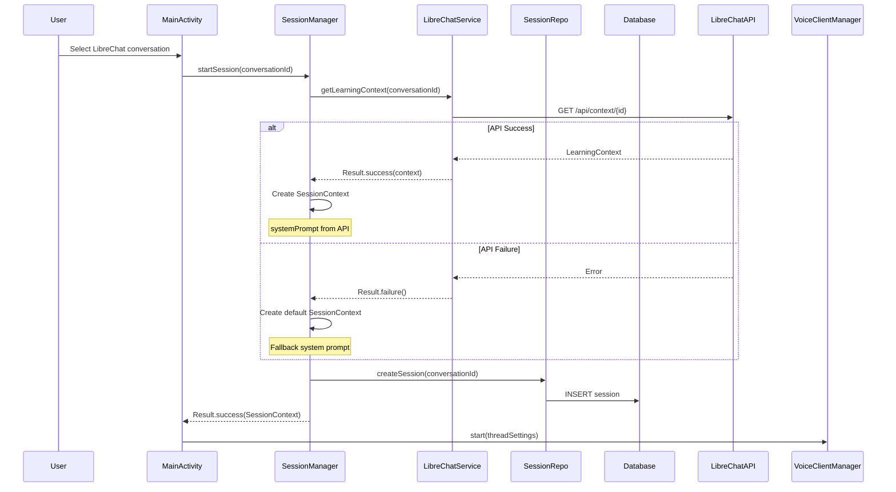
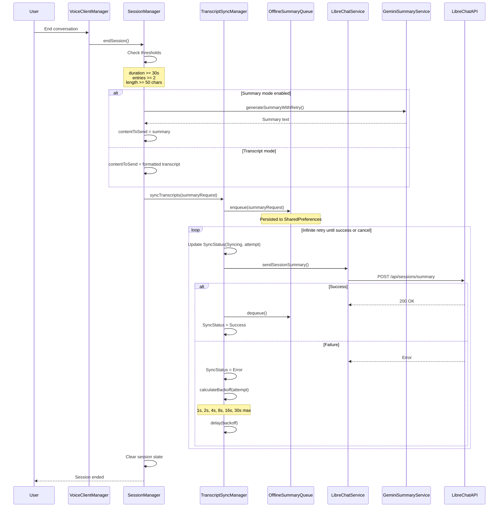
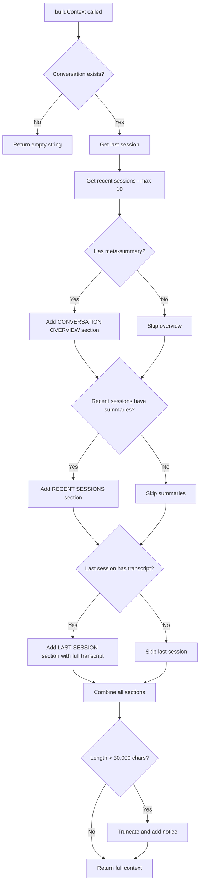
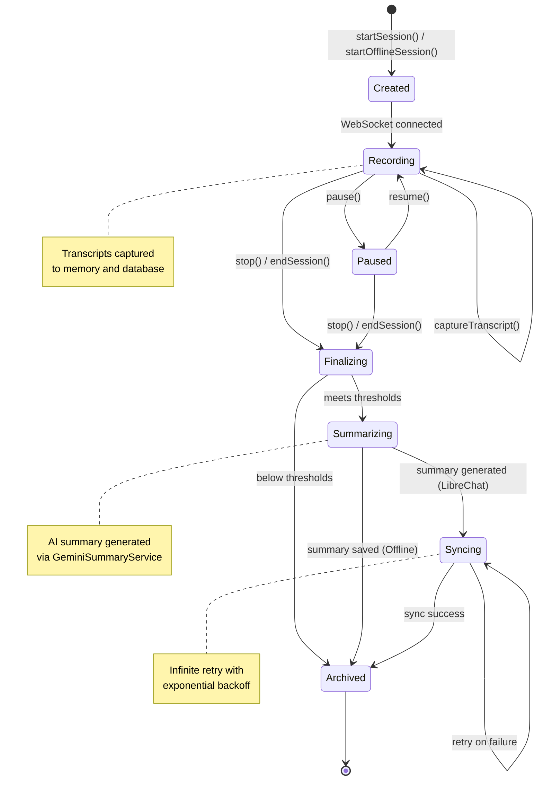
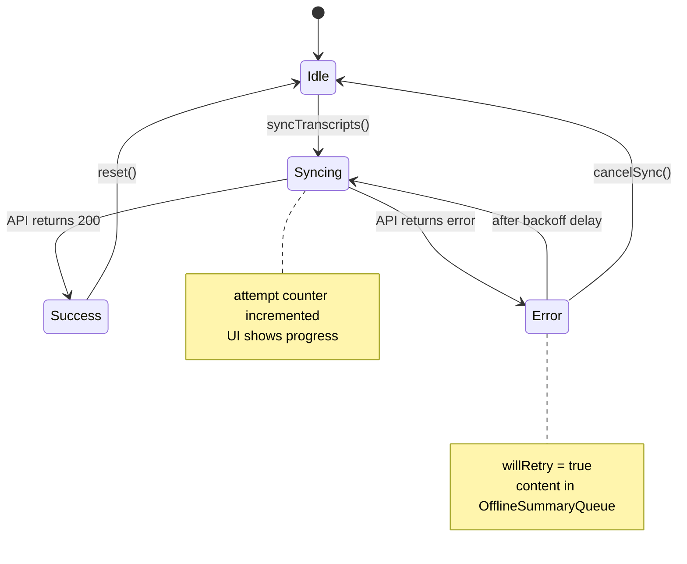

# Design Document: Comprehensive Architecture Documentation

## Overview

This design document outlines the structure and content for comprehensive architecture documentation that addresses the identified gaps. The documentation will be organized into multiple files within the `/docs/` directory, following the existing documentation structure rules.

## Architecture

### Documentation Structure

The documentation will be organized as follows:

```
docs/
├── domain/
│   ├── model.md                    # Updated with complete object model
│   ├── session-pipelines.md        # NEW: Offline and LibreChat pipelines
│   └── state-machines.md           # NEW: Session state machine
├── implementation/
│   ├── components.md               # Updated with missing components
│   ├── interactions.md             # Updated with new sequence diagrams
│   ├── context-builder.md          # NEW: ContextBuilder deep dive
│   ├── transcript-sync.md          # NEW: TranscriptSyncManager details
│   └── summary-generation.md       # NEW: Summary generation feature
├── project/
│   └── architecture.md             # Updated with data flow diagrams
└── operations/
    └── database-schema.md          # NEW: Database entities and schema
```

### Documentation Approach

1. **Incremental Updates**: Update existing files rather than replacing them
2. **Cross-References**: Link between documents for related topics
3. **Code References**: Include file paths and line numbers for all components
4. **Mermaid Diagrams**: Use Mermaid for all diagrams (sequence, state, flow)

## Components and Interfaces

### New Documentation Files

#### 1. Session Pipelines Document (`docs/domain/session-pipelines.md`)

**Purpose**: Document complete lifecycle of both session types

**Sections**:
- Offline Session Pipeline
  - Session Start Flow
  - Context Building with ContextBuilder
  - Transcript Capture
  - Session End and Summary Generation
  - Clipboard Copy Feature
- LibreChat Session Pipeline
  - Session Start with API Call
  - Learning Context Fetching
  - Fallback Behavior
  - Transcript Capture (in-memory)
  - Session End with TranscriptSyncManager
  - Infinite Retry Mechanism

#### 2. Context Builder Document (`docs/implementation/context-builder.md`)

**Purpose**: Deep dive into ContextBuilder component

**Sections**:
- Hybrid Context Strategy
- Database Queries
- Context Formatting
  - Last Full Transcript Section
  - Previous Summaries Section
  - Meta-Summary Section
- Length Limits and Truncation
- Session Retention Policy
- ContextStats Data Structure

#### 3. Transcript Sync Document (`docs/implementation/transcript-sync.md`)

**Purpose**: Document TranscriptSyncManager and OfflineSummaryQueue

**Sections**:
- Infinite Retry Mechanism
- Exponential Backoff Algorithm
- SyncStatus State Machine
- OfflineSummaryQueue Persistence
- Cancellation Handling
- Queue Processing on App Start

#### 4. Summary Generation Document (`docs/implementation/summary-generation.md`)

**Purpose**: Document AI summary generation feature

**Sections**:
- GeminiSummaryService Component
- Custom Prompt Priority Chain
- Model Selection
- Infinite Retry for Generation
- Clipboard Copy Feature
- Database Storage
- Transcript vs Summary Mode

#### 5. Database Schema Document (`docs/operations/database-schema.md`)

**Purpose**: Document database entities and repositories

**Sections**:
- SessionEntity
- ConversationEntity
- SessionRepository Methods
- ConversationRepository Methods
- Foreign Key Relationships
- Cascade Rules
- TranscriptEntry Serialization
  - Stored as JSON string in SessionEntity.transcript column
  - Uses Room TypeConverter for serialization/deserialization
  - Cannot be queried directly via SQL (must load full session)
  - Format: List of "speaker: text" entries separated by newlines

#### 6. State Machines Document (`docs/domain/state-machines.md`)

**Purpose**: Document state machines for key objects

**Sections**:
- Session State Machine
- ConnectionState Machine (existing, enhanced)
- SyncStatus State Machine

## Data Models

### Key Data Structures to Document

#### SessionContext
```kotlin
data class SessionContext(
    val sessionId: String,
    val conversationId: String,
    val startTime: Long,
    val systemPrompt: String,
    val transcripts: MutableList<TranscriptEntry>,
    val imageEvents: MutableList<ImageEvent>,
    val contextUpdates: MutableList<ContextUpdate>
)
```

#### TranscriptEntry
```kotlin
data class TranscriptEntry(
    val timestamp: Long,
    val speaker: Speaker,  // USER or BOT
    val text: String
)
```

#### ContextStats
```kotlin
data class ContextStats(
    val conversationExists: Boolean,
    val totalSessions: Int,
    val sessionsWithSummaries: Int,
    val lastSessionHasTranscript: Boolean,
    val lastSessionLength: Int,
    val hasMetaSummary: Boolean
)
```

#### SyncStatus
```kotlin
sealed class SyncStatus {
    object Idle : SyncStatus()
    data class Syncing(val attempt: Int) : SyncStatus()
    object Success : SyncStatus()
    data class Error(val message: String, val willRetry: Boolean) : SyncStatus()
}
```

#### OfflineConversation
```kotlin
data class OfflineConversation(
    val id: String,
    val title: String,
    val systemPrompt: String,
    val voiceName: String,
    val speechSpeed: Float,
    val volumeBoost: Float,
    val temperature: Float,
    val customSummaryPrompt: String,
    val copySummaryToClipboard: Boolean,
    val isSystemConversation: Boolean,
    val createdAt: Long,
    val updatedAt: Long
)
```

## Correctness Properties

*A property is a characteristic or behavior that should hold true across all valid executions of a system-essentially, a formal statement about what the system should do. Properties serve as the bridge between human-readable specifications and machine-verifiable correctness guarantees.*

Since this specification is for documentation (not code), the correctness properties focus on documentation completeness and accuracy:

**Property 1: Documentation Completeness**
*For any* component mentioned in the codebase, the documentation SHALL contain a corresponding section with role, fields, methods, and code references.
**Validates: Requirements 3.1, 3.2, 3.3, 3.4**

**Property 2: Diagram Coverage**
*For any* major workflow (session start, session end, context building, sync), the documentation SHALL contain a corresponding sequence or flow diagram.
**Validates: Requirements 4.1, 4.2, 4.3, 9.1-9.7**

**Property 3: Code Reference Accuracy**
*For any* code reference in the documentation, the referenced file and line numbers SHALL exist and match the described functionality.
**Validates: Requirements 3.4**

**Property 4: Cross-Reference Consistency**
*For any* cross-reference between documents, the target section SHALL exist and be relevant to the source context.
**Validates: Requirements 1.1, 2.1**

## Error Handling

### Documentation Errors to Address

1. **Missing Information**: Document all components even if partially implemented
2. **Outdated References**: Verify all code references before publishing
3. **Conflicting Information**: Resolve conflicts between existing docs and code
4. **Incomplete Diagrams**: Ensure all diagrams show complete flows

### Conflict Resolution Strategy

1. **Code is Truth**: When documentation conflicts with code, update documentation
2. **Mark Uncertainties**: Use "TO CLARIFY" markers for unclear areas
3. **Version Control**: Track documentation changes in MIGRATION_LOG.md

## Testing Strategy

### Documentation Verification

Since this is a documentation specification, testing involves verification rather than automated tests:

1. **Structure Verification**: Check that all required sections exist
2. **Code Reference Verification**: Validate file paths and line numbers
3. **Diagram Rendering**: Verify Mermaid diagrams render correctly
4. **Cross-Reference Verification**: Check all internal links work
5. **Completeness Review**: Manual review against requirements

### Verification Checklist

For each new/updated document:
- [ ] All required sections present
- [ ] Code references valid
- [ ] Diagrams render correctly
- [ ] Cross-references work
- [ ] Follows documentation style guide
- [ ] Logged in MIGRATION_LOG.md

## Detailed Content Specifications

### Offline Session Pipeline Content

```markdown
## Offline Session Pipeline

### Overview
Offline sessions operate without LibreChat integration, storing all data locally
in Room database and building context from previous sessions.

### Session Start Flow

1. User selects offline conversation from list
2. MainActivity calls `sessionManager.startOfflineSession(conversationId)`
3. SessionManager ensures conversation exists in Room database
4. ContextBuilder.buildContext() is called to build conversation history
5. Context is returned and stored in `currentConversationContext`
6. Database session is created via `sessionRepository.createSession()`
7. Old sessions are cleaned up in background via ContextBuilder.cleanupOldSessions()
   - ContextBuilder keeps last 50 sessions per conversation
   - Note: This is the active retention mechanism

### Context Building (Hybrid Approach)

ContextBuilder uses a hybrid strategy:
- **Section 1**: Conversation Overview (meta-summary if exists)
- **Section 2**: Recent Sessions (summaries of last 10 sessions)
- **Section 3**: Last Session (FULL transcript)

This ensures:
- AI has detailed context from most recent conversation
- AI has summarized context from older conversations
- Total context stays within 30,000 character limit

### Transcript Capture (Offline)

During active offline session:
- User transcripts captured via `captureUserTranscript()`
- Bot transcripts captured via `captureBotTranscript()`
- Transcripts persisted to database (SessionRepository.appendTranscript)
- Limit enforced: max 10,000 TranscriptEntry objects
- When limit exceeded, oldest entries are removed (FIFO)

### Session End Flow

1. VoiceClientManager.stop() is called
2. SessionManager.endSession() processes the session
3. Database session is marked complete
4. If session meets thresholds (30s, 50 chars):
   - Summary is generated via GeminiSummaryService
   - Summary is saved to database
   - If clipboard copy enabled, summary is emitted to clipboardEvent
5. Session context is cleared
```

### LibreChat Session Pipeline Content

```markdown
## LibreChat Session Pipeline

### Overview
LibreChat sessions integrate with the LibreChat platform, fetching learning
context from the API and synchronizing transcripts/summaries back.

### Session Start Flow

1. User selects LibreChat conversation from list
2. MainActivity calls `sessionManager.startSession(conversationId)`
3. SessionManager calls `libreChatService.getLearningContext(conversationId)`
4. API returns learning context with system prompt
5. SessionContext is created with system prompt
6. Database session is created for local persistence
7. On API failure: fallback to default context

### Transcript Capture

During active session:
- User transcripts captured via `captureUserTranscript()`
- Bot transcripts captured via `captureBotTranscript()`
- Both stored in-memory (SessionContext.transcripts) for LibreChat sessions
- Both persisted to database (SessionRepository.appendTranscript) for ALL sessions
- Limit enforced: max 10,000 TranscriptEntry objects (applies to both session types)
- When limit exceeded, oldest entries are removed (FIFO)

### Session End Flow

1. VoiceClientManager.stop() is called
2. SessionManager.endSession() processes the session
3. Minimum thresholds checked (30s duration, 2 entries, 50 chars)
4. If summary mode enabled:
   - GeminiSummaryService generates summary
   - Summary sent to LibreChat instead of transcript
5. TranscriptSyncManager handles delivery with infinite retry
6. OfflineSummaryQueue persists content for app restart survival
7. Exponential backoff: 1s, 2s, 4s, 8s, 16s, 30s max
```

### TranscriptSyncManager Content

```markdown
## TranscriptSyncManager

### Overview
Inner class of SessionManager that handles reliable transcript delivery
to LibreChat with infinite retry and persistence.

### SyncStatus State Machine



### Exponential Backoff Algorithm

```kotlin
private fun calculateBackoff(attempt: Int): Long {
    val delay = (BASE_DELAY * Math.pow(BACKOFF_FACTOR, (attempt - 1).toDouble())).toLong()
    return delay.coerceAtMost(MAX_DELAY)
}
// BASE_DELAY = 1000ms, BACKOFF_FACTOR = 2.0, MAX_DELAY = 30000ms
// Results: 1s, 2s, 4s, 8s, 16s, 30s, 30s, 30s...
```

### OfflineSummaryQueue Persistence

- Stored in SharedPreferences as JSON
- Survives app process kill/restart
- Processed on app start via `processOfflineQueue()`
- Items removed only after successful sync
```

### ContextBuilder Content

```markdown
## ContextBuilder

### Overview
Builds context for Gemini Live from conversation history using a hybrid
approach: last full transcript + summaries of previous sessions.

### Hybrid Context Strategy

The context is built in three sections:

1. **CONVERSATION OVERVIEW** (if meta-summary exists)
   - High-level summary of the entire conversation thread
   
2. **RECENT SESSIONS** (summaries only)
   - Last 10 sessions with summaries
   - Format: "Session [date] ([duration]): [summary]"
   
3. **LAST SESSION** (full transcript)
   - Complete transcript of most recent session
   - Includes note about recency for AI context

### Configuration Constants

```kotlin
const val MAX_RECENT_SESSIONS = 10      // Max summaries to include
const val MAX_CONTEXT_LENGTH = 30000    // Character limit
const val MAX_SESSIONS_TO_KEEP = 50     // Retention limit
```

### Session Retention Policy

**Active mechanism**: ContextBuilder.cleanupOldSessions()
- Keeps last 50 sessions per conversation
- Runs in background on session start
- Deletes oldest sessions when limit exceeded

### Audio Gating Strategy

To prevent acoustic echo and VAD false positives:
- **Half-duplex mode**: Audio NOT sent while bot is talking
- **Bot silence detection**: 1500ms threshold before user can speak
- **Gate mechanism**: VoiceClientManager checks `botIsTalking` state before sending audio
- This prevents the bot from hearing its own voice through speakers
```


## Sequence Diagrams

### Offline Session Start



### Offline Session End



### LibreChat Session Start



### LibreChat Session End with Sync



### Context Building Flow



## State Machine Diagrams

### Session State Machine



### SyncStatus State Machine



## Threading Model

### Coroutine Dispatchers

| Operation | Dispatcher | Reason |
|-----------|------------|--------|
| Database reads/writes | Dispatchers.IO | Blocking I/O |
| Network calls | Dispatchers.IO | Blocking I/O |
| Context building | Dispatchers.IO | Database queries |
| Summary generation | Dispatchers.IO | Network call |
| UI state updates | Dispatchers.Main | Compose state |
| Audio processing | Dedicated thread | Real-time requirements |

### Suspend Functions

All I/O operations in SessionManager and repositories are suspend functions:
- `startSession()` - suspend
- `startOfflineSession()` - suspend
- `endSession()` - suspend
- `buildContext()` - suspend
- `syncTranscripts()` - suspend

### Thread Safety

- `currentSession` - accessed from single coroutine scope
- `transcripts` - MutableList, accessed sequentially
- `syncStatus` - StateFlow, thread-safe
- `OfflineSummaryQueue` - SharedPreferences, thread-safe

## Error Handling

### Gemini API Errors

| Error Type | Handling | Retry? |
|------------|----------|--------|
| Network timeout | Exponential backoff | Yes |
| 429 Rate limit | Longer backoff | Yes |
| 500 Server error | Exponential backoff | Yes |
| Safety ratings block | Log and skip | No |
| Invalid API key | Log and fail | No |
| Quota exceeded | Log and fail | No |

### Database Errors

| Error Type | Handling |
|------------|----------|
| Insert failure | Log, continue without persistence |
| Query failure | Return empty/default |
| Update failure | Log, continue |

## Code References

| Component | File | Lines |
|-----------|------|-------|
| SessionManager | SessionManager.kt | 25-1059 |
| ContextBuilder | data/ContextBuilder.kt | 1-170 |
| TranscriptSyncManager | SessionManager.kt | 870-1000 |
| OfflineSummaryQueue | OfflineSummaryQueue.kt | 1-100 |
| OfflineConversationManager | OfflineConversationManager.kt | 1-200 |
| GeminiSummaryService | GeminiSummaryService.kt | 1-150 |
| SessionRepository | data/repository/SessionRepository.kt | 1-100 |
| ConversationRepository | data/repository/ConversationRepository.kt | 1-150 |
| SessionEntity | data/entities/SessionEntity.kt | 1-50 |
| ConversationEntity | data/entities/ConversationEntity.kt | 1-50 |
