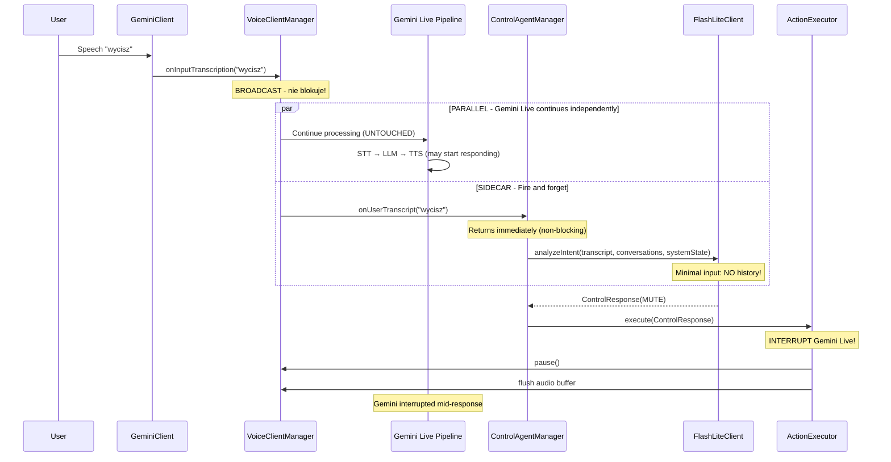
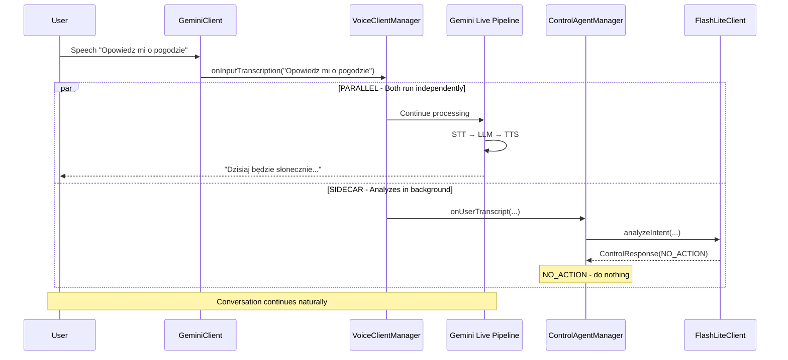
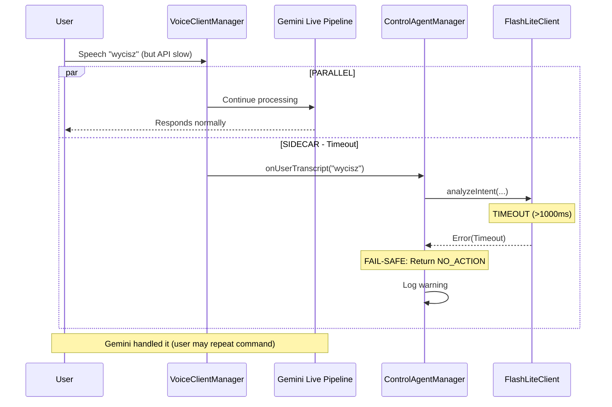
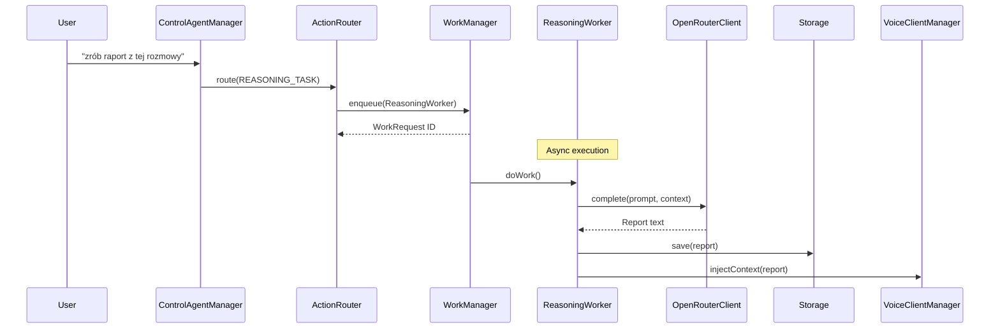
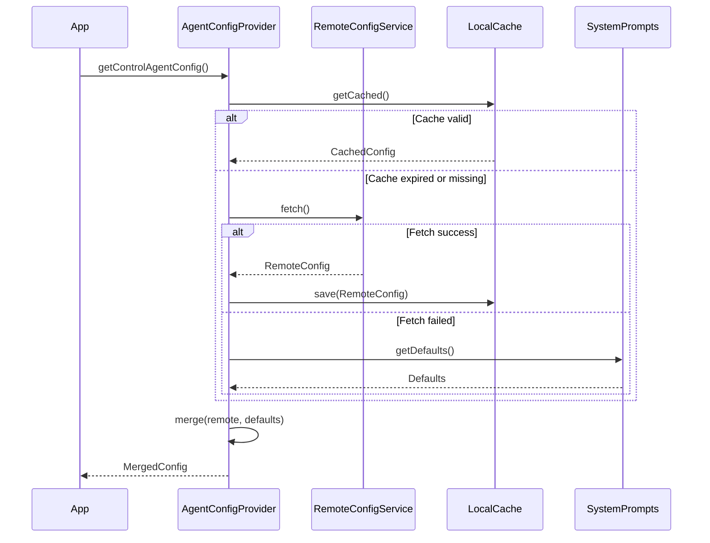

# Design Document: Hands-Free Control System

## Overview

System wprowadza warstwę sterowania (Control Layer), która działa **równolegle i całkowicie niezależnie** od głównego potoku konwersacyjnego Gemini Live.

**Kluczowa zasada:** Główny potok (Audio → STT → Gemini Live → TTS) pozostaje **nietknięty**. Aplikacja **nigdy nie czeka** na decyzję agenta sterującego. Agent ten działa w tle ("fire-and-forget") i interweniuje (przerywa Gemini) **tylko wtedy**, gdy wykryje silną intencję systemową (np. "Wycisz", "Rozłącz").

System składa się z trzech warstw:
1. **Sidecar Control Layer** - obserwator transkrypcji w czasie rzeczywistym (Gemini 2.5 Flash Lite)
2. **Reasoning Layer** - asynchroniczne zadania w tle (OpenRouter)
3. **Config Layer** - zdalna konfiguracja

### Dane wejściowe Control Agenta (minimalne)

Control Agent **NIE potrzebuje** historii rozmowy. Wymaga jedynie:

| Typ danych | Control Agent | Reasoning Agent |
|:-----------|:-------------:|:---------------:|
| Bieżący transkrypt | ✅ TAK | ✅ TAK |
| Historia rozmowy | ❌ NIE (zbędny balast) | ✅ TAK (kluczowe) |
| Podsumowania sesji | ❌ NIE | ✅ TAK |
| Lista konwersacji (ID + tytuł) | ✅ TAK (dla SWITCH) | ❌ NIE |
| Stan systemu (is_media_playing) | ✅ TAK (pomocnicze) | ❌ NIE |

**Uzasadnienie:**
- **Opóźnienie (Latency):** Każdy dodatkowy token wydłuża czas przetwarzania. Flash Lite jest szybki, ale przy dużym kontekście zwolni, a walczymy o milisekundy (wymóg < 500ms).
- **Szum informacyjny:** Historia rozmowy może zmylić prosty model klasyfikujący.

## Architecture

**Kluczowa zmiana:** Strzałka od VoiceClientManager do ControlAgentManager jest **jednokierunkowa i nieblokująca**.

```
┌─────────────────────────────────────────────────────────────────────────────┐
│                              User Speech                                     │
└─────────────────────────────────────────────────────────────────────────────┘
                                    │
                                    ▼
┌─────────────────────────────────────────────────────────────────────────────┐
│                           GeminiClient                                       │
│                    onInputTranscription callback                             │
└─────────────────────────────────────────────────────────────────────────────┘
                                    │
                                    │ (broadcast - nie blokuje)
                    ┌───────────────┴───────────────┐
                    ▼                               ▼
┌───────────────────────────────┐   ┌───────────────────────────────┐
│      VoiceClientManager       │   │     ControlAgentManager       │
│   (MAIN FLOW - UNTOUCHED)     │   │     (SIDECAR - OBSERVER)      │
│                               │   │                               │
│  - Updates UI state           │   │  - Fire-and-forget analysis   │
│  - Sends to SessionManager    │   │  - Calls Flash Lite API       │
│  - Continues Gemini Live      │   │  - NO BLOCKING of main flow   │
│  - NEVER WAITS for Control    │   │  - Executes actions if needed │
│                               │   │                               │
│  ┌─────────────────────────┐  │   │  Input (minimal):             │
│  │ Gemini Live Pipeline    │  │   │  - transcript (current only)  │
│  │ Audio→STT→LLM→TTS       │  │   │  - conversation_list          │
│  │ (runs independently)    │  │   │  - system_state               │
│  └─────────────────────────┘  │   │  (NO conversation history!)   │
└───────────────────────────────┘   └───────────────────────────────┘
                                                    │
                                                    │ (async, non-blocking)
                                                    ▼
                                    ┌───────────────────────────────┐
                                    │       FlashLiteClient         │
                                    │   (Gemini 2.5 Flash Lite)     │
                                    │                               │
                                    │  - Lightweight REST API call  │
                                    │  - Timeout: 1000ms max        │
                                    │  - On error → NO_ACTION       │
                                    └───────────────────────────────┘
                                                    │
                                                    ▼
                                    ┌───────────────────────────────┐
                                    │      ControlResponse          │
                                    │                               │
                                    │  action: ControlActionType    │
                                    │  target_id: String?           │
                                    │  parameters: Map<String,Any>  │
                                    │  confidence: Float            │
                                    └───────────────────────────────┘
                                                    │
                                                    ▼
                                    ┌───────────────────────────────┐
                                    │       ActionExecutor          │
                                    │   (executes system actions)   │
                                    └───────────────────────────────┘
                                                    │
                    ┌───────────┬───────────┬───────────┬───────────┐
                    ▼           ▼           ▼           ▼           ▼
              ┌─────────┐ ┌─────────┐ ┌─────────┐ ┌─────────┐ ┌─────────┐
              │  MUTE   │ │ HANGUP  │ │ SWITCH  │ │TOOL_USE │ │REASONING│
              │         │ │         │ │  CONV   │ │         │ │  TASK   │
              └─────────┘ └─────────┘ └─────────┘ └─────────┘ └─────────┘
                    │           │           │           │           │
                    ▼           ▼           ▼           ▼           ▼
              VoiceClient  VoiceClient  Session    ToolExecutor  WorkManager
              .pause()     .stop()      Manager                  (async)
              (interrupts  (interrupts                               │
               Gemini)      Gemini)                                  ▼
                                                        ┌───────────────────┐
                                                        │  ReasoningWorker  │
                                                        │   (OpenRouter)    │
                                                        │  (has full ctx)   │
                                                        └───────────────────┘
```

### Fail-Safe Behavior

Jeśli brak kontekstu sprawia, że polecenie jest niejasne (np. "Zrób to co mówiłeś wcześniej"), Control Agent zwraca **NO_ACTION**:
- Control Agent ignoruje polecenie
- Główny Gemini Live (który ma pełny kontekst) przetworzy to naturalnie
- To podejście gwarantuje, że "szybki, ale prosty" agent nie zepsuje konwersacji

## Components and Interfaces

### 1. ControlAgentManager

**Role:** Sidecar/Observer - nasłuchuje transkrypcji asynchronicznie i koordynuje klasyfikację intencji. **Nigdy nie blokuje głównego potoku.**

**Location:** `ai.pipecat.gemini_multimodal_websocket_demo.agents.ControlAgentManager`

```kotlin
class ControlAgentManager(
    private val context: Context,
    private val voiceClientManager: VoiceClientManager,
    private val sessionManager: SessionManager,
    private val scope: CoroutineScope  // WAŻNE: Zobacz notatkę poniżej!
) {
    // Dependencies
    private val flashLiteClient: FlashLiteClient
    private val actionExecutor: ActionExecutor
    private val configProvider: AgentConfigProvider
    
    // State
    private val _isEnabled = MutableStateFlow(false)
    val isEnabled: StateFlow<Boolean>
    
    // System state for context (minimal)
    private val _systemState = MutableStateFlow(SystemState())
    
    // Public API - FIRE AND FORGET
    fun onUserTranscript(transcript: String)  // Non-blocking, launches coroutine
    fun setEnabled(enabled: Boolean)
    fun updateSystemState(state: SystemState)
    fun release()
}
```

**⚠️ WAŻNE: CoroutineScope dla background operation**

**NIE używaj** `lifecycleScope` fragmentu/widoku! Jeśli użytkownik zminimalizuje aplikację, analiza może zostać przerwana.

**Zalecane podejście:**
- Wstrzyknij (DI) scope powiązany z **procesem aplikacji** lub **VoiceService**
- Użyj `SupervisorJob()` aby błędy w jednej analizie nie ubijały innych
- Scope powinien żyć tak długo jak VoiceService (foreground service)

```kotlin
// Przykład: scope z VoiceService
class VoiceService : Service() {
    private val serviceJob = SupervisorJob()
    private val serviceScope = CoroutineScope(Dispatchers.Default + serviceJob)
    
    // Przekaż ten scope do ControlAgentManager
    private val controlAgent = ControlAgentManager(
        context = this,
        voiceClientManager = voiceClientManager,
        sessionManager = sessionManager,
        scope = serviceScope  // Żyje tak długo jak service
    )
}
```

**Key Methods:**
- `onUserTranscript(transcript)` - Entry point called from VoiceClientManager. **Non-blocking** - launches coroutine and returns immediately.
- `setEnabled(enabled)` - Toggle Control Agent on/off
- `updateSystemState(state)` - Update system state (is_media_playing, etc.)
- `release()` - Cleanup resources (cancels serviceJob)

### 2. FlashLiteClient

**Role:** Klient REST do Gemini 2.5 Flash Lite API dla szybkiej klasyfikacji intencji. Używa **minimalnego kontekstu**.

**Location:** `ai.pipecat.gemini_multimodal_websocket_demo.agents.FlashLiteClient`

```kotlin
class FlashLiteClient(
    private val configProvider: AgentConfigProvider
) {
    /**
     * Analyzes intent using MINIMAL context:
     * - transcript: current user utterance only
     * - conversations: list of available conversations (ID + title only)
     * - systemState: is_media_playing, current_audio_state
     * 
     * NO conversation history is passed!
     */
    suspend fun analyzeIntent(
        transcript: String,
        conversations: List<ConversationMeta>,
        systemState: SystemState
    ): Result<ControlResponse>
}
```

### 3. ActionExecutor

**Role:** Wykonuje zdecydowane akcje systemowe. Może przerwać główny potok Gemini Live.

**Location:** `ai.pipecat.gemini_multimodal_websocket_demo.agents.ActionExecutor`

```kotlin
class ActionExecutor(
    private val voiceClientManager: VoiceClientManager,
    private val sessionManager: SessionManager,
    private val toolExecutor: ToolExecutor,
    private val context: Context
) {
    /**
     * Executes the action. For MUTE/HANGUP/SWITCH_CONVERSATION,
     * this will INTERRUPT the main Gemini Live pipeline.
     */
    suspend fun execute(response: ControlResponse): ActionResult
}
```

### 4. OpenRouterClient

**Role:** Klient HTTP do OpenRouter API dla Reasoning Agenta.

**Location:** `ai.pipecat.gemini_multimodal_websocket_demo.agents.OpenRouterClient`

```kotlin
class OpenRouterClient(
    private val configProvider: AgentConfigProvider
) {
    suspend fun complete(
        prompt: String,
        context: ReasoningContext
    ): Result<String>
}
```

### 5. ReasoningWorker

**Role:** WorkManager Worker wykonujący zadania Reasoning Agenta w tle.

**Location:** `ai.pipecat.gemini_multimodal_websocket_demo.agents.ReasoningWorker`

```kotlin
class ReasoningWorker(
    context: Context,
    params: WorkerParameters
) : CoroutineWorker(context, params) {
    override suspend fun doWork(): Result
}
```

### 6. AgentConfigProvider

**Role:** Dostarcza konfigurację agentów z merge Remote Config + SystemPrompts defaults.

**Location:** `ai.pipecat.gemini_multimodal_websocket_demo.config.AgentConfigProvider`

```kotlin
object AgentConfigProvider {
    fun getControlAgentConfig(): ControlAgentConfig
    fun getReasoningAgentConfig(): ReasoningAgentConfig
    suspend fun refreshFromRemote()
}
```

## Data Models

### ControlResponse

```kotlin
@Serializable
data class ControlResponse(
    val action: ControlActionType,
    val targetId: String? = null,
    val parameters: Map<String, String> = emptyMap(),
    val reasoningPrompt: String? = null,
    val confidence: Float = 1.0f
)

@Serializable
enum class ControlActionType {
    NO_ACTION,      // Default - let Gemini Live handle it
    MUTE,           // Pause microphone, interrupt Gemini
    HANGUP,         // End session, interrupt Gemini
    SWITCH_CONVERSATION,  // Switch to different conversation
    TOOL_USE,       // Execute a tool
    REASONING_TASK  // Delegate to Reasoning Agent (async)
}
```

### SystemState (NEW - minimal context for Control Agent)

```kotlin
@Serializable
data class SystemState(
    val isMediaPlaying: Boolean = false,
    val currentAudioState: AudioState = AudioState.IDLE,
    val availableTools: List<String> = emptyList()
)

enum class AudioState {
    IDLE,
    RECORDING,
    PLAYING_TTS,
    PLAYING_MEDIA
}
```

### ConversationMeta (lightweight - only ID and title)

```kotlin
@Serializable
data class ConversationMeta(
    val id: String,
    val title: String
    // NO tags, NO history, NO context - keep it minimal!
)
```

### ControlAgentInput (what gets sent to Flash Lite)

```kotlin
@Serializable
data class ControlAgentInput(
    val userTranscript: String,
    val availableConversations: List<ConversationMeta>,
    val systemState: SystemState
    // NO conversation history!
)
```

### ControlAgentConfig

```kotlin
@Serializable
data class ControlAgentConfig(
    val enabled: Boolean = true,
    val provider: String = "google",
    val modelId: String = "gemini-2.5-flash-lite",
    val temperature: Float = 0.0f,
    val timeoutMs: Long = 1000,
    val systemPrompt: String = ""
)
```

### ReasoningAgentConfig

```kotlin
@Serializable
data class ReasoningAgentConfig(
    val enabled: Boolean = true,
    val provider: String = "openrouter",
    val modelId: String = "anthropic/claude-3.5-sonnet",
    val temperature: Float = 0.4f,
    val systemPrompt: String = ""
)
```

### ActionResult

```kotlin
sealed class ActionResult {
    object Success : ActionResult()
    data class Error(val message: String) : ActionResult()
    object Skipped : ActionResult()  // NO_ACTION or disabled
}
```


## Correctness Properties

*A property is a characteristic or behavior that should hold true across all valid executions of a system-essentially, a formal statement about what the system should do. Properties serve as the bridge between human-readable specifications and machine-verifiable correctness guarantees.*

### Property 1: Command Classification Correctness

*For any* voice command phrase (in Polish or English) that matches a known command pattern (mute, hangup, switch, tool), the Control Agent SHALL classify it to the correct ControlActionType.

**Validates: Requirements 1.1, 2.1, 3.1, 4.1, 9.1, 9.2**

### Property 2: Normal Conversation Non-Interference

*For any* conversational phrase that does not match a command pattern, the Control Agent SHALL return NO_ACTION without triggering any system actions.

**Validates: Requirements 5.1**

### Property 3: Fuzzy Matching Accuracy

*For any* SWITCH_CONVERSATION intent and list of available conversations, the Control Agent SHALL return the conversation ID whose title best matches the user's intent, or NO_ACTION if no reasonable match exists.

**Validates: Requirements 3.2**

### Property 4: Conversation List Invariant

*For any* SWITCH_CONVERSATION action execution, the conversation list order and content SHALL remain unchanged after the switch operation completes.

**Validates: Requirements 3.5**

### Property 5: TOOL_USE Response Structure

*For any* TOOL_USE action response, the response SHALL contain a valid tool name from the known tools list and parameters matching the tool's expected schema.

**Validates: Requirements 4.2**

### Property 6: System Action Interruption

*For any* utterance that triggers a system action (MUTE, HANGUP, SWITCH_CONVERSATION), the Control Agent SHALL interrupt the main Gemini Live pipeline by calling appropriate VoiceClientManager methods.

**Validates: Requirements 5.5**

### Property 7: Minimal Input Data

*For any* Control Agent API call, the constructed prompt SHALL contain ONLY: user transcript, conversation list (ID + title), and system state. It SHALL NOT contain conversation history.

**Validates: Requirements 6.4, 6.5**

### Property 8: Non-Blocking Execution

*For any* transcript received by ControlAgentManager.onUserTranscript(), the method SHALL return immediately without blocking, launching analysis in a separate coroutine.

**Validates: Requirements 5.3, 5.4**

### Property 9: Fail-Safe to NO_ACTION

*For any* uncertain intent or error condition (timeout, API failure, parse error), the Control Agent SHALL return NO_ACTION and allow Gemini Live to handle the utterance.

**Validates: Requirements 5.6, 5.7**

### Property 10: Disabled State No Processing

*For any* transcript received when Control Agent is disabled, the system SHALL not make any API calls or trigger any actions.

**Validates: Requirements 7.2**

### Property 11: Retry with Exponential Backoff

*For any* OpenRouter API error, the system SHALL retry with exponential backoff (delay doubles each attempt) up to 3 times before marking the task as failed.

**Validates: Requirements 10.6**

### Property 12: JSON Schema Validation

*For any* Remote Config JSON, the parser SHALL validate the schema and reject invalid configurations while preserving the last known good configuration.

**Validates: Requirements 11.3**

### Property 13: Config Merge Correctness

*For any* configuration key present in both Remote Config and SystemPrompts defaults, the Remote Config value SHALL override the local default.

**Validates: Requirements 11.5, 12.3**

### Property 14: API Keys Security

*For any* Remote Config JSON (valid or invalid), the configuration SHALL NOT contain API keys; API keys SHALL only be read from Encrypted Preferences.

**Validates: Requirements 11.6**

## Optimized Prompt Structure

Control Agent używa **minimalnego promptu** dla szybkości. Przykład:

```json
{
  "system_instruction": "Jesteś routerem akcji głosowych. Klasyfikuj intencję użytkownika do jednej z akcji: MUTE, HANGUP, SWITCH_CONVERSATION, TOOL_USE, REASONING_TASK, NO_ACTION. Jeśli nie jesteś pewien lub to zwykła rozmowa -> NO_ACTION. Odpowiadaj TYLKO w formacie JSON.",
  "input_context": {
    "user_transcript": "Przełącz na angielski",
    "available_conversations": [
      {"id": "c1", "title": "Lekcje hiszpańskiego"},
      {"id": "c2", "title": "Nauczyciel Angielskiego"},
      {"id": "c3", "title": "Trener Fitness"}
    ],
    "system_state": {
      "is_media_playing": false,
      "current_audio_state": "RECORDING"
    }
  }
}
```

**Czego NIE zawiera prompt:**
- ❌ Historia rozmowy (conversation history)
- ❌ Podsumowania sesji
- ❌ Kontekst konwersacyjny
- ❌ Poprzednie wypowiedzi użytkownika

**Dlaczego minimalne dane?**
1. **Latency:** Każdy token = więcej czasu. Cel: < 500ms.
2. **Szum:** Historia może zmylić prosty klasyfikator.
3. **Fail-safe:** W razie wątpliwości → NO_ACTION → Gemini Live obsłuży.

## Error Handling

### FlashLiteClient Errors

| Error Type | Handling Strategy |
|------------|-------------------|
| Network timeout (>1000ms) | Return NO_ACTION, log warning |
| HTTP 4xx | Return NO_ACTION, log error |
| HTTP 5xx | Return NO_ACTION, log error |
| JSON parse error | Return NO_ACTION, log error |
| Invalid response schema | Return NO_ACTION, log error |

### OpenRouterClient Errors

| Error Type | Handling Strategy |
|------------|-------------------|
| Network error | Retry with exponential backoff (3 attempts) |
| HTTP 401 (auth) | Mark task failed, notify user |
| HTTP 429 (rate limit) | Retry with longer backoff |
| HTTP 5xx | Retry with exponential backoff |
| Timeout | Retry with exponential backoff |

### Configuration Errors

| Error Type | Handling Strategy |
|------------|-------------------|
| Remote fetch failed | Use cached config or defaults |
| JSON parse error | Use cached config or defaults |
| Schema validation failed | Use cached config or defaults |
| Missing required field | Use default value for that field |

## Testing Strategy

### Dual Testing Approach

This feature requires both unit tests and property-based tests:

- **Unit tests**: Verify specific examples, edge cases, and integration points
- **Property-based tests**: Verify universal properties across all valid inputs

### Property-Based Testing Library

**Library:** [Kotest Property Testing](https://kotest.io/docs/proptest/property-based-testing.html)

**Configuration:** Each property test runs minimum 100 iterations.

### Test File Structure

```
src/test/java/ai/pipecat/gemini_multimodal_websocket_demo/
├── agents/
│   ├── ControlAgentManagerTest.kt          # Unit tests
│   ├── ControlAgentPropertyTest.kt         # Property tests (Properties 1-10)
│   ├── FlashLiteClientTest.kt              # Unit tests
│   ├── ActionExecutorTest.kt               # Unit tests
│   ├── OpenRouterClientTest.kt             # Unit tests
│   └── ReasoningWorkerTest.kt              # Unit tests
├── config/
│   ├── AgentConfigProviderTest.kt          # Unit tests
│   └── AgentConfigPropertyTest.kt          # Property tests (Properties 11-14)
```

### Property Test Annotations

Each property-based test MUST be annotated with:
```kotlin
/**
 * **Feature: control-agent, Property 1: Command Classification Correctness**
 * **Validates: Requirements 1.1, 2.1, 3.1, 4.1, 9.1, 9.2**
 */
```

### Test Generators

**Command Phrase Generator:**
```kotlin
val muteCommands = listOf("wycisz", "mute", "pauza", "cisza", "stop talking")
val hangupCommands = listOf("zakończ", "koniec", "rozłącz", "do widzenia", "end", "bye")
val switchCommands = listOf("przełącz na", "zmień na", "switch to", "change to")
val toolCommands = listOf("włącz Spotify", "puść muzykę", "nawiguj do", "play music")
```

**Conversation List Generator:**
```kotlin
val conversationGen = Arb.list(
    Arb.bind(
        Arb.uuid(),
        Arb.string(5..30)
    ) { id, title -> ConversationMeta(id.toString(), title) },
    1..20
)
```

**Normal Conversation Generator:**
```kotlin
val normalConversationGen = Arb.string(10..200)
    .filter { !containsCommandPattern(it) }
```

## Sequence Diagrams

### Control Agent Flow - Sidecar Pattern (Happy Path)

**Kluczowe:** VoiceClientManager NIE CZEKA na odpowiedź Control Agenta. Gemini Live kontynuuje niezależnie.



### Control Agent Flow - NO_ACTION (Normal Conversation)

**Kluczowe:** Gdy Control Agent zwraca NO_ACTION, Gemini Live kontynuuje bez przeszkód.



### Control Agent Flow - Fail-Safe (Error/Timeout)



### Reasoning Task Flow



### Remote Config Flow


