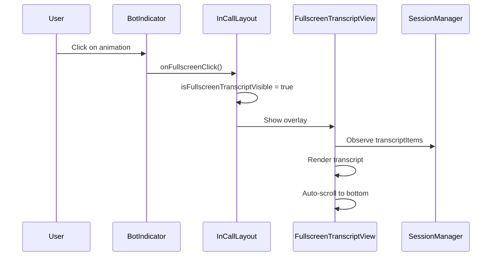
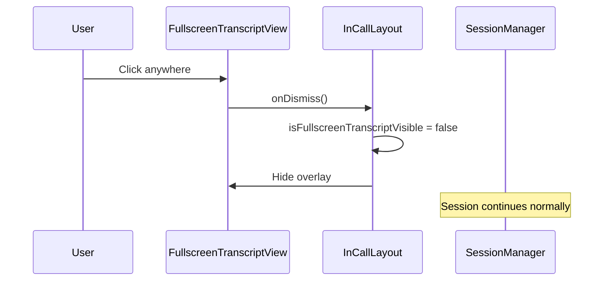
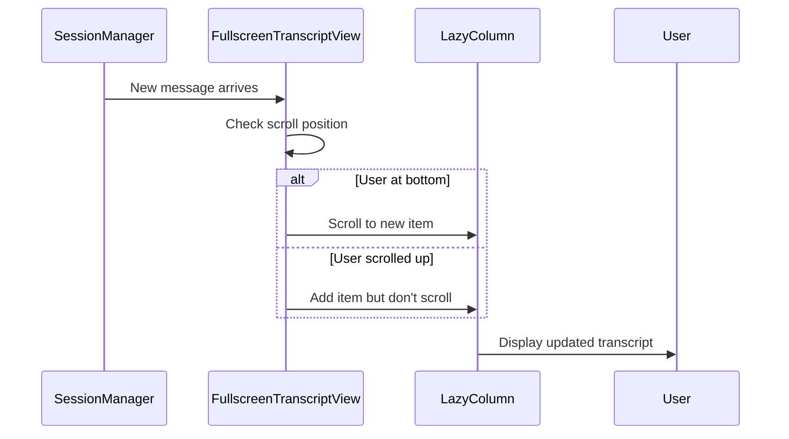

# Design Document: Fullscreen Transcript View

## Overview

Fullscreen Transcript View to tryb pełnoekranowy wyświetlający transkrypcję rozmowy w czasie rzeczywistym. Funkcja umożliwia użytkownikowi szybkie przełączenie się z tradycyjnego UI sesji na widok transkrypcji poprzez kliknięcie na animację bota. W trybie fullscreen transkrypcja jest wyświetlana na całym ekranie z wyrównaniem: bot po lewej (zielony), użytkownik po prawej (czarny/biały). Nowe wiadomości automatycznie przewijają do najnowszych, ale użytkownik może ręcznie przewijać do poprzednich. Kliknięcie gdziekolwiek powraca do tradycyjnego UI.

**Kluczowe zasady:**
- Fullscreen mode jest **overlay** na istniejący UI sesji
- Główny potok Gemini Live **nie jest przerywany** - sesja kontynuuje normalnie
- Transkrypcja jest **read-only** - brak edycji
- Przejście między modami jest **szybkie i responsywne**

## Architecture

```
┌─────────────────────────────────────────────────────────────────┐
│                        MainActivity                              │
│                                                                   │
│  ┌──────────────────────────────────────────────────────────┐   │
│  │                    InCallLayout                          │   │
│  │              (Session UI - always active)                │   │
│  │                                                           │   │
│  │  ┌────────────────────────────────────────────────────┐  │   │
│  │  │  Header (Timer, Status)                            │  │   │
│  │  └────────────────────────────────────────────────────┘  │   │
│  │                                                           │   │
│  │  ┌────────────────────────────────────────────────────┐  │   │
│  │  │  Content Area                                      │  │   │
│  │  │  - AudioIndicator                                 │  │   │
│  │  │  - BotIndicator (clickable) ◄─── CLICK TRIGGER   │  │   │
│  │  │  - UserMicButton                                  │  │   │
│  │  └────────────────────────────────────────────────────┘  │   │
│  │                                                           │   │
│  │  ┌────────────────────────────────────────────────────┐  │   │
│  │  │  Footer (Controls)                                 │  │   │
│  │  └────────────────────────────────────────────────────┘  │   │
│  └──────────────────────────────────────────────────────────┘   │
│                                                                   │
│  ┌──────────────────────────────────────────────────────────┐   │
│  │         FullscreenTranscriptView (Overlay)              │   │
│  │              (Visible only when active)                 │   │
│  │                                                           │   │
│  │  ┌────────────────────────────────────────────────────┐  │   │
│  │  │  LazyColumn (Scrollable Transcript)                │  │   │
│  │  │                                                     │  │   │
│  │  │  [Bot Message 1]        (left, green)             │  │   │
│  │  │                                                     │  │   │
│  │  │                    [User Message 1] (right, black) │  │   │
│  │  │                                                     │  │   │
│  │  │  [Bot Message 2]        (left, green)             │  │   │
│  │  │                                                     │  │   │
│  │  │  (Auto-scroll to latest)                          │  │   │
│  │  └────────────────────────────────────────────────────┘  │   │
│  │                                                           │   │
│  │  (Click anywhere to exit)                               │   │
│  └──────────────────────────────────────────────────────────┘   │
│                                                                   │
└─────────────────────────────────────────────────────────────────┘
```

**State Management:**
- `isFullscreenTranscriptVisible: MutableState<Boolean>` - Controls overlay visibility
- `transcriptItems: StateFlow<List<TranscriptItem>>` - Live transcript data from SessionManager
- `scrollState: LazyListState` - Manages scroll position
- `isAutoScrollEnabled: MutableState<Boolean>` - Tracks if auto-scroll is active

**Data Flow:**
1. SessionManager maintains transcript items
2. FullscreenTranscriptView observes SessionManager.transcriptItems
3. New items trigger LazyColumn recomposition
4. Auto-scroll logic checks if user is at bottom
5. If at bottom → scroll to new item
6. If scrolled up → show new item but don't scroll

## Components and Interfaces

### 1. FullscreenTranscriptView (NEW)

**Role:** Composable overlay displaying fullscreen transcript with auto-scroll and manual scroll support.

**Location:** `ai.pipecat.gemini_multimodal_websocket_demo.ui.FullscreenTranscriptView`

```kotlin
@Composable
fun FullscreenTranscriptView(
    isVisible: Boolean,
    transcriptItems: List<TranscriptItem>,
    onDismiss: () -> Unit,
    modifier: Modifier = Modifier
) {
    // Fullscreen overlay with transcript
    // Auto-scroll to bottom on new messages
    // Manual scroll support
    // Click anywhere to dismiss
}
```

**Key Features:**
- LazyColumn for efficient rendering of large transcript lists
- Auto-scroll to bottom when new messages arrive
- Manual scroll detection (disable auto-scroll when user scrolls up)
- Re-enable auto-scroll when user scrolls to bottom
- Click anywhere to dismiss
- Respects theme (light/dark mode)

### 2. TranscriptItemView (NEW)

**Role:** Composable for rendering individual transcript items (bot or user message).

**Location:** `ai.pipecat.gemini_multimodal_websocket_demo.ui.TranscriptItemView`

```kotlin
@Composable
fun TranscriptItemView(
    item: TranscriptItem,
    modifier: Modifier = Modifier
) {
    // Renders bot message (left, green) or user message (right, black/white)
    // Handles text wrapping and spacing
}
```

**Key Features:**
- Alignment based on sender (bot left, user right)
- Color based on sender and theme
- Proper padding and margins
- Text wrapping for long messages
- Readable font size (minimum 14sp)

### 3. BotIndicator Enhancement

**Role:** Make BotIndicator clickable to enter fullscreen mode.

**Location:** `ai.pipecat.gemini_multimodal_websocket_demo.ui.BotIndicator`

**Changes:**
- Add `onClick` callback parameter
- Make clickable area larger (easier to tap)
- Add visual feedback (ripple effect)

```kotlin
@Composable
fun BotIndicator(
    isSpeaking: Boolean,
    onFullscreenClick: () -> Unit,
    modifier: Modifier = Modifier
) {
    // Existing animation + clickable
}
```

### 4. InCallLayout Enhancement

**Role:** Integrate fullscreen transcript view into main session UI.

**Location:** `ai.pipecat.gemini_multimodal_websocket_demo.ui.InCallLayout`

**Changes:**
- Add state for fullscreen visibility
- Add FullscreenTranscriptView overlay
- Pass BotIndicator click handler

```kotlin
@Composable
fun InCallLayout(
    voiceClientManager: VoiceClientManager,
    sessionManager: SessionManager,
    // ... existing parameters
) {
    var isFullscreenTranscriptVisible by remember { mutableStateOf(false) }
    
    Box {
        // Existing InCallLayout content
        
        // Fullscreen overlay
        if (isFullscreenTranscriptVisible) {
            FullscreenTranscriptView(
                isVisible = isFullscreenTranscriptVisible,
                transcriptItems = sessionManager.transcriptItems.collectAsState().value,
                onDismiss = { isFullscreenTranscriptVisible = false }
            )
        }
    }
}
```

## Data Models

### TranscriptItem

```kotlin
@Serializable
data class TranscriptItem(
    val id: String = UUID.randomUUID().toString(),
    val sender: TranscriptSender,
    val text: String,
    val timestamp: Long = System.currentTimeMillis()
)

enum class TranscriptSender {
    BOT,
    USER
}
```

**Note:** This model likely already exists in SessionManager. If not, it needs to be created.

### FullscreenTranscriptState

```kotlin
data class FullscreenTranscriptState(
    val isVisible: Boolean = false,
    val isAutoScrollEnabled: Boolean = true,
    val scrollPosition: Int = 0
)
```

## Correctness Properties

*A property is a characteristic or behavior that should hold true across all valid executions of a system-essentially, a formal statement about what the system should do. Properties serve as the bridge between human-readable specifications and machine-verifiable correctness guarantees.*

### Property 1: Fullscreen Entry Trigger

*For any* click on the bot animation indicator, the system SHALL enter fullscreen transcript mode and display the overlay.

**Validates: Requirements 1.1, 1.2, 1.3**

### Property 2: Fullscreen Exit Trigger

*For any* click on the fullscreen transcript view, the system SHALL exit fullscreen mode and return to session UI.

**Validates: Requirements 4.1, 4.2**

### Property 3: Message Alignment Correctness

*For any* transcript item, bot messages SHALL be aligned left and user messages SHALL be aligned right.

**Validates: Requirements 2.1, 2.2**

### Property 4: Color Correctness by Theme

*For any* transcript item in light mode, bot messages SHALL be green and user messages SHALL be black.
*For any* transcript item in dark mode, bot messages SHALL be green and user messages SHALL be white.

**Validates: Requirements 2.3, 2.4, 2.5, 2.6**

### Property 5: Auto-Scroll on New Message

*For any* new message arriving while user is at bottom of transcript, the system SHALL automatically scroll to show the new message.

**Validates: Requirements 3.3**

### Property 6: Manual Scroll Preservation

*For any* manual scroll to previous messages, the system SHALL preserve scroll position until a new message arrives.

**Validates: Requirements 3.4, 3.5**

### Property 7: Session State Preservation

*For any* exit from fullscreen mode, the session state (messages, connection, audio) SHALL remain unchanged.

**Validates: Requirements 4.3, 4.4**

### Property 8: Continuous Session Operation

*For any* time spent in fullscreen mode, the Gemini Live pipeline SHALL continue processing audio and responses normally.

**Validates: Requirements 8.1, 8.2, 8.3, 8.4**

### Property 9: Theme Consistency

*For any* theme change while in fullscreen mode, the transcript colors and background SHALL update immediately.

**Validates: Requirements 7.3, 7.4**

### Property 10: Lifecycle Handling

*For any* app lifecycle event (background, rotation, session end) while in fullscreen, the system SHALL handle it gracefully without crashes.

**Validates: Requirements 10.1, 10.2, 10.3, 10.4, 10.5**

## UI/UX Design

### Colors

**Light Mode:**
- Bot messages: Green (#4CAF50)
- User messages: Black (#000000)
- Background: White (#FFFFFF)
- Text background: Light gray (#F5F5F5)

**Dark Mode:**
- Bot messages: Green (#4CAF50)
- User messages: White (#FFFFFF)
- Background: Dark gray (#121212)
- Text background: Darker gray (#1E1E1E)

### Typography

- Font size: 16sp (body text)
- Line height: 1.5
- Font family: System default (Roboto on Android)

### Spacing

- Message padding: 12dp horizontal, 8dp vertical
- Message margin: 8dp between items
- Screen padding: 16dp horizontal

### Animations (Optional)

- Transition duration: 300ms
- Animation type: Fade or Slide (if implemented)

## Error Handling

| Error Type | Handling Strategy |
|------------|-------------------|
| Empty transcript | Show empty state message |
| Scroll position invalid | Reset to bottom |
| Theme not available | Use default theme |
| Session ends while fullscreen | Auto-exit fullscreen |
| Memory pressure | Limit transcript items in memory |

## Testing Strategy

### Unit Tests

- Test TranscriptItemView rendering with different senders
- Test color selection based on theme and sender
- Test alignment logic (left/right)
- Test scroll position calculations

### Property-Based Tests

- Property 1: Fullscreen entry/exit triggers
- Property 2: Message alignment correctness
- Property 3: Color correctness by theme
- Property 4: Auto-scroll behavior
- Property 5: Manual scroll preservation
- Property 6: Session state preservation
- Property 7: Theme consistency
- Property 8: Lifecycle handling

### Integration Tests

- Test fullscreen mode with live transcript updates
- Test theme changes while in fullscreen
- Test app lifecycle (background/foreground) while in fullscreen
- Test session end while in fullscreen

## Performance Considerations

- **LazyColumn:** Efficiently renders only visible items
- **State management:** Use StateFlow for reactive updates
- **Recomposition:** Minimize recompositions by using proper state scoping
- **Memory:** Limit transcript items in memory (e.g., last 500 messages)
- **Scroll:** Use LazyListState for efficient scroll management

## Accessibility

- Ensure text is readable (minimum 14sp)
- Provide sufficient color contrast
- Support system font size scaling
- Make clickable areas large enough (minimum 48dp)
- Provide content descriptions for screen readers

## Sequence Diagrams

### Entering Fullscreen Mode



### Exiting Fullscreen Mode



### Auto-Scroll on New Message


