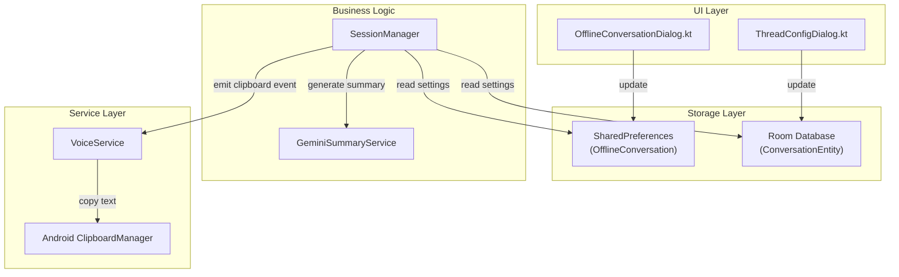

# Design Document: Per-Conversation Summary Settings

## Overview

This feature adds per-conversation customization of summary generation settings. Users can override the global summary prompt for individual conversations and optionally enable automatic clipboard copying of generated summaries.

The implementation touches multiple layers:
1. **Data Layer**: Extend `OfflineConversation` model (SharedPreferences) and `ConversationEntity` (Room DB)
2. **Business Logic**: Modify `SessionManager` to use per-conversation prompts and emit clipboard events
3. **Service Layer**: Add clipboard handling to `VoiceService` for background operation
4. **UI Layer**: Extend conversation settings dialogs with new fields

## Architecture



## Components and Interfaces

### 1. OfflineConversation (Model Extension)

**File**: `models/OfflineConversation.kt`

Add two new fields to the existing `@Serializable` data class:

```kotlin
@Serializable
data class OfflineConversation(
    // ... existing fields ...
    val customSummaryPrompt: String = "",      // NEW: Empty = use global
    val copySummaryToClipboard: Boolean = false // NEW: Default disabled
)
```

**Important**: The `OfflineConversationManager` uses `Json { ignoreUnknownKeys = true }` configuration, which ensures backward compatibility when loading old conversations that don't have these new fields - they will use the default values.

### 2. ConversationEntity (Room Extension)

**File**: `data/entities/ConversationEntity.kt`

Add two new columns:

```kotlin
@Entity(tableName = "conversations")
data class ConversationEntity(
    // ... existing fields ...
    
    @ColumnInfo(name = "custom_summary_prompt")
    val customSummaryPrompt: String? = null,  // NULL = use global
    
    @ColumnInfo(name = "copy_summary_to_clipboard")
    val copySummaryToClipboard: Boolean = false
)
```

### 3. ConversationDao (DAO Extension)

**File**: `data/dao/ConversationDao.kt`

Add update methods for new fields:

```kotlin
@Dao
interface ConversationDao {
    // ... existing methods ...
    
    @Query("UPDATE conversations SET custom_summary_prompt = :prompt WHERE id = :conversationId")
    suspend fun updateCustomSummaryPrompt(conversationId: String, prompt: String?)
    
    @Query("UPDATE conversations SET copy_summary_to_clipboard = :enabled WHERE id = :conversationId")
    suspend fun updateCopySummaryToClipboard(conversationId: String, enabled: Boolean)
}
```

### 4. AppDatabase (Migration)

**File**: `data/AppDatabase.kt`

Add migration from version 1 to 2:

```kotlin
@Database(
    entities = [...],
    version = 2,  // Increment version
    exportSchema = false
)
abstract class AppDatabase : RoomDatabase() {
    companion object {
        private val MIGRATION_1_2 = object : Migration(1, 2) {
            override fun migrate(database: SupportSQLiteDatabase) {
                database.execSQL(
                    "ALTER TABLE conversations ADD COLUMN custom_summary_prompt TEXT DEFAULT NULL"
                )
                database.execSQL(
                    "ALTER TABLE conversations ADD COLUMN copy_summary_to_clipboard INTEGER NOT NULL DEFAULT 0"
                )
            }
        }
        
        fun getDatabase(context: Context): AppDatabase {
            return INSTANCE ?: synchronized(this) {
                Room.databaseBuilder(...)
                    .addMigrations(MIGRATION_1_2)
                    .build()
            }
        }
    }
}
```

### 5. SessionManager (Business Logic)

**File**: `SessionManager.kt`

Modify summary generation to use per-conversation prompt:

```kotlin
class SessionManager(...) {
    
    // Event for clipboard copy (observed by VoiceService)
    private val _clipboardEvent = MutableSharedFlow<String>()
    val clipboardEvent: SharedFlow<String> = _clipboardEvent.asSharedFlow()
    
    private suspend fun getEffectiveSummaryPrompt(conversationId: String): String {
        // Try offline conversation first
        val offlineConv = OfflineConversationManager.getById(conversationId)
        if (offlineConv != null && offlineConv.customSummaryPrompt.isNotBlank()) {
            return offlineConv.customSummaryPrompt
        }
        
        // Try Room database
        val dbConv = conversationRepository.getConversation(conversationId)
        if (dbConv != null && !dbConv.customSummaryPrompt.isNullOrBlank()) {
            return dbConv.customSummaryPrompt
        }
        
        // Fall back to global prompt
        return Preferences.summaryPrompt.value ?: ""
    }
    
    private suspend fun shouldCopyToClipboard(conversationId: String): Boolean {
        val offlineConv = OfflineConversationManager.getById(conversationId)
        if (offlineConv != null) {
            return offlineConv.copySummaryToClipboard
        }
        
        val dbConv = conversationRepository.getConversation(conversationId)
        return dbConv?.copySummaryToClipboard ?: false
    }
    
    // In endSession(), after generating summary:
    private suspend fun handleSummaryGenerated(summary: String, conversationId: String) {
        if (summary.isNotBlank() && shouldCopyToClipboard(conversationId)) {
            _clipboardEvent.emit(summary)
        }
    }
}
```

### 6. VoiceService (Clipboard Handler)

**File**: `VoiceService.kt`

Add clipboard handling capability:

```kotlin
class VoiceService : Service() {
    
    private var clipboardJob: Job? = null
    
    fun observeClipboardEvents(sessionManager: SessionManager) {
        clipboardJob = CoroutineScope(Dispatchers.Main).launch {
            sessionManager.clipboardEvent.collect { text ->
                copyToClipboard(text)
            }
        }
    }
    
    private fun copyToClipboard(text: String) {
        try {
            val clipboard = getSystemService(Context.CLIPBOARD_SERVICE) as ClipboardManager
            val clip = ClipData.newPlainText("Podsumowanie sesji", text)
            clipboard.setPrimaryClip(clip)
            Log.d(TAG, "Summary copied to clipboard (${text.length} chars)")
            
            // Only show toast on Android < 12 (system shows its own on 12+)
            // Note: No Handler needed - copyToClipboard is called from Dispatchers.Main
            if (Build.VERSION.SDK_INT < Build.VERSION_CODES.S) {
                Toast.makeText(this, "Podsumowanie skopiowane", Toast.LENGTH_SHORT).show()
            }
        } catch (e: Exception) {
            Log.e(TAG, "Failed to copy to clipboard", e)
        }
    }
    
    override fun onDestroy() {
        clipboardJob?.cancel()
        super.onDestroy()
    }
}
```

### 7. UI Components

#### ThreadConfigDialog (LibreChat conversations)

**File**: `ui/ThreadConfigDialog.kt`

Add fields for custom summary prompt and clipboard toggle:

```kotlin
@Composable
fun ThreadConfigDialog(
    conversation: ConversationEntity,
    onDismiss: () -> Unit,
    onSave: (ConversationEntity) -> Unit
) {
    var customPrompt by remember { mutableStateOf(conversation.customSummaryPrompt ?: "") }
    var copyToClipboard by remember { mutableStateOf(conversation.copySummaryToClipboard) }
    val globalPrompt = Preferences.summaryPrompt.value ?: ""
    
    // ... existing dialog content ...
    
    // Custom Summary Prompt Section
    Text("Własny prompt podsumowania", style = MaterialTheme.typography.labelMedium)
    
    OutlinedTextField(
        value = customPrompt,
        onValueChange = { 
            customPrompt = it
            onSave(conversation.copy(customSummaryPrompt = it.ifBlank { null }))
        },
        placeholder = { Text("Użyj globalnego promptu") },
        modifier = Modifier.fillMaxWidth().height(120.dp),
        maxLines = 5
    )
    
    if (customPrompt.isBlank() && globalPrompt.isNotBlank()) {
        Text(
            text = "Aktualny globalny: ${globalPrompt.take(100)}...",
            style = MaterialTheme.typography.bodySmall,
            color = MaterialTheme.colorScheme.onSurfaceVariant
        )
    }
    
    // Clipboard Copy Toggle
    Row(verticalAlignment = Alignment.CenterVertically) {
        Checkbox(
            checked = copyToClipboard,
            onCheckedChange = { 
                copyToClipboard = it
                onSave(conversation.copy(copySummaryToClipboard = it))
            }
        )
        Text("Kopiuj podsumowanie do schowka")
    }
}
```

#### OfflineConversationDialog (Offline conversations)

Similar UI additions for offline conversation settings dialog.

## Data Models

### OfflineConversation (Extended)

| Field | Type | Default | Description |
|-------|------|---------|-------------|
| id | String | UUID | Unique identifier |
| title | String | - | Conversation title |
| systemPrompt | String | "" | System prompt for Gemini |
| voiceName | String | "Puck" | Voice selection |
| speechSpeed | Float | 1.0 | Speech speed multiplier |
| volumeBoost | Float | 1.0 | Volume boost multiplier |
| temperature | Float | 1.0 | LLM temperature |
| isSystemConversation | Boolean | false | System conversation flag |
| createdAt | Long | now | Creation timestamp |
| updatedAt | Long | now | Last update timestamp |
| **customSummaryPrompt** | String | "" | **NEW**: Per-conversation summary prompt |
| **copySummaryToClipboard** | Boolean | false | **NEW**: Enable clipboard copy |

### ConversationEntity (Extended)

| Column | Type | Default | Description |
|--------|------|---------|-------------|
| id | String (PK) | - | UUID identifier |
| title | String? | null | Conversation title |
| created_at | Long | - | Creation timestamp |
| last_session_at | Long | - | Last session timestamp |
| session_count | Int | 0 | Number of sessions |
| total_duration_seconds | Int | 0 | Total duration |
| document_count | Int | 0 | Document count |
| meta_summary | String? | null | Meta summary |
| source | String | "gemini_live" | Source type |
| metadata | String? | null | JSON metadata |
| **custom_summary_prompt** | String? | null | **NEW**: Per-conversation prompt |
| **copy_summary_to_clipboard** | Boolean | false | **NEW**: Clipboard copy flag |

### ClipboardEvent (New)

Simple event emitted when summary should be copied:

```kotlin
data class ClipboardEvent(
    val text: String,
    val conversationId: String,
    val timestamp: Long = System.currentTimeMillis()
)
```


## Correctness Properties

*A property is a characteristic or behavior that should hold true across all valid executions of a system-essentially, a formal statement about what the system should do. Properties serve as the bridge between human-readable specifications and machine-verifiable correctness guarantees.*

Based on the acceptance criteria analysis, the following correctness properties must be validated:

### Property 1: Effective Prompt Selection

*For any* conversation (offline or LibreChat) and any combination of custom and global prompts, the `getEffectiveSummaryPrompt()` function SHALL return:
- The custom prompt if `customSummaryPrompt` is non-empty
- The global prompt from Settings if `customSummaryPrompt` is empty/null

**Validates: Requirements 1.4, 1.5**

### Property 2: Offline Conversation Settings Round-Trip

*For any* `OfflineConversation` with arbitrary `customSummaryPrompt` (including empty, whitespace, special characters) and `copySummaryToClipboard` values, saving to SharedPreferences and then loading SHALL produce an equivalent object with identical field values.

**Validates: Requirements 3.1**

### Property 3: Room Conversation Settings Round-Trip

*For any* `ConversationEntity` with arbitrary `customSummaryPrompt` (including null, empty, special characters) and `copySummaryToClipboard` values, saving to Room database and then loading SHALL produce an equivalent entity with identical field values.

**Validates: Requirements 3.2**

### Property 4: Clipboard Event Emission

*For any* conversation with `copySummaryToClipboard = true`:
- IF the generated summary is non-empty THEN a clipboard event SHALL be emitted with the summary text
- IF the generated summary is empty or null THEN NO clipboard event SHALL be emitted

**Validates: Requirements 2.3, 2.6**

### Property 5: Clipboard Copy Non-Interference

*For any* session end with clipboard copy enabled, the clipboard copy operation SHALL NOT prevent or modify the normal summary processing flow (LibreChat sync or local storage).

**Validates: Requirements 2.5**

## Error Handling

### Storage Errors

| Error | Handling |
|-------|----------|
| SharedPreferences write failure | Log error, continue with in-memory state |
| Room database write failure | Log error, retry on next save |
| Migration failure | Fall back to destructive migration (existing behavior) |

### Clipboard Errors

| Error | Handling |
|-------|----------|
| ClipboardManager unavailable | Log error, skip clipboard copy, continue normal flow |
| SecurityException on clipboard access | Log error, skip clipboard copy |
| Empty summary | Skip clipboard copy silently |

### Prompt Resolution Errors

| Error | Handling |
|-------|----------|
| Both custom and global prompts empty | Use hardcoded fallback prompt |
| Conversation not found | Use global prompt |

## Testing Strategy

### Property-Based Testing Framework

**Library**: [Kotest](https://kotest.io/) with Property Testing module

**Configuration**: Minimum 100 iterations per property test

### Property Tests

Each property test must be annotated with the format:
`**Feature: per-conversation-summary-settings, Property {number}: {property_text}**`

#### Property 1 Test: Effective Prompt Selection

```kotlin
// **Feature: per-conversation-summary-settings, Property 1: Effective Prompt Selection**
class EffectivePromptSelectionPropertyTest : FunSpec({
    test("custom prompt takes precedence over global") {
        checkAll(100, Arb.string(1..500), Arb.string(1..500)) { customPrompt, globalPrompt ->
            // Given a conversation with non-empty custom prompt
            val conversation = createTestConversation(customSummaryPrompt = customPrompt)
            setGlobalPrompt(globalPrompt)
            
            // When getting effective prompt
            val effective = getEffectiveSummaryPrompt(conversation.id)
            
            // Then custom prompt is returned
            effective shouldBe customPrompt
        }
    }
    
    test("global prompt used when custom is empty") {
        checkAll(100, Arb.string(1..500)) { globalPrompt ->
            // Given a conversation with empty custom prompt
            val conversation = createTestConversation(customSummaryPrompt = "")
            setGlobalPrompt(globalPrompt)
            
            // When getting effective prompt
            val effective = getEffectiveSummaryPrompt(conversation.id)
            
            // Then global prompt is returned
            effective shouldBe globalPrompt
        }
    }
})
```

#### Property 2 Test: Offline Conversation Round-Trip

```kotlin
// **Feature: per-conversation-summary-settings, Property 2: Offline Conversation Settings Round-Trip**
class OfflineConversationRoundTripPropertyTest : FunSpec({
    test("settings survive save and load cycle") {
        checkAll(100, 
            Arb.string(0..1000),  // customSummaryPrompt
            Arb.boolean()         // copySummaryToClipboard
        ) { prompt, clipboard ->
            // Given an offline conversation with settings
            val original = OfflineConversation(
                id = UUID.randomUUID().toString(),
                title = "Test",
                customSummaryPrompt = prompt,
                copySummaryToClipboard = clipboard
            )
            
            // When saved and loaded
            OfflineConversationManager.update(original)
            val loaded = OfflineConversationManager.getById(original.id)
            
            // Then settings are preserved
            loaded?.customSummaryPrompt shouldBe original.customSummaryPrompt
            loaded?.copySummaryToClipboard shouldBe original.copySummaryToClipboard
        }
    }
})
```

#### Property 3 Test: Room Conversation Round-Trip

```kotlin
// **Feature: per-conversation-summary-settings, Property 3: Room Conversation Settings Round-Trip**
class RoomConversationRoundTripPropertyTest : FunSpec({
    test("settings survive database save and load cycle") {
        checkAll(100,
            Arb.string(0..1000).orNull(),  // customSummaryPrompt (nullable)
            Arb.boolean()                   // copySummaryToClipboard
        ) { prompt, clipboard ->
            // Given a conversation entity with settings
            val original = ConversationEntity(
                id = UUID.randomUUID().toString(),
                title = "Test",
                createdAt = System.currentTimeMillis(),
                lastSessionAt = System.currentTimeMillis(),
                customSummaryPrompt = prompt,
                copySummaryToClipboard = clipboard
            )
            
            // When saved and loaded
            conversationDao.insert(original)
            val loaded = conversationDao.getById(original.id)
            
            // Then settings are preserved
            loaded?.customSummaryPrompt shouldBe original.customSummaryPrompt
            loaded?.copySummaryToClipboard shouldBe original.copySummaryToClipboard
        }
    }
})
```

#### Property 4 Test: Clipboard Event Emission

```kotlin
// **Feature: per-conversation-summary-settings, Property 4: Clipboard Event Emission**
class ClipboardEventEmissionPropertyTest : FunSpec({
    test("clipboard event emitted for non-empty summary when enabled") {
        checkAll(100, Arb.string(1..5000)) { summary ->
            // Given clipboard copy enabled
            val conversation = createTestConversation(copySummaryToClipboard = true)
            val events = mutableListOf<String>()
            sessionManager.clipboardEvent.collect { events.add(it) }
            
            // When summary is generated
            sessionManager.handleSummaryGenerated(summary, conversation.id)
            
            // Then event is emitted
            events shouldContain summary
        }
    }
    
    test("no clipboard event for empty summary") {
        checkAll(100, Arb.element("", " ", "\n", "\t")) { emptySummary ->
            // Given clipboard copy enabled
            val conversation = createTestConversation(copySummaryToClipboard = true)
            val events = mutableListOf<String>()
            sessionManager.clipboardEvent.collect { events.add(it) }
            
            // When empty summary is generated
            sessionManager.handleSummaryGenerated(emptySummary, conversation.id)
            
            // Then no event is emitted
            events shouldBeEmpty()
        }
    }
})
```

### Unit Tests

Unit tests cover specific examples and edge cases:

1. **UI Tests**: Verify placeholder text, helper text visibility, checkbox state
2. **Migration Test**: Verify database migration adds columns with correct defaults
3. **Integration Test**: End-to-end test of session end with clipboard copy

### Test File Organization

```
src/test/java/ai/pipecat/gemini_multimodal_websocket_demo/
├── EffectivePromptSelectionPropertyTest.kt
├── OfflineConversationRoundTripPropertyTest.kt
├── RoomConversationRoundTripPropertyTest.kt
├── ClipboardEventEmissionPropertyTest.kt
└── PerConversationSettingsUnitTest.kt
```
