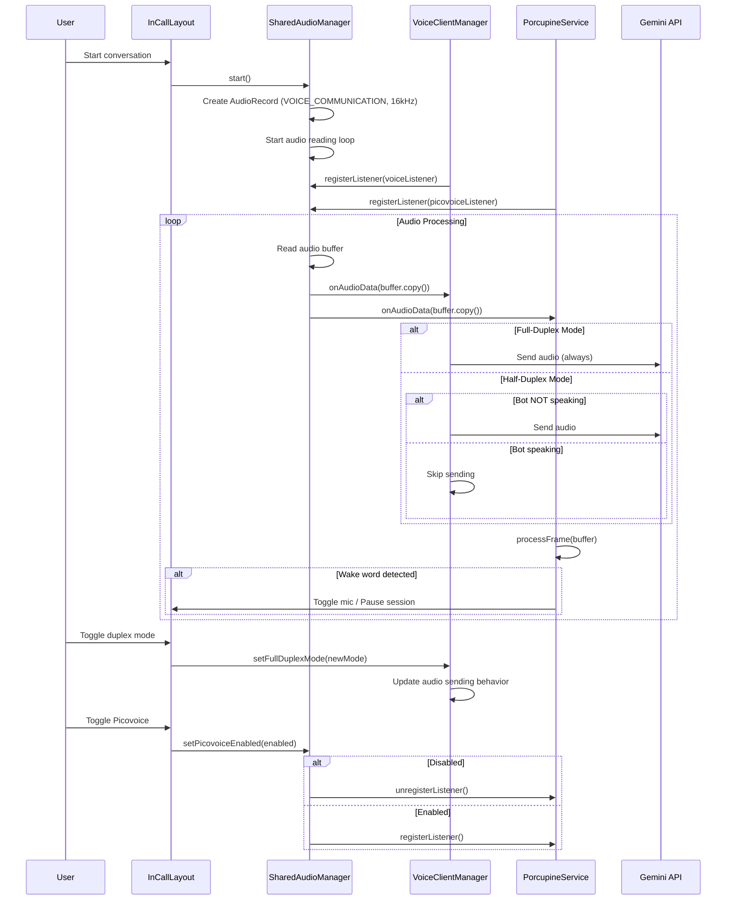

# Design Document: Shared Audio Manager

## Overview

This document describes the technical design for implementing a Shared Audio Manager that enables simultaneous audio processing by VoiceClientManager (Gemini conversation) and PorcupineService (wake word detection). The design introduces a centralized audio management component that distributes AEC-filtered audio to multiple consumers, along with UI controls for dynamic mode switching.

## Architecture

### High-Level Architecture

```
┌─────────────────────────────────────────────────────────────────┐
│                        MainActivity                              │
│  - Manages UI state for duplex mode and Picovoice toggles       │
│  - Observes SharedAudioManager state                            │
└────────────────────────┬────────────────────────────────────────┘
                         │
         ┌───────────────┼───────────────┐
         │               │               │
         ▼               ▼               ▼
┌─────────────┐  ┌──────────────┐  ┌─────────────────┐
│ InCallLayout│  │SettingsScreen│  │ VoiceService    │
│ - Mode icons│  │ - Defaults   │  │ - Keeps alive   │
└─────────────┘  └──────────────┘  └─────────────────┘
                         │
                         ▼
┌─────────────────────────────────────────────────────────────────┐
│                    SharedAudioManager                            │
│  - Single AudioRecord (VOICE_COMMUNICATION, 16kHz)              │
│  - Continuous audio reading loop                                 │
│  - Distributes audio to registered listeners                     │
│  - Manages Bluetooth SCO for headsets                           │
└────────────────────────┬────────────────────────────────────────┘
                         │
         ┌───────────────┴───────────────┐
         │                               │
         ▼                               ▼
┌─────────────────────┐      ┌─────────────────────┐
│  VoiceClientManager │      │   PorcupineService  │
│  - AudioListener    │      │   - AudioListener   │
│  - Gemini WebSocket │      │   - Wake word detect│
│  - Half/Full duplex │      │   - Rate limiting   │
└─────────────────────┘      └─────────────────────┘
```

### Component Interaction Flow



## Components and Interfaces

### 1. SharedAudioManager

**Location:** `SharedAudioManager.kt`

**Role:** Centralized audio capture and distribution component.

```kotlin
object SharedAudioManager {
    
    // Configuration
    private const val SAMPLE_RATE = 16000
    private const val CHANNEL_CONFIG = AudioFormat.CHANNEL_IN_MONO
    private const val AUDIO_FORMAT = AudioFormat.ENCODING_PCM_16BIT
    private const val BUFFER_SIZE_MULTIPLIER = 4
    
    // State
    private var audioRecord: AudioRecord? = null
    private var isRunning = false
    private var scope: CoroutineScope? = null
    private val listeners = CopyOnWriteArrayList<AudioListener>()
    private val listenersMutex = Mutex()
    
    // Bluetooth SCO
    private var audioManager: AudioManager? = null
    private var isBluetoothScoOn = false
    
    // Observable state
    val isActive = mutableStateOf(false)
    val error = mutableStateOf<String?>(null)
    
    interface AudioListener {
        val id: String
        fun onAudioData(buffer: ByteArray, size: Int)
        fun onError(error: String)
    }
    
    fun initialize(context: Context)
    fun start(): Result<Unit>
    fun stop()
    fun registerListener(listener: AudioListener)
    fun unregisterListener(listenerId: String)
    fun isListenerRegistered(listenerId: String): Boolean
    
    // Bluetooth SCO management
    private fun setupBluetoothSco(context: Context)
    private fun startBluetoothSco()
    private fun stopBluetoothSco()
}
```

### 2. AudioListener Interface

**Location:** `SharedAudioManager.kt` (inner interface)

```kotlin
interface AudioListener {
    val id: String  // Unique identifier for the listener
    fun onAudioData(buffer: ByteArray, size: Int)
    fun onError(error: String)
}
```

### 3. VoiceClientManager Changes

**Modified methods:**

```kotlin
class VoiceClientManager {
    // New state
    val isFullDuplexMode = mutableStateOf(Preferences.fullDuplexMode.value)
    val isPicovoiceEnabled = mutableStateOf(Preferences.picovoiceEnabled.value)
    
    // AudioListener implementation
    private val audioListener = object : SharedAudioManager.AudioListener {
        override val id = "voice_client_manager"
        
        override fun onAudioData(buffer: ByteArray, size: Int) {
            // Process audio (level calculation, Gemini transmission)
            processAudioData(buffer, size)
        }
        
        override fun onError(error: String) {
            Log.e(TAG, "Audio error: $error")
            errors.add(Error(error))
        }
    }
    
    // Mode switching
    fun setFullDuplexMode(enabled: Boolean) {
        isFullDuplexMode.value = enabled
        Log.i(TAG, "Duplex mode changed: ${if (enabled) "FULL" else "HALF"}")
    }
    
    fun setPicovoiceEnabled(enabled: Boolean) {
        isPicovoiceEnabled.value = enabled
        if (enabled) {
            SharedAudioManager.registerListener(picovoiceListener)
        } else {
            SharedAudioManager.unregisterListener("picovoice")
        }
        Log.i(TAG, "Picovoice: ${if (enabled) "ENABLED" else "DISABLED"}")
    }
    
    // Modified start() - uses SharedAudioManager instead of own AudioRecord
    fun start(threadSettings: ThreadSettings? = null) {
        // ... existing setup code ...
        
        // Initialize modes from preferences
        isFullDuplexMode.value = Preferences.fullDuplexMode.value
        isPicovoiceEnabled.value = Preferences.picovoiceEnabled.value
        
        // Register with SharedAudioManager
        SharedAudioManager.registerListener(audioListener)
        
        if (isPicovoiceEnabled.value) {
            SharedAudioManager.registerListener(picovoiceListener)
        }
        
        // Start SharedAudioManager if not already running
        if (!SharedAudioManager.isActive.value) {
            SharedAudioManager.start()
        }
        
        // ... rest of connection setup ...
    }
    
    // Modified audio processing
    private fun processAudioData(buffer: ByteArray, size: Int) {
        // Calculate audio level
        val level = calculateAudioLevel(buffer.copyOf(size))
        userAudioLevel.floatValue = level
        
        // Detect user talking
        val threshold = Preferences.activityDetectionThreshold.value
        val isTalking = level > threshold
        if (userIsTalking.value != isTalking) {
            userIsTalking.value = isTalking
            if (isTalking) updateActivity()
        }
        
        // Send to Gemini based on duplex mode
        val shouldSend = when {
            state.value != ConnectionState.CONNECTED -> false
            isFullDuplexMode.value -> true  // Always send in full-duplex
            botIsTalking.value -> false     // Don't send in half-duplex when bot talks
            else -> true
        }
        
        if (shouldSend) {
            sendAudioToGemini(buffer, size)
        }
    }
}
```

### 4. PorcupineService Changes

**Modified to use SharedAudioManager:**

```kotlin
class PorcupineService : Service() {
    
    private var porcupine: Porcupine? = null
    private var lastWakeWordTime = 0L
    private val RATE_LIMIT_MS = 2000L
    
    // AudioListener implementation (no longer uses PorcupineManager)
    private val audioListener = object : SharedAudioManager.AudioListener {
        override val id = "picovoice"
        
        override fun onAudioData(buffer: ByteArray, size: Int) {
            processAudioFrame(buffer, size)
        }
        
        override fun onError(error: String) {
            Log.e(TAG, "Audio error from SharedAudioManager: $error")
        }
    }
    
    private fun processAudioFrame(buffer: ByteArray, size: Int) {
        // Convert ByteArray to ShortArray for Porcupine
        val shortBuffer = ShortArray(size / 2)
        ByteBuffer.wrap(buffer).order(ByteOrder.LITTLE_ENDIAN).asShortBuffer().get(shortBuffer)
        
        // Process with Porcupine
        val keywordIndex = porcupine?.process(shortBuffer) ?: -1
        
        if (keywordIndex >= 0) {
            handleWakeWordDetection(keywordIndex)
        }
    }
    
    private fun handleWakeWordDetection(keywordIndex: Int) {
        // Rate limiting
        val now = System.currentTimeMillis()
        if (now - lastWakeWordTime < RATE_LIMIT_MS) {
            Log.d(TAG, "Wake word rate limited")
            return
        }
        lastWakeWordTime = now
        
        // Check connection state - ignore during reconnection
        // (This check happens via broadcast receiver in MainActivity)
        
        // Handle wake word
        val wakeWord = loadedWakeWords.getOrNull(keywordIndex)
        if (wakeWord != null) {
            wakeWordHandler.handleWakeWord(wakeWord)
        }
    }
    
    override fun onStartCommand(intent: Intent?, flags: Int, startId: Int): Int {
        // ... notification setup ...
        
        // Initialize Porcupine (without PorcupineManager)
        initializePorcupine()
        
        // Don't register with SharedAudioManager here
        // VoiceClientManager controls registration based on isPicovoiceEnabled
        
        return START_STICKY
    }
    
    private fun initializePorcupine() {
        val accessKey = PicovoiceManager.getEffectiveAccessKey()
        val wakeWords = loadWakeWords()
        
        porcupine = Porcupine.Builder()
            .setAccessKey(accessKey)
            .setKeywordPaths(wakeWords.mapNotNull { it.ppnPath }.toTypedArray())
            .setSensitivities(wakeWords.map { it.sensitivity }.toFloatArray())
            .build(this)
    }
}
```

### 5. UI Components

#### DuplexModeButton

**Location:** `ui/DuplexModeButton.kt`

```kotlin
@Composable
fun DuplexModeButton(
    isFullDuplex: Boolean,
    onToggle: () -> Unit,
    modifier: Modifier = Modifier
) {
    IconButton(
        onClick = onToggle,
        modifier = modifier
            .size(48.dp)
            .background(
                color = if (isFullDuplex) Colors.buttonActive else Colors.buttonInactive,
                shape = CircleShape
            )
    ) {
        Icon(
            painter = painterResource(
                id = if (isFullDuplex) R.drawable.ic_duplex_full else R.drawable.ic_duplex_half
            ),
            contentDescription = if (isFullDuplex) "Full-duplex mode" else "Half-duplex mode",
            tint = Color.White
        )
    }
}
```

#### PicovoiceToggleButton

**Location:** `ui/PicovoiceToggleButton.kt`

```kotlin
@Composable
fun PicovoiceToggleButton(
    isEnabled: Boolean,
    onToggle: () -> Unit,
    modifier: Modifier = Modifier
) {
    IconButton(
        onClick = onToggle,
        modifier = modifier
            .size(48.dp)
            .background(
                color = if (isEnabled) Colors.picovoiceActive else Colors.picovoiceInactive,
                shape = CircleShape
            )
    ) {
        Icon(
            painter = painterResource(
                id = if (isEnabled) R.drawable.ic_wake_word_on else R.drawable.ic_wake_word_off
            ),
            contentDescription = if (isEnabled) "Wake word enabled" else "Wake word disabled",
            tint = Color.White
        )
    }
}
```

#### InCallLayout Modifications

```kotlin
@Composable
fun InCallLayout(
    voiceClientManager: VoiceClientManager,
    // ... existing params ...
) {
    // ... existing code ...
    
    // Mode control buttons row
    Row(
        modifier = Modifier
            .fillMaxWidth()
            .padding(horizontal = 16.dp),
        horizontalArrangement = Arrangement.SpaceEvenly
    ) {
        // Duplex mode toggle
        DuplexModeButton(
            isFullDuplex = voiceClientManager.isFullDuplexMode.value,
            onToggle = {
                voiceClientManager.setFullDuplexMode(!voiceClientManager.isFullDuplexMode.value)
            }
        )
        
        // Picovoice toggle
        PicovoiceToggleButton(
            isEnabled = voiceClientManager.isPicovoiceEnabled.value,
            onToggle = {
                voiceClientManager.setPicovoiceEnabled(!voiceClientManager.isPicovoiceEnabled.value)
            }
        )
        
        // Existing buttons (mic, speakerphone, etc.)
        // ...
    }
}
```

## Data Models

### AudioConfig

```kotlin
data class AudioConfig(
    val sampleRate: Int = 16000,
    val channelConfig: Int = AudioFormat.CHANNEL_IN_MONO,
    val audioFormat: Int = AudioFormat.ENCODING_PCM_16BIT,
    val audioSource: Int = MediaRecorder.AudioSource.VOICE_COMMUNICATION,
    val bufferSizeMultiplier: Int = 4
) {
    val bufferSize: Int
        get() = AudioRecord.getMinBufferSize(sampleRate, channelConfig, audioFormat) * bufferSizeMultiplier
}
```

### SessionAudioState

```kotlin
data class SessionAudioState(
    val isFullDuplexMode: Boolean = true,
    val isPicovoiceEnabled: Boolean = true,
    val isSharedAudioActive: Boolean = false,
    val lastError: String? = null
)
```

### Preferences Updates

```kotlin
object Preferences {
    // Existing
    val fullDuplexMode = BooleanPref(PREF_FULL_DUPLEX_MODE, true)
    
    // New
    val picovoiceEnabledDefault = BooleanPref(PREF_PICOVOICE_ENABLED_DEFAULT, true)
}
```

## Correctness Properties

*A property is a characteristic or behavior that should hold true across all valid executions of a system-essentially, a formal statement about what the system should do. Properties serve as the bridge between human-readable specifications and machine-verifiable correctness guarantees.*

### Property 1: Audio Distribution Consistency
*For any* audio buffer read by SharedAudioManager, all registered listeners SHALL receive an identical copy of the buffer data.
**Validates: Requirements 1.4**

### Property 2: Listener Registration Atomicity
*For any* sequence of registerListener and unregisterListener calls, the listeners list SHALL always be in a consistent state (no partial updates or race conditions).
**Validates: Requirements 1.5**

### Property 3: Duplex Mode Audio Transmission
*For any* audio buffer in half-duplex mode when botIsTalking is true, the system SHALL NOT transmit audio to Gemini. Conversely, in full-duplex mode, audio SHALL be transmitted regardless of botIsTalking state.
**Validates: Requirements 2.2, 2.3**

### Property 4: Mode State Synchronization
*For any* change to isFullDuplexMode or isPicovoiceEnabled, the corresponding UI state SHALL reflect the new value within one frame render cycle.
**Validates: Requirements 2.4, 3.4**

### Property 5: Default Mode Initialization
*For any* new session start, the initial values of isFullDuplexMode and isPicovoiceEnabled SHALL equal the values stored in Preferences.
**Validates: Requirements 2.5, 3.5**

### Property 6: Picovoice Listener Control
*For any* state where isPicovoiceEnabled is false, the Picovoice listener SHALL NOT be registered with SharedAudioManager and SHALL NOT receive audio callbacks.
**Validates: Requirements 3.2, 3.3**

### Property 7: Wake Word Rate Limiting
*For any* sequence of wake word detections, the minimum interval between processed detections SHALL be at least 2000ms.
**Validates: Requirements 9.4**

### Property 8: Reconnection Wake Word Suppression
*For any* wake word detection when connection state is RECONNECTING, the system SHALL ignore the detection and not execute any action.
**Validates: Requirements 9.3**

### Property 9: Singleton AudioRecord
*For any* number of start() calls to SharedAudioManager, there SHALL be at most one active AudioRecord instance at any time.
**Validates: Requirements 1.3**

### Property 10: Error Isolation
*For any* exception thrown by a listener's onAudioData callback, the SharedAudioManager SHALL continue distributing audio to other listeners without interruption.
**Validates: Requirements 10.4**

## Error Handling

### AudioRecord Initialization Failure

```kotlin
fun start(): Result<Unit> {
    return try {
        val bufferSize = AudioRecord.getMinBufferSize(SAMPLE_RATE, CHANNEL_CONFIG, AUDIO_FORMAT)
        if (bufferSize == AudioRecord.ERROR || bufferSize == AudioRecord.ERROR_BAD_VALUE) {
            return Result.failure(AudioException("Invalid buffer size"))
        }
        
        audioRecord = AudioRecord(
            MediaRecorder.AudioSource.VOICE_COMMUNICATION,
            SAMPLE_RATE,
            CHANNEL_CONFIG,
            AUDIO_FORMAT,
            bufferSize * BUFFER_SIZE_MULTIPLIER
        )
        
        if (audioRecord?.state != AudioRecord.STATE_INITIALIZED) {
            audioRecord?.release()
            audioRecord = null
            return Result.failure(AudioException("AudioRecord initialization failed"))
        }
        
        audioRecord?.startRecording()
        startAudioLoop()
        Result.success(Unit)
    } catch (e: SecurityException) {
        Result.failure(AudioException("Microphone permission denied"))
    } catch (e: Exception) {
        Result.failure(AudioException("Audio initialization failed: ${e.message}"))
    }
}
```

### Audio Read Error Recovery

```kotlin
private fun startAudioLoop() {
    scope = CoroutineScope(Dispatchers.IO + SupervisorJob())
    var consecutiveErrors = 0
    val maxErrors = 3
    
    scope?.launch {
        val buffer = ByteArray(bufferSize)
        
        while (isActive && isRunning) {
            val read = audioRecord?.read(buffer, 0, buffer.size) ?: -1
            
            when {
                read > 0 -> {
                    consecutiveErrors = 0
                    distributeAudio(buffer, read)
                }
                read == AudioRecord.ERROR_INVALID_OPERATION -> {
                    consecutiveErrors++
                    Log.e(TAG, "AudioRecord invalid operation (attempt $consecutiveErrors)")
                    if (consecutiveErrors >= maxErrors) {
                        notifyError("Audio recording failed after $maxErrors attempts")
                        break
                    }
                    delay(100)
                    recreateAudioRecord()
                }
                read == AudioRecord.ERROR_BAD_VALUE -> {
                    Log.e(TAG, "AudioRecord bad value")
                    notifyError("Audio configuration error")
                    break
                }
            }
        }
    }
}
```

### Listener Exception Handling

```kotlin
private fun distributeAudio(buffer: ByteArray, size: Int) {
    listeners.forEach { listener ->
        try {
            // Create copy for each listener to prevent data corruption
            val bufferCopy = buffer.copyOf(size)
            listener.onAudioData(bufferCopy, size)
        } catch (e: Exception) {
            Log.e(TAG, "Listener ${listener.id} threw exception: ${e.message}")
            // Continue to other listeners - don't let one failure stop distribution
        }
    }
}
```

## Testing Strategy

### Dual Testing Approach

The implementation requires both unit tests and property-based tests:

- **Unit tests:** Verify specific examples, edge cases, and integration points
- **Property-based tests:** Verify universal properties that should hold across all inputs

### Property-Based Testing Library

**Library:** Kotest Property Testing (io.kotest:kotest-property)

**Configuration:** Each property test runs minimum 100 iterations.

### Unit Tests

1. **SharedAudioManager initialization**
   - Verify AudioRecord uses VOICE_COMMUNICATION source
   - Verify 16kHz sample rate configuration
   - Verify buffer size calculation

2. **Listener registration**
   - Register single listener
   - Register multiple listeners
   - Unregister listener
   - Unregister non-existent listener

3. **Mode switching**
   - Toggle duplex mode during session
   - Toggle Picovoice during session
   - Rapid mode toggling (debounce)

4. **Bluetooth SCO**
   - Start SCO when headset connected
   - Stop SCO when headset disconnected
   - Handle SCO connection failure

### Property-Based Tests

Each test tagged with format: `**Feature: shared-audio-manager, Property {number}: {property_text}**`

1. **Audio distribution consistency** (Property 1)
2. **Listener registration atomicity** (Property 2)
3. **Duplex mode audio transmission** (Property 3)
4. **Mode state synchronization** (Property 4)
5. **Default mode initialization** (Property 5)
6. **Picovoice listener control** (Property 6)
7. **Wake word rate limiting** (Property 7)
8. **Reconnection wake word suppression** (Property 8)
9. **Singleton AudioRecord** (Property 9)
10. **Error isolation** (Property 10)

### Integration Tests

1. **End-to-end wake word detection during conversation**
2. **Mode switching with active Gemini connection**
3. **Background operation with VoiceService**
4. **Bluetooth headset connection/disconnection**

## Implementation Notes

### Bluetooth SCO Handling (CRITICAL)

**IMPORTANT:** `startBluetoothSco()` is ASYNCHRONOUS. You MUST wait for the broadcast 
`AudioManager.ACTION_SCO_AUDIO_STATE_UPDATED` with state `SCO_AUDIO_STATE_CONNECTED` 
before creating AudioRecord. Otherwise, audio will be recorded from phone microphone 
instead of Bluetooth headset.

```kotlin
// SCO connection state
private var scoConnectionPending = false
private var scoConnected = false
private val scoConnectionLatch = CompletableDeferred<Boolean>()

private val bluetoothScoReceiver = object : BroadcastReceiver() {
    override fun onReceive(context: Context, intent: Intent) {
        val state = intent.getIntExtra(AudioManager.EXTRA_SCO_AUDIO_STATE, -1)
        Log.d(TAG, "Bluetooth SCO state changed: $state")
        
        when (state) {
            AudioManager.SCO_AUDIO_STATE_CONNECTED -> {
                Log.i(TAG, "✅ Bluetooth SCO CONNECTED - headset mic ready")
                scoConnected = true
                scoConnectionPending = false
                scoConnectionLatch.complete(true)
                
                // Recreate AudioRecord to use Bluetooth mic
                if (isRunning) {
                    recreateAudioRecord()
                }
            }
            AudioManager.SCO_AUDIO_STATE_DISCONNECTED -> {
                Log.i(TAG, "🔌 Bluetooth SCO DISCONNECTED - using phone mic")
                scoConnected = false
                scoConnectionPending = false
                scoConnectionLatch.complete(false)
                
                // Recreate AudioRecord to use phone mic
                if (isRunning) {
                    recreateAudioRecord()
                }
            }
            AudioManager.SCO_AUDIO_STATE_CONNECTING -> {
                Log.d(TAG, "⏳ Bluetooth SCO connecting...")
                scoConnectionPending = true
            }
            AudioManager.SCO_AUDIO_STATE_ERROR -> {
                Log.e(TAG, "❌ Bluetooth SCO error")
                scoConnectionPending = false
                scoConnectionLatch.complete(false)
            }
        }
    }
}

private fun setupBluetoothSco(context: Context) {
    audioManager = context.getSystemService(Context.AUDIO_SERVICE) as AudioManager
    
    // Register for Bluetooth SCO state changes
    val filter = IntentFilter(AudioManager.ACTION_SCO_AUDIO_STATE_UPDATED)
    context.registerReceiver(bluetoothScoReceiver, filter)
}

/**
 * Start Bluetooth SCO connection.
 * IMPORTANT: This is ASYNCHRONOUS - wait for SCO_AUDIO_STATE_CONNECTED broadcast
 * before creating AudioRecord to ensure headset mic is used.
 */
private suspend fun startBluetoothScoAsync(): Boolean {
    audioManager?.let { am ->
        if (!am.isBluetoothScoAvailableOffCall) {
            Log.w(TAG, "Bluetooth SCO not available")
            return false
        }
        
        // Reset latch for new connection attempt
        scoConnectionLatch = CompletableDeferred()
        scoConnectionPending = true
        
        am.startBluetoothSco()
        Log.i(TAG, "⏳ Bluetooth SCO start requested - waiting for connection...")
        
        // Wait for SCO connection with timeout
        return try {
            withTimeout(5000L) {
                scoConnectionLatch.await()
            }
        } catch (e: TimeoutCancellationException) {
            Log.e(TAG, "Bluetooth SCO connection timeout")
            scoConnectionPending = false
            false
        }
    }
    return false
}

private fun stopBluetoothSco() {
    audioManager?.let { am ->
        if (scoConnected || scoConnectionPending) {
            am.stopBluetoothSco()
            am.isBluetoothScoOn = false
            scoConnected = false
            scoConnectionPending = false
            Log.i(TAG, "Bluetooth SCO stopped")
        }
    }
}

/**
 * Start SharedAudioManager with Bluetooth SCO support.
 * If Bluetooth headset is connected, waits for SCO connection before starting AudioRecord.
 */
suspend fun startWithBluetoothSupport(): Result<Unit> {
    // Check if Bluetooth headset is connected
    val hasBluetoothHeadset = audioManager?.isBluetoothScoAvailableOffCall == true
    
    if (hasBluetoothHeadset) {
        Log.i(TAG, "Bluetooth headset detected - starting SCO connection")
        val scoSuccess = startBluetoothScoAsync()
        if (scoSuccess) {
            Log.i(TAG, "✅ SCO connected - will use Bluetooth mic")
        } else {
            Log.w(TAG, "⚠️ SCO connection failed - will use phone mic")
        }
    }
    
    // Now create AudioRecord (will use correct mic based on SCO state)
    return start()
}
```

### Thread Safety

- `CopyOnWriteArrayList` for listeners collection (safe iteration during modification)
- `Mutex` for critical sections (AudioRecord creation/destruction)
- Atomic state updates via Compose `mutableStateOf`

### Memory Management

**Buffer Copying Strategy:**

The current design uses `buffer.copyOf(size)` for each listener, which creates new ByteArray 
allocations every 10-20ms. This can cause GC pressure and UI jank on lower-end devices.

**Current approach (Safety first):**
```kotlin
private fun distributeAudio(buffer: ByteArray, size: Int) {
    listeners.forEach { listener ->
        try {
            // Create copy for each listener to prevent data corruption
            // TODO: Use buffer pooling if GC pressure becomes high
            val bufferCopy = buffer.copyOf(size)
            listener.onAudioData(bufferCopy, size)
        } catch (e: Exception) {
            Log.e(TAG, "Listener ${listener.id} threw exception: ${e.message}")
        }
    }
}
```

**Future optimization (if GC pressure is observed):**

Option A: Pre-allocated buffers per listener
```kotlin
interface AudioListener {
    val id: String
    val buffer: ByteArray  // Pre-allocated by listener
    fun onAudioData(size: Int)  // Data already in buffer
    fun onError(error: String)
}

private fun distributeAudio(sourceBuffer: ByteArray, size: Int) {
    listeners.forEach { listener ->
        System.arraycopy(sourceBuffer, 0, listener.buffer, 0, size)
        listener.onAudioData(size)
    }
}
```

Option B: Buffer pool
```kotlin
private val bufferPool = ArrayDeque<ByteArray>()
private val poolSize = 10

private fun getBuffer(size: Int): ByteArray {
    return bufferPool.pollFirst() ?: ByteArray(size)
}

private fun returnBuffer(buffer: ByteArray) {
    if (bufferPool.size < poolSize) {
        bufferPool.addLast(buffer)
    }
}
```

**Recommendation:** Start with `copyOf()` approach. Monitor GC metrics during testing.
If GC pauses exceed 5ms or occur more than 10 times per second, implement buffer pooling.

**Other memory considerations:**
- Reuse buffer array in read loop (only copy when distributing)
- Release AudioRecord on stop to free native resources
- Clear listener references on stop to prevent memory leaks

### Migration Path

1. Create SharedAudioManager as new component
2. Add AudioListener interface
3. Modify VoiceClientManager to implement AudioListener
4. Modify PorcupineService to implement AudioListener
5. Remove direct AudioRecord usage from VoiceClientManager
6. Remove PorcupineManager usage from PorcupineService
7. Add UI components for mode toggles
8. Update Settings screen with new defaults
9. Add property-based tests
10. Integration testing
