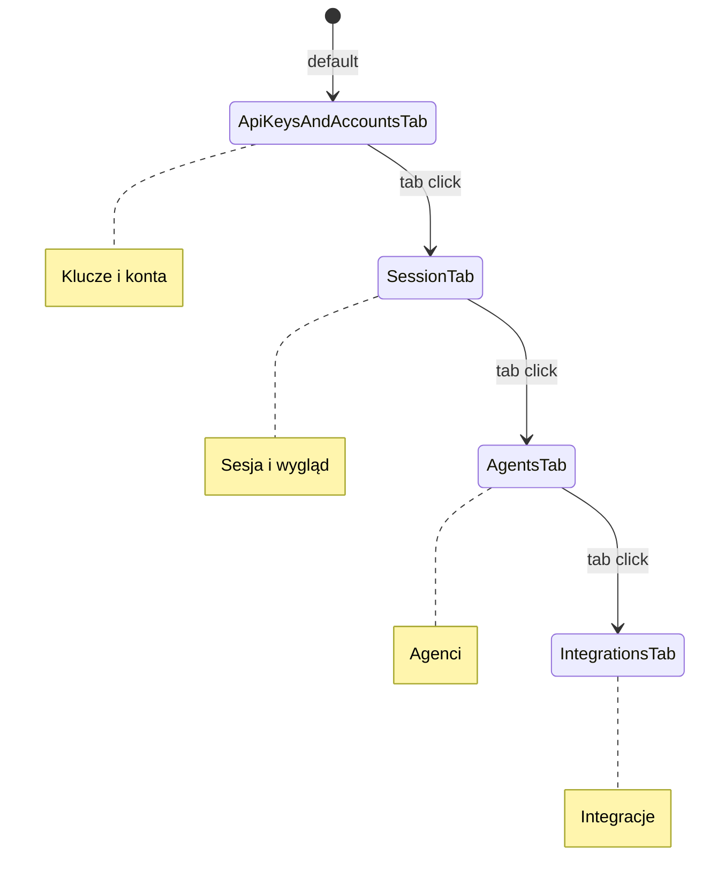

# Design Document: UI Settings Refactor

## Overview

Refaktoryzacja ekranu ustawień (SettingsScreen) z monolitycznego scrollowalnego widoku na system zakładek (tabs). Główne cele:
1. Podział ~3000 linii kodu na mniejsze, zarządzalne komponenty
2. Lepsza nawigacja między kategoriami ustawień
3. Zmiana logiki logowania - aplikacja działa bez Kumpel-chat (tylko offline)
4. Centralizacja wszystkich kluczy API z możliwością importu z JSON

## Architecture

### Component Structure

```
SettingsScreen (główny kontener)
├── SettingsTabBar (pasek zakładek - 4 zakładki)
│   └── TabItem × 4 (zakładki)
└── SettingsContent (zawartość zakładki)
    ├── ApiKeysAndAccountsTab (Klucze API + Kumpel-chat)
    ├── SessionAndAppearanceTab (Sesja i wygląd)
    ├── AgentsTab (Agent sterowania + Agent rozumujący)
    └── IntegrationsTab (Picovoice + Telegram)
```

### Tab Navigation Pattern



### Consolidated Tabs (4 zakładki)

| Zakładka | Zawartość | Ikona |
|----------|-----------|-------|
| **Klucze i konta** | Wszystkie klucze API + logowanie Kumpel-chat | 🔑 |
| **Sesja i wygląd** | Zarządzanie sesją, tryb audio, preferencje wizualne, bezpieczeństwo | ⚙️ |
| **Agenci** | Agent sterowania głosowego + Agent rozumujący | 🤖 |
| **Integracje** | Picovoice (wake words) + Telegram + Custom Tools | 🔗 |

## Components and Interfaces

### SettingsScreen.kt (refactored)

```kotlin
@Composable
fun SettingsScreen(
    onClose: () -> Unit,
    onLogout: () -> Unit,
    onChangePIN: () -> Unit,
    onThemeSelection: () -> Unit = {}
)
```

Główny kontener zarządzający:
- Stanem wybranej zakładki
- Walidacją i zapisem ustawień
- Nawigacją między zakładkami

### SettingsTabBar.kt (new)

```kotlin
@Composable
fun SettingsTabBar(
    selectedTab: SettingsTab,
    onTabSelected: (SettingsTab) -> Unit
)

enum class SettingsTab {
    API_KEYS_AND_ACCOUNTS, // "Klucze i konta"
    SESSION,               // "Sesja i wygląd"
    AGENTS,                // "Agenci"
    INTEGRATIONS           // "Integracje"
}
```

Pasek 4 zakładek - wszystkie mieszczą się na ekranie bez przewijania.

### ApiKeysAndAccountsTab.kt (new)

```kotlin
@Composable
fun ApiKeysAndAccountsTab(
    // API Keys
    geminiApiKey: String,
    onGeminiApiKeyChange: (String) -> Unit,
    modelName: String,
    onModelNameChange: (String) -> Unit,
    perplexityApiKey: String,
    onPerplexityApiKeyChange: (String) -> Unit,
    openRouterApiKey: String,
    onOpenRouterApiKeyChange: (String) -> Unit,
    picovoiceAccessKey: String,
    onPicovoiceAccessKeyChange: (String) -> Unit,
    telegramBotToken: String,
    onTelegramBotTokenChange: (String) -> Unit,
    telegramChatId: String,
    onTelegramChatIdChange: (String) -> Unit,
    onImportJson: (Uri) -> Unit,
    // Kumpel-chat login
    isLoggedIn: Boolean,
    email: String,
    onEmailChange: (String) -> Unit,
    password: String,
    onPasswordChange: (String) -> Unit,
    onLogin: () -> Unit,
    onLogoutKumpelChat: () -> Unit,
    useSummaryMode: Boolean,
    onSummaryModeChange: (Boolean) -> Unit,
    summaryModel: String,
    onSummaryModelChange: (String) -> Unit,
    summaryPrompt: String,
    onSummaryPromptChange: (String) -> Unit
)
```

Zawiera dwie sekcje:
1. **Klucze API** - wszystkie klucze + import z JSON
2. **Kumpel-chat** - logowanie i ustawienia synchronizacji

### SessionAndAppearanceTab.kt (new)

```kotlin
@Composable
fun SessionAndAppearanceTab(
    keepScreenAwake: Boolean,
    onKeepScreenAwakeChange: (Boolean) -> Unit,
    autoPauseTimeout: Int,
    onAutoPauseTimeoutChange: (Int) -> Unit,
    botResponseTimeout: Int,
    onBotResponseTimeoutChange: (Int) -> Unit,
    activityThreshold: Float,
    onActivityThresholdChange: (Float) -> Unit,
    fullDuplexMode: Boolean,
    onFullDuplexModeChange: (Boolean) -> Unit,
    parentalLockEnabled: Boolean,
    onParentalLockChange: (Boolean) -> Unit,
    onChangePIN: () -> Unit,
    onThemeSelection: () -> Unit
)
```

Zawiera sekcje:
- Zarządzanie sesją
- Tryb audio
- Preferencje wizualne
- Bezpieczeństwo
- Custom Tools

### AgentsTab.kt (new)

```kotlin
@Composable
fun AgentsTab(
    // Control Agent
    controlAgentEnabled: Boolean,
    onControlAgentEnabledChange: (Boolean) -> Unit,
    // Reasoning Agent
    reasoningAgentEnabled: Boolean,
    onReasoningAgentEnabledChange: (Boolean) -> Unit,
    reasoningModel: String,
    onReasoningModelChange: (String) -> Unit,
    whispererMode: Boolean,
    onWhispererModeChange: (Boolean) -> Unit
)
```

Zawiera dwie sekcje:
1. **Agent sterowania głosowego** - przełącznik i opis komend
2. **Agent rozumujący** - przełącznik, wybór modelu, tryb Whisperer

### IntegrationsTab.kt (new)

```kotlin
@Composable
fun IntegrationsTab(
    // Picovoice
    picovoiceEnabled: Boolean,
    onPicovoiceEnabledChange: (Boolean) -> Unit,
    picovoiceAccessKey: String,
    onPicovoiceAccessKeyChange: (String) -> Unit,
    picovoiceSensitivity: Float,
    onPicovoiceSensitivityChange: (Float) -> Unit,
    picovoiceActivationSound: Boolean,
    onPicovoiceActivationSoundChange: (Boolean) -> Unit,
    customWakeWords: List<CustomWakeWord>,
    onAddWakeWord: (String) -> Unit,
    onDeleteWakeWord: (String) -> Unit,
    onImportPpn: (String, Uri) -> Unit,
    // Telegram
    telegramBotToken: String,
    onTelegramBotTokenChange: (String) -> Unit,
    telegramChatId: String,
    onTelegramChatIdChange: (String) -> Unit,
    onTestTelegramConnection: () -> Unit,
    telegramTestResult: String?
)
```

Zawiera trzy sekcje:
1. **Picovoice** - wake words, czułość, własne komendy
2. **Telegram** - konfiguracja bota i test połączenia
3. **Custom Tools** - import i zarządzanie własnymi narzędziami

### ApiKeysImporter.kt (new)

```kotlin
data class ApiKeysConfig(
    val geminiApiKey: String? = null,
    val modelName: String? = null,
    val perplexityApiKey: String? = null,
    val openRouterApiKey: String? = null,
    val picovoiceAccessKey: String? = null,
    val telegramBotToken: String? = null,
    val telegramChatId: String? = null
)

object ApiKeysImporter {
    fun parseJson(json: String): Result<ApiKeysConfig>
    fun importFromUri(context: Context, uri: Uri): Result<ApiKeysConfig>
}
```

## Data Models

### ApiKeysConfig

```kotlin
@Serializable
data class ApiKeysConfig(
    val geminiApiKey: String? = null,
    val modelName: String? = null,
    val perplexityApiKey: String? = null,
    val openRouterApiKey: String? = null,
    val picovoiceAccessKey: String? = null,
    val telegramBotToken: String? = null,
    val telegramChatId: String? = null
)
```

Przykładowy plik JSON:
```json
{
  "geminiApiKey": "AIza...",
  "modelName": "models/gemini-2.5-flash-native-audio-preview-09-2025",
  "perplexityApiKey": "pplx-...",
  "openRouterApiKey": "sk-or-...",
  "picovoiceAccessKey": "...",
  "telegramBotToken": "123456789:ABC...",
  "telegramChatId": "123456789"
}
```

### SettingsTab Enum

```kotlin
enum class SettingsTab(val title: String, val icon: String) {
    API_KEYS_AND_ACCOUNTS("Klucze i konta", "🔑"),
    SESSION("Sesja i wygląd", "⚙️"),
    AGENTS("Agenci", "🤖"),
    INTEGRATIONS("Integracje", "🔗")
}
```


## Correctness Properties

*A property is a characteristic or behavior that should hold true across all valid executions of a system-essentially, a formal statement about what the system should do. Properties serve as the bridge between human-readable specifications and machine-verifiable correctness guarantees.*

### Property Reflection

Po analizie acceptance criteria, zidentyfikowano następujące testowalne properties:

**Redundancy Analysis:**
- Properties 3.3 i 9.1 dotyczą tego samego - trybu offline bez logowania - można połączyć
- Properties 3.5 i 9.3 dotyczą zachowania konwersacji offline - można połączyć
- Property 10.1 (przycisk wylogowania widoczny) jest subsumowane przez test struktury UI

**Consolidated Properties:**

### Property 1: Tab selection changes active tab
*For any* tab in SettingsTab enum, when that tab is selected, the selectedTab state should equal that tab.
**Validates: Requirements 1.2**

### Property 2: API key validation accepts valid formats
*For any* valid API key format (non-empty string matching expected pattern), the validation function should return success.
**Validates: Requirements 2.2**

### Property 3: JSON import round-trip
*For any* valid ApiKeysConfig object, serializing to JSON and parsing back should produce an equivalent object.
**Validates: Requirements 2.6, 2.8**

### Property 4: Offline mode without login
*For any* application state without Kumpel-chat credentials, the system should allow creating and accessing offline conversations.
**Validates: Requirements 3.3, 9.1, 9.3**

### Property 5: Logout preserves offline conversations
*For any* set of offline conversations, after logout from Kumpel-chat, all offline conversations should remain accessible.
**Validates: Requirements 3.5**

### Property 6: SettingsTab enum ordering
*For all* tabs in SettingsTab enum (API_KEYS_AND_ACCOUNTS, SESSION, AGENTS, INTEGRATIONS), the ordinal values should match the expected display order.
**Validates: Requirements 1.4**

## Error Handling

### API Key Validation Errors

| Error Type | User Message | Recovery Action |
|------------|--------------|-----------------|
| Empty Gemini key | "Klucz API Gemini jest wymagany do pełnej funkcjonalności" | Highlight field, allow save with warning |
| Invalid key format | "Nieprawidłowy format klucza API" | Highlight field, prevent save |
| API validation failed | "Błąd walidacji klucza: [details]" | Show dialog, allow retry |

### JSON Import Errors

| Error Type | User Message | Recovery Action |
|------------|--------------|-----------------|
| Invalid JSON syntax | "Nieprawidłowy format pliku JSON" | Show dialog with error details |
| Missing required fields | "Brak wymaganych pól w pliku JSON" | Show dialog listing missing fields |
| File read error | "Nie można odczytać pliku" | Show dialog, suggest retry |

### Login Errors

| Error Type | User Message | Recovery Action |
|------------|--------------|-----------------|
| Invalid credentials | "Nieprawidłowy email lub hasło" | Clear password, focus email |
| Network error | "Brak połączenia z serwerem" | Show retry button |
| Server error | "Błąd serwera, spróbuj później" | Show retry button |

## Testing Strategy

### Dual Testing Approach

Projekt wykorzystuje zarówno testy jednostkowe jak i property-based testing:

**Unit Tests:**
- Testy struktury UI (czy komponenty zawierają wymagane elementy)
- Testy edge cases (puste klucze, nieprawidłowy JSON)
- Testy integracji między zakładkami

**Property-Based Tests:**
- Biblioteka: **Kotest** z modułem property testing
- Minimum 100 iteracji na property
- Generatory dla: SettingsTab, ApiKeysConfig, String (API keys)

### Test Files Structure

```
src/test/java/ai/pipecat/gemini_multimodal_websocket_demo/ui/settings/
├── SettingsTabPropertyTest.kt      # Property 1, 6
├── ApiKeysValidationPropertyTest.kt # Property 2
├── ApiKeysConfigRoundTripPropertyTest.kt # Property 3
├── OfflineModePropertyTest.kt      # Property 4, 5
└── SettingsScreenUnitTest.kt       # Unit tests for UI structure
```

### Property Test Annotations

Każdy property test musi zawierać komentarz:
```kotlin
/**
 * **Feature: ui-settings-refactor, Property 1: Tab selection changes active tab**
 * **Validates: Requirements 1.2**
 */
```

### Test Coverage Requirements

- Wszystkie 6 properties muszą mieć odpowiadające property-based testy
- Edge cases (puste wartości, nieprawidłowe formaty) pokryte przez unit testy
- UI structure tests jako przykłady (examples) dla acceptance criteria
