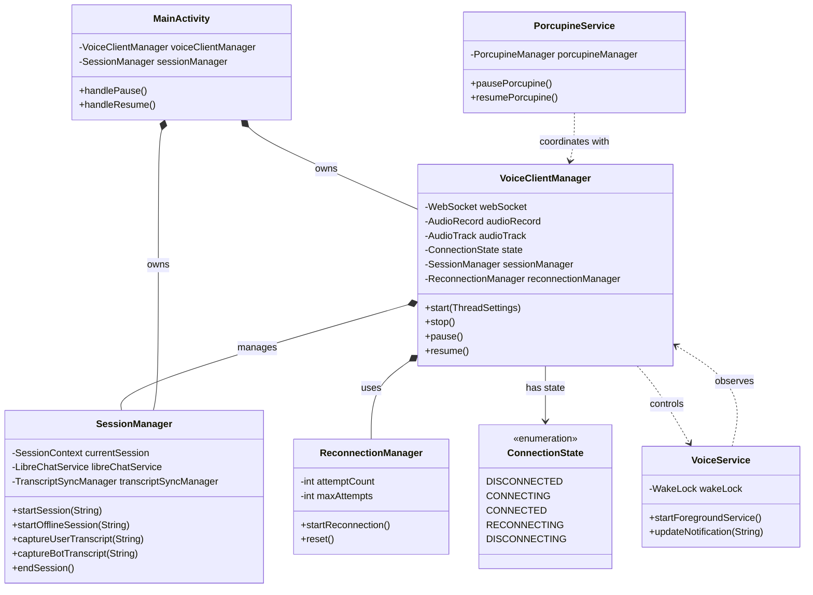

# Domain Model

This document describes the core domain objects and their relationships in the voice conversation system.

## Overview

The system is built around real-time voice interaction with Google's Gemini Multimodal Live API. The domain model consists of managers, services, state objects, and data entities that work together to provide continuous voice conversation capabilities.

## Core Domain Objects

### VoiceClientManager

**Role:** Central coordinator for WebSocket connection, audio streaming, and conversation state management.

**Location:** `VoiceClientManager.kt:170`

**Main Fields:**
- `webSocket: WebSocket?` - Active WebSocket connection to Gemini API
- `audioRecord: AudioRecord?` - Microphone input recorder (16kHz, mono, PCM 16-bit)
- `audioTrack: AudioTrack?` - Audio output player (24kHz, mono, PCM 16-bit)
- `state: MutableState<ConnectionState>` - Current connection state (DISCONNECTED, CONNECTING, CONNECTED, RECONNECTING, DISCONNECTING)
- `botIsTalking: MutableState<Boolean>` - Indicates if bot is currently speaking
- `userIsTalking: MutableState<Boolean>` - Indicates if user is currently speaking
- `isPaused: MutableState<Boolean>` - Session paused state (can be resumed)
- `sessionResumptionHandle: String?` - Handle for resuming paused sessions
- `scope: CoroutineScope?` - Coroutine scope for async operations
- `wakeLock: PowerManager.WakeLock?` - Keeps CPU active during conversation
- `reconnectionManager: ReconnectionManager` - Handles automatic reconnection with exponential backoff
- `sessionManager: SessionManager?` - Manages session context and transcripts

**Invariants:**
- `audioRecord` and `audioTrack` are null when disconnected
- `webSocket` is non-null only when state is CONNECTED or CONNECTING
- `wakeLock` is held only when state is CONNECTED
- `sessionResumptionHandle` is valid for 2 hours after session creation

**Main Methods:**

#### `start(threadSettings: ThreadSettings?): Unit`
**Role:** Initiates WebSocket connection and starts audio streaming
**Preconditions:** 
- API key must be configured
- State must be DISCONNECTED or RECONNECTING
**Parameters:**
- `threadSettings`: Optional thread-specific voice/speed/temperature settings
**Postconditions:**
- State transitions to CONNECTING
- WebSocket connection initiated
- Audio recording/playback started on successful connection
**Side-effects:**
- Acquires wake lock
- Starts foreground service
- Registers Bluetooth SCO receiver
**Errors:** Adds Error to errors list if API key missing
**Code Reference:** `VoiceClientManager.kt:560`

#### `stop(): Unit`
**Role:** Terminates connection and cleans up all resources
**Preconditions:** None (safe to call in any state)
**Postconditions:**
- State transitions to DISCONNECTED
- All resources released (WebSocket, audio, wake lock)
- Session ended and transcript sent to LibreChat
**Side-effects:**
- Stops foreground service
- Releases wake lock
- Unregisters receivers
- Cancels all coroutine jobs
**Code Reference:** `VoiceClientManager.kt:2800`

#### `pause(): Unit`
**Role:** Pauses session while preserving resumption handle
**Preconditions:** State must be CONNECTED
**Postconditions:**
- State transitions to DISCONNECTED
- `isPaused` set to true
- Session handle preserved for resumption
**Side-effects:**
- Closes WebSocket
- Stops audio but keeps session context
**Code Reference:** `VoiceClientManager.kt:2850`

#### `resume(): Unit`
**Role:** Resumes paused session using stored handle
**Preconditions:** 
- `isPaused` must be true
- Session handle must be valid (< 2 hours old)
**Postconditions:**
- State transitions to CONNECTING
- Session resumed with previous context
**Side-effects:**
- Reconnects WebSocket with resumption handle
- Restarts audio streaming
**Code Reference:** `VoiceClientManager.kt:2900`

**Relationships:**
- **Depends on:** SessionManager (composition), ReconnectionManager (composition), WebSocket (OkHttp), AudioRecord/AudioTrack (Android)
- **Used by:** MainActivity, VoiceService
- **Observes:** NetworkMonitor for connectivity changes

**Lifecycle:**
1. **Creation:** Instantiated by MainActivity with Context and SessionManager
2. **Usage:** start() → CONNECTED → pause()/stop() cycle
3. **Destruction:** stop() releases all resources, scope cancelled

**Testability:**
- **Mocking:** Requires mocking WebSocket, AudioRecord, AudioTrack, PowerManager
- **Edge cases:** Network failures, audio device conflicts, session expiration, rapid pause/resume cycles

---

### SessionManager

**Role:** Manages conversation session lifecycle, transcript capture, and synchronization with LibreChat.

**Location:** `SessionManager.kt:25`

**Main Fields:**
- `currentSession: SessionContext?` - Active session with transcripts and metadata
- `currentDbSessionId: String?` - Database session ID for persistence
- `transcriptSyncManager: TranscriptSyncManager` - Handles reliable transcript delivery
- `libreChatService: LibreChatService` - API client for LibreChat integration
- `sessionRepository: SessionRepository` - Database access for sessions
- `conversationRepository: ConversationRepository` - Database access for conversations

**Main Methods:**

#### `startSession(conversationId: String): Result<SessionContext>`
**Role:** Initializes new session and fetches learning context from LibreChat
**Preconditions:** Valid LibreChat authentication token
**Parameters:**
- `conversationId`: LibreChat conversation thread ID
**Returns:** Result with SessionContext containing system prompt and metadata
**Postconditions:**
- `currentSession` populated with context
- Database session created
**Side-effects:**
- HTTP request to LibreChat API
- Database write
**Errors:** Returns failure Result if API call fails
**Code Reference:** `SessionManager.kt:150`

#### `startOfflineSession(conversationId: String): Result<String>`
**Role:** Starts session without LibreChat, building context from local database
**Preconditions:** Conversation exists in local database
**Parameters:**
- `conversationId`: Local offline conversation ID
**Returns:** Result with conversation context string
**Postconditions:**
- Database session created
- Context built from previous sessions
**Side-effects:**
- Database reads and writes
- Old sessions cleaned up in background
**Code Reference:** `SessionManager.kt:100`

#### `captureUserTranscript(text: String): Unit`
**Role:** Records user speech transcript
**Preconditions:** Session must be active
**Parameters:**
- `text`: Transcribed user speech from Gemini
**Postconditions:**
- Transcript added to session and database
**Side-effects:**
- In-memory list updated
- Database write (async)
**Code Reference:** `SessionManager.kt:250`

#### `captureBotTranscript(text: String): Unit`
**Role:** Records bot speech transcript
**Preconditions:** Session must be active
**Parameters:**
- `text`: Transcribed bot speech from Gemini
**Postconditions:**
- Transcript added to session and database
**Side-effects:**
- In-memory list updated
- Database write (async)
**Code Reference:** `SessionManager.kt:280`

#### `endSession(): Result<Unit>`
**Role:** Ends session and synchronizes transcript/summary to LibreChat
**Preconditions:** Session must be active
**Returns:** Result indicating sync success/failure
**Postconditions:**
- Session cleared
- Transcript/summary sent to LibreChat (with infinite retry)
- Database session marked complete
**Side-effects:**
- HTTP request to LibreChat (async with retry)
- Database updates
- VoiceClientManager stopped
**Errors:** Returns failure if sync cancelled
**Code Reference:** `SessionManager.kt:400`

**Relationships:**
- **Depends on:** LibreChatService (aggregation), SessionRepository (aggregation), TranscriptSyncManager (composition)
- **Used by:** VoiceClientManager, MainActivity
- **Lifecycle:** Created with MainActivity, lives for app lifetime

**Testability:**
- **Mocking:** Mock LibreChatService, repositories for unit tests
- **Edge cases:** Network failures during sync, session timeout, empty transcripts

---

### ConnectionState

**Role:** Enum representing WebSocket connection lifecycle states.

**Location:** `VoiceClientManager.kt:70`

**Values:**
- `DISCONNECTED` - No active connection, idle state
- `CONNECTING` - Initial connection attempt in progress
- `CONNECTED` - Active connection, audio streaming
- `RECONNECTING` - Connection lost, attempting automatic reconnection
- `DISCONNECTING` - User-initiated disconnect in progress

**Transitions:**
- `DISCONNECTED` → `CONNECTING` (via start())
- `CONNECTING` → `CONNECTED` (on setupComplete message)
- `CONNECTING` → `DISCONNECTED` (on connection failure)
- `CONNECTED` → `RECONNECTING` (on unexpected disconnect)
- `CONNECTED` → `DISCONNECTING` (via stop())
- `RECONNECTING` → `CONNECTED` (on successful reconnection)
- `RECONNECTING` → `DISCONNECTED` (after max attempts)
- `DISCONNECTING` → `DISCONNECTED` (cleanup complete)

**Triggers:**
- User actions: start(), stop(), pause()
- Network events: onOpen(), onClosed(), onFailure()
- Timeouts: auto-pause, bot response timeout, health check

---

### ReconnectionManager

**Role:** Manages automatic reconnection with exponential backoff strategy.

**Location:** `VoiceClientManager.kt` (inner class)

**Main Fields:**
- `attemptCount: Int` - Current reconnection attempt number
- `maxAttempts: Int = 5` - Maximum reconnection attempts before giving up
- `baseDelay: Long = 2000` - Initial delay in milliseconds
- `maxDelay: Long = 30000` - Maximum delay cap

**Strategy:**
- Exponential backoff: delay = min(baseDelay * 2^attempt, maxDelay)
- Attempts: 2s, 4s, 8s, 16s, 30s
- After max attempts: triggers callback for user decision

**Main Methods:**

#### `startReconnection(): Unit`
**Role:** Initiates reconnection attempt with exponential backoff
**Preconditions:** State must be RECONNECTING
**Postconditions:**
- Delay calculated based on attempt count
- Connection reattempted after delay
**Side-effects:**
- Coroutine delay
- Calls VoiceClientManager.start()
**Code Reference:** `VoiceClientManager.kt:2950`

#### `reset(): Unit`
**Role:** Resets attempt counter after successful connection
**Postconditions:** `attemptCount` set to 0
**Code Reference:** `VoiceClientManager.kt:3000`

---

### AudioPipeline

**Role:** Manages bidirectional audio streaming between device and Gemini API.

**Components:**

#### AudioRecord
- **Sample Rate:** 16000 Hz
- **Channel:** MONO
- **Encoding:** PCM 16-bit
- **Buffer Size:** Calculated via getMinBufferSize()
- **Source:** MediaRecorder.AudioSource.VOICE_COMMUNICATION
- **Lifecycle:** Created on connection, released on disconnect
- **Code Reference:** `VoiceClientManager.kt:1800`

#### AudioTrack
- **Sample Rate:** 24000 Hz (Gemini output rate)
- **Channel:** MONO
- **Encoding:** PCM 16-bit
- **Mode:** STREAM
- **Buffer Size:** Calculated via getMinBufferSize()
- **Lifecycle:** Created on connection, released on disconnect
- **Code Reference:** `VoiceClientManager.kt:1900`

#### Audio Queue
- **Type:** `MutableList<Pair<Int, ByteArray>>` (generationId, audioData)
- **Purpose:** Smooth playback without pops/clicks
- **Synchronization:** Protected by Mutex
- **Interruption:** Generation ID incremented to invalidate pending chunks
- **Code Reference:** `VoiceClientManager.kt:200`

**Data Flow:**
1. **Input:** AudioRecord → PCM bytes → Base64 encode → WebSocket → Gemini
2. **Output:** Gemini → WebSocket → Base64 decode → Audio Queue → AudioTrack

---

## Relationship Diagram

## Data Entities

### SessionContext
**Purpose:** Holds active session metadata and transcripts
**Fields:**
- `sessionId: String` - Unique session identifier
- `conversationId: String` - LibreChat conversation ID
- `startTime: Long` - Session start timestamp
- `systemPrompt: String` - AI system instructions
- `transcripts: MutableList<TranscriptEntry>` - Conversation history
- `imageEvents: MutableList<ImageEvent>` - Sent images log
- `contextUpdates: MutableList<ContextUpdate>` - Additional context
**Code Reference:** `SessionManager.kt:60`

### TranscriptEntry
**Purpose:** Single user or bot speech entry
**Fields:**
- `timestamp: Long` - Entry timestamp
- `speaker: Speaker` - USER or BOT
- `text: String` - Transcribed text
**Code Reference:** `SessionManager.kt:70`

### ThreadSettings
**Purpose:** Per-conversation voice and behavior settings
**Fields:**
- `conversationId: String` - Associated conversation
- `voiceName: String?` - Gemini voice (e.g., "Puck", "Charon")
- `speechSpeed: Float` - Speed multiplier (0.5-2.0)
- `volumeBoost: Float` - Volume multiplier (0.5-2.0)
- `temperature: Float` - Response creativity (0.0-2.0)
**Code Reference:** `models/ThreadSettings.kt`

---

## Code References Summary

| Component | File | Key Lines |
|-----------|------|-----------|
| VoiceClientManager | VoiceClientManager.kt | 170-3061 |
| SessionManager | SessionManager.kt | 25-972 |
| ConnectionState | VoiceClientManager.kt | 70-76 |
| ReconnectionManager | VoiceClientManager.kt | 2950-3050 |
| AudioRecord setup | VoiceClientManager.kt | 1800-1850 |
| AudioTrack setup | VoiceClientManager.kt | 1900-1950 |
| SessionContext | SessionManager.kt | 60-80 |
| TranscriptEntry | SessionManager.kt | 70-75 |

**Last Updated:** 2025-12-01
