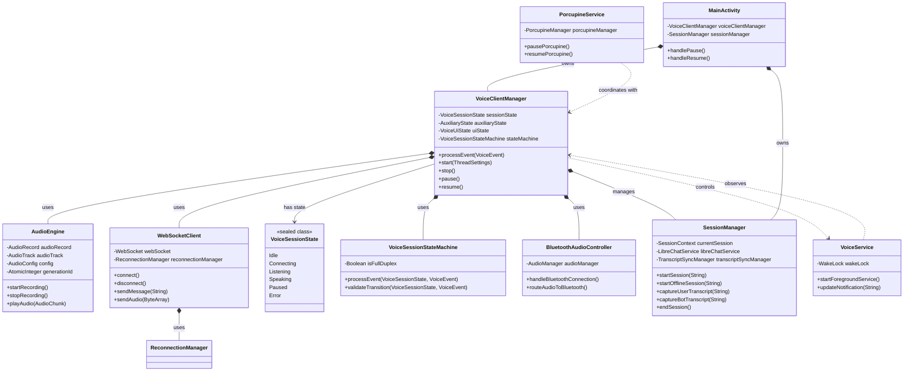

# Domain Model

This document describes the core domain objects and their relationships in the voice conversation system.

## Overview

The system has been significantly refactored to use a modular, state machine-based architecture. The complex Core audio system has been replaced with a simplified AudioEngine, and state management now uses a proper state machine pattern with VoiceSessionState. The domain model emphasizes composition over inheritance and clear separation of concerns.

## Core Domain Objects

### VoiceClientManager (Refactored)

**Role:** Orchestrates voice conversation using composition pattern and state machine architecture.

**Location:** `VoiceClientManager.kt:61`

**New Architecture:**
The VoiceClientManager has been completely refactored to use composition and dependency injection:

**Injected Components:**
- `audioEngine: AudioEngine` - Simplified audio recording/playback
- `webSocketClient: WebSocketClient` - WebSocket connection management
- `bluetoothAudioController: BluetoothAudioController` - Bluetooth device handling
- `reconnectionManager: ReconnectionManager` - Automatic reconnection logic
- `sessionStateManager: SessionStateManager` - Session lifecycle management
- `toolExecutor: ToolExecutor` - Function calling execution

**State Management:**
- `_sessionState: MutableStateFlow<VoiceSessionState>` - Current session state (sealed class)
- `_auxiliaryState: MutableStateFlow<AuxiliaryState>` - Cross-cutting concerns (tools, images)
- `_uiState: MutableStateFlow<VoiceUiState>` - Derived UI state for Compose
- `stateMachine: VoiceSessionStateMachine` - State transition logic

**Legacy Fields (Maintained for Compatibility):**
- `scope: CoroutineScope?` - Coroutine scope for async operations
- `wakeLock: PowerManager.WakeLock?` - Keeps CPU active during conversation
- `currentThreadSettings: ThreadSettings?` - Per-conversation settings
- `errors: MutableStateList<Error>` - Error collection for UI

**Key Changes:**
- **No Direct Audio Management:** AudioEngine handles all audio operations
- **No WebSocket Management:** WebSocketClient handles all network operations
- **State Machine:** VoiceSessionState replaces boolean flags
- **Event-Driven:** Processes VoiceEvent through state machine
- **Composition:** Uses injected dependencies instead of direct instantiation

**Main Methods:**

#### `start(threadSettings: ThreadSettings?): Unit`
**Role:** Initiates WebSocket connection and starts audio streaming
**Preconditions:** 
- API key must be configured
- State must be DISCONNECTED or RECONNECTING
**Parameters:**
- `threadSettings`: Optional thread-specific voice/speed/temperature settings
**Postconditions:**
- State transitions to CONNECTING
- WebSocket connection initiated
- Audio recording/playback started on successful connection
**Side-effects:**
- Acquires wake lock
- Starts foreground service
- Registers Bluetooth SCO receiver
**Errors:** Adds Error to errors list if API key missing
**Code Reference:** `VoiceClientManager.kt:560`

#### `stop(): Unit`
**Role:** Terminates connection and cleans up all resources
**Preconditions:** None (safe to call in any state)
**Postconditions:**
- State transitions to DISCONNECTED
- All resources released (WebSocket, audio, wake lock)
- Session ended and transcript sent to LibreChat
**Side-effects:**
- Stops foreground service
- Releases wake lock
- Unregisters receivers
- Cancels all coroutine jobs
**Code Reference:** `VoiceClientManager.kt:2800`

#### `pause(): Unit`
**Role:** Pauses session while preserving resumption handle
**Preconditions:** State must be CONNECTED
**Postconditions:**
- State transitions to DISCONNECTED
- `isPaused` set to true
- Session handle preserved for resumption
**Side-effects:**
- Closes WebSocket
- Stops audio but keeps session context
**Code Reference:** `VoiceClientManager.kt:2850`

#### `resume(): Unit`
**Role:** Resumes paused session using stored handle
**Preconditions:** 
- `isPaused` must be true
- Session handle must be valid (< 2 hours old)
**Postconditions:**
- State transitions to CONNECTING
- Session resumed with previous context
**Side-effects:**
- Reconnects WebSocket with resumption handle
- Restarts audio streaming
**Code Reference:** `VoiceClientManager.kt:2900`

**Relationships:**
- **Depends on:** SessionManager (composition), ReconnectionManager (composition), WebSocket (OkHttp), AudioRecord/AudioTrack (Android)
- **Used by:** MainActivity, VoiceService
- **Observes:** NetworkMonitor for connectivity changes

**Lifecycle:**
1. **Creation:** Instantiated by MainActivity with Context and SessionManager
2. **Usage:** start() → CONNECTED → pause()/stop() cycle
3. **Destruction:** stop() releases all resources, scope cancelled

**Testability:**
- **Mocking:** Mock injected components (AudioEngine, WebSocketClient, etc.)
- **Edge cases:** State transition validation, event processing, component coordination

---

### AudioEngine (New Simplified Component)

**Role:** Handles audio recording and playback with simplified, Gemini-centric architecture.

**Location:** `audio/AudioEngine.kt:150`

**Main Fields:**
- `context: Context` - Android context for audio services
- `scope: CoroutineScope` - Coroutine scope for audio operations
- `config: AudioConfig` - Audio configuration (sample rates, formats)
- `listener: AudioEngineListener?` - Callback interface for audio events

**Internal State:**
- `_isRecording: MutableStateFlow<Boolean>` - Recording state
- `_isPlaying: MutableStateFlow<Boolean>` - Playback state
- `audioRecord: AudioRecord?` - Android audio recorder
- `audioTrack: AudioTrack?` - Android audio player
- `currentGenerationId: AtomicInteger` - Generation tracking for interruption

**Key Simplifications:**
- **No Complex State Machine:** Simple start/stop operations
- **Gemini-Centric:** Audio processing delegated to Gemini API
- **Standard Android Audio:** Direct use of AudioRecord/AudioTrack
- **Event-Based:** Notifies listeners of audio events

**Main Methods:**

#### `startRecording(): Result<Unit>`
**Role:** Starts audio recording from microphone
**Postconditions:** AudioRecord active, recording loop started
**Side-effects:** Acquires microphone, starts coroutine for audio capture
**Code Reference:** `audio/AudioEngine.kt:200`

#### `stopRecording(): Result<Unit>`
**Role:** Stops audio recording and releases microphone
**Postconditions:** AudioRecord stopped and released
**Code Reference:** `audio/AudioEngine.kt:250`

#### `playAudio(audioChunk: AudioChunk): Result<Unit>`
**Role:** Plays audio chunk through speaker/headphones
**Parameters:** `audioChunk: AudioChunk` - Audio data with generation ID
**Side-effects:** Writes to AudioTrack, handles generation interruption
**Code Reference:** `audio/AudioEngine.kt:300`

---

### VoiceSessionState (New State Machine)

**Role:** Sealed class hierarchy representing mutually exclusive session states.

**Location:** `state/VoiceSessionState.kt:28`

**States:**
- `Idle` - No active session, disconnected
- `Connecting(threadSettings)` - WebSocket connecting, waiting for setup
- `Listening(isMicEnabled, isFullDuplex)` - Connected, user can speak
- `Speaking(isMicEnabled, isFullDuplex)` - Bot is responding
- `Paused(canResume, resumptionHandle)` - Session paused, can resume
- `Error(message, isRecoverable)` - Critical error state

**Key Benefits:**
- **Mutually Exclusive:** Only one state active at a time
- **Type Safety:** Compiler enforces valid state transitions
- **Clear Semantics:** Each state has specific meaning and allowed operations
- **Testability:** Easy to test state transitions and invariants

**Code Reference:** `state/VoiceSessionState.kt:28`

---

### VoiceSessionStateMachine (New Component)

**Role:** Manages state transitions and validates events.

**Location:** `state/VoiceSessionStateMachine.kt`

**Main Methods:**

#### `processEvent(currentState: VoiceSessionState, event: VoiceEvent): StateTransition`
**Role:** Processes event and returns new state with side effects
**Returns:** `StateTransition` containing new state and side effects to execute
**Validation:** Ensures only valid transitions are allowed
**Code Reference:** `state/VoiceSessionStateMachine.kt:50`

---

### WebSocketClient (Separated Component)

**Role:** Manages WebSocket connection independently from VoiceClientManager.

**Location:** `network/WebSocketClient.kt`

**Responsibilities:**
- WebSocket connection lifecycle
- Message sending/receiving
- Connection health monitoring
- Error classification and reporting

**Benefits of Separation:**
- **Single Responsibility:** Only handles WebSocket operations
- **Testability:** Can be mocked independently
- **Reusability:** Can be used by other components
- **Error Handling:** Dedicated error classification

---

### SessionManager

**Role:** Manages conversation session lifecycle, transcript capture, and synchronization with LibreChat.

**Location:** `SessionManager.kt:25`

**Main Fields:**
- `currentSession: SessionContext?` - Active session with transcripts and metadata
- `currentDbSessionId: String?` - Database session ID for persistence
- `transcriptSyncManager: TranscriptSyncManager` - Handles reliable transcript delivery
- `libreChatService: LibreChatService` - API client for LibreChat integration
- `sessionRepository: SessionRepository` - Database access for sessions
- `conversationRepository: ConversationRepository` - Database access for conversations

**Main Methods:**

#### `startSession(conversationId: String): Result<SessionContext>`
**Role:** Initializes new session and fetches learning context from LibreChat
**Preconditions:** Valid LibreChat authentication token
**Parameters:**
- `conversationId`: LibreChat conversation thread ID
**Returns:** Result with SessionContext containing system prompt and metadata
**Postconditions:**
- `currentSession` populated with context
- Database session created
**Side-effects:**
- HTTP request to LibreChat API
- Database write
**Errors:** Returns failure Result if API call fails
**Code Reference:** `SessionManager.kt:150`

#### `startOfflineSession(conversationId: String): Result<String>`
**Role:** Starts session without LibreChat, building context from local database
**Preconditions:** Conversation exists in local database
**Parameters:**
- `conversationId`: Local offline conversation ID
**Returns:** Result with conversation context string
**Postconditions:**
- Database session created
- Context built from previous sessions
**Side-effects:**
- Database reads and writes
- Old sessions cleaned up in background
**Code Reference:** `SessionManager.kt:100`

#### `captureUserTranscript(text: String): Unit`
**Role:** Records user speech transcript
**Preconditions:** Session must be active
**Parameters:**
- `text`: Transcribed user speech from Gemini
**Postconditions:**
- Transcript added to session and database
**Side-effects:**
- In-memory list updated
- Database write (async)
**Code Reference:** `SessionManager.kt:250`

#### `captureBotTranscript(text: String): Unit`
**Role:** Records bot speech transcript
**Preconditions:** Session must be active
**Parameters:**
- `text`: Transcribed bot speech from Gemini
**Postconditions:**
- Transcript added to session and database
**Side-effects:**
- In-memory list updated
- Database write (async)
**Code Reference:** `SessionManager.kt:280`

#### `endSession(): Result<Unit>`
**Role:** Ends session and synchronizes transcript/summary to LibreChat
**Preconditions:** Session must be active
**Returns:** Result indicating sync success/failure
**Postconditions:**
- Session cleared
- Transcript/summary sent to LibreChat (with infinite retry)
- Database session marked complete
**Side-effects:**
- HTTP request to LibreChat (async with retry)
- Database updates
- VoiceClientManager stopped
**Errors:** Returns failure if sync cancelled
**Code Reference:** `SessionManager.kt:400`

**Relationships:**
- **Depends on:** LibreChatService (aggregation), SessionRepository (aggregation), TranscriptSyncManager (composition)
- **Used by:** VoiceClientManager, MainActivity
- **Lifecycle:** Created with MainActivity, lives for app lifetime

**Testability:**
- **Mocking:** Mock LibreChatService, repositories for unit tests
- **Edge cases:** Network failures during sync, session timeout, empty transcripts

---

### ConnectionState

**Role:** Enum representing WebSocket connection lifecycle states.

**Location:** `VoiceClientManager.kt:70`

**Values:**
- `DISCONNECTED` - No active connection, idle state
- `CONNECTING` - Initial connection attempt in progress
- `CONNECTED` - Active connection, audio streaming
- `RECONNECTING` - Connection lost, attempting automatic reconnection
- `DISCONNECTING` - User-initiated disconnect in progress

**Transitions:**
- `DISCONNECTED` → `CONNECTING` (via start())
- `CONNECTING` → `CONNECTED` (on setupComplete message)
- `CONNECTING` → `DISCONNECTED` (on connection failure)
- `CONNECTED` → `RECONNECTING` (on unexpected disconnect)
- `CONNECTED` → `DISCONNECTING` (via stop())
- `RECONNECTING` → `CONNECTED` (on successful reconnection)
- `RECONNECTING` → `DISCONNECTED` (after max attempts)
- `DISCONNECTING` → `DISCONNECTED` (cleanup complete)

**Triggers:**
- User actions: start(), stop(), pause()
- Network events: onOpen(), onClosed(), onFailure()
- Timeouts: auto-pause, bot response timeout, health check

---

### ReconnectionManager

**Role:** Manages automatic reconnection with exponential backoff strategy.

**Location:** `VoiceClientManager.kt` (inner class)

**Main Fields:**
- `attemptCount: Int` - Current reconnection attempt number
- `maxAttempts: Int = 5` - Maximum reconnection attempts before giving up
- `baseDelay: Long = 2000` - Initial delay in milliseconds
- `maxDelay: Long = 30000` - Maximum delay cap

**Strategy:**
- Exponential backoff: delay = min(baseDelay * 2^attempt, maxDelay)
- Attempts: 2s, 4s, 8s, 16s, 30s
- After max attempts: triggers callback for user decision

**Main Methods:**

#### `startReconnection(): Unit`
**Role:** Initiates reconnection attempt with exponential backoff
**Preconditions:** State must be RECONNECTING
**Postconditions:**
- Delay calculated based on attempt count
- Connection reattempted after delay
**Side-effects:**
- Coroutine delay
- Calls VoiceClientManager.start()
**Code Reference:** `VoiceClientManager.kt:2950`

#### `reset(): Unit`
**Role:** Resets attempt counter after successful connection
**Postconditions:** `attemptCount` set to 0
**Code Reference:** `VoiceClientManager.kt:3000`

---

### AudioPipeline

**Role:** Manages bidirectional audio streaming between device and Gemini API.

**Components:**

#### AudioRecord
- **Sample Rate:** 16000 Hz
- **Channel:** MONO
- **Encoding:** PCM 16-bit
- **Buffer Size:** Calculated via getMinBufferSize()
- **Source:** MediaRecorder.AudioSource.VOICE_COMMUNICATION
- **Lifecycle:** Created on connection, released on disconnect
- **Code Reference:** `VoiceClientManager.kt:1800`

#### AudioTrack
- **Sample Rate:** 24000 Hz (Gemini output rate)
- **Channel:** MONO
- **Encoding:** PCM 16-bit
- **Mode:** STREAM
- **Buffer Size:** Calculated via getMinBufferSize()
- **Lifecycle:** Created on connection, released on disconnect
- **Code Reference:** `VoiceClientManager.kt:1900`

#### Audio Queue
- **Type:** `MutableList<Pair<Int, ByteArray>>` (generationId, audioData)
- **Purpose:** Smooth playback without pops/clicks
- **Synchronization:** Protected by Mutex
- **Interruption:** Generation ID incremented to invalidate pending chunks
- **Code Reference:** `VoiceClientManager.kt:200`

**Data Flow:**
1. **Input:** AudioRecord → PCM bytes → Base64 encode → WebSocket → Gemini
2. **Output:** Gemini → WebSocket → Base64 decode → Audio Queue → AudioTrack

---

## Relationship Diagram

## Data Entities

### SessionContext
**Purpose:** Holds active session metadata and transcripts
**Fields:**
- `sessionId: String` - Unique session identifier
- `conversationId: String` - LibreChat conversation ID
- `startTime: Long` - Session start timestamp
- `systemPrompt: String` - AI system instructions
- `transcripts: MutableList<TranscriptEntry>` - Conversation history
- `imageEvents: MutableList<ImageEvent>` - Sent images log
- `contextUpdates: MutableList<ContextUpdate>` - Additional context
**Code Reference:** `SessionManager.kt:60`

### TranscriptEntry
**Purpose:** Single user or bot speech entry
**Fields:**
- `timestamp: Long` - Entry timestamp
- `speaker: Speaker` - USER or BOT
- `text: String` - Transcribed text
**Code Reference:** `SessionManager.kt:70`

### ThreadSettings
**Purpose:** Per-conversation voice and behavior settings
**Fields:**
- `conversationId: String` - Associated conversation
- `voiceName: String?` - Gemini voice (e.g., "Puck", "Charon")
- `speechSpeed: Float` - Speed multiplier (0.5-2.0)
- `volumeBoost: Float` - Volume multiplier (0.5-2.0)
- `temperature: Float` - Response creativity (0.0-2.0)
**Code Reference:** `models/ThreadSettings.kt`

---

## Code References Summary

| Component | File | Key Lines |
|-----------|------|-----------|
| VoiceClientManager | VoiceClientManager.kt | 170-3061 |
| SessionManager | SessionManager.kt | 25-972 |
| ConnectionState | VoiceClientManager.kt | 70-76 |
| ReconnectionManager | VoiceClientManager.kt | 2950-3050 |
| AudioRecord setup | VoiceClientManager.kt | 1800-1850 |
| AudioTrack setup | VoiceClientManager.kt | 1900-1950 |
| SessionContext | SessionManager.kt | 60-80 |
| TranscriptEntry | SessionManager.kt | 70-75 |
| ContextBuilder | data/ContextBuilder.kt | 1-170 |
| TranscriptSyncManager | SessionManager.kt | 870-1000 |
| OfflineSummaryQueue | OfflineSummaryQueue.kt | 1-150 |
| ContextStats | data/ContextBuilder.kt | 170-180 |
| SyncStatus | SessionManager.kt | 850-870 |

**Last Updated:** 2025-12-04

---

## Related Documentation

### Architecture & Design
- [Architecture Overview](../project/architecture.md) - System architecture and components
- [State Machines](state-machine.md) - State transitions and lifecycle

### Implementation Details
- [Components](../implementation/components.md) - Detailed component documentation
- [Session Pipelines](session-pipelines.md) - Complete session lifecycle flows
- [Context Builder](../implementation/context-builder.md) - Conversation context building
- [Transcript Sync](../implementation/transcript-sync.md) - LibreChat synchronization
- [Summary Generation](../implementation/summary-generation.md) - AI-powered summaries

### Data & Persistence
- [Database Schema](../operations/database-schema.md) - Database entities and schema

---

### ContextBuilder

**Role:** Builds conversation context from database history using hybrid approach (last full transcript + summaries of previous sessions).

**Location:** `data/ContextBuilder.kt:1`

**Main Fields:**
- `conversationRepository: ConversationRepository` - Database access for conversations
- `sessionRepository: SessionRepository` - Database access for sessions
- `MAX_RECENT_SESSIONS: Int = 10` - Maximum number of session summaries to include
- `MAX_CONTEXT_LENGTH: Int = 30000` - Maximum context length in characters
- `MAX_SESSIONS_TO_KEEP: Int = 50` - Session retention limit per conversation

**Invariants:**
- Context never exceeds MAX_CONTEXT_LENGTH characters
- Only last session includes full transcript
- Previous sessions include summaries only

**Main Methods:**

#### `buildContext(conversationId: String): String`
**Role:** Builds formatted context string for Gemini system instructions
**Preconditions:** None (returns empty string if conversation not found)
**Parameters:**
- `conversationId: String` - ID of conversation to build context for
**Returns:** Formatted context string (max 30,000 characters)
**Postconditions:**
- Context built with up to 3 sections (overview, recent summaries, last transcript)
- Context truncated if exceeds length limit
**Side-effects:**
- Database queries to fetch conversation, sessions, and transcripts
**Errors:** Returns empty string on error, logs exception
**Code Reference:** `data/ContextBuilder.kt:25`

#### `getContextStats(conversationId: String): ContextStats`
**Role:** Returns statistics about available context for debugging
**Preconditions:** None
**Parameters:**
- `conversationId: String` - ID of conversation to analyze
**Returns:** ContextStats data class with statistics
**Postconditions:** None (read-only operation)
**Side-effects:** Database queries
**Code Reference:** `data/ContextBuilder.kt:110`

#### `cleanupOldSessions(conversationId: String): Int`
**Role:** Deletes old sessions to prevent database bloat
**Preconditions:** None
**Parameters:**
- `conversationId: String` - ID of conversation to clean up
**Returns:** Number of sessions deleted
**Postconditions:**
- Only last MAX_SESSIONS_TO_KEEP (50) sessions remain
- Oldest sessions deleted first
**Side-effects:**
- Database DELETE operations
- Logs cleanup activity
**Errors:** Returns 0 on error, logs exception
**Code Reference:** `data/ContextBuilder.kt:130`

**Relationships:**
- **Depends on:** ConversationRepository (aggregation), SessionRepository (aggregation)
- **Used by:** SessionManager (calls buildContext on session start)

**Lifecycle:**
1. **Creation:** Instantiated by SessionManager with repository dependencies
2. **Usage:** buildContext() called on each session start, cleanupOldSessions() called in background
3. **Destruction:** Lives for app lifetime, no explicit cleanup

**Testability:**
- **Mocking:** Mock repositories for unit tests
- **Edge cases:** Empty conversations, missing summaries, very long transcripts, context truncation

---

### TranscriptSyncManager

**Role:** Handles reliable transcript/summary delivery to LibreChat with infinite retry and exponential backoff.

**Location:** `SessionManager.kt:870` (inner class)

**Main Fields:**
- `syncStatus: MutableStateFlow<SyncStatus>` - Current sync state (Idle, Syncing, Success, Error)
- `currentJob: Job?` - Active sync coroutine job
- `BASE_DELAY: Long = 1000` - Initial retry delay (1 second)
- `BACKOFF_FACTOR: Double = 2.0` - Exponential backoff multiplier
- `MAX_DELAY: Long = 30000` - Maximum retry delay (30 seconds)

**Invariants:**
- Only one sync job active at a time
- Content remains in OfflineSummaryQueue until successful sync
- Backoff delay never exceeds MAX_DELAY

**Main Methods:**

#### `syncTranscripts(summaryRequest: SummaryRequest): Unit`
**Role:** Initiates transcript/summary sync with infinite retry
**Preconditions:** None (can be called multiple times, cancels previous job)
**Parameters:**
- `summaryRequest: SummaryRequest` - Content to sync (transcript or summary)
**Postconditions:**
- Content added to OfflineSummaryQueue
- Sync job started with infinite retry
- SyncStatus updated to Syncing
**Side-effects:**
- Enqueues content in OfflineSummaryQueue (persisted to SharedPreferences)
- Starts coroutine job for retry loop
- HTTP POST requests to LibreChat API
- Updates syncStatus StateFlow
**Errors:** Continues retrying on all errors except cancellation
**Code Reference:** `SessionManager.kt:900`

#### `calculateBackoff(attempt: Int): Long`
**Role:** Calculates exponential backoff delay
**Preconditions:** None
**Parameters:**
- `attempt: Int` - Current attempt number (1-based)
**Returns:** Delay in milliseconds (1s, 2s, 4s, 8s, 16s, 30s max)
**Postconditions:** None (pure function)
**Side-effects:** None
**Code Reference:** `SessionManager.kt:950`

#### `cancelSync(): Unit`
**Role:** Cancels active sync job
**Preconditions:** None (safe to call when no job active)
**Postconditions:**
- Current job cancelled
- SyncStatus reset to Idle
- Content remains in queue for later retry
**Side-effects:**
- Cancels coroutine job
- Updates syncStatus StateFlow
**Code Reference:** `SessionManager.kt:980`

**Relationships:**
- **Depends on:** LibreChatService (aggregation), OfflineSummaryQueue (aggregation)
- **Used by:** SessionManager (calls syncTranscripts on session end)

**Lifecycle:**
1. **Creation:** Created as inner class of SessionManager
2. **Usage:** syncTranscripts() called on session end, retry loop continues until success or cancel
3. **Destruction:** cancelSync() called on SessionManager cleanup

**Testability:**
- **Mocking:** Mock LibreChatService, OfflineSummaryQueue for unit tests
- **Edge cases:** Network failures, API errors, cancellation during retry, queue persistence across app restart

---

### OfflineSummaryQueue

**Role:** Persistent queue for transcripts/summaries awaiting synchronization to LibreChat.

**Location:** `OfflineSummaryQueue.kt:1`

**Main Fields:**
- `prefs: SharedPreferences` - Persistent storage for queue
- `json: Json` - Kotlinx serialization for JSON encoding/decoding
- `MAX_QUEUE_SIZE: Int = 10` - Maximum queue capacity (FIFO eviction)

**Invariants:**
- Queue never exceeds MAX_QUEUE_SIZE items
- Queue persists across app restarts (SharedPreferences)
- FIFO ordering maintained

**Main Methods:**

#### `enqueue(summary: SummaryRequest): Unit`
**Role:** Adds summary to persistent queue
**Preconditions:** None
**Parameters:**
- `summary: SummaryRequest` - Content to enqueue
**Postconditions:**
- Summary added to queue
- If queue full, oldest item removed (FIFO)
- Queue persisted to SharedPreferences
**Side-effects:**
- Writes to SharedPreferences
- Logs queue operations
**Errors:** Logs exception, operation fails silently
**Code Reference:** `OfflineSummaryQueue.kt:30`

#### `dequeue(): SummaryRequest?`
**Role:** Removes and returns oldest summary from queue
**Preconditions:** None
**Returns:** Oldest SummaryRequest or null if queue empty
**Postconditions:**
- Item removed from queue
- Queue persisted to SharedPreferences
**Side-effects:**
- Writes to SharedPreferences
- Logs queue operations
**Code Reference:** `OfflineSummaryQueue.kt:50`

#### `processQueue(libreChatService: LibreChatService): Int`
**Role:** Processes all queued summaries by sending to LibreChat
**Preconditions:** None
**Parameters:**
- `libreChatService: LibreChatService` - Service for sending summaries
**Returns:** Number of successfully processed summaries
**Postconditions:**
- Successfully sent summaries removed from queue
- Failed summary re-enqueued at front
- Processing stops on first failure
**Side-effects:**
- HTTP POST requests to LibreChat API
- Writes to SharedPreferences
- Logs processing activity
**Errors:** Stops processing on first failure, re-enqueues failed item
**Code Reference:** `OfflineSummaryQueue.kt:80`

#### `size(): Int`
**Role:** Returns current queue size
**Returns:** Number of items in queue
**Code Reference:** `OfflineSummaryQueue.kt:65`

#### `clear(): Unit`
**Role:** Removes all items from queue
**Postconditions:** Queue empty
**Side-effects:** Writes to SharedPreferences
**Code Reference:** `OfflineSummaryQueue.kt:75`

**Relationships:**
- **Depends on:** SharedPreferences (Android), Kotlinx Serialization
- **Used by:** TranscriptSyncManager (enqueues/dequeues), SessionManager (processes queue on app start)

**Lifecycle:**
1. **Creation:** Instantiated by SessionManager with Context
2. **Usage:** enqueue() on sync start, dequeue() on sync success, processQueue() on app start
3. **Destruction:** Lives for app lifetime, data persists in SharedPreferences

**Testability:**
- **Mocking:** Mock SharedPreferences, LibreChatService for unit tests
- **Edge cases:** Queue overflow, corrupted JSON, app restart with pending items, network failures during processing

---

### ContextStats

**Role:** Data class containing statistics about available context for debugging.

**Location:** `data/ContextBuilder.kt:170`

**Fields:**
- `conversationExists: Boolean` - Whether conversation found in database
- `totalSessions: Int` - Total number of sessions for conversation
- `sessionsWithSummaries: Int` - Number of sessions that have summaries
- `lastSessionHasTranscript: Boolean` - Whether last session has transcript
- `lastSessionLength: Int` - Length of last session transcript in characters
- `hasMetaSummary: Boolean` - Whether conversation has meta-summary

**Usage:** Returned by ContextBuilder.getContextStats() for debugging context building.

---

### SyncStatus

**Role:** Sealed class representing transcript sync state.

**Location:** `SessionManager.kt:850`

**States:**
- `Idle` - No active sync operation
- `Syncing(attempt: Int)` - Sync in progress with attempt counter
- `Success` - Sync completed successfully
- `Error(message: String, willRetry: Boolean)` - Sync failed with error details

**Usage:** Used by TranscriptSyncManager to track sync progress and communicate state to UI.

