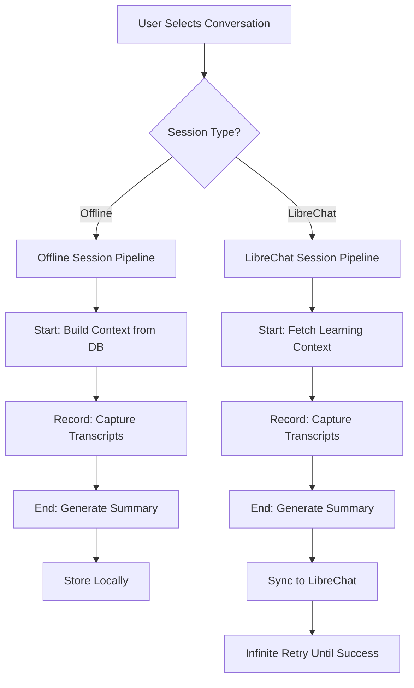
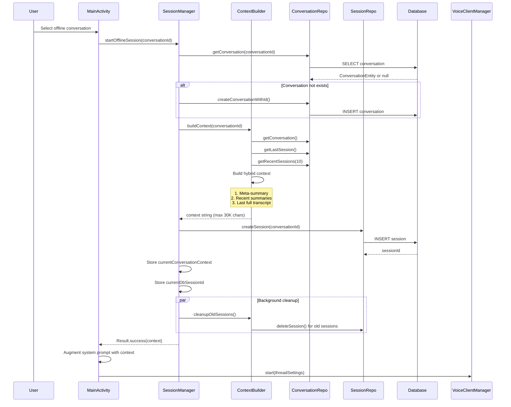
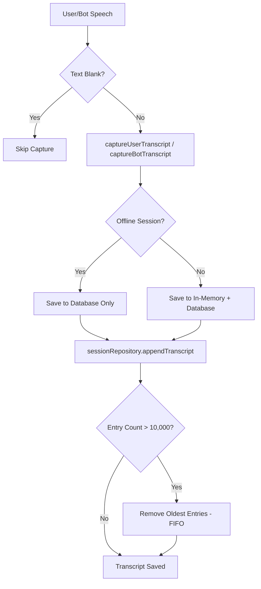
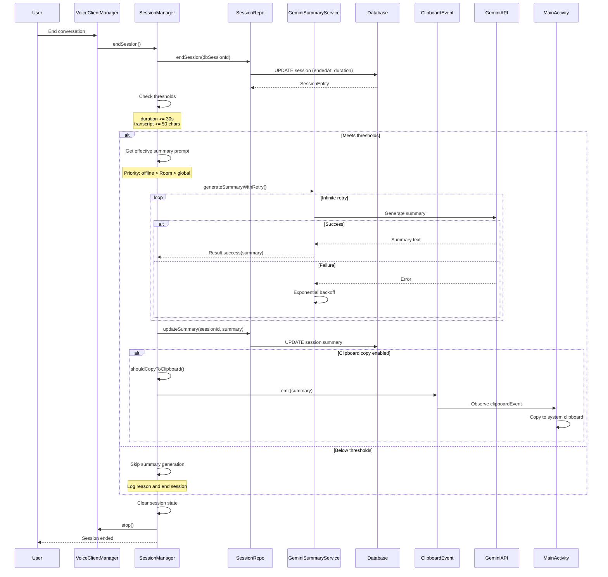
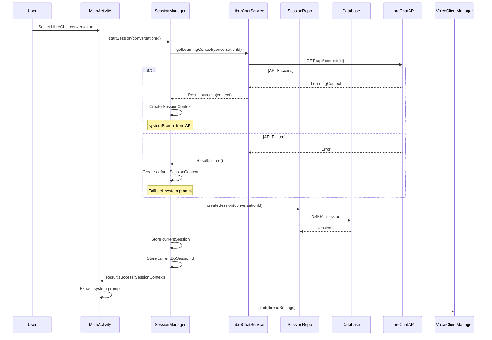
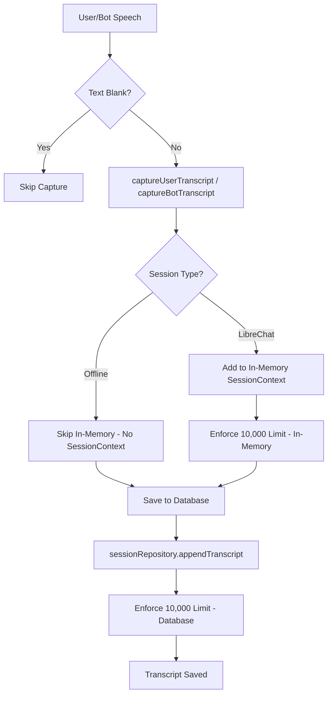
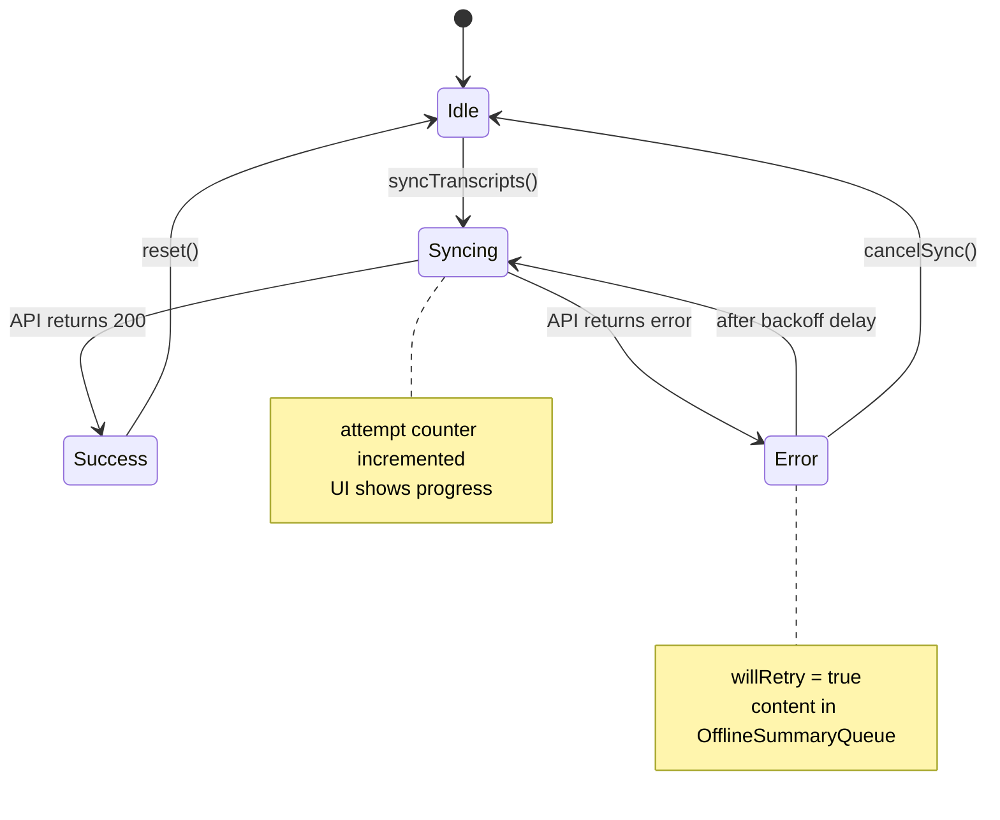
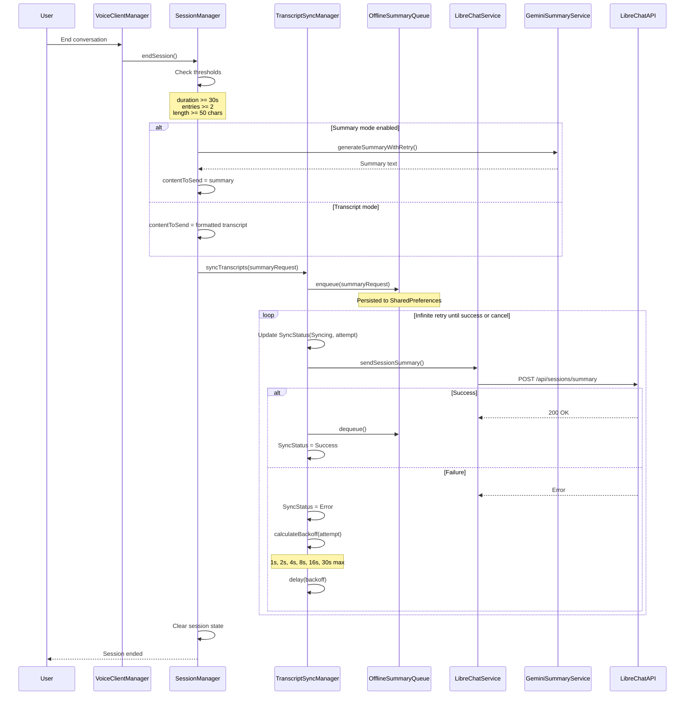
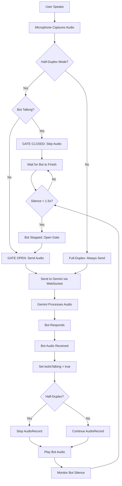

# Session Pipelines

## Introduction

This document describes the complete lifecycle of both session types in the application: **Offline Sessions** and **LibreChat Sessions**. Each session type follows a distinct pipeline from start to end, with different context building strategies, transcript capture mechanisms, and synchronization approaches.

Understanding these pipelines is essential for:
- Debugging session-related issues
- Extending session functionality
- Understanding data flow through the system
- Implementing new features that interact with sessions

## Glossary

- **Offline Session**: A conversation session that operates without LibreChat integration, storing all data locally in Room database
- **LibreChat Session**: A conversation session integrated with LibreChat platform for learning context and transcript synchronization
- **Context Builder**: Component that builds conversation context from previous sessions using a hybrid approach
- **Session Manager**: Component managing session lifecycle, transcript capture, and synchronization
- **Transcript**: Full record of user and bot speech during a session, stored as TranscriptEntry objects
- **Summary**: AI-generated condensed version of a conversation transcript
- **Meta-Summary**: High-level summary of multiple sessions for a conversation
- **Hybrid Context**: Context built from last full transcript + summaries of previous sessions
- **TranscriptSyncManager**: Component handling reliable transcript delivery with infinite retry
- **OfflineSummaryQueue**: Persistent queue for transcripts/summaries awaiting synchronization
- **SessionContext**: In-memory data structure holding active session state
- **TranscriptEntry**: Individual transcript item with timestamp, speaker, and text
- **VAD**: Voice Activity Detection - algorithm for detecting speech in audio
- **Audio Gating**: Mechanism to prevent acoustic echo by controlling when audio is sent

## Session Pipeline Overview




---

## Offline Session Pipeline

Offline sessions operate without LibreChat integration, storing all data locally in Room database and building context from previous sessions. This pipeline is designed for standalone operation with full conversation history management.

### Session Start Flow

The offline session start flow involves context building from previous sessions and database initialization.

#### Flow Steps

1. **User Selection**: User selects an offline conversation from the conversation list
2. **Session Initialization**: `MainActivity` calls `sessionManager.startOfflineSession(conversationId)`
3. **Database Verification**: SessionManager ensures conversation exists in Room database
   - If conversation doesn't exist, creates it with the same ID from OfflineConversationManager
   - Uses `conversationRepository.createConversationWithId()` to maintain ID consistency
4. **Context Building**: ContextBuilder builds conversation history using hybrid approach
   - Calls `contextBuilder.buildContext(conversationId)` 
   - Returns formatted context string (max 30,000 characters)
5. **Database Session Creation**: Creates new session record in database
   - Calls `sessionRepository.createSession(conversationId)`
   - Returns database session ID stored in `currentDbSessionId`
6. **Background Cleanup**: Launches background task to cleanup old sessions
   - Calls `contextBuilder.cleanupOldSessions(conversationId)`
   - Keeps last 50 sessions per conversation
   - Deletes older sessions to prevent database bloat
7. **Context Storage**: Stores context in `currentConversationContext` for later use
8. **System Prompt Augmentation**: MainActivity augments system prompt with conversation context
9. **Voice Client Start**: VoiceClientManager starts with augmented system prompt

#### Context Building Strategy (Hybrid Approach)

ContextBuilder uses a three-section hybrid strategy to maximize context value while staying within limits:

**Section 1: Conversation Overview** (if exists)
- Meta-summary of the entire conversation thread
- High-level summary of all previous sessions
- Only included if meta-summary exists in database

**Section 2: Recent Sessions** (summaries only)
- Last 10 sessions with summaries
- Format: "Session [date] ([duration]): [summary]"
- Provides condensed history of recent interactions
- Excludes the last session (covered in Section 3)

**Section 3: Last Session** (FULL transcript)
- Complete transcript of most recent session
- Includes all user and bot exchanges
- Provides detailed context from last conversation
- Includes note about recency for AI awareness

**Configuration Constants:**
```kotlin
MAX_RECENT_SESSIONS = 10      // Max summaries to include
MAX_CONTEXT_LENGTH = 30000    // Character limit
MAX_SESSIONS_TO_KEEP = 50     // Retention limit
```

**Rationale:**
- AI has detailed context from most recent conversation (full transcript)
- AI has summarized context from older conversations (summaries)
- Total context stays within 30,000 character limit
- Balances detail with breadth of history

#### Database Session Creation

When creating a session in the database:
- Generates unique session ID
- Records conversation ID (foreign key)
- Sets start timestamp
- Initializes empty transcript
- Session remains "active" until `endSession()` is called

#### Background Cleanup

The cleanup process runs asynchronously to avoid blocking session start:
- Queries all sessions for the conversation
- Sorts by start date (newest first)
- Keeps last 50 sessions
- Deletes older sessions
- Logs number of deleted sessions

**Code References:**
- `SessionManager.startOfflineSession()`: SessionManager.kt:165-230
- `ContextBuilder.buildContext()`: data/ContextBuilder.kt:25-110
- `ContextBuilder.cleanupOldSessions()`: data/ContextBuilder.kt:140-170
- `ConversationRepository.createConversationWithId()`: data/repository/ConversationRepository.kt

#### Sequence Diagram




### Transcript Capture (Offline)

During an active offline session, all user and bot speech is captured and persisted to the database. The system enforces a hard limit to prevent memory overflow.

#### Capture Methods

**User Transcript Capture:**
- Method: `SessionManager.captureUserTranscript(text: String)`
- Triggered when user speech is transcribed by Gemini
- Validates text is not blank before capturing
- Saves to database with speaker role "user"

**Bot Transcript Capture:**
- Method: `SessionManager.captureBotTranscript(text: String)`
- Triggered when bot speech is generated by Gemini
- Validates text is not blank before capturing
- Saves to database with speaker role "assistant"

#### Storage Mechanism

For offline sessions, transcripts are stored ONLY in the database (not in-memory):

1. **Database Persistence**: 
   - Calls `sessionRepository.appendTranscript(dbSessionId, speaker, text)`
   - Appends to existing transcript in SessionEntity
   - Transcript stored as formatted string: "speaker: text\n"
   - Persisted immediately on each capture

2. **No In-Memory Storage**:
   - Offline sessions do NOT create a SessionContext object
   - `currentSession` remains null for offline sessions
   - All transcript data lives in database only

#### Transcript Size Limit (10,000 Entries)

To prevent memory overflow and database bloat, the system enforces a hard limit:

**Limit**: Maximum 10,000 TranscriptEntry objects per session

**Enforcement Mechanism**:
- Database-level enforcement in SessionRepository
- When appending transcript, checks current entry count
- If limit exceeded, removes oldest entries (FIFO - First In, First Out)
- Maintains chronological order of remaining entries

**Why This Limit?**:
- Prevents OutOfMemoryError on long-running sessions
- Keeps database queries performant
- Ensures reasonable context size for AI
- Typical conversation has < 1,000 entries

**Implementation**:
```kotlin
private fun enforceTranscriptLimit(session: SessionContext) {
    if (session.transcripts.size > MAX_TRANSCRIPTS) {
        val toRemove = session.transcripts.size - MAX_TRANSCRIPTS
        repeat(toRemove) {
            session.transcripts.removeAt(0) // Remove oldest
        }
        Log.d(TAG, "Removed $toRemove old transcripts to enforce limit")
    }
}
```

Note: For offline sessions, this enforcement happens at the database level in SessionRepository, not in SessionManager (since there's no in-memory SessionContext).

#### Data Flow



#### Transcript Format in Database

Transcripts are stored as a formatted string in the SessionEntity.transcript column:

```
user: Hello, how are you?
assistant: I'm doing well, thank you! How can I help you today?
user: I need help with my homework.
assistant: Of course! What subject are you working on?
```

Each line follows the format: `{speaker}: {text}`

**Code References:**
- `SessionManager.captureUserTranscript()`: SessionManager.kt:350-380
- `SessionManager.captureBotTranscript()`: SessionManager.kt:382-412
- `SessionManager.enforceTranscriptLimit()`: SessionManager.kt:414-425
- `SessionRepository.appendTranscript()`: data/repository/SessionRepository.kt


### Session End Flow (Offline)

When an offline session ends, the system finalizes the database session, generates an AI summary (if thresholds are met), and optionally copies the summary to clipboard.

#### Flow Steps

1. **End Trigger**: User ends conversation (button press or voice command)
2. **VoiceClientManager Stop**: Stops WebSocket connection and audio processing
3. **SessionManager.endSession()**: Processes session end
4. **Database Session End**: Marks session as complete in database
   - Calls `sessionRepository.endSession(dbSessionId)`
   - Sets `endedAt` timestamp
   - Calculates and stores `durationSeconds`
5. **Threshold Check**: Verifies session meets minimum requirements
6. **Summary Generation**: Generates AI summary if thresholds met
7. **Clipboard Copy**: Copies summary to clipboard if enabled
8. **Cleanup**: Clears session state variables

#### Minimum Thresholds

Sessions must meet ALL of the following thresholds to generate a summary:

| Threshold | Value | Reason |
|-----------|-------|--------|
| Duration | ≥ 30 seconds | Avoid summarizing very short interactions |
| Transcript Length | ≥ 50 characters | Ensure meaningful content exists |

**Threshold Check Logic:**
```kotlin
val durationSecs = sess.durationSeconds ?: 0
val transcriptLength = sess.transcript.length

if (sess.transcript.isNotBlank() && 
    durationSecs >= MIN_SESSION_DURATION_SECONDS && 
    transcriptLength >= MIN_TRANSCRIPT_LENGTH) {
    // Generate summary
}
```

If thresholds are NOT met:
- Session is saved to database without summary
- No summary generation attempted
- Session ends immediately
- Logs reason for skipping summary

#### Summary Generation Process

**Step 1: Get Effective Summary Prompt**
- Priority chain: offline conversation > Room database > global preference
- Calls `getEffectiveSummaryPrompt(conversationId)`
- Returns custom prompt or falls back to global

**Step 2: Get API Configuration**
- Retrieves Gemini API key from preferences
- Gets summary model (default: "gemini-2.5-flash")
- Validates API key exists

**Step 3: Generate Summary with Infinite Retry**
- Calls `geminiSummaryService.generateSummaryWithRetry()`
- Uses exponential backoff on failures
- Retries indefinitely until success
- Runs in background coroutine (non-blocking)

**Step 4: Save Summary to Database**
- Calls `sessionRepository.updateSummary(dbSessionId, summary)`
- Updates SessionEntity.summary field
- Summary now available for future context building

**Step 5: Handle Clipboard Copy**
- Checks if clipboard copy is enabled for conversation
- Calls `shouldCopyToClipboard(conversationId)`
- If enabled, emits summary to `clipboardEvent` flow
- MainActivity observes flow and copies to system clipboard

#### Clipboard Copy Feature

The clipboard copy feature allows automatic copying of summaries after session end.

**Configuration Levels:**
1. **Offline Conversation**: `OfflineConversation.copySummaryToClipboard`
2. **Room Database**: `ConversationEntity.copySummaryToClipboard`
3. **Default**: false (disabled)

**Priority**: Offline conversation setting > Room database setting > default

**Implementation:**
```kotlin
private suspend fun shouldCopyToClipboard(conversationId: String): Boolean {
    // Try offline conversation first
    val offlineConv = OfflineConversationManager.getById(conversationId)
    if (offlineConv != null) {
        return offlineConv.copySummaryToClipboard
    }
    
    // Try Room database
    val dbConv = conversationRepository.getConversation(conversationId)
    return dbConv?.copySummaryToClipboard ?: false
}
```

**Event Flow:**
1. Summary generated successfully
2. `handleSummaryGenerated()` checks clipboard setting
3. If enabled, emits to `_clipboardEvent` SharedFlow
4. MainActivity observes `clipboardEvent`
5. MainActivity copies to system clipboard
6. User sees toast notification: "Summary copied to clipboard"

#### Session State Cleanup

After session end (successful or failed):
- `currentDbSessionId` set to null
- `currentConversationId` set to null
- `currentConversationContext` remains (for reference)
- `isEndingSession` flag reset to false

#### Sequence Diagram



**Code References:**
- `SessionManager.endSession()`: SessionManager.kt:460-600
- `SessionManager.getEffectiveSummaryPrompt()`: SessionManager.kt:240-260
- `SessionManager.shouldCopyToClipboard()`: SessionManager.kt:262-275
- `SessionManager.handleSummaryGenerated()`: SessionManager.kt:277-290
- `GeminiSummaryService.generateSummaryWithRetry()`: GeminiSummaryService.kt
- `SessionRepository.updateSummary()`: data/repository/SessionRepository.kt


---

## LibreChat Session Pipeline

LibreChat sessions integrate with the LibreChat platform, fetching learning context from the API and synchronizing transcripts/summaries back. This pipeline enables persistent learning across sessions.

### Session Start Flow (LibreChat)

The LibreChat session start flow involves fetching learning context from the API and creating an in-memory session context.

#### Flow Steps

1. **User Selection**: User selects a LibreChat conversation from the thread list
2. **Session Initialization**: `MainActivity` calls `sessionManager.startSession(conversationId)`
3. **API Call**: SessionManager fetches learning context from LibreChat
   - Calls `libreChatService.getLearningContext(conversationId)`
   - Makes HTTP GET request to `/api/context/{conversationId}`
4. **Success Path**: API returns learning context
   - Creates SessionContext with system prompt from API
   - Stores in `currentSession`
   - Initializes empty transcript lists
5. **Failure Path**: API call fails
   - Logs error message
   - Falls back to default context
   - Creates SessionContext with default system prompt
   - Session continues with fallback
6. **Database Session Creation**: Creates session record in Room database
   - Calls `sessionRepository.createSession(conversationId)`
   - Stores database session ID in `currentDbSessionId`
7. **Voice Client Start**: VoiceClientManager starts with system prompt

#### SessionContext Data Structure

The SessionContext holds all in-memory state for an active LibreChat session:

```kotlin
data class SessionContext(
    val sessionId: String,           // Unique session ID (UUID)
    val conversationId: String,      // LibreChat thread ID
    val startTime: Long,             // Session start timestamp
    val systemPrompt: String,        // System instructions for Gemini
    val transcripts: MutableList<TranscriptEntry>,  // In-memory transcripts
    val imageEvents: MutableList<ImageEvent>,       // Image tracking
    val contextUpdates: MutableList<ContextUpdate>  // Context updates
)
```

**Key Characteristics:**
- Exists ONLY for LibreChat sessions (not offline)
- Stored in `currentSession` variable
- Cleared when session ends
- Transcripts stored in-memory for fast access
- Also persisted to database for reliability

#### Learning Context from LibreChat

The learning context provides personalized system instructions based on previous interactions:

**API Endpoint**: `GET /api/context/{conversationId}`

**Response Structure**:
```json
{
  "readyToUseContext": {
    "systemPrompt": "You are a helpful AI tutor..."
  }
}
```

**System Prompt Usage:**
- Sent to Gemini as system instructions
- Guides AI behavior and personality
- Includes learning history and preferences
- Personalized per conversation thread

#### Fallback Behavior

When LibreChat API is unavailable, the system gracefully degrades:

**Fallback Triggers:**
- Network timeout
- API server error (500)
- Authentication failure
- Connection refused

**Fallback Action:**
- Creates default SessionContext
- Uses generic system prompt: "You are a helpful AI tutor. Assist the student with their learning."
- Session continues normally
- User may not notice the fallback
- Transcripts still captured and queued for sync

**Implementation:**
```kotlin
private fun createDefaultContext(conversationId: String): SessionContext {
    val sessionId = UUID.randomUUID().toString()
    val startTime = System.currentTimeMillis()
    
    return SessionContext(
        sessionId = sessionId,
        conversationId = conversationId,
        startTime = startTime,
        systemPrompt = "You are a helpful AI tutor. Assist the student with their learning.",
        transcripts = mutableListOf(),
        imageEvents = mutableListOf(),
        contextUpdates = mutableListOf()
    )
}
```

#### Database Session Creation

Even for LibreChat sessions, a database record is created:

**Purpose:**
- Local backup of transcripts
- Enables offline access to history
- Supports context building for offline mode
- Provides audit trail

**Fields Initialized:**
- `id`: Unique session ID
- `conversationId`: Foreign key to conversation
- `startedAt`: Current timestamp
- `transcript`: Empty string (populated during session)
- `summary`: null (populated at session end)
- `endedAt`: null (set when session ends)

#### Sequence Diagram



**Code References:**
- `SessionManager.startSession()`: SessionManager.kt:292-348
- `SessionManager.createDefaultContext()`: SessionManager.kt:350-365
- `LibreChatService.getLearningContext()`: LibreChatService.kt
- `SessionRepository.createSession()`: data/repository/SessionRepository.kt


### Transcript Capture (LibreChat)

During an active LibreChat session, transcripts are captured both in-memory (for fast access) and in the database (for persistence). This dual-storage approach ensures reliability.

#### Dual-Storage Strategy

LibreChat sessions use a dual-storage approach for transcripts:

**1. In-Memory Storage (SessionContext)**
- Stored in `currentSession.transcripts` list
- Fast access for formatting and display
- Cleared when session ends
- Used for generating transcript/summary at session end

**2. Database Storage (SessionEntity)**
- Stored in `SessionEntity.transcript` column
- Persisted immediately on each capture
- Survives app restart
- Used for offline access and context building

**Why Both?**
- In-memory: Fast access during active session
- Database: Reliability and persistence
- Redundancy: If app crashes, database has backup
- Flexibility: Can switch between modes easily

#### Capture Methods

The same methods handle both LibreChat and offline sessions:

**User Transcript Capture:**
```kotlin
fun captureUserTranscript(text: String) {
    // For LibreChat sessions: add to in-memory
    currentSession?.let { session ->
        val entry = TranscriptEntry(
            timestamp = System.currentTimeMillis(),
            speaker = Speaker.USER,
            text = text.trim()
        )
        session.transcripts.add(entry)
        enforceTranscriptLimit(session)
    }
    
    // For ALL sessions: save to database
    currentDbSessionId?.let { dbSessionId ->
        sessionRepository.appendTranscript(dbSessionId, "user", text)
    }
}
```

**Bot Transcript Capture:**
```kotlin
fun captureBotTranscript(text: String) {
    // For LibreChat sessions: add to in-memory
    currentSession?.let { session ->
        val entry = TranscriptEntry(
            timestamp = System.currentTimeMillis(),
            speaker = Speaker.BOT,
            text = text.trim()
        )
        session.transcripts.add(entry)
        enforceTranscriptLimit(session)
    }
    
    // For ALL sessions: save to database
    currentDbSessionId?.let { dbSessionId ->
        sessionRepository.appendTranscript(dbSessionId, "assistant", text)
    }
}
```

#### TranscriptEntry Data Structure

Each transcript entry contains:

```kotlin
data class TranscriptEntry(
    val timestamp: Long,    // Milliseconds since epoch
    val speaker: Speaker,   // USER or BOT
    val text: String        // Transcribed text
)

enum class Speaker {
    USER, BOT
}
```

**Characteristics:**
- Immutable (val fields)
- Timestamp for chronological ordering
- Speaker for role identification
- Text trimmed of whitespace

#### Transcript Size Limit (10,000 Entries)

The same 10,000 entry limit applies to LibreChat sessions:

**In-Memory Enforcement:**
```kotlin
private fun enforceTranscriptLimit(session: SessionContext) {
    if (session.transcripts.size > MAX_TRANSCRIPTS) {
        val toRemove = session.transcripts.size - MAX_TRANSCRIPTS
        repeat(toRemove) {
            session.transcripts.removeAt(0) // Remove oldest (FIFO)
        }
        Log.d(TAG, "Removed $toRemove old transcripts to enforce limit")
    }
}
```

**Database Enforcement:**
- Handled by SessionRepository
- Same FIFO logic
- Keeps database size manageable

**Limit Constant:**
```kotlin
private const val MAX_TRANSCRIPTS = 10000
```

#### Data Flow Comparison



#### Synchronization Guarantees

**Consistency:**
- In-memory and database transcripts stay synchronized
- Both updated on every capture
- No drift between the two stores

**Failure Handling:**
- If database write fails, logs error but continues
- In-memory transcript still captured
- Session can continue normally
- Database write retried on next capture

**App Restart:**
- In-memory transcripts lost (SessionContext cleared)
- Database transcripts persist
- Can rebuild context from database if needed

**Code References:**
- `SessionManager.captureUserTranscript()`: SessionManager.kt:350-380
- `SessionManager.captureBotTranscript()`: SessionManager.kt:382-412
- `SessionManager.enforceTranscriptLimit()`: SessionManager.kt:414-425
- `SessionRepository.appendTranscript()`: data/repository/SessionRepository.kt


### Session End Flow (LibreChat)

When a LibreChat session ends, the system formats transcripts, generates a summary (if enabled), and synchronizes to LibreChat with infinite retry using TranscriptSyncManager.

#### Flow Steps

1. **End Trigger**: User ends conversation (button press or voice command)
2. **VoiceClientManager Stop**: Stops WebSocket connection and audio processing
3. **SessionManager.endSession()**: Processes session end
4. **Database Session End**: Marks session as complete in database
5. **Threshold Check**: Verifies session meets minimum requirements
6. **Content Preparation**: Formats transcript or generates summary
7. **TranscriptSyncManager**: Handles reliable delivery with infinite retry
8. **OfflineSummaryQueue**: Persists content for app restart survival
9. **Cleanup**: Clears session state variables

#### Minimum Thresholds

Sessions must meet ALL of the following thresholds to send transcript/summary:

| Threshold | Value | Reason |
|-----------|-------|--------|
| Duration | ≥ 30 seconds | Avoid sending very short interactions |
| Transcript Entries | ≥ 2 entries | Ensure at least one exchange |
| Transcript Length | ≥ 50 characters | Ensure meaningful content exists |

**Threshold Check Logic:**
```kotlin
val meetsMinimumThresholds = durationSeconds >= MIN_SESSION_DURATION_SECONDS &&
                            session.transcripts.size >= MIN_TRANSCRIPT_ENTRIES &&
                            transcriptText.length >= MIN_TRANSCRIPT_LENGTH
```

If thresholds are NOT met:
- Session ends immediately
- No transcript/summary sent to LibreChat
- Database session still saved
- Logs reason for skipping

#### Transcript vs Summary Mode

The system supports two modes for sending content to LibreChat:

**Transcript Mode** (default):
- Sends full formatted transcript
- Includes all user and bot exchanges
- Preserves complete conversation detail
- Format: "## TRANSKRYPCJA ##\n\n[formatted transcript]"

**Summary Mode** (optional):
- Generates AI summary using Gemini
- Sends condensed version instead of full transcript
- Saves bandwidth and storage
- Format: "## PODSUMOWANIE ##\n\n[summary]"

**Configuration:**
- Controlled by `Preferences.useSummaryMode.value`
- User can toggle in settings
- Default: false (transcript mode)

#### Summary Generation (If Enabled)

When summary mode is enabled:

**Step 1: Get Configuration**
- Effective summary prompt (priority: offline > Room > global)
- Gemini API key from preferences
- Summary model (default: "gemini-2.5-flash")

**Step 2: Generate Summary**
- Calls `geminiSummaryService.generateSummaryWithRetry()`
- Uses infinite retry with exponential backoff
- Retries until success (no failure case)
- Runs synchronously (blocks session end)

**Step 3: Handle Result**
- Success: Use summary as content to send
- Failure: Fall back to transcript mode
- Log generation result

**Step 4: Save to Database**
- Updates SessionEntity.summary field
- Available for future context building

#### TranscriptSyncManager: Infinite Retry

The TranscriptSyncManager ensures reliable delivery to LibreChat:

**Key Features:**
- **Infinite Retry**: Never gives up until success or cancellation
- **Exponential Backoff**: 1s, 2s, 4s, 8s, 16s, 30s (max)
- **Persistence**: Uses OfflineSummaryQueue for app restart survival
- **Cancellation**: User can cancel, content remains queued
- **Status Updates**: Emits SyncStatus for UI feedback

**Retry Loop:**
```kotlin
while (!isCancelled) {
    attempt++
    _syncStatus.value = SyncStatus.Syncing(attempt)
    
    val result = libreChatService.sendSessionSummary(summaryRequest)
    
    if (result.isSuccess) {
        offlineQueue.dequeue()  // Remove from queue
        _syncStatus.value = SyncStatus.Success
        return
    } else {
        _syncStatus.value = SyncStatus.Error(message, willRetry = true)
        delay(calculateBackoff(attempt))
    }
}
```

**Backoff Algorithm:**
```kotlin
private fun calculateBackoff(attempt: Int): Long {
    val delay = (BASE_DELAY * Math.pow(BACKOFF_FACTOR, (attempt - 1).toDouble())).toLong()
    return delay.coerceAtMost(MAX_DELAY)
}
// BASE_DELAY = 1000ms, BACKOFF_FACTOR = 2.0, MAX_DELAY = 30000ms
// Results: 1s, 2s, 4s, 8s, 16s, 30s, 30s, 30s...
```

#### OfflineSummaryQueue: Persistence

The OfflineSummaryQueue ensures content survives app restarts:

**Storage:**
- Persisted to SharedPreferences as JSON
- Survives app process kill
- Survives device reboot
- Loaded on app start

**Queue Operations:**
- `enqueue(summaryRequest)`: Add to queue immediately
- `dequeue()`: Remove after successful sync
- `processQueue()`: Attempt to send all queued items
- `size()`: Get current queue size

**Processing on App Start:**
- Called in MainActivity.onCreate()
- Attempts to send all queued items
- Uses same retry logic
- Runs in background

**Why Persistence?**
- Network may be unavailable at session end
- App may be killed during sync
- Device may lose power
- Ensures no data loss

#### SyncStatus State Machine

The sync status provides UI feedback:



**States:**
- `Idle`: No sync in progress
- `Syncing(attempt)`: Sync in progress, shows attempt number
- `Success`: Sync completed successfully
- `Error(message, willRetry)`: Sync failed, will retry

#### Cancellation Handling

Users can cancel ongoing synchronization:

**Trigger:**
- User presses "Cancel" button in UI
- Calls `sessionManager.cancelTranscriptSync()`

**Behavior:**
- Sets `isCancelled = true`
- Cancels sync job
- Updates status to `Error(willRetry = false)`
- **Content remains in OfflineSummaryQueue**
- Will retry on next app start or manual trigger

**Important:**
- Cancellation does NOT lose data
- Content persisted in queue
- Can retry later when network available
- User can start new conversation immediately

#### Sequence Diagram



**Code References:**
- `SessionManager.endSession()`: SessionManager.kt:460-650
- `TranscriptSyncManager.syncTranscripts()`: SessionManager.kt:900-980
- `TranscriptSyncManager.calculateBackoff()`: SessionManager.kt:1000-1005
- `OfflineSummaryQueue.enqueue()`: OfflineSummaryQueue.kt
- `OfflineSummaryQueue.processQueue()`: OfflineSummaryQueue.kt
- `LibreChatService.sendSessionSummary()`: LibreChatService.kt


---

## Audio Gating Strategy

The application implements an audio gating strategy to prevent acoustic echo and ensure clean audio processing. This is critical for preventing the bot from hearing its own voice through the device speakers.

### Problem: Acoustic Echo

**The Challenge:**
- Bot speaks through device speakers
- Device microphone picks up bot's voice
- Bot hears itself and gets confused
- Creates feedback loop and poor user experience
- Voice Activity Detection (VAD) triggers on bot's own voice

**Solution:**
- Audio gating mechanism
- Half-duplex mode (default)
- Bot silence detection
- Controlled audio transmission

### Half-Duplex vs Full-Duplex Mode

The system supports two audio modes:

#### Half-Duplex Mode (Default)

**Behavior:**
- Only ONE party can speak at a time
- When bot speaks, user audio is NOT sent to Gemini
- When bot finishes, user can speak
- Prevents acoustic echo completely

**Implementation:**
```kotlin
if (botIsTalking.value && !Preferences.fullDuplexMode.value) {
    // Half-duplex: Don't send audio while bot talks
    continue // Skip sending this audio chunk
}
```

**Advantages:**
- No acoustic echo
- Clean audio processing
- Reliable VAD
- Lower bandwidth usage

**Disadvantages:**
- User cannot interrupt bot
- Must wait for bot to finish
- Less natural conversation flow

#### Full-Duplex Mode (Optional)

**Behavior:**
- Both parties can speak simultaneously
- User audio sent even when bot is talking
- Allows user interruption
- Requires good echo cancellation

**Implementation:**
```kotlin
if (botIsTalking.value && Preferences.fullDuplexMode.value) {
    // Full-duplex: Send audio even when bot talks (user can interrupt)
    // Continue normally - don't skip
}
```

**Advantages:**
- Natural conversation flow
- User can interrupt bot
- More responsive interaction

**Disadvantages:**
- Risk of acoustic echo
- Requires hardware echo cancellation
- Higher bandwidth usage
- May confuse VAD

**Configuration:**
- Controlled by `Preferences.fullDuplexMode.value`
- Default: false (half-duplex)
- User can toggle in settings

### Bot Silence Detection

The system automatically detects when the bot stops speaking:

**Mechanism:**
- Monitors bot audio timestamps
- Checks every 500ms
- Threshold: 1500ms (1.5 seconds) of silence
- Automatically sets `botIsTalking = false`

**Implementation:**
```kotlin
private val BOT_SILENCE_THRESHOLD_MS = 1500L // 1.5 seconds

botSilenceDetectionJob = scope?.launch {
    while (isActive) {
        delay(500) // Check every 500ms
        
        if (botIsTalking.value) {
            val silenceDuration = System.currentTimeMillis() - lastBotAudioTime
            
            if (silenceDuration > BOT_SILENCE_THRESHOLD_MS) {
                Log.i(TAG, "🔇 Bot stopped speaking (silence detected: ${silenceDuration}ms)")
                botIsTalking.value = false
                botAudioLevel.floatValue = 0f
            }
        }
    }
}
```

**Why 1.5 Seconds?**
- Allows for natural pauses in speech
- Not too short (avoids false positives)
- Not too long (responsive to user)
- Balances accuracy and responsiveness

**Triggers:**
- No bot audio received for 1.5 seconds
- `turnComplete` message from Gemini
- WebSocket disconnection
- Session end

### Audio Gate Mechanism

The audio gate controls when user audio is sent to Gemini:

**Gate States:**
- **OPEN**: User audio sent to Gemini (bot not talking)
- **CLOSED**: User audio NOT sent to Gemini (bot talking in half-duplex)

**Gate Logic:**
```kotlin
// In audio recording loop
while (isActive && state.value == ConnectionState.CONNECTED) {
    // Skip reading if bot is talking (half-duplex only)
    if (botIsTalking.value && !Preferences.fullDuplexMode.value) {
        delay(100)  // Wait while bot talks
        continue
    }
    
    val read = audioRecord?.read(buffer, 0, buffer.size) ?: 0
    
    if (read > 0) {
        // Calculate audio level
        val level = calculateAudioLevel(buffer.copyOf(read))
        userAudioLevel.floatValue = level
        
        // CRITICAL: Don't send audio while bot is talking (half-duplex)
        if (botIsTalking.value && !Preferences.fullDuplexMode.value) {
            continue // Skip sending this audio chunk
        }
        
        // Send audio to Gemini
        sendAudioData(buffer, read)
    }
}
```

**Two-Level Gating:**
1. **AudioRecord Level**: Stop reading from microphone (half-duplex)
2. **Transmission Level**: Don't send audio to Gemini (half-duplex)

### AudioRecord Management (Half-Duplex)

In half-duplex mode, AudioRecord is stopped/resumed:

**Stop AudioRecord (Bot Starts Speaking):**
```kotlin
if (!Preferences.fullDuplexMode.value) {
    stopAudioRecording()  // Stop AudioRecord to free mic
    Log.i(TAG, "🎤 Half-duplex: AudioRecord stopped (bot speaking)")
}
```

**Resume AudioRecord (Bot Stops Speaking):**
```kotlin
if (!Preferences.fullDuplexMode.value) {
    resumeAudioRecording()  // Resume AudioRecord
    Log.i(TAG, "🎤 Half-duplex: AudioRecord resumed (bot finished)")
}
```

**Why Stop AudioRecord?**
- Frees microphone hardware
- Reduces CPU usage
- Prevents buffer overflow
- Cleaner state management

**In Full-Duplex:**
- AudioRecord never stopped
- Continues reading from microphone
- Audio still sent to Gemini
- User can interrupt bot

### Voice Activity Detection (VAD)

VAD is used for activity detection and auto-pause:

**Purpose:**
- Detect when user is speaking
- Reset auto-pause timer
- Update UI indicators
- Does NOT affect audio volume sent to Gemini

**Threshold:**
- Configurable: `Preferences.activityDetectionThreshold.value`
- Default: 0.02 (2% of max amplitude)
- User can adjust in settings

**Implementation:**
```kotlin
val threshold = Preferences.activityDetectionThreshold.value
val isTalking = level > threshold

if (userIsTalking.value != isTalking) {
    userIsTalking.value = isTalking
    if (isTalking) {
        updateActivity()  // Reset auto-pause timer
    }
}
```

**Important:**
- VAD threshold affects ONLY activity detection
- Does NOT affect audio volume sent to Gemini
- All audio sent regardless of VAD state (when gate open)

### Integration with Picovoice Wake Word

Picovoice wake word detection is coordinated with audio gating:

**Picovoice Active When:**
- Session is paused
- Bot is talking (half-duplex mode)

**Picovoice Inactive When:**
- User can speak (gate open)
- Full-duplex mode (user can always speak)

**Implementation:**
```kotlin
private fun updatePicovoiceState() {
    val shouldPorcupineBeActive = isPaused.value || botIsTalking.value
    
    val action = if (shouldPorcupineBeActive) {
        "START"  // Activate wake word detection
    } else {
        "STOP"   // Deactivate wake word detection
    }
    
    val reason = when {
        isPaused.value -> "session paused"
        botIsTalking.value -> "bot talking"
        else -> "user can talk"
    }
}
```

**Why This Coordination?**
- Prevents wake word false positives from bot voice
- Allows wake word during bot speech (to interrupt)
- Efficient resource usage

### Data Flow Diagram



### Summary

**Key Points:**
- **Half-duplex mode** (default) prevents acoustic echo completely
- **Audio gate** controls when user audio is sent to Gemini
- **Bot silence detection** (1.5s threshold) automatically reopens gate
- **Full-duplex mode** (optional) allows interruption but risks echo
- **AudioRecord management** stops/resumes microphone in half-duplex
- **VAD** used for activity detection, not audio filtering
- **Picovoice coordination** enables wake word during bot speech

**Code References:**
- `VoiceClientManager.botIsTalking`: VoiceClientManager.kt:266
- Audio gate logic: VoiceClientManager.kt:1930-1970
- Bot silence detection: VoiceClientManager.kt:440-460
- AudioRecord management: VoiceClientManager.kt:1195-1250
- Picovoice coordination: VoiceClientManager.kt:397-415
- `BOT_SILENCE_THRESHOLD_MS`: VoiceClientManager.kt:232
- `Preferences.fullDuplexMode`: Preferences.kt:307

---

## Related Documentation

### Core Architecture
- [Architecture Overview](../project/architecture.md) - System architecture and components
- [Domain Model](model.md) - Core domain objects and relationships
- [State Machines](state-machine.md) - State transitions and lifecycle

### Implementation Details
- [Components](../implementation/components.md) - Detailed component documentation
- [Context Builder](../implementation/context-builder.md) - Conversation context building
- [Transcript Sync](../implementation/transcript-sync.md) - LibreChat synchronization
- [Summary Generation](../implementation/summary-generation.md) - AI-powered summaries
- [Interactions](../implementation/interactions.md) - Component interaction sequences
- [Lifecycle Management](../implementation/lifecycle.md) - Activity and service lifecycle

### Data & Persistence
- [Database Schema](../operations/database-schema.md) - Database entities and schema

---

**Last Updated:** 2025-12-04
