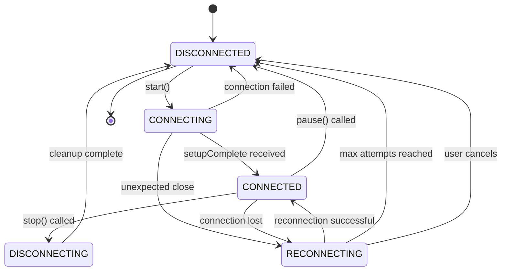
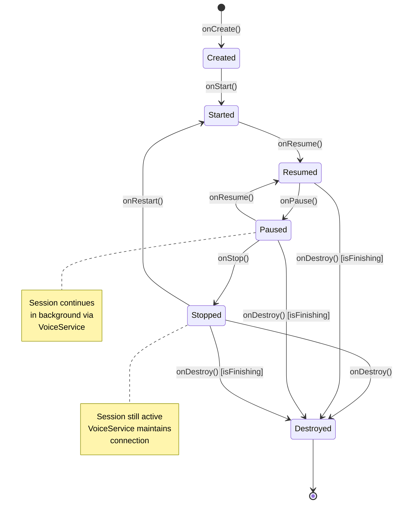
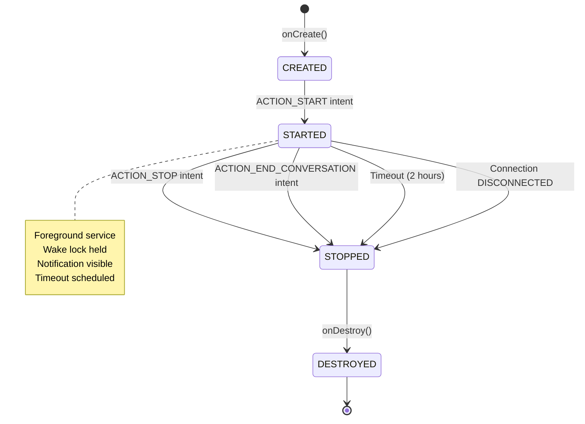
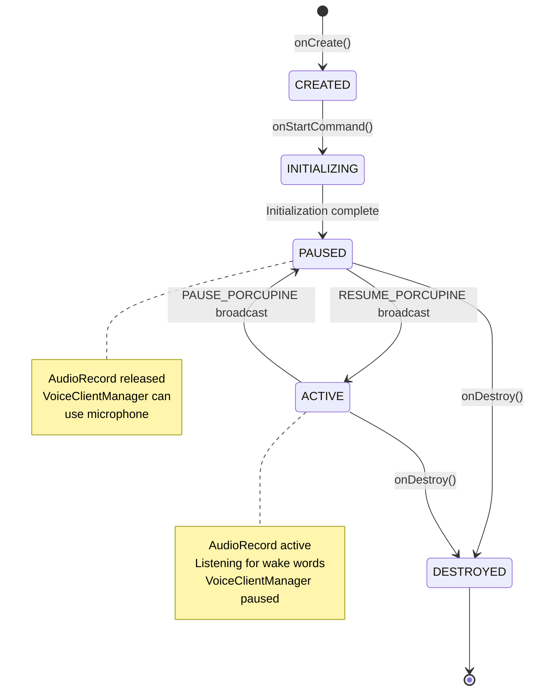
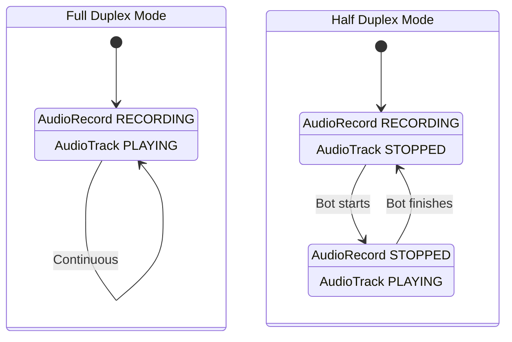

# State Machine Documentation

This document describes the state machines and lifecycle management in the voice conversation system.

## Overview

The system uses multiple coordinated state machines to manage connection lifecycle, service lifecycle, and audio pipeline states. Understanding these state transitions is critical for debugging and extending the system.

## ConnectionState State Machine

### States

**DISCONNECTED**
- **Description:** No active connection, system idle
- **Characteristics:**
  - WebSocket is null
  - Audio resources released
  - Wake lock released
  - No foreground service running
- **UI Indicators:** Connect button enabled, status shows "Disconnected"

**CONNECTING**
- **Description:** Initial connection attempt in progress
- **Characteristics:**
  - WebSocket connection initiated
  - Waiting for setupComplete message
  - Audio resources not yet allocated
- **UI Indicators:** Loading spinner, status shows "Connecting..."

**CONNECTED**
- **Description:** Active conversation, audio streaming
- **Characteristics:**
  - WebSocket open and receiving messages
  - AudioRecord capturing microphone
  - AudioTrack playing bot audio
  - Wake lock held
  - Foreground service running
- **UI Indicators:** Disconnect button enabled, audio indicators active

**RECONNECTING**
- **Description:** Connection lost, automatic reconnection in progress
- **Characteristics:**
  - WebSocket closed
  - Audio resources released temporarily
  - Exponential backoff delay between attempts
  - Attempt counter incremented
- **UI Indicators:** Reconnection dialog with attempt count

**DISCONNECTING**
- **Description:** User-initiated disconnect, cleanup in progress
- **Characteristics:**
  - WebSocket closing
  - Audio resources being released
  - Session ending
  - Transcript being sent
- **UI Indicators:** Loading spinner, status shows "Disconnecting..."

### State Transition Diagram



### Transition Triggers and Conditions

#### DISCONNECTED → CONNECTING
**Trigger:** `VoiceClientManager.start()` called
**Conditions:**
- API key configured
- Not already connected
- Not in DISCONNECTING state
**Actions:**
- Create WebSocket connection
- Initialize scope
- Transition state
**Code Reference:** `VoiceClientManager.kt:560`

#### CONNECTING → CONNECTED
**Trigger:** `setupComplete` message received from Gemini
**Conditions:**
- WebSocket successfully opened
- Setup message acknowledged
**Actions:**
- Start AudioRecord
- Start AudioTrack
- Acquire wake lock
- Start foreground service
- Start monitoring jobs (auto-pause, bot timeout, health check)
- Reset reconnection manager
**Code Reference:** `VoiceClientManager.kt:1200`

#### CONNECTED → RECONNECTING
**Trigger:** Unexpected WebSocket closure or failure
**Conditions:**
- Not user-initiated disconnect
- Not in paused state
- Recoverable error type
**Actions:**
- Stop audio resources
- Start reconnection manager
- Update service notification
**Code Reference:** `VoiceClientManager.kt:900`

#### RECONNECTING → CONNECTED
**Trigger:** Successful reconnection after delay
**Conditions:**
- Reconnection attempt succeeded
- setupComplete received
**Actions:**
- Restore audio resources
- Resume monitoring jobs
- Reset attempt counter
**Code Reference:** `VoiceClientManager.kt:2950`

#### RECONNECTING → DISCONNECTED
**Trigger:** Max reconnection attempts reached OR user cancels
**Conditions:**
- Attempt count >= maxAttempts (5)
- OR user clicks "End Conversation" in dialog
**Actions:**
- Stop reconnection attempts
- Clean up resources
- Show user dialog (if max attempts)
**Code Reference:** `VoiceClientManager.kt:3000`

#### CONNECTED → DISCONNECTING
**Trigger:** `VoiceClientManager.stop()` called
**Conditions:**
- User clicks disconnect button
- OR session timeout
- OR critical memory pressure
**Actions:**
- Close WebSocket
- Stop audio resources
- End session (send transcript)
- Transition to DISCONNECTING
**Code Reference:** `VoiceClientManager.kt:2800`

#### DISCONNECTING → DISCONNECTED
**Trigger:** Cleanup complete
**Conditions:**
- WebSocket closed
- Audio resources released
- Session ended
**Actions:**
- Release wake lock
- Stop foreground service
- Clear session context
- Final state transition
**Code Reference:** `VoiceClientManager.kt:2850`

#### CONNECTED → DISCONNECTED (Pause)
**Trigger:** `VoiceClientManager.pause()` called
**Conditions:**
- User pauses session
- OR wake word "stop" detected
**Actions:**
- Close WebSocket (preserving session handle)
- Stop audio resources
- Set isPaused flag
- Keep session context for resume
**Code Reference:** `VoiceClientManager.kt:2850`

#### DISCONNECTED → CONNECTING (Resume)
**Trigger:** `VoiceClientManager.resume()` called
**Conditions:**
- isPaused flag is true
- Session handle valid (< 2 hours old)
**Actions:**
- Clear isPaused flag
- Reconnect with session handle
- Restore audio resources
**Code Reference:** `VoiceClientManager.kt:2900`

---

## MainActivity Lifecycle States

### Lifecycle Events

**onCreate()**
- **Actions:**
  - Initialize VoiceClientManager
  - Initialize SessionManager
  - Register lifecycle observers
  - Set up connection state observer
**Code Reference:** `MainActivity.kt:100`

**onStart()**
- **Actions:**
  - Activity becomes visible
  - No special handling (session continues in background)
**Code Reference:** `MainActivity.kt:200`

**onResume()**
- **Actions:**
  - Activity comes to foreground
  - Update UI with current state
  - No session interruption
**Code Reference:** `MainActivity.kt:250`

**onPause()**
- **Actions:**
  - Activity goes to background
  - Session continues via VoiceService
  - No audio interruption
**Code Reference:** `MainActivity.kt:300`

**onStop()**
- **Actions:**
  - Activity no longer visible
  - Session continues in background
  - VoiceService maintains connection
**Code Reference:** `MainActivity.kt:350`

**onDestroy()**
- **Actions:**
  - Only cleanup if activity finishing
  - Check `isFinishing` flag
  - Stop VoiceClientManager if finishing
  - Unregister receivers
**Code Reference:** `MainActivity.kt:400`

**onTrimMemory(level)**
- **Actions:**
  - TRIM_MEMORY_RUNNING_LOW: Log warning
  - TRIM_MEMORY_RUNNING_CRITICAL: Log critical warning
  - TRIM_MEMORY_COMPLETE: Force stop session (emergency)
**Code Reference:** `MainActivity.kt:450`

### Lifecycle State Diagram



### Critical Lifecycle Rules

1. **Background Operation:** Session continues when activity is paused/stopped
2. **VoiceService Coordination:** Foreground service keeps session alive
3. **Memory Pressure:** Only force-stop on TRIM_MEMORY_COMPLETE
4. **Cleanup:** Only stop session if `isFinishing` is true
5. **Wake Lock:** Maintained by VoiceService, not activity

---

## VoiceService Lifecycle

### Service States

**CREATED**
- **Description:** Service instantiated but not started
- **Actions:**
  - onCreate() called
  - Notification channel created
  - Battery profiler initialized
**Code Reference:** `VoiceService.kt:50`

**STARTED (Foreground)**
- **Description:** Service running as foreground service
- **Characteristics:**
  - Persistent notification shown
  - Wake lock acquired
  - Service timeout scheduled (2 hours)
  - Battery profiling active
**Actions:**
  - startForeground() called
  - Wake lock acquired with timeout
  - Timeout job scheduled
**Code Reference:** `VoiceService.kt:80`

**STOPPED**
- **Description:** Service stopping, cleanup in progress
- **Actions:**
  - Release wake lock
  - Stop battery profiling
  - Remove notification
  - stopSelf() called
**Code Reference:** `VoiceService.kt:200`

**DESTROYED**
- **Description:** Service destroyed by system
- **Actions:**
  - Final cleanup
  - Cancel timeout job
  - Clear instance reference
**Code Reference:** `VoiceService.kt:250`

### Service Lifecycle Diagram



### Service Control Flow

**Start Sequence:**
1. MainActivity observes ConnectionState.CONNECTED
2. MainActivity calls `startVoiceService()`
3. Intent with ACTION_START sent
4. VoiceService.onStartCommand() receives intent
5. startForegroundService() called
6. Wake lock acquired
7. Timeout job scheduled

**Stop Sequence:**
1. MainActivity observes ConnectionState.DISCONNECTED
2. MainActivity calls `stopVoiceService()`
3. Intent with ACTION_STOP sent
4. VoiceService.onStartCommand() receives intent
5. stopService() called
6. Wake lock released
7. Notification removed
8. stopSelf() called

**Code References:**
- Start: `MainActivity.kt:600`, `VoiceService.kt:80`
- Stop: `MainActivity.kt:650`, `VoiceService.kt:200`

---

## PorcupineService Lifecycle

### Service States

**CREATED**
- **Description:** Service instantiated
- **Actions:**
  - onCreate() called
  - Notification channel created
  - Control receiver registered
**Code Reference:** `PorcupineService.kt:50`

**INITIALIZING**
- **Description:** Loading wake words and creating PorcupineManager
- **Actions:**
  - Load system wake words
  - Load custom wake words
  - Create PorcupineManager
  - Start in PAUSED state
**Code Reference:** `PorcupineService.kt:100`

**PAUSED**
- **Description:** Service running but wake word detection inactive
- **Characteristics:**
  - PorcupineManager stopped and deleted
  - AudioRecord released
  - Waiting for RESUME broadcast
**Actions:**
  - porcupineManager.stop()
  - porcupineManager.delete()
  - Set isPorcupinePaused flag
**Code Reference:** `PorcupineService.kt:150`

**ACTIVE**
- **Description:** Wake word detection active
- **Characteristics:**
  - PorcupineManager running
  - AudioRecord capturing audio
  - Listening for wake words
**Actions:**
  - Create new PorcupineManager
  - Start listening
  - Clear isPorcupinePaused flag
**Code Reference:** `PorcupineService.kt:200`

**DESTROYED**
- **Description:** Service destroyed
- **Actions:**
  - Stop PorcupineManager
  - Unregister control receiver
  - Clear resources
**Code Reference:** `PorcupineService.kt:300`

### Porcupine State Diagram



### Coordination with VoiceClientManager

**Microphone Arbitration:**
- Only one component can use AudioRecord at a time
- VoiceClientManager has priority during active conversation
- PorcupineService pauses when user is talking
- PorcupineService resumes when bot is talking or session paused

**State Coordination:**
```
VoiceClientManager State    →    PorcupineService State
DISCONNECTED (paused)        →    ACTIVE (listening)
CONNECTED (user talking)     →    PAUSED (mic released)
CONNECTED (bot talking)      →    ACTIVE (listening)
```

**Broadcast Flow:**
1. VoiceClientManager detects state change
2. Calls `updatePicovoiceState()`
3. Sends PAUSE_PORCUPINE or RESUME_PORCUPINE broadcast
4. PorcupineService receives broadcast
5. Transitions between PAUSED/ACTIVE states

**Code References:**
- Coordination: `VoiceClientManager.kt:450`
- Pause: `PorcupineService.kt:150`
- Resume: `PorcupineService.kt:200`

---

## Audio Pipeline States

### AudioRecord States

**NULL**
- No AudioRecord instance
- Microphone not in use

**INITIALIZED**
- AudioRecord created
- Not yet recording

**RECORDING**
- Actively capturing audio
- Sending to WebSocket

**STOPPED**
- Recording stopped
- Resources still allocated

**RELEASED**
- Resources deallocated
- Back to NULL state

### AudioTrack States

**NULL**
- No AudioTrack instance
- Speaker not in use

**INITIALIZED**
- AudioTrack created
- Not yet playing

**PLAYING**
- Actively playing audio
- Processing audio queue

**STOPPED**
- Playback stopped
- Resources still allocated

**RELEASED**
- Resources deallocated
- Back to NULL state

### Audio State Coordination



**Mode Selection:**
- Full Duplex: User can interrupt bot (both active)
- Half Duplex: Turn-based (one active at a time)
- Configured via `Preferences.fullDuplexMode`

**Code References:**
- Full Duplex: `VoiceClientManager.kt:1500`
- Half Duplex: `VoiceClientManager.kt:1550`

---

## State Persistence

### Session Resumption

**Handle Lifecycle:**
- Generated by Gemini on session start
- Valid for 2 hours
- Stored in `sessionResumptionHandle`
- Used to resume paused sessions

**Resumption Flow:**
1. User pauses session
2. Handle preserved in memory
3. User resumes within 2 hours
4. Handle sent in setup message
5. Session continues from previous state

**Code Reference:** `VoiceClientManager.kt:800`

### Database Persistence

**Session Entities:**
- Session ID, conversation ID, timestamps
- Full transcript text
- Summary (if generated)
- Duration in seconds

**Persistence Points:**
- Session start: Create database entry
- Transcript capture: Append to database
- Session end: Mark complete, add summary

**Code References:**
- Create: `SessionManager.kt:150`
- Append: `SessionManager.kt:250`
- End: `SessionManager.kt:400`

---

## Error State Handling

### Recoverable Errors
**Trigger:** Network timeout, DNS failure, connection refused
**Action:** Transition to RECONNECTING state
**Recovery:** Exponential backoff reconnection

### Fatal Errors
**Trigger:** SSL error, protocol error, authentication failure
**Action:** Transition to DISCONNECTED state
**Recovery:** User must manually reconnect

### Unknown Errors
**Trigger:** Unclassified exceptions
**Action:** Treat as recoverable, log for analysis
**Recovery:** Attempt reconnection

**Code Reference:** `WebSocketErrorClassifier.kt:20`

---

**Last Updated:** 2025-12-01
