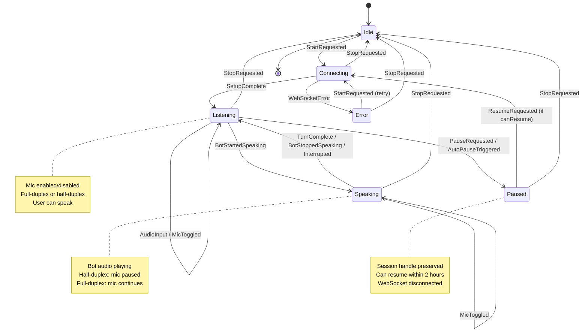
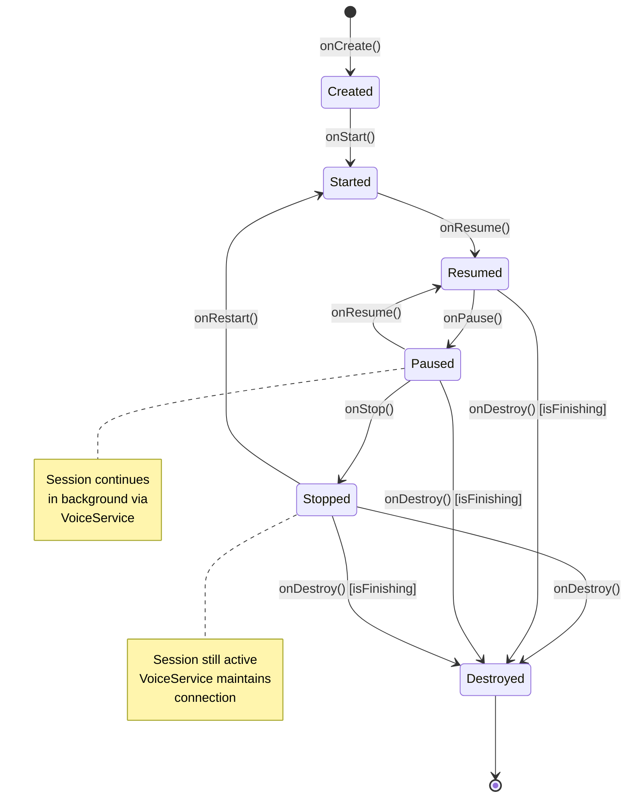
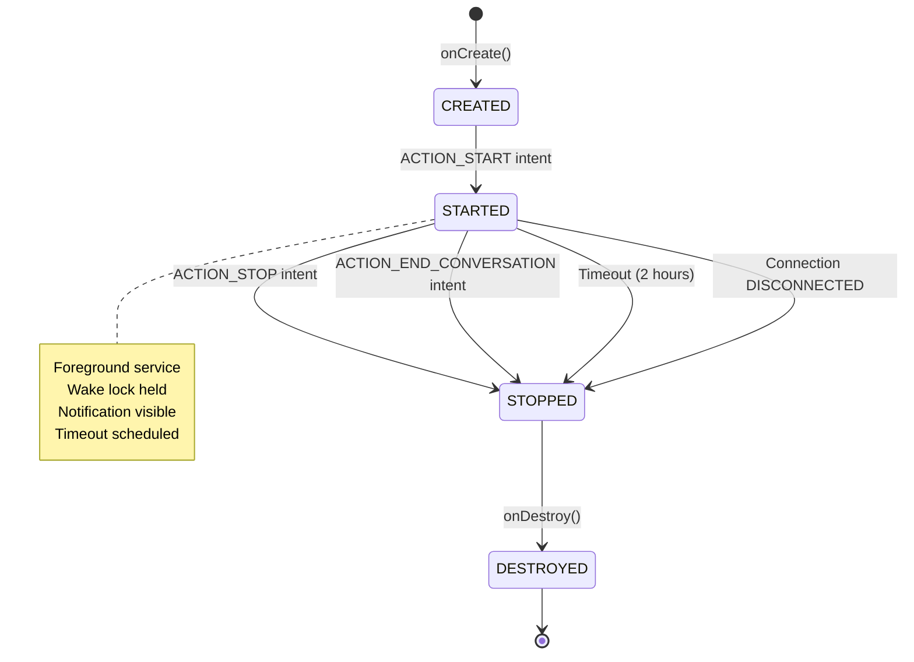
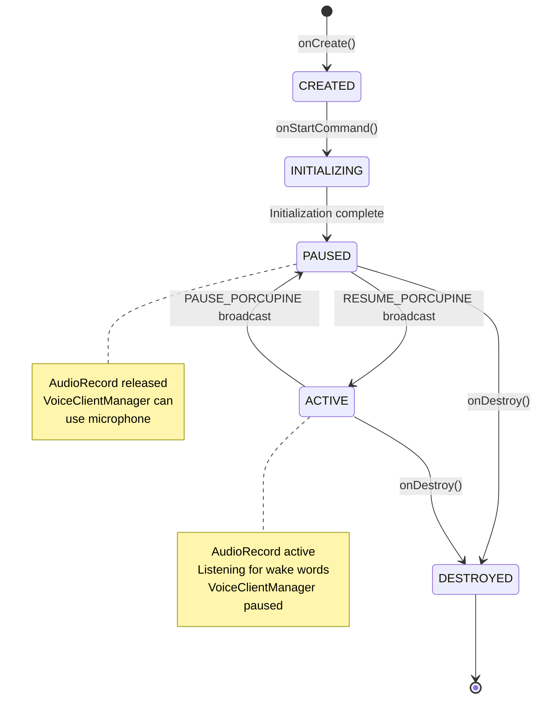
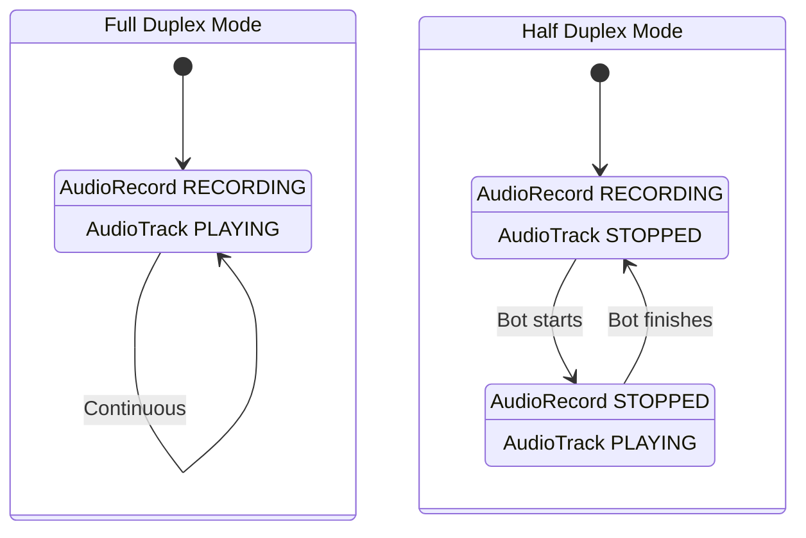
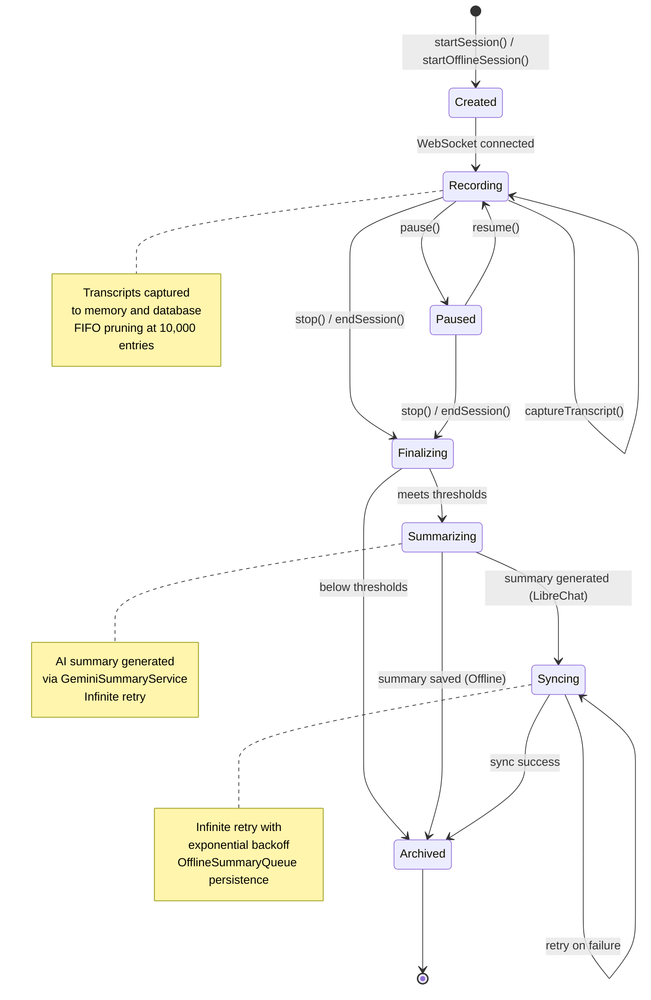
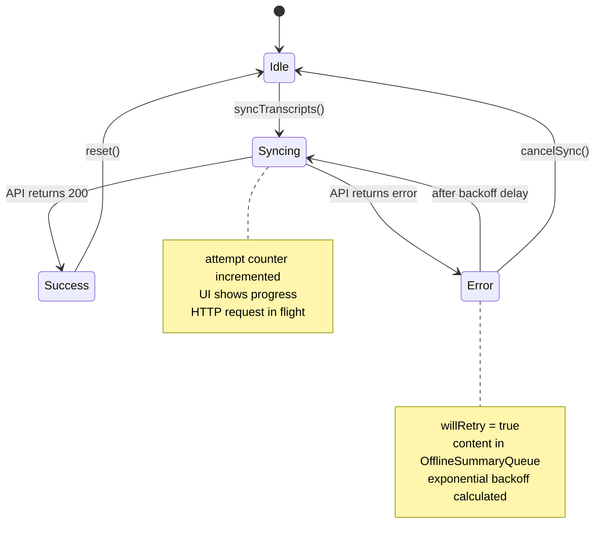

# State Machine Documentation

This document describes the state machines and lifecycle management in the voice conversation system.

## Overview

The system has been refactored to use a proper state machine architecture with VoiceSessionState sealed class. The complex boolean flag system has been replaced with mutually exclusive states that prevent race conditions and make the system more predictable. The state machine is now the central coordination mechanism for all voice session operations.

## VoiceSessionState State Machine (New Architecture)

### States

**Idle**
- **Description:** No active session, system idle
- **Characteristics:**
  - No WebSocket connection
  - Audio resources released
  - Wake lock released
  - No foreground service running
- **UI Indicators:** Connect button enabled, status shows "Disconnected"
- **Valid Transitions:** StartRequested → Connecting

**Connecting**
- **Description:** WebSocket connecting, waiting for setupComplete
- **Characteristics:**
  - WebSocket connection in progress
  - Waiting for Gemini setupComplete message
  - Audio resources not yet allocated
  - Optional ThreadSettings for session configuration
- **UI Indicators:** Loading spinner, status shows "Connecting..."
- **Valid Transitions:** 
  - SetupComplete → Listening
  - WebSocketError → Error
  - StopRequested → Idle

**Listening**
- **Description:** Connected and ready - user can speak, bot waiting
- **Characteristics:**
  - WebSocket connected and active
  - AudioEngine recording (if mic enabled)
  - Bot waiting for user input
  - Full-duplex or half-duplex mode
- **UI Indicators:** Mic button active, audio level indicators
- **Valid Transitions:**
  - AudioInput → Listening (self-transition)
  - BotStartedSpeaking → Speaking
  - MicToggled → Listening (with updated mic state)
  - PauseRequested → Paused
  - StopRequested → Idle
  - AutoPauseTriggered → Paused

**Speaking**
- **Description:** Bot is playing audio response
- **Characteristics:**
  - WebSocket active, receiving bot audio
  - AudioEngine playing bot audio
  - Mic behavior depends on duplex mode:
    - Half-duplex: Mic paused
    - Full-duplex: Mic continues
- **UI Indicators:** Bot audio indicator active, mic state varies
- **Valid Transitions:**
  - TurnComplete → Listening
  - BotStoppedSpeaking → Listening
  - Interrupted → Listening
  - MicToggled → Speaking (with updated mic state)
  - StopRequested → Idle

**Paused**
- **Description:** Session paused but can be resumed
- **Characteristics:**
  - WebSocket disconnected
  - Audio resources released
  - Session handle preserved (if resumable)
  - Foreground service may continue
- **UI Indicators:** Resume button enabled, status shows "Paused"
- **Valid Transitions:**
  - ResumeRequested → Connecting (if canResume)
  - StopRequested → Idle

**Error**
- **Description:** Critical error requiring user intervention
- **Characteristics:**
  - WebSocket disconnected
  - Audio resources released
  - Error message available
  - Recovery possible if error is recoverable
- **UI Indicators:** Error message displayed, retry button (if recoverable)
- **Valid Transitions:**
  - StartRequested → Connecting (retry)
  - StopRequested → Idle

### State Transition Diagram



### Transition Triggers and Conditions

#### DISCONNECTED → CONNECTING
**Trigger:** `VoiceClientManager.start()` called
**Conditions:**
- API key configured
- Not already connected
- Not in DISCONNECTING state
**Actions:**
- Create WebSocket connection
- Initialize scope
- Transition state
**Code Reference:** `VoiceClientManager.kt:560`

#### CONNECTING → CONNECTED
**Trigger:** `setupComplete` message received from Gemini
**Conditions:**
- WebSocket successfully opened
- Setup message acknowledged
**Actions:**
- Start AudioRecord
- Start AudioTrack
- Acquire wake lock
- Start foreground service
- Start monitoring jobs (auto-pause, bot timeout, health check)
- Reset reconnection manager
**Code Reference:** `VoiceClientManager.kt:1200`

#### CONNECTED → RECONNECTING
**Trigger:** Unexpected WebSocket closure or failure
**Conditions:**
- Not user-initiated disconnect
- Not in paused state
- Recoverable error type
**Actions:**
- Stop audio resources
- Start reconnection manager
- Update service notification
**Code Reference:** `VoiceClientManager.kt:900`

#### RECONNECTING → CONNECTED
**Trigger:** Successful reconnection after delay
**Conditions:**
- Reconnection attempt succeeded
- setupComplete received
**Actions:**
- Restore audio resources
- Resume monitoring jobs
- Reset attempt counter
**Code Reference:** `VoiceClientManager.kt:2950`

#### RECONNECTING → DISCONNECTED
**Trigger:** Max reconnection attempts reached OR user cancels
**Conditions:**
- Attempt count >= maxAttempts (5)
- OR user clicks "End Conversation" in dialog
**Actions:**
- Stop reconnection attempts
- Clean up resources
- Show user dialog (if max attempts)
**Code Reference:** `VoiceClientManager.kt:3000`

#### CONNECTED → DISCONNECTING
**Trigger:** `VoiceClientManager.stop()` called
**Conditions:**
- User clicks disconnect button
- OR session timeout
- OR critical memory pressure
**Actions:**
- Close WebSocket
- Stop audio resources
- End session (send transcript)
- Transition to DISCONNECTING
**Code Reference:** `VoiceClientManager.kt:2800`

#### DISCONNECTING → DISCONNECTED
**Trigger:** Cleanup complete
**Conditions:**
- WebSocket closed
- Audio resources released
- Session ended
**Actions:**
- Release wake lock
- Stop foreground service
- Clear session context
- Final state transition
**Code Reference:** `VoiceClientManager.kt:2850`

#### CONNECTED → DISCONNECTED (Pause)
**Trigger:** `VoiceClientManager.pause()` called
**Conditions:**
- User pauses session
- OR wake word "stop" detected
**Actions:**
- Close WebSocket (preserving session handle)
- Stop audio resources
- Set isPaused flag
- Keep session context for resume
**Code Reference:** `VoiceClientManager.kt:2850`

#### DISCONNECTED → CONNECTING (Resume)
**Trigger:** `VoiceClientManager.resume()` called
**Conditions:**
- isPaused flag is true
- Session handle valid (< 2 hours old)
**Actions:**
- Clear isPaused flag
- Reconnect with session handle
- Restore audio resources
**Code Reference:** `state/VoiceSessionStateMachine.kt:50`

---

## Event-Driven Architecture (New)

### VoiceEvent System

The new architecture uses an event-driven approach where all state changes are triggered by VoiceEvent objects:

**Event Types:**
- `StartRequested(threadSettings)` - User wants to start session
- `SetupComplete` - WebSocket setup completed
- `AudioInput(data, level)` - Audio data from microphone
- `BotStartedSpeaking` - Bot began audio response
- `BotStoppedSpeaking` - Bot finished audio response
- `TurnComplete` - Conversation turn completed
- `Interrupted` - Bot audio interrupted by user
- `MicToggled` - User toggled microphone
- `PauseRequested` - User requested pause
- `ResumeRequested` - User requested resume
- `StopRequested` - User requested stop
- `AutoPauseTriggered` - Automatic pause due to inactivity
- `WebSocketError(error)` - WebSocket connection error

### Event Processing

```kotlin
suspend fun processEvent(event: VoiceEvent) {
    eventProcessingMutex.withLock {
        val currentState = _sessionState.value
        val transition = stateMachine.processEvent(currentState, event)
        
        // Update state
        _sessionState.value = transition.newState
        
        // Execute side effects
        sideEffectExecutor?.execute(transition.sideEffects)
        
        // Update UI state
        updateUiState()
    }
}
```

### Benefits of Event-Driven Architecture

1. **Predictable State Changes:** All state changes go through the same event processing pipeline
2. **Race Condition Prevention:** Mutex ensures events are processed sequentially
3. **Testability:** Events can be easily mocked and tested
4. **Debugging:** All state changes are logged and traceable
5. **Extensibility:** New events can be added without changing existing code

**Code Reference:** `VoiceClientManager.kt:200`

---

## MainActivity Lifecycle States

### Lifecycle Events

**onCreate()**
- **Actions:**
  - Initialize VoiceClientManager
  - Initialize SessionManager
  - Register lifecycle observers
  - Set up connection state observer
**Code Reference:** `MainActivity.kt:100`

**onStart()**
- **Actions:**
  - Activity becomes visible
  - No special handling (session continues in background)
**Code Reference:** `MainActivity.kt:200`

**onResume()**
- **Actions:**
  - Activity comes to foreground
  - Update UI with current state
  - No session interruption
**Code Reference:** `MainActivity.kt:250`

**onPause()**
- **Actions:**
  - Activity goes to background
  - Session continues via VoiceService
  - No audio interruption
**Code Reference:** `MainActivity.kt:300`

**onStop()**
- **Actions:**
  - Activity no longer visible
  - Session continues in background
  - VoiceService maintains connection
**Code Reference:** `MainActivity.kt:350`

**onDestroy()**
- **Actions:**
  - Only cleanup if activity finishing
  - Check `isFinishing` flag
  - Stop VoiceClientManager if finishing
  - Unregister receivers
**Code Reference:** `MainActivity.kt:400`

**onTrimMemory(level)**
- **Actions:**
  - TRIM_MEMORY_RUNNING_LOW: Log warning
  - TRIM_MEMORY_RUNNING_CRITICAL: Log critical warning
  - TRIM_MEMORY_COMPLETE: Force stop session (emergency)
**Code Reference:** `MainActivity.kt:450`

### Lifecycle State Diagram



### Critical Lifecycle Rules

1. **Background Operation:** Session continues when activity is paused/stopped
2. **VoiceService Coordination:** Foreground service keeps session alive
3. **Memory Pressure:** Only force-stop on TRIM_MEMORY_COMPLETE
4. **Cleanup:** Only stop session if `isFinishing` is true
5. **Wake Lock:** Maintained by VoiceService, not activity

---

## VoiceService Lifecycle

### Service States

**CREATED**
- **Description:** Service instantiated but not started
- **Actions:**
  - onCreate() called
  - Notification channel created
  - Battery profiler initialized
**Code Reference:** `VoiceService.kt:50`

**STARTED (Foreground)**
- **Description:** Service running as foreground service
- **Characteristics:**
  - Persistent notification shown
  - Wake lock acquired
  - Service timeout scheduled (2 hours)
  - Battery profiling active
**Actions:**
  - startForeground() called
  - Wake lock acquired with timeout
  - Timeout job scheduled
**Code Reference:** `VoiceService.kt:80`

**STOPPED**
- **Description:** Service stopping, cleanup in progress
- **Actions:**
  - Release wake lock
  - Stop battery profiling
  - Remove notification
  - stopSelf() called
**Code Reference:** `VoiceService.kt:200`

**DESTROYED**
- **Description:** Service destroyed by system
- **Actions:**
  - Final cleanup
  - Cancel timeout job
  - Clear instance reference
**Code Reference:** `VoiceService.kt:250`

### Service Lifecycle Diagram



### Service Control Flow

**Start Sequence:**
1. MainActivity observes ConnectionState.CONNECTED
2. MainActivity calls `startVoiceService()`
3. Intent with ACTION_START sent
4. VoiceService.onStartCommand() receives intent
5. startForegroundService() called
6. Wake lock acquired
7. Timeout job scheduled

**Stop Sequence:**
1. MainActivity observes ConnectionState.DISCONNECTED
2. MainActivity calls `stopVoiceService()`
3. Intent with ACTION_STOP sent
4. VoiceService.onStartCommand() receives intent
5. stopService() called
6. Wake lock released
7. Notification removed
8. stopSelf() called

**Code References:**
- Start: `MainActivity.kt:600`, `VoiceService.kt:80`
- Stop: `MainActivity.kt:650`, `VoiceService.kt:200`

---

## PorcupineService Lifecycle

### Service States

**CREATED**
- **Description:** Service instantiated
- **Actions:**
  - onCreate() called
  - Notification channel created
  - Control receiver registered
**Code Reference:** `PorcupineService.kt:50`

**INITIALIZING**
- **Description:** Loading wake words and creating PorcupineManager
- **Actions:**
  - Load system wake words
  - Load custom wake words
  - Create PorcupineManager
  - Start in PAUSED state
**Code Reference:** `PorcupineService.kt:100`

**PAUSED**
- **Description:** Service running but wake word detection inactive
- **Characteristics:**
  - PorcupineManager stopped and deleted
  - AudioRecord released
  - Waiting for RESUME broadcast
**Actions:**
  - porcupineManager.stop()
  - porcupineManager.delete()
  - Set isPorcupinePaused flag
**Code Reference:** `PorcupineService.kt:150`

**ACTIVE**
- **Description:** Wake word detection active
- **Characteristics:**
  - PorcupineManager running
  - AudioRecord capturing audio
  - Listening for wake words
**Actions:**
  - Create new PorcupineManager
  - Start listening
  - Clear isPorcupinePaused flag
**Code Reference:** `PorcupineService.kt:200`

**DESTROYED**
- **Description:** Service destroyed
- **Actions:**
  - Stop PorcupineManager
  - Unregister control receiver
  - Clear resources
**Code Reference:** `PorcupineService.kt:300`

### Porcupine State Diagram



### Coordination with VoiceClientManager

**Microphone Arbitration:**
- Only one component can use AudioRecord at a time
- VoiceClientManager has priority during active conversation
- PorcupineService pauses when user is talking
- PorcupineService resumes when bot is talking or session paused

**State Coordination:**
```
VoiceClientManager State    →    PorcupineService State
DISCONNECTED (paused)        →    ACTIVE (listening)
CONNECTED (user talking)     →    PAUSED (mic released)
CONNECTED (bot talking)      →    ACTIVE (listening)
```

**Broadcast Flow:**
1. VoiceClientManager detects state change
2. Calls `updatePicovoiceState()`
3. Sends PAUSE_PORCUPINE or RESUME_PORCUPINE broadcast
4. PorcupineService receives broadcast
5. Transitions between PAUSED/ACTIVE states

**Code References:**
- Coordination: `VoiceClientManager.kt:450`
- Pause: `PorcupineService.kt:150`
- Resume: `PorcupineService.kt:200`

---

## Audio Pipeline States

### AudioRecord States

**NULL**
- No AudioRecord instance
- Microphone not in use

**INITIALIZED**
- AudioRecord created
- Not yet recording

**RECORDING**
- Actively capturing audio
- Sending to WebSocket

**STOPPED**
- Recording stopped
- Resources still allocated

**RELEASED**
- Resources deallocated
- Back to NULL state

### AudioTrack States

**NULL**
- No AudioTrack instance
- Speaker not in use

**INITIALIZED**
- AudioTrack created
- Not yet playing

**PLAYING**
- Actively playing audio
- Processing audio queue

**STOPPED**
- Playback stopped
- Resources still allocated

**RELEASED**
- Resources deallocated
- Back to NULL state

### Audio State Coordination



**Mode Selection:**
- Full Duplex: User can interrupt bot (both active)
- Half Duplex: Turn-based (one active at a time)
- Configured via `Preferences.fullDuplexMode`

**Code References:**
- Full Duplex: `VoiceClientManager.kt:1500`
- Half Duplex: `VoiceClientManager.kt:1550`

---

## State Persistence

### Session Resumption

**Handle Lifecycle:**
- Generated by Gemini on session start
- Valid for 2 hours
- Stored in `sessionResumptionHandle`
- Used to resume paused sessions

**Resumption Flow:**
1. User pauses session
2. Handle preserved in memory
3. User resumes within 2 hours
4. Handle sent in setup message
5. Session continues from previous state

**Code Reference:** `VoiceClientManager.kt:800`

### Database Persistence

**Session Entities:**
- Session ID, conversation ID, timestamps
- Full transcript text
- Summary (if generated)
- Duration in seconds

**Persistence Points:**
- Session start: Create database entry
- Transcript capture: Append to database
- Session end: Mark complete, add summary

**Code References:**
- Create: `SessionManager.kt:150`
- Append: `SessionManager.kt:250`
- End: `SessionManager.kt:400`

---

## Error State Handling

### Recoverable Errors
**Trigger:** Network timeout, DNS failure, connection refused
**Action:** Transition to RECONNECTING state
**Recovery:** Exponential backoff reconnection

### Fatal Errors
**Trigger:** SSL error, protocol error, authentication failure
**Action:** Transition to DISCONNECTED state
**Recovery:** User must manually reconnect

### Unknown Errors
**Trigger:** Unclassified exceptions
**Action:** Treat as recoverable, log for analysis
**Recovery:** Attempt reconnection

**Code Reference:** `WebSocketErrorClassifier.kt:20`

---

## Session State Machine

### Overview

The Session State Machine tracks the lifecycle of a conversation session from creation through archiving. This state machine applies to both LibreChat and offline sessions, managing the flow from initial recording through summary generation and final storage.

### States

**Created**
- **Description:** Session initialized but not yet recording
- **Characteristics:**
  - Session ID assigned
  - Conversation ID linked
  - Start time recorded
  - Database entry created
- **Entry Actions:**
  - `sessionRepository.createSession()` called
  - Session context initialized
- **Code Reference:** `SessionManager.kt:150`

**Recording**
- **Description:** Active conversation, capturing transcripts
- **Characteristics:**
  - WebSocket connected
  - Transcripts being captured
  - Audio streaming active
  - Transcript limit enforced (10,000 entries max)
- **Entry Actions:**
  - Start transcript capture
  - Begin FIFO pruning if limit exceeded
- **Code Reference:** `SessionManager.kt:250`

**Paused**
- **Description:** Session temporarily suspended
- **Characteristics:**
  - WebSocket disconnected
  - Session handle preserved
  - Transcript capture stopped
  - Can be resumed within 2 hours
- **Entry Actions:**
  - Store session resumption handle
  - Stop audio capture
  - Maintain session context
- **Code Reference:** `VoiceClientManager.kt:2850`

**Finalizing**
- **Description:** Session ended, checking thresholds
- **Characteristics:**
  - WebSocket closed
  - Duration calculated
  - Transcript count verified
  - Threshold checks performed
- **Entry Actions:**
  - `sessionRepository.endSession()` called
  - Calculate duration and content length
  - Check minimum thresholds
- **Thresholds:**
  - Minimum duration: 30 seconds
  - Minimum entries: 2 (one exchange)
  - Minimum length: 50 characters
- **Code Reference:** `SessionManager.kt:400`

**Summarizing**
- **Description:** Generating AI summary of session
- **Characteristics:**
  - Summary prompt selected (priority: offline > Room > global)
  - Gemini API called
  - Infinite retry with exponential backoff
  - Summary saved to database
- **Entry Actions:**
  - `geminiSummaryService.generateSummaryWithRetry()` called
  - Summary stored in SessionEntity
  - Clipboard event emitted if enabled
- **Code Reference:** `SessionManager.kt:450`, `GeminiSummaryService.kt:50`

**Syncing**
- **Description:** Sending transcript/summary to LibreChat (LibreChat sessions only)
- **Characteristics:**
  - TranscriptSyncManager active
  - OfflineSummaryQueue persistence
  - Infinite retry mechanism
  - Exponential backoff (1s, 2s, 4s, 8s, 16s, 30s max)
- **Entry Actions:**
  - `transcriptSyncManager.syncTranscripts()` called
  - Content enqueued in OfflineSummaryQueue
  - Retry loop started
- **Code Reference:** `SessionManager.kt:870`

**Archived**
- **Description:** Session complete and stored
- **Characteristics:**
  - Database entry finalized
  - Summary saved (if generated)
  - Session context cleared
  - Ready for context building in future sessions
- **Entry Actions:**
  - Clear session context
  - Reset state flags
  - Session available for retrieval
- **Code Reference:** `SessionManager.kt:550`

### State Transition Diagram



### Transition Triggers and Conditions

#### Created → Recording
**Trigger:** WebSocket connection established
**Conditions:**
- Session created in database
- WebSocket setupComplete received
**Actions:**
- Begin transcript capture
- Start monitoring transcript limit
**Code Reference:** `SessionManager.kt:150`

#### Recording → Paused
**Trigger:** `VoiceClientManager.pause()` called
**Conditions:**
- User manually pauses
- OR wake word "stop" detected
**Actions:**
- Store session resumption handle
- Stop transcript capture
- Preserve session context
**Code Reference:** `VoiceClientManager.kt:2850`

#### Paused → Recording
**Trigger:** `VoiceClientManager.resume()` called
**Conditions:**
- Session handle valid (< 2 hours old)
- User resumes session
**Actions:**
- Reconnect with session handle
- Resume transcript capture
**Code Reference:** `VoiceClientManager.kt:2900`

#### Recording → Finalizing
**Trigger:** `SessionManager.endSession()` called
**Conditions:**
- User ends conversation
- OR session timeout
- OR critical memory pressure
**Actions:**
- Close WebSocket
- Calculate session duration
- End database session
**Code Reference:** `SessionManager.kt:400`

#### Finalizing → Summarizing
**Trigger:** Threshold checks pass
**Conditions:**
- Duration >= 30 seconds
- Entries >= 2
- Length >= 50 characters
**Actions:**
- Select summary prompt (priority chain)
- Call GeminiSummaryService
**Code Reference:** `SessionManager.kt:450`

#### Finalizing → Archived
**Trigger:** Threshold checks fail
**Conditions:**
- Session too short
- OR insufficient content
**Actions:**
- Skip summary generation
- Clear session context
- Mark as archived
**Code Reference:** `SessionManager.kt:480`

#### Summarizing → Syncing
**Trigger:** Summary generated successfully (LibreChat sessions)
**Conditions:**
- Summary text received from Gemini
- Active LibreChat session
**Actions:**
- Enqueue in OfflineSummaryQueue
- Start TranscriptSyncManager
**Code Reference:** `SessionManager.kt:870`

#### Summarizing → Archived
**Trigger:** Summary generated successfully (Offline sessions)
**Conditions:**
- Summary text received from Gemini
- Offline session (no LibreChat)
**Actions:**
- Save summary to database
- Emit clipboard event if enabled
- Clear session context
**Code Reference:** `SessionManager.kt:500`

#### Syncing → Archived
**Trigger:** Sync successful
**Conditions:**
- LibreChat API returns 200 OK
- Content delivered successfully
**Actions:**
- Dequeue from OfflineSummaryQueue
- Update sync status to Success
- Clear session context
**Code Reference:** `SessionManager.kt:950`

#### Syncing → Syncing
**Trigger:** Sync failure
**Conditions:**
- Network error
- OR API error (non-fatal)
**Actions:**
- Calculate exponential backoff
- Delay and retry
- Increment attempt counter
**Code Reference:** `SessionManager.kt:920`

---

## SyncStatus State Machine

### Overview

The SyncStatus State Machine manages the reliable delivery of transcripts and summaries to LibreChat with infinite retry and exponential backoff. This state machine is used by the TranscriptSyncManager to ensure no data is lost even during network failures or app restarts.

### States

**Idle**
- **Description:** No sync operation in progress
- **Characteristics:**
  - No active sync job
  - OfflineSummaryQueue may contain pending items
  - Ready to start new sync
- **Code Reference:** `SessionManager.kt:870`

**Syncing**
- **Description:** Actively attempting to sync content
- **Characteristics:**
  - HTTP request in flight to LibreChat API
  - Attempt counter tracked
  - UI shows progress indicator
  - Exponential backoff between retries
- **Data:**
  - `attempt: Int` - Current attempt number (1, 2, 3, ...)
- **Code Reference:** `SessionManager.kt:900`

**Success**
- **Description:** Sync completed successfully
- **Characteristics:**
  - Content delivered to LibreChat
  - Item removed from OfflineSummaryQueue
  - Ready to process next item or return to Idle
- **Code Reference:** `SessionManager.kt:950`

**Error**
- **Description:** Sync attempt failed, will retry
- **Characteristics:**
  - Error message captured
  - Content remains in OfflineSummaryQueue
  - Backoff delay calculated
  - Will automatically retry
- **Data:**
  - `message: String` - Error description
  - `willRetry: Boolean` - Always true (infinite retry)
- **Code Reference:** `SessionManager.kt:920`

### State Transition Diagram



### Transition Triggers and Conditions

#### Idle → Syncing
**Trigger:** `syncTranscripts()` called
**Conditions:**
- Content available to sync
- Not already syncing
**Actions:**
- Enqueue content in OfflineSummaryQueue
- Set attempt counter to 1
- Start HTTP request
- Update UI state
**Code Reference:** `SessionManager.kt:900`

#### Syncing → Success
**Trigger:** LibreChat API returns 200 OK
**Conditions:**
- HTTP request successful
- Content accepted by server
**Actions:**
- Dequeue from OfflineSummaryQueue
- Update sync status to Success
- Log success
**Code Reference:** `SessionManager.kt:950`

#### Syncing → Error
**Trigger:** LibreChat API returns error
**Conditions:**
- Network timeout
- OR HTTP error (4xx, 5xx)
- OR connection failure
**Actions:**
- Capture error message
- Keep content in OfflineSummaryQueue
- Calculate backoff delay
- Update sync status to Error
**Code Reference:** `SessionManager.kt:920`

#### Error → Syncing
**Trigger:** Backoff delay expires
**Conditions:**
- Automatic retry (infinite)
- Content still in queue
**Actions:**
- Increment attempt counter
- Calculate new backoff delay
- Start new HTTP request
**Backoff Formula:**
```kotlin
delay = min(BASE_DELAY * 2^(attempt-1), MAX_DELAY)
// BASE_DELAY = 1000ms, MAX_DELAY = 30000ms
// Results: 1s, 2s, 4s, 8s, 16s, 30s, 30s, 30s...
```
**Code Reference:** `SessionManager.kt:930`

#### Error → Idle
**Trigger:** `cancelSync()` called
**Conditions:**
- User cancels sync
- OR app shutdown
**Actions:**
- Cancel retry job
- Keep content in OfflineSummaryQueue (for next app start)
- Reset sync status
**Code Reference:** `SessionManager.kt:980`

#### Success → Idle
**Trigger:** Sync complete, no more items
**Conditions:**
- OfflineSummaryQueue empty
- OR processing complete
**Actions:**
- Reset sync status
- Ready for next sync operation
**Code Reference:** `SessionManager.kt:960`

### Exponential Backoff Algorithm

**Configuration:**
- `BASE_DELAY = 1000ms` (1 second)
- `BACKOFF_FACTOR = 2.0` (double each time)
- `MAX_DELAY = 30000ms` (30 seconds)

**Backoff Sequence:**
| Attempt | Delay (seconds) | Calculation |
|---------|----------------|-------------|
| 1       | 1              | 1 * 2^0 = 1 |
| 2       | 2              | 1 * 2^1 = 2 |
| 3       | 4              | 1 * 2^2 = 4 |
| 4       | 8              | 1 * 2^3 = 8 |
| 5       | 16             | 1 * 2^4 = 16 |
| 6       | 30             | min(32, 30) = 30 |
| 7+      | 30             | capped at MAX_DELAY |

**Code Reference:** `SessionManager.kt:930`

### OfflineSummaryQueue Persistence

**Storage:**
- Persisted to SharedPreferences as JSON
- Survives app process kill/restart
- Processed on app start via `processOfflineQueue()`

**Queue Operations:**
- `enqueue()` - Add item and persist
- `dequeue()` - Remove item and persist
- `peek()` - View next item without removing
- `isEmpty()` - Check if queue has items

**Persistence Format:**
```json
{
  "queue": [
    {
      "conversationId": "thread_abc123",
      "content": "User: Hello\nBot: Hi there!",
      "timestamp": 1234567890,
      "isSummary": true
    }
  ]
}
```

**Code Reference:** `OfflineSummaryQueue.kt:1-100`

### Sync Status Observability

**StateFlow Exposure:**
```kotlin
val syncStatus: StateFlow<SyncStatus>
```

**UI Integration:**
- Observe `syncStatus` in Compose UI
- Show progress indicator during Syncing
- Display error message during Error
- Show success confirmation on Success

**Example Usage:**
```kotlin
val syncStatus by sessionManager.syncStatus.collectAsState()

when (syncStatus) {
    is SyncStatus.Idle -> { /* No indicator */ }
    is SyncStatus.Syncing -> { 
        Text("Syncing... (attempt ${syncStatus.attempt})")
    }
    is SyncStatus.Success -> { 
        Text("✓ Synced successfully")
    }
    is SyncStatus.Error -> { 
        Text("⚠ ${syncStatus.message} (retrying...)")
    }
}
```

**Code Reference:** `SessionManager.kt:90`

---

**Last Updated:** 2025-12-04
