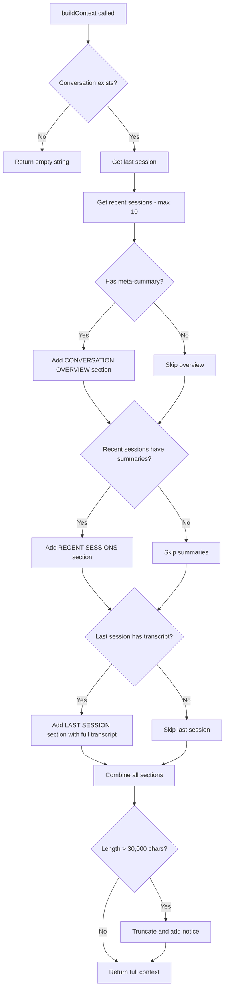

# ContextBuilder Component

## Overview

The `ContextBuilder` component is responsible for building conversation context from historical session data stored in the Room database. It uses a hybrid approach that combines the last full transcript with summaries of previous sessions to provide Gemini Live with relevant conversation history while staying within token limits.

**Role:** Build context for new sessions by retrieving and formatting conversation history from the database.

**Key Responsibilities:**
- Query database for conversation and session data
- Format context using three-section hybrid approach
- Enforce character limits and truncation
- Manage session retention (cleanup old sessions)
- Provide context statistics for debugging

**Code Reference:** `gemini-multimodal-websocket-demo/src/main/java/ai/pipecat/gemini_multimodal_websocket_demo/data/ContextBuilder.kt`

---

## Hybrid Context Strategy

ContextBuilder uses a three-section hybrid approach to balance detail and brevity:

### Section 1: Conversation Overview (Optional)
- **Content:** Meta-summary of the entire conversation thread
- **Source:** `ConversationEntity.metaSummary` field
- **When Included:** Only if meta-summary exists
- **Purpose:** Provides high-level context about the overall conversation theme

### Section 2: Recent Sessions (Summaries Only)
- **Content:** Summaries of up to 10 recent sessions (excluding the last session)
- **Source:** `SessionEntity.summary` field from recent sessions
- **Format:** Each summary includes date, duration, and summary text
- **Purpose:** Provides condensed history of recent interactions

### Section 3: Last Session (Full Transcript)
- **Content:** Complete transcript of the most recent session
- **Source:** `SessionEntity.transcript` field from last session
- **Purpose:** Provides detailed context from the most recent conversation
- **Rationale:** Users are most likely to reference details from their last interaction

### Rationale for Hybrid Approach

The hybrid approach balances competing needs:

1. **Detail vs. Brevity:** Full transcripts provide rich detail but consume many tokens. Summaries are concise but lose nuance.

2. **Recency Bias:** Recent conversations are more relevant. The last session gets full detail, older sessions get summaries.

3. **Token Efficiency:** By limiting to 10 summaries + 1 full transcript, we stay within the 30,000 character limit while providing meaningful context.

4. **User Expectations:** Users expect the AI to remember details from their last conversation, but only general themes from older ones.

### Context Building Flow Diagram



---

## Database Queries

ContextBuilder uses three main queries through `ConversationRepository`:

### `getConversation(conversationId: String): ConversationEntity?`

**Purpose:** Retrieve conversation metadata including meta-summary

**Query Pattern:**
```kotlin
conversationDao.getById(conversationId)
```

**Returns:** ConversationEntity with fields:
- `id`: Conversation identifier
- `title`: Conversation title
- `metaSummary`: High-level summary of entire conversation
- `createdAt`: Creation timestamp
- `lastSessionAt`: Last session timestamp

**Performance:** Single row lookup by primary key (fast)

**Usage in ContextBuilder:** Retrieves meta-summary for Section 1

---

### `getLastSession(conversationId: String): SessionEntity?`

**Purpose:** Retrieve the most recent session with full transcript

**Query Pattern:**
```kotlin
sessionDao.getLastSession(conversationId)
// SELECT * FROM sessions 
// WHERE conversationId = ? 
// ORDER BY startedAt DESC 
// LIMIT 1
```

**Returns:** SessionEntity with fields:
- `id`: Session identifier
- `conversationId`: Parent conversation ID
- `transcript`: Full transcript text
- `summary`: AI-generated summary (may be null)
- `startedAt`: Session start timestamp
- `durationSeconds`: Session duration

**Performance:** Indexed query on conversationId + sort (fast)

**Usage in ContextBuilder:** Retrieves full transcript for Section 3

---

### `getRecentSessions(conversationId: String, limit: Int): List<SessionEntity>`

**Purpose:** Retrieve recent sessions for summary inclusion

**Query Pattern:**
```kotlin
sessionDao.getRecentSessions(conversationId, limit)
// SELECT * FROM sessions 
// WHERE conversationId = ? 
// ORDER BY startedAt DESC 
// LIMIT ?
```

**Parameters:**
- `conversationId`: Target conversation
- `limit`: Maximum number of sessions (typically 11: 10 summaries + 1 last session)

**Returns:** List of SessionEntity objects ordered by recency

**Performance:** Indexed query with limit (fast, even with many sessions)

**Usage in ContextBuilder:** 
- Retrieves 11 sessions (MAX_RECENT_SESSIONS + 1)
- Filters out the last session (to avoid duplication)
- Extracts summaries for Section 2

**Performance Considerations:**
- All queries use indexed columns (conversationId, startedAt)
- LIMIT clauses prevent loading excessive data
- Queries run on Dispatchers.IO to avoid blocking main thread

---

## Context Formatting

### Section 1: CONVERSATION OVERVIEW

**Format:**
```
=== CONVERSATION OVERVIEW ===
[Meta-summary text from ConversationEntity.metaSummary]
```

**Example:**
```
=== CONVERSATION OVERVIEW ===
This is an ongoing conversation about Android development, focusing on 
implementing voice interaction features and debugging WebSocket connections.
```

**When Included:** Only if `conversation.metaSummary` is not null

---

### Section 2: RECENT SESSIONS

**Format:**
```
=== RECENT SESSIONS ===

Session [date] ([duration]):
[Summary text]

Session [date] ([duration]):
[Summary text]

...
```

**Example:**
```
=== RECENT SESSIONS ===

Session Dec 03, 14:30 (5 min):
User asked about implementing wake word detection. Discussed Picovoice 
integration and provided code examples for PorcupineService.

Session Dec 03, 15:45 (3 min):
Debugged WebSocket connection issues. Identified missing API key and 
corrected configuration.

Session Dec 04, 09:15 (7 min):
Implemented session resumption feature with exponential backoff retry logic.
```

**When Included:** Only if recent sessions have non-null summaries

**Filtering:** 
- Excludes last session (to avoid duplication with Section 3)
- Only includes sessions where `summary != null`

**Date Format:** "MMM dd, HH:mm" (e.g., "Dec 04, 14:30")

**Duration Format:** Minutes (e.g., "5 min")

---

### Section 3: LAST SESSION (Full Transcript)

**Format:**
```
=== LAST SESSION (Full Transcript) ===
Date: [date]
Duration: [duration]

[Full transcript text]

Note: This is the most recent conversation. User may refer to details from this session.
```

**Example:**
```
=== LAST SESSION (Full Transcript) ===
Date: Dec 04, 14:30
Duration: 8 min

User: Can you help me understand how ContextBuilder works?
Bot: Of course! ContextBuilder is responsible for building conversation 
context from historical session data...
User: How does it handle long conversations?
Bot: It uses a hybrid approach with three sections...

Note: This is the most recent conversation. User may refer to details from this session.
```

**When Included:** Only if last session has non-blank transcript

**Note Purpose:** Reminds Gemini that this is the most recent interaction, so user references are likely about this session

---

### Complete Context Example

```
=== CONVERSATION OVERVIEW ===
Ongoing discussion about Android voice app development and debugging.

=== RECENT SESSIONS ===

Session Dec 03, 14:30 (5 min):
Implemented wake word detection using Picovoice Porcupine.

Session Dec 03, 15:45 (3 min):
Fixed WebSocket connection issues and API key configuration.

=== LAST SESSION (Full Transcript) ===
Date: Dec 04, 09:15
Duration: 8 min

User: How does the context building work?
Bot: ContextBuilder uses a hybrid approach...
User: What's the character limit?
Bot: The limit is 30,000 characters...

Note: This is the most recent conversation. User may refer to details from this session.
```

---

## Length Limits and Truncation

### Configuration Constants

```kotlin
const val MAX_RECENT_SESSIONS = 10      // Max summaries to include
const val MAX_CONTEXT_LENGTH = 30000    // Character limit
const val MAX_SESSIONS_TO_KEEP = 50     // Retention limit
```

**Code Reference:** `ContextBuilder.kt:16-18`

---

### MAX_CONTEXT_LENGTH: 30,000 Characters

**Purpose:** Prevent exceeding Gemini's token limits

**Enforcement:** After building all sections, total length is checked:

```kotlin
val trimmedContext = if (fullContext.length > MAX_CONTEXT_LENGTH) {
    Log.w(TAG, "Context too long (${fullContext.length} chars), trimming to $MAX_CONTEXT_LENGTH")
    fullContext.take(MAX_CONTEXT_LENGTH) + "\n\n[Context truncated due to length]"
} else {
    fullContext
}
```

**Truncation Strategy:**
1. Build all three sections normally
2. Combine sections into full context string
3. If length > 30,000 characters:
   - Take first 30,000 characters
   - Append truncation notice: `[Context truncated due to length]`
4. Log warning with original and truncated lengths

**Implications:**
- Truncation is rare (summaries are concise)
- When it occurs, Section 3 (last transcript) may be cut off
- Truncation notice alerts Gemini that context is incomplete

**Code Reference:** `ContextBuilder.kt:95-100`

---

### MAX_RECENT_SESSIONS: 10 Sessions

**Purpose:** Limit number of session summaries included

**Enforcement:** Query retrieves `MAX_RECENT_SESSIONS + 1` sessions, then filters:

```kotlin
val recentSessions = conversationRepository.getRecentSessions(
    conversationId, 
    MAX_RECENT_SESSIONS + 1 // +1 because we'll exclude last session
).filter { it.id != lastSession?.id } // Exclude last session
```

**Rationale:**
- 10 summaries provide sufficient historical context
- More summaries increase token usage without proportional benefit
- Older sessions are less relevant to current conversation

**Actual Count:** May be less than 10 if:
- Conversation has fewer than 10 sessions
- Some sessions don't have summaries (summary generation failed or was skipped)

**Code Reference:** `ContextBuilder.kt:44-47`

---

### Truncation Edge Cases

**Case 1: Very Long Last Transcript**
- If last transcript alone exceeds 30,000 characters
- Result: Transcript is truncated, summaries may be lost
- Mitigation: Session transcripts are limited to 10,000 entries during recording

**Case 2: Many Long Summaries**
- If 10 summaries + meta-summary exceed 30,000 characters
- Result: Last transcript section is truncated or omitted
- Mitigation: Summaries are typically concise (200-500 characters)

**Case 3: No Truncation Needed**
- Most common case
- Typical context length: 5,000-15,000 characters
- All sections included in full

---

## Session Retention Policy

### Cleanup Mechanism: `cleanupOldSessions()`

**Purpose:** Prevent database bloat by deleting old sessions

**Retention Limit:** 50 sessions per conversation (MAX_SESSIONS_TO_KEEP)

**Trigger:** Called in background when session starts

**Algorithm:**
1. Retrieve all sessions for conversation
2. If count ≤ 50, skip cleanup
3. Sort sessions by `startedAt` (descending, newest first)
4. Keep newest 50 sessions
5. Delete remaining sessions

**Code:**
```kotlin
suspend fun cleanupOldSessions(conversationId: String): Int {
    val allSessions = conversationRepository.getConversationSessions(conversationId)
    
    if (allSessions.size <= MAX_SESSIONS_TO_KEEP) {
        return 0
    }
    
    val sessionsToDelete = allSessions
        .sortedByDescending { it.startedAt }
        .drop(MAX_SESSIONS_TO_KEEP)
    
    sessionsToDelete.forEach { session ->
        sessionRepository.deleteSession(session)
    }
    
    return sessionsToDelete.size
}
```

**Code Reference:** `ContextBuilder.kt:130-155`

---

### Relationship with Other Cleanup Mechanisms

**ContextBuilder Cleanup (Active):**
- Runs on every session start (background)
- Keeps last 50 sessions per conversation
- This is the PRIMARY retention mechanism

**SessionManager 30-Day Cleanup (Inactive):**
- **TO CLARIFY:** Code references suggest a 30-day cleanup in SessionManager
- **Current Status:** Not found in current SessionManager implementation
- **Precedence:** If both exist, ContextBuilder's 50-session limit takes precedence (more restrictive)

**Cascade Deletion:**
- When conversation is deleted, all sessions are deleted (foreign key cascade)
- See: `docs/operations/database-schema.md` for cascade rules

**Manual Deletion:**
- Users can delete conversations from UI
- Triggers cascade deletion of all sessions

---

### Retention Policy Rationale

**Why 50 Sessions?**
1. **Sufficient History:** 50 sessions provide months of conversation history for typical users
2. **Database Size:** Prevents unbounded growth (each session can be several KB)
3. **Query Performance:** Smaller tables improve query speed
4. **Context Relevance:** Sessions older than 50 are rarely relevant

**Why Not Time-Based?**
- Session-based limit is more predictable
- Users with infrequent usage don't lose data prematurely
- Users with frequent usage don't accumulate excessive data

**Storage Impact:**
- Average session: 2-5 KB (transcript + metadata)
- 50 sessions: 100-250 KB per conversation
- 100 conversations: 10-25 MB total (acceptable)

---

## ContextStats Data Structure

### Definition

```kotlin
data class ContextStats(
    val conversationExists: Boolean,
    val totalSessions: Int,
    val sessionsWithSummaries: Int,
    val lastSessionHasTranscript: Boolean,
    val lastSessionLength: Int,
    val hasMetaSummary: Boolean
)
```

**Code Reference:** `ContextBuilder.kt:158-165`

---

### Field Descriptions

#### `conversationExists: Boolean`
**Purpose:** Indicates if conversation was found in database

**Values:**
- `true`: Conversation exists
- `false`: Conversation not found (returns empty context)

**Usage:** Debugging why context is empty

---

#### `totalSessions: Int`
**Purpose:** Total number of sessions for this conversation

**Range:** 0 to unlimited (limited by retention policy)

**Usage:** 
- Understand conversation history depth
- Determine if cleanup is needed
- Debug context building issues

---

#### `sessionsWithSummaries: Int`
**Purpose:** Count of sessions that have AI-generated summaries

**Range:** 0 to `totalSessions`

**Usage:**
- Understand summary coverage
- Debug why Section 2 is empty
- Identify summary generation failures

**Note:** Sessions without summaries are excluded from Section 2

---

#### `lastSessionHasTranscript: Boolean`
**Purpose:** Indicates if last session has a non-blank transcript

**Values:**
- `true`: Last session has transcript (Section 3 will be included)
- `false`: Last session has no transcript (Section 3 will be empty)

**Usage:** Debug why Section 3 is missing

---

#### `lastSessionLength: Int`
**Purpose:** Character count of last session's transcript

**Range:** 0 to unlimited

**Usage:**
- Understand context size contribution
- Debug truncation issues
- Identify unusually long transcripts

**Note:** Does not include formatting (date, duration, note)

---

#### `hasMetaSummary: Boolean`
**Purpose:** Indicates if conversation has a meta-summary

**Values:**
- `true`: Meta-summary exists (Section 1 will be included)
- `false`: No meta-summary (Section 1 will be empty)

**Usage:** Debug why Section 1 is missing

**Note:** Meta-summaries are generated every 10 sessions

---

### Usage Example

```kotlin
val stats = contextBuilder.getContextStats(conversationId)

Log.d(TAG, """
    Context Stats:
    - Conversation exists: ${stats.conversationExists}
    - Total sessions: ${stats.totalSessions}
    - Sessions with summaries: ${stats.sessionsWithSummaries}
    - Last session has transcript: ${stats.lastSessionHasTranscript}
    - Last session length: ${stats.lastSessionLength} chars
    - Has meta-summary: ${stats.hasMetaSummary}
""".trimIndent())

// Example output:
// Context Stats:
// - Conversation exists: true
// - Total sessions: 23
// - Sessions with summaries: 18
// - Last session has transcript: true
// - Last session length: 4521 chars
// - Has meta-summary: true
```

---

### Debugging Scenarios

**Scenario 1: Empty Context**
```kotlin
stats.conversationExists = false
// → Conversation not found, check conversationId
```

**Scenario 2: Missing Section 2**
```kotlin
stats.totalSessions = 5
stats.sessionsWithSummaries = 0
// → No summaries generated, check GeminiSummaryService
```

**Scenario 3: Missing Section 3**
```kotlin
stats.lastSessionHasTranscript = false
// → Last session has no transcript, check session recording
```

**Scenario 4: Truncation Risk**
```kotlin
stats.lastSessionLength = 28000
// → Last transcript is very long, may cause truncation
```

---

## Threading Model

All ContextBuilder methods are `suspend` functions that run on `Dispatchers.IO`:

```kotlin
suspend fun buildContext(conversationId: String): String
suspend fun getContextStats(conversationId: String): ContextStats
suspend fun cleanupOldSessions(conversationId: String): Int
```

**Caller Responsibility:** Launch in appropriate coroutine scope

**Example:**
```kotlin
viewModelScope.launch {
    val context = contextBuilder.buildContext(conversationId)
    // Use context...
}
```

---

## Error Handling

ContextBuilder uses defensive error handling:

```kotlin
try {
    // Build context...
} catch (e: Exception) {
    Log.e(TAG, "Error building context", e)
    return ""
}
```

**Strategy:** Return empty string on error (fail gracefully)

**Rationale:** 
- Session can proceed without context
- Better than crashing the app
- Error is logged for debugging

**Common Errors:**
- Database query failures
- Null pointer exceptions (defensive null checks)
- Formatting errors

---

## Related Documentation

- [Session Pipelines](../domain/session-pipelines.md) - How context is used in session lifecycle
- [Database Schema](../operations/database-schema.md) - SessionEntity and ConversationEntity details
- [Components](components.md) - SessionManager and ConversationRepository integration

---

**Last Updated:** 2025-12-04

---

## Related Documentation

### Session Management
- [Session Pipelines](../domain/session-pipelines.md) - How context is used in session lifecycle
- [Components](components.md) - SessionManager and ConversationRepository integration
- [Transcript Sync](transcript-sync.md) - LibreChat transcript synchronization
- [Summary Generation](summary-generation.md) - AI-powered summary generation

### Data & Persistence
- [Database Schema](../operations/database-schema.md) - SessionEntity and ConversationEntity details
- [Domain Model](../domain/model.md) - Core domain objects and relationships

### Architecture
- [Architecture Overview](../project/architecture.md) - System architecture and components
- [State Machines](../domain/state-machine.md) - State transitions and lifecycle
