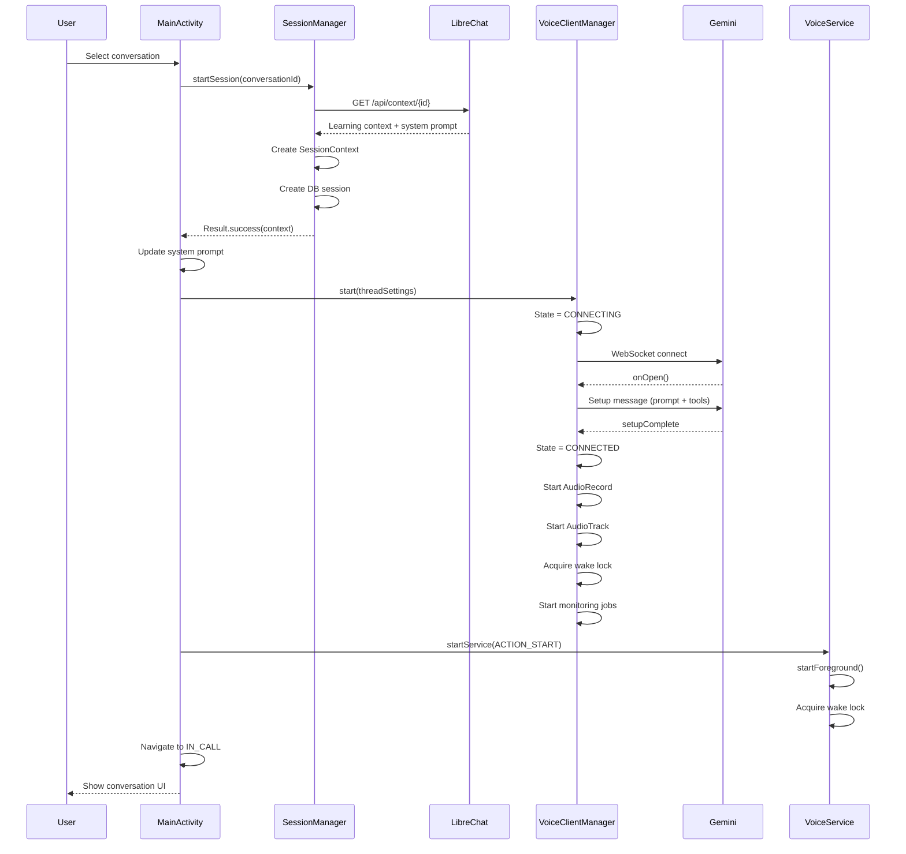
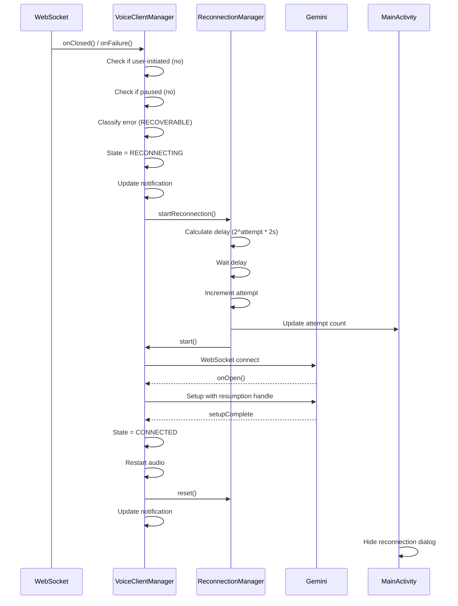
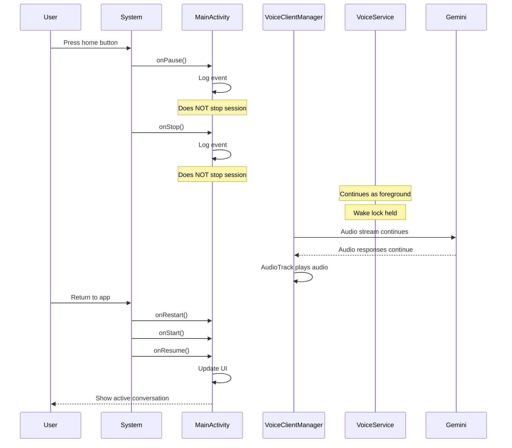
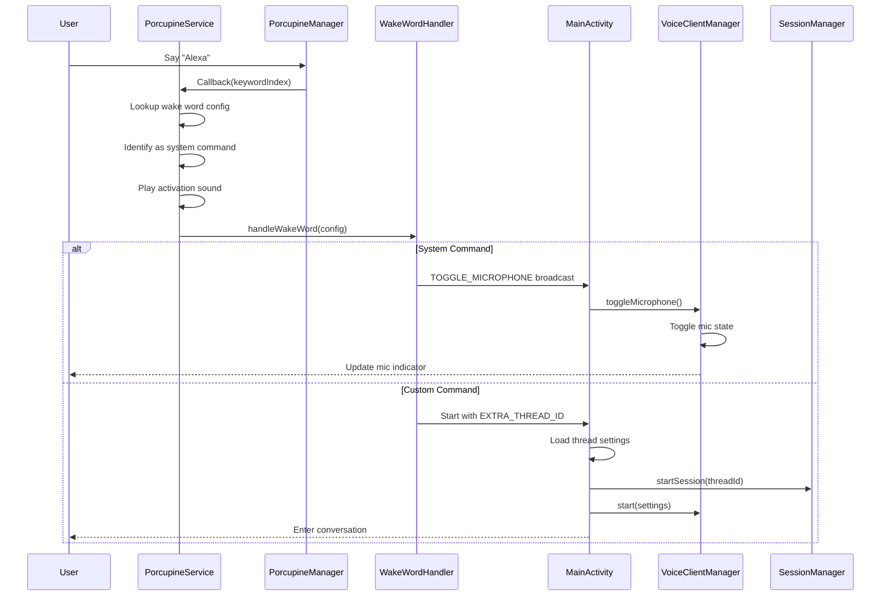
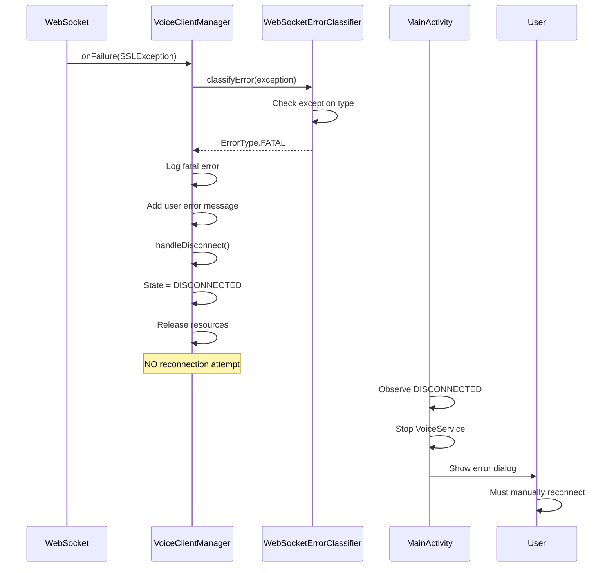

# Component Interactions

This document describes key interaction sequences between components in the voice conversation system.

## Overview

The system involves complex interactions between UI, managers, services, and external APIs. Understanding these sequences is critical for debugging and extending functionality.

## Sequence 1: Start Conversation

### Description
User initiates a new voice conversation from the thread list screen.

### Participants
- User
- MainActivity
- SessionManager
- LibreChatService
- VoiceClientManager
- VoiceService
- Gemini API

### Step-by-Step Flow

1. **User selects conversation** from thread list
2. **MainActivity** receives conversation selection
3. **MainActivity** calls `sessionManager.startSession(conversationId)`
4. **SessionManager** sends HTTP GET to LibreChat API `/api/context/{conversationId}`
5. **LibreChatService** returns learning context with system prompt
6. **SessionManager** creates SessionContext with system prompt
7. **SessionManager** creates database session entry
8. **SessionManager** returns Result.success(SessionContext)
9. **MainActivity** updates `Preferences.systemPrompt` with context
10. **MainActivity** calls `voiceClientManager.start(threadSettings)`
11. **VoiceClientManager** transitions state to CONNECTING
12. **VoiceClientManager** creates WebSocket connection to Gemini
13. **Gemini API** accepts connection (onOpen callback)
14. **VoiceClientManager** sends setup message with system prompt and tools
15. **Gemini API** returns setupComplete message
16. **VoiceClientManager** transitions state to CONNECTED
17. **VoiceClientManager** starts AudioRecord (microphone)
18. **VoiceClientManager** starts AudioTrack (speaker)
19. **VoiceClientManager** acquires wake lock
20. **VoiceClientManager** starts monitoring jobs (auto-pause, bot timeout, health check)
21. **MainActivity** observes state change to CONNECTED
22. **MainActivity** calls `startVoiceService()`
23. **VoiceService** starts as foreground service with notification
24. **VoiceService** acquires wake lock
25. **MainActivity** navigates to IN_CALL screen
26. **User** sees conversation interface with audio indicators

### Sequence Diagram

### Data Flow
- **Input:** Conversation ID from user selection
- **Output:** Active voice conversation with Gemini
- **State Changes:** 
  - SessionManager: null → SessionContext
  - VoiceClientManager: DISCONNECTED → CONNECTING → CONNECTED
  - VoiceService: Not running → Foreground service

### Code References
- MainActivity conversation selection: `MainActivity.kt:800-900`
- SessionManager.startSession(): `SessionManager.kt:150-220`
- VoiceClientManager.start(): `VoiceClientManager.kt:560-850`
- VoiceService start: `VoiceService.kt:50-100`

---

## Sequence 2: Reconnection Flow

### Description
WebSocket connection is lost unexpectedly, system attempts automatic reconnection with exponential backoff.

### Participants
- VoiceClientManager
- ReconnectionManager
- WebSocket
- Gemini API
- MainActivity (UI observer)

### Step-by-Step Flow

1. **WebSocket** connection drops (network issue, server restart, etc.)
2. **WebSocket** triggers `onClosed()` or `onFailure()` callback
3. **VoiceClientManager** checks if disconnect was user-initiated (no)
4. **VoiceClientManager** checks if session is paused (no)
5. **VoiceClientManager** classifies error using WebSocketErrorClassifier
6. **WebSocketErrorClassifier** returns RECOVERABLE error type
7. **VoiceClientManager** transitions state to RECONNECTING
8. **VoiceClientManager** updates VoiceService notification ("Reconnecting...")
9. **VoiceClientManager** calls `reconnectionManager.startReconnection()`
10. **ReconnectionManager** calculates delay: `min(2000 * 2^attempt, 30000)`
11. **ReconnectionManager** waits for delay (2s, 4s, 8s, 16s, 30s)
12. **ReconnectionManager** increments attempt counter
13. **ReconnectionManager** updates UI with attempt count
14. **ReconnectionManager** calls `voiceClientManager.start()`
15. **VoiceClientManager** attempts WebSocket reconnection
16. **Gemini API** accepts connection
17. **VoiceClientManager** sends setup with session resumption handle
18. **Gemini API** returns setupComplete
19. **VoiceClientManager** transitions state to CONNECTED
20. **VoiceClientManager** restarts audio pipeline
21. **ReconnectionManager** calls `reset()` to clear attempt counter
22. **VoiceClientManager** updates VoiceService notification ("Connected")
23. **MainActivity** observes state change, hides reconnection dialog

**Alternative Flow: Max Attempts Reached**
- After 5 failed attempts (at 30s delay each)
- **ReconnectionManager** triggers `onMaxReconnectionAttemptsReached` callback
- **MainActivity** shows dialog: "Continue trying?" or "End conversation"
- If user chooses "Continue": Reset counter and retry
- If user chooses "End": Call `voiceClientManager.stop()`

### Sequence Diagram

### Data Flow
- **Input:** Connection failure event
- **Output:** Restored connection or user decision dialog
- **State Changes:**
  - VoiceClientManager: CONNECTED → RECONNECTING → CONNECTED (or DISCONNECTED)
  - ReconnectionManager: attemptCount 0 → 1 → 2 → ... → 5 (or reset to 0)

### Code References
- WebSocket callbacks: `VoiceClientManager.kt:900-1000`
- Error classification: `utils/WebSocketErrorClassifier.kt:20-60`
- Reconnection logic: `VoiceClientManager.kt:2950-3050`
- Max attempts callback: `MainActivity.kt:400-450`

---

## Sequence 3: Background Operation

### Description
User presses home button, app goes to background while conversation continues via VoiceService.

### Participants
- User
- Android System
- MainActivity
- VoiceClientManager
- VoiceService
- AudioRecord
- AudioTrack
- Gemini API

### Step-by-Step Flow

1. **User** presses home button
2. **Android System** calls `MainActivity.onPause()`
3. **MainActivity** logs lifecycle event
4. **MainActivity** does NOT stop VoiceClientManager
5. **VoiceService** continues running as foreground service
6. **VoiceService** maintains wake lock (CPU stays active)
7. **AudioRecord** continues capturing microphone input
8. **VoiceClientManager** continues sending audio to Gemini
9. **Gemini API** continues sending audio responses
10. **AudioTrack** continues playing bot audio
11. **User** hears bot responses through speaker/headphones
12. **Android System** calls `MainActivity.onStop()`
13. **MainActivity** logs lifecycle event
14. **MainActivity** does NOT stop VoiceClientManager
15. **VoiceService** notification remains visible
16. **User** can interact with other apps
17. **Conversation continues** in background
18. **User** returns to app (taps notification or app icon)
19. **Android System** calls `MainActivity.onRestart()`
20. **Android System** calls `MainActivity.onStart()`
21. **Android System** calls `MainActivity.onResume()`
22. **MainActivity** updates UI with current state
23. **User** sees conversation still active

### Sequence Diagram

### Data Flow
- **Input:** User navigation away from app
- **Output:** Conversation continues seamlessly
- **State Changes:**
  - MainActivity: Resumed → Paused → Stopped (then back to Resumed)
  - VoiceClientManager: CONNECTED (no change)
  - VoiceService: Running (no change)

### Key Design Decisions
1. **VoiceService maintains session:** Foreground service keeps conversation alive
2. **Wake lock prevents sleep:** CPU stays active even with screen off
3. **No lifecycle interruption:** onPause/onStop do NOT stop session
4. **Only stop on finish:** Session ends only if `isFinishing` is true

### Code References
- MainActivity lifecycle: `MainActivity.kt:200-400`
- VoiceService foreground: `VoiceService.kt:50-100`
- Wake lock management: `VoiceService.kt:150-200`

---

## Sequence 4: Wake Word Detection

### Description
User says wake word to toggle microphone or launch specific conversation thread.

### Participants
- User
- PorcupineService
- PorcupineManager
- WakeWordHandler
- MainActivity
- VoiceClientManager

### Step-by-Step Flow

**System Wake Word (Toggle Mic):**

1. **User** says "Alexa" (or configured wake word)
2. **PorcupineManager** detects wake word
3. **PorcupineManager** triggers callback with keyword index
4. **PorcupineService** receives callback
5. **PorcupineService** looks up wake word config by index
6. **PorcupineService** identifies as system command
7. **PorcupineService** plays activation sound (if enabled)
8. **PorcupineService** calls `wakeWordHandler.handleWakeWord()`
9. **WakeWordHandler** identifies command type (system)
10. **WakeWordHandler** sends TOGGLE_MICROPHONE broadcast
11. **MainActivity** receives broadcast via LocalBroadcastManager
12. **MainActivity** calls `voiceClientManager.toggleMicrophone()`
13. **VoiceClientManager** toggles mic state
14. **User** sees mic indicator change

**Custom Wake Word (Launch Thread):**

1. **User** says custom wake word (e.g., "Computer")
2. **PorcupineManager** detects wake word
3. **PorcupineService** identifies as custom command
4. **PorcupineService** looks up assigned thread ID
5. **WakeWordHandler** creates Intent with thread ID
6. **WakeWordHandler** starts MainActivity with Intent
7. **MainActivity** receives Intent with EXTRA_THREAD_ID
8. **MainActivity** loads thread settings
9. **MainActivity** starts session for that thread
10. **User** enters conversation with specific thread

### Sequence Diagram

### Data Flow
- **Input:** Audio from microphone (wake word)
- **Output:** Microphone toggle or thread launch
- **State Changes:**
  - System command: VoiceClientManager mic state toggles
  - Custom command: MainActivity navigates to IN_CALL screen

### Microphone Coordination
- **PorcupineService** and **VoiceClientManager** share microphone
- When user talks: PorcupineService PAUSED, VoiceClientManager uses mic
- When bot talks: PorcupineService ACTIVE, VoiceClientManager releases mic
- Coordination via broadcasts: PAUSE_PORCUPINE, RESUME_PORCUPINE

### Code References
- Wake word detection: `PorcupineService.kt:200-250`
- Wake word handling: `PorcupineService.kt:350-450`
- Microphone coordination: `VoiceClientManager.kt:450-500`
- MainActivity broadcast receiver: `MainActivity.kt:500-550`

---

## Sequence 5: Error Recovery

### Description
Critical error occurs (SSL failure, authentication error), system handles gracefully without reconnection.

### Participants
- WebSocket
- VoiceClientManager
- WebSocketErrorClassifier
- MainActivity
- User

### Step-by-Step Flow

1. **WebSocket** encounters SSL certificate error
2. **WebSocket** triggers `onFailure()` callback with SSLException
3. **VoiceClientManager** receives failure callback
4. **VoiceClientManager** calls `WebSocketErrorClassifier.classifyError()`
5. **WebSocketErrorClassifier** identifies as FATAL error
6. **WebSocketErrorClassifier** returns ErrorType.FATAL
7. **VoiceClientManager** logs fatal error details
8. **VoiceClientManager** adds user-friendly error to errors list
9. **VoiceClientManager** calls `handleDisconnect()`
10. **VoiceClientManager** transitions state to DISCONNECTED
11. **VoiceClientManager** releases all resources
12. **VoiceClientManager** does NOT attempt reconnection
13. **MainActivity** observes state change to DISCONNECTED
14. **MainActivity** stops VoiceService
15. **MainActivity** shows error dialog to user
16. **User** sees error message: "SSL error occurred"
17. **User** must manually reconnect after fixing issue

**Alternative: Recoverable Error**
- If error is RECOVERABLE (e.g., timeout)
- System transitions to RECONNECTING
- Automatic reconnection attempted
- See Sequence 2 for details

**Alternative: Unknown Error**
- If error is UNKNOWN
- System logs error for analysis
- Treats as RECOVERABLE
- Attempts reconnection

### Sequence Diagram

### Data Flow
- **Input:** Fatal error exception
- **Output:** Clean disconnect with error message
- **State Changes:**
  - VoiceClientManager: CONNECTED → DISCONNECTED
  - VoiceService: Running → Stopped

### Error Classification

| Error Type | Examples | Recovery Strategy |
|------------|----------|-------------------|
| RECOVERABLE | SocketTimeoutException, UnknownHostException, ConnectException, EOFException | Automatic reconnection with backoff |
| FATAL | SSLException, ProtocolException, IllegalStateException, SecurityException | No reconnection, user must fix |
| UNKNOWN | Other exceptions | Log and treat as recoverable |

### Code References
- Error classification: `utils/WebSocketErrorClassifier.kt:20-80`
- Error handling: `VoiceClientManager.kt:950-1050`
- Fatal error flow: `VoiceClientManager.kt:1000-1020`
- Recoverable error flow: `VoiceClientManager.kt:970-990`

---

## Cross-Cutting Concerns

### Transcript Synchronization

**Reliable Delivery:**
- TranscriptSyncManager handles infinite retry
- Exponential backoff between attempts
- Persists to database if sync fails
- Retries on network reconnection

**Flow:**
1. Session ends
2. Format transcripts
3. Generate summary (if enabled)
4. Send to LibreChat via TranscriptSyncManager
5. Retry on failure with backoff
6. Update database on success

**Code Reference:** `SessionManager.kt:400-600`

### Memory Pressure Handling

**Levels:**
- TRIM_MEMORY_RUNNING_LOW: Log warning, continue
- TRIM_MEMORY_RUNNING_CRITICAL: Log critical, continue
- TRIM_MEMORY_COMPLETE: Force stop session (emergency)

**Flow:**
1. System calls `onTrimMemory(level)`
2. MainActivity checks level
3. If COMPLETE: Call `voiceClientManager.forceStop()`
4. Release all resources immediately

**Code Reference:** `MainActivity.kt:450-500`

### Audio Device Changes

**Bluetooth Headset:**
- Detect Bluetooth SCO connection
- Switch audio routing automatically
- Handle disconnect gracefully

**Wired Headset:**
- Detect headphone plug/unplug
- Disable speakerphone when headphones connected
- Re-enable when disconnected

**Code Reference:** `VoiceClientManager.kt:1600-1700`

---

## Performance Considerations

### Audio Latency
- AudioRecord buffer: Minimum size for low latency
- AudioTrack buffer: Minimum size for smooth playback
- Audio queue: Prevents pops/clicks during playback

### Network Efficiency
- WebSocket ping interval: 30 seconds
- Health check interval: 5 seconds
- Reconnection backoff: Prevents server overload

### Battery Optimization
- Wake lock only when needed
- Release resources promptly
- Battery profiling for monitoring

---

**Last Updated:** 2025-12-01
