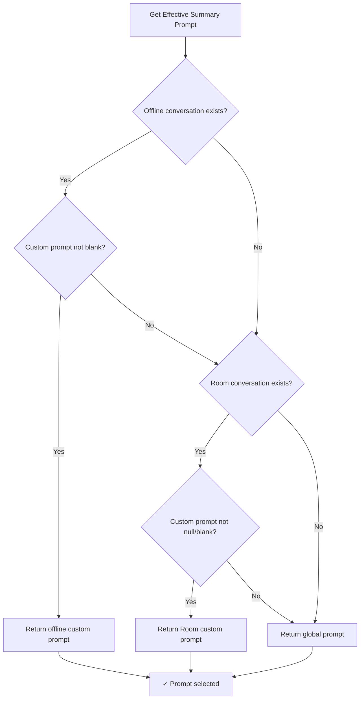
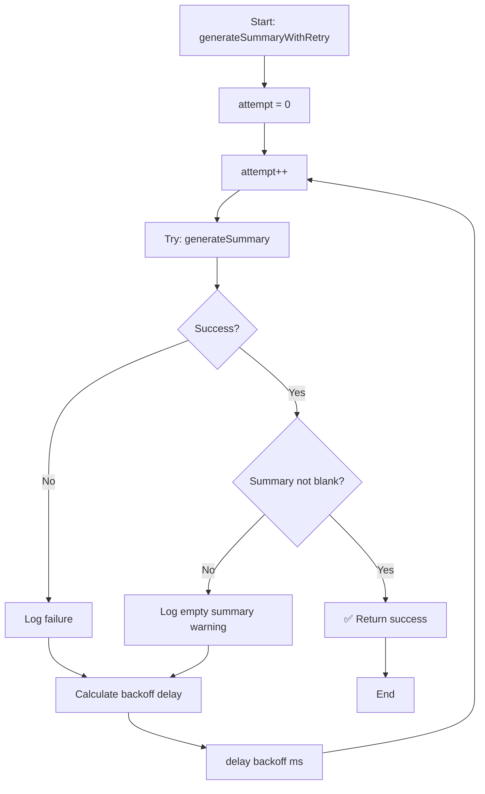
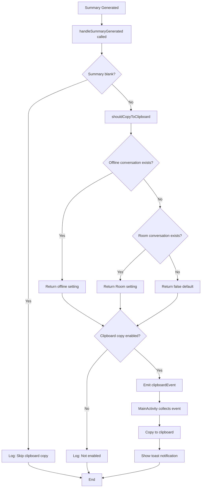
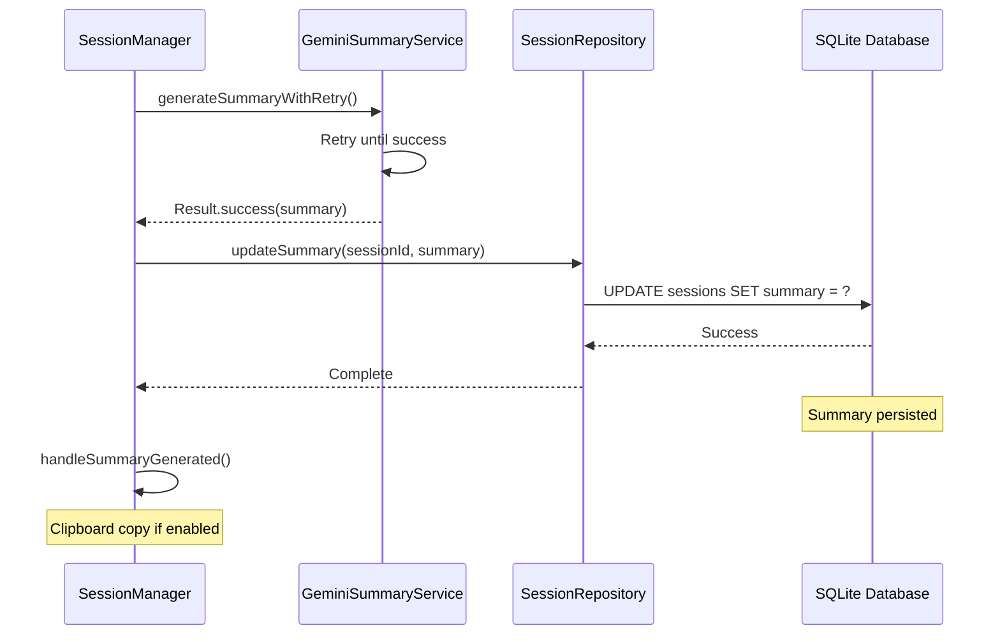
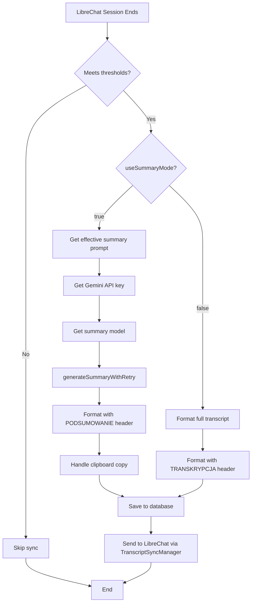
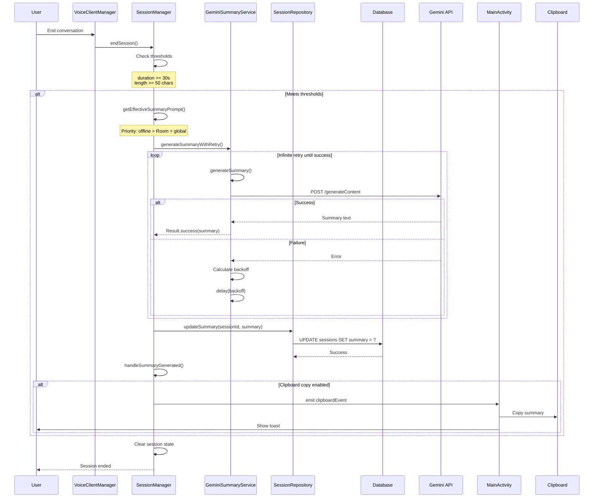
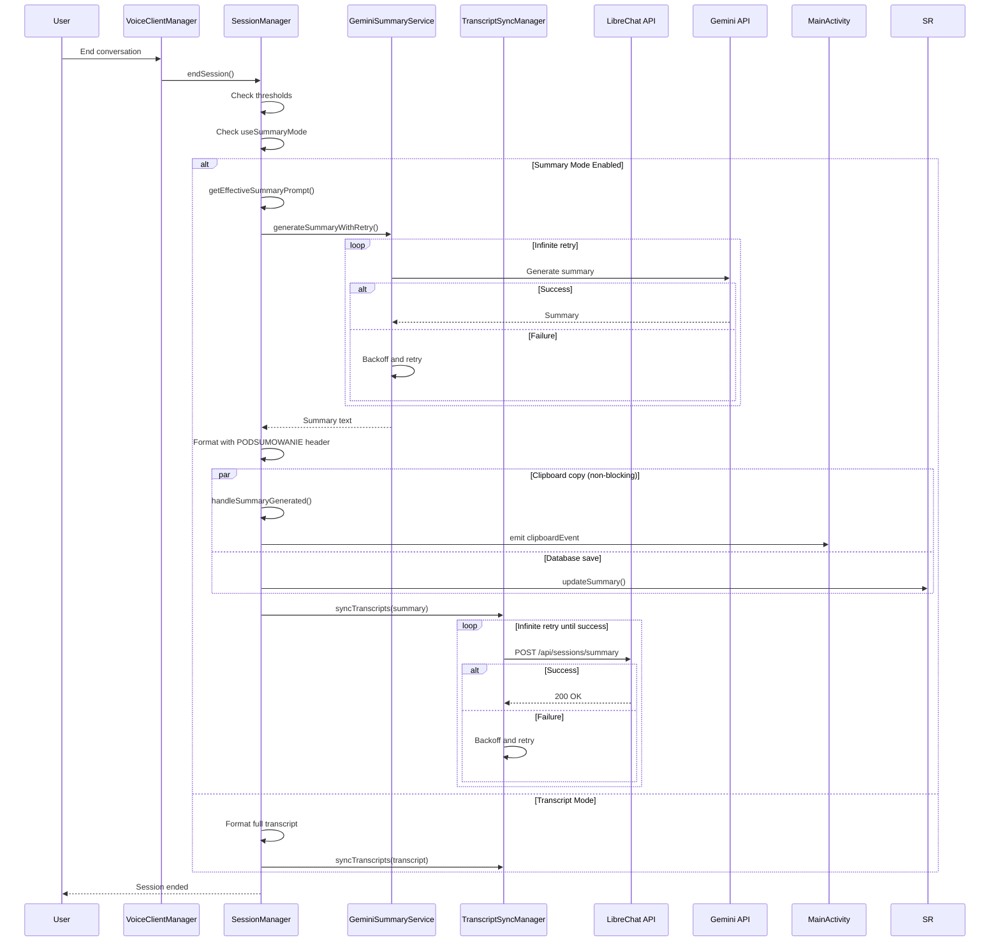

# Summary Generation

## Overview

The summary generation feature provides AI-powered summarization of conversation transcripts using Google's Gemini API. This feature is designed to create concise, meaningful summaries of voice conversations that can be:

- Stored in the database for future reference
- Sent to LibreChat instead of full transcripts (when summary mode is enabled)
- Copied to the device clipboard for easy sharing
- Used to build context for future conversations

The system uses the `GeminiSummaryService` component to interact with the Gemini REST API, with built-in infinite retry logic to ensure reliable summary generation even under poor network conditions.

## Key Features

- **Infinite Retry**: Guarantees summary generation with exponential backoff
- **Custom Prompts**: Per-conversation customization with priority chain
- **Model Selection**: Configurable Gemini model (default: gemini-2.5-flash)
- **Clipboard Integration**: Optional automatic clipboard copy
- **Database Persistence**: Summaries stored with session records
- **Summary Mode**: Toggle between sending full transcripts or summaries to LibreChat

## Architecture

```
┌─────────────────┐
│  SessionManager │
└────────┬────────┘
         │
         │ 1. Check useSummaryMode
         │ 2. Get effective prompt
         │ 3. Generate summary
         │
         ▼
┌─────────────────────────┐
│ GeminiSummaryService    │
│                         │
│ - generateSummaryWith   │
│   Retry()               │
│ - Exponential backoff   │
│ - HTTP client           │
└────────┬────────────────┘
         │
         │ POST request
         │
         ▼
┌─────────────────────────┐
│   Gemini REST API       │
│   (generativelanguage   │
│    .googleapis.com)     │
└─────────────────────────┘
```


## GeminiSummaryService Component

### Overview

`GeminiSummaryService` is the core component responsible for generating AI summaries using the Gemini REST API. It provides a reliable, retry-enabled interface for summary generation with proper error handling and exponential backoff.

**Code Reference:** `GeminiSummaryService.kt:1-300`

### Class Structure

```kotlin
class GeminiSummaryService(private val context: Context) {
    companion object {
        private const val GEMINI_API_BASE = "https://generativelanguage.googleapis.com/v1beta"
        private const val TIMEOUT_SECONDS = 120L
        private const val BASE_DELAY_MS = 2000L      // 2 seconds
        private const val MAX_DELAY_MS = 60000L      // 60 seconds
        private const val BACKOFF_MULTIPLIER = 2.0
    }
    
    private val client: OkHttpClient
    private val json: Json
}
```

### Key Methods

#### `generateSummaryWithRetry()`

**Role:** Generate a summary with infinite retry until success

**Signature:**
```kotlin
suspend fun generateSummaryWithRetry(
    transcript: String,
    summaryPrompt: String,
    modelName: String,
    apiKey: String
): Result<String>
```

**Parameters:**
- `transcript`: The full transcript text to summarize (must not be blank)
- `summaryPrompt`: The prompt instructing how to create the summary
- `modelName`: The Gemini model to use (e.g., "gemini-2.5-flash")
- `apiKey`: The Gemini API key for authentication

**Returns:** `Result<String>` - Always succeeds eventually with summary text

**Behavior:**
1. Attempts to generate summary using `generateSummary()`
2. On failure, calculates exponential backoff delay
3. Waits for backoff period
4. Retries indefinitely until success
5. Logs all attempts and delays

**Preconditions:**
- API key must be configured
- Transcript must not be blank
- Network connectivity required (will retry until available)

**Postconditions:**
- Summary text is generated and returned
- All failures are logged
- Successful attempt is logged with summary length

**Side-effects:**
- Network I/O (HTTP POST to Gemini API)
- Logging to Android logcat
- Coroutine delays during backoff

**Code Reference:** `GeminiSummaryService.kt:67-107`

#### `generateSummary()` (private)

**Role:** Generate a summary of the transcript using Gemini (single attempt)

**Signature:**
```kotlin
private suspend fun generateSummary(
    transcript: String,
    summaryPrompt: String,
    modelName: String,
    apiKey: String
): Result<String>
```

**Parameters:**
- Same as `generateSummaryWithRetry()`

**Returns:** `Result<String>` - Success with summary text, or failure with exception

**Behavior:**
1. Validates API key and transcript are not blank
2. Combines prompt and transcript with separator
3. Creates JSON request body
4. Sends POST request to Gemini API
5. Parses JSON response
6. Extracts summary text from response

**Preconditions:**
- API key must not be blank
- Transcript must not be blank
- Valid network connection

**Postconditions:**
- On success: Summary text extracted from API response
- On failure: Exception with error details

**Side-effects:**
- Network I/O (HTTP POST)
- Logging (request details, response, errors)
- Runs on Dispatchers.IO

**Errors:**
- "Gemini API key is not configured" - API key is blank
- "Transcript is empty" - Transcript is blank
- "Gemini API error: {code}" - API returned error status
- "Empty response from Gemini API" - No response body
- "No summary in Gemini response" - Response missing summary text

**Code Reference:** `GeminiSummaryService.kt:117-200`

#### `calculateBackoff()`

**Role:** Calculate exponential backoff delay for retry attempts

**Signature:**
```kotlin
private fun calculateBackoff(attempt: Int): Long
```

**Parameters:**
- `attempt`: The current attempt number (1-indexed)

**Returns:** Delay in milliseconds, capped at MAX_DELAY_MS (60 seconds)

**Algorithm:**
```
delay = BASE_DELAY_MS * (BACKOFF_MULTIPLIER ^ (attempt - 1))
delay = min(delay, MAX_DELAY_MS)
```

**Backoff Schedule:**
| Attempt | Calculation | Delay |
|---------|-------------|-------|
| 1 | 2000 * 2^0 | 2s |
| 2 | 2000 * 2^1 | 4s |
| 3 | 2000 * 2^2 | 8s |
| 4 | 2000 * 2^3 | 16s |
| 5 | 2000 * 2^4 | 32s |
| 6+ | 2000 * 2^5+ | 60s (capped) |

**Code Reference:** `GeminiSummaryService.kt:207-210`

#### `validateModel()`

**Role:** Validate if a model exists by making a test request

**Signature:**
```kotlin
suspend fun validateModel(modelName: String, apiKey: String): Result<Boolean>
```

**Parameters:**
- `modelName`: The model name to validate (e.g., "gemini-2.5-flash")
- `apiKey`: The Gemini API key

**Returns:** `Result<Boolean>` - Success with true if model exists, failure with error message

**Behavior:**
1. Validates API key and model name are not blank
2. Creates minimal test request with "test" content
3. Sends POST request to Gemini API
4. Interprets response code:
   - 200: Model is valid
   - 404: Model not found
   - 400: Check error body for model-related errors
   - 403: API key doesn't have access
   - Other: Generic error

**Use Case:** Called from settings screen before saving model configuration

**Code Reference:** `GeminiSummaryService.kt:219-270`

### Data Models

#### Request Structure

```kotlin
@Serializable
data class GeminiRequest(
    val contents: List<Content>
)

@Serializable
data class Content(
    val parts: List<Part>
)

@Serializable
data class Part(
    val text: String
)
```

**Example JSON:**
```json
{
  "contents": [
    {
      "parts": [
        {
          "text": "Summarize this conversation:\n\n---\n\nUser: Hello\nBot: Hi there!"
        }
      ]
    }
  ]
}
```

#### Response Structure

```kotlin
@Serializable
data class GeminiResponse(
    val candidates: List<Candidate>
)

@Serializable
data class Candidate(
    val content: Content
)
```

**Example JSON:**
```json
{
  "candidates": [
    {
      "content": {
        "parts": [
          {
            "text": "The user greeted the bot, and the bot responded with a friendly greeting."
          }
        ]
      }
    }
  ]
}
```

### HTTP Client Configuration

```kotlin
private val client = OkHttpClient.Builder()
    .connectTimeout(TIMEOUT_SECONDS, TimeUnit.SECONDS)  // 120s
    .readTimeout(TIMEOUT_SECONDS, TimeUnit.SECONDS)     // 120s
    .writeTimeout(TIMEOUT_SECONDS, TimeUnit.SECONDS)    // 120s
    .build()
```

**Rationale:**
- Long timeouts (120s) accommodate large transcripts
- Gemini API can take time to process lengthy content
- Timeout failures trigger retry logic

### API Endpoint

```
POST https://generativelanguage.googleapis.com/v1beta/models/{modelName}:generateContent?key={apiKey}
```

**Headers:**
- `Content-Type: application/json`

**Authentication:** API key passed as query parameter


## Custom Prompt Priority Chain

### Overview

The system supports three levels of summary prompt customization, with a clear priority chain to determine which prompt to use for a given conversation. This allows users to:

- Set a global default prompt for all conversations
- Override with conversation-specific prompts in the Room database
- Override with offline conversation-specific prompts

### Priority Order (Highest to Lowest)

```
1. Offline Conversation Custom Prompt (SharedPreferences)
   ↓ (if not set or blank)
2. Room Database Conversation Custom Prompt
   ↓ (if not set or blank)
3. Global Summary Prompt (Preferences)
```

### Implementation: `getEffectiveSummaryPrompt()`

**Code Reference:** `SessionManager.kt:232-252`

```kotlin
private suspend fun getEffectiveSummaryPrompt(conversationId: String): String {
    // Priority 1: Try offline conversation first
    val offlineConv = OfflineConversationManager.getById(conversationId)
    if (offlineConv != null && offlineConv.customSummaryPrompt.isNotBlank()) {
        Log.d(TAG, "Using custom summary prompt from offline conversation")
        return offlineConv.customSummaryPrompt
    }
    
    // Priority 2: Try Room database
    val dbConv = conversationRepository.getConversation(conversationId)
    if (dbConv != null && !dbConv.customSummaryPrompt.isNullOrBlank()) {
        Log.d(TAG, "Using custom summary prompt from Room database")
        return dbConv.customSummaryPrompt
    }
    
    // Priority 3: Fall back to global prompt
    Log.d(TAG, "Using global summary prompt")
    return Preferences.summaryPrompt.value ?: ""
}
```

### Storage Locations

#### 1. Offline Conversation (Highest Priority)

**Storage:** SharedPreferences via `OfflineConversationManager`

**Data Structure:**
```kotlin
data class OfflineConversation(
    val id: String,
    val title: String,
    val customSummaryPrompt: String,  // ← Custom prompt
    val copySummaryToClipboard: Boolean,
    // ... other fields
)
```

**Access:** `OfflineConversationManager.getById(conversationId)`

**Use Case:** User-created offline conversations with custom prompts

**Persistence:** Survives app restart (SharedPreferences)

#### 2. Room Database Conversation (Medium Priority)

**Storage:** Room database via `ConversationRepository`

**Data Structure:**
```kotlin
@Entity(tableName = "conversations")
data class ConversationEntity(
    @PrimaryKey val id: String,
    val title: String,
    val customSummaryPrompt: String?,  // ← Custom prompt (nullable)
    val copySummaryToClipboard: Boolean,
    // ... other fields
)
```

**Access:** `conversationRepository.getConversation(conversationId)`

**Use Case:** LibreChat conversations with custom prompts

**Persistence:** Survives app restart (SQLite database)

#### 3. Global Prompt (Lowest Priority)

**Storage:** SharedPreferences via `Preferences`

**Access:** `Preferences.summaryPrompt.value`

**Default Value:**
```kotlin
val summaryPrompt = StringPref(PREF_SUMMARY_PROMPT, """
Podsumuj poniższą rozmowę w języku polskim. 
Skup się na kluczowych punktach i decyzjach.
Zachowaj zwięzłość i klarowność.
""".trimIndent())
```

**Use Case:** Default prompt for all conversations without custom prompts

**Configuration:** Editable in Settings screen

### Decision Flow Diagram



### Usage Example

```kotlin
// In SessionManager.endSession()
val summaryPrompt = getEffectiveSummaryPrompt(session.conversationId)

val summaryResult = geminiSummaryService.generateSummaryWithRetry(
    transcript = formattedTranscript,
    summaryPrompt = summaryPrompt,  // ← Effective prompt
    modelName = summaryModel,
    apiKey = apiKey
)
```

### Validation Rules

**Blank Check:**
- Offline: `customSummaryPrompt.isNotBlank()`
- Room: `!customSummaryPrompt.isNullOrBlank()`
- Global: Always has default value

**Null Handling:**
- Offline: Never null (String type)
- Room: Nullable (String? type)
- Global: Nullable but has default

### Testing

The prompt priority chain is validated by property-based tests:

**Test:** `EffectivePromptSelectionPropertyTest.kt`

**Properties Tested:**
1. Offline prompt takes precedence when non-blank
2. Room prompt is used when offline is blank/missing
3. Global prompt is used when both custom prompts are blank/missing

**Code Reference:** `EffectivePromptSelectionPropertyTest.kt:1-100`


## Model Selection

### Overview

The system allows users to configure which Gemini model to use for summary generation. The model selection is global (applies to all conversations) and is validated before being saved to ensure the model exists and is accessible.

### Default Model

**Model Name:** `gemini-2.5-flash`

**Rationale:**
- Fast response times suitable for real-time summarization
- Cost-effective for frequent summary generation
- Sufficient quality for conversation summaries
- Wide availability in Gemini API

**Configuration:**
```kotlin
val summaryModel = StringPref(PREF_SUMMARY_MODEL, "gemini-2.5-flash")
```

**Code Reference:** `Preferences.kt:276`

### Supported Models

The system supports any Gemini model available through the REST API, including:

| Model | Use Case | Speed | Quality |
|-------|----------|-------|---------|
| gemini-2.5-flash | Default, fast summaries | ⚡⚡⚡ | ⭐⭐⭐ |
| gemini-2.0-flash-exp | Experimental, faster | ⚡⚡⚡⚡ | ⭐⭐⭐ |
| gemini-1.5-pro | Higher quality | ⚡⚡ | ⭐⭐⭐⭐ |
| gemini-1.5-flash | Older fast model | ⚡⚡⚡ | ⭐⭐ |

**Note:** Model availability depends on API key permissions and regional availability.

### Configuration Location

**Storage:** SharedPreferences via `Preferences.summaryModel`

**Access:**
```kotlin
// Read
val modelName = Preferences.summaryModel.value ?: "gemini-2.5-flash"

// Write
Preferences.summaryModel.value = "gemini-2.0-flash-exp"
```

**Persistence:** Survives app restart

### Model Validation

Before saving a new model configuration, the system validates that the model exists and is accessible.

#### Validation Process

**Code Reference:** `SettingsScreen.kt:147-200`

```kotlin
// In SettingsScreen validation
if (useSummaryMode) {
    when {
        geminiApiKey.isBlank() -> {
            showError("Gemini API key is required for summary mode")
            return@validateAndSaveSettings
        }
        summaryModel.isBlank() -> {
            showError("Summary model is required")
            return@validateAndSaveSettings
        }
        else -> {
            // Validate model exists
            scope.launch {
                isValidatingModel = true
                val result = geminiSummaryService.validateModel(
                    summaryModel, 
                    geminiApiKey
                )
                isValidatingModel = false
                
                if (result.isSuccess) {
                    // Save settings
                    Preferences.summaryModel.value = summaryModel
                    onSuccess()
                } else {
                    showError(result.exceptionOrNull()?.message ?: "Invalid model")
                }
            }
        }
    }
}
```

#### Validation Method

**Code Reference:** `GeminiSummaryService.kt:219-270`

```kotlin
suspend fun validateModel(modelName: String, apiKey: String): Result<Boolean> {
    // Makes a test request to the model endpoint
    // Returns success if model exists and is accessible
    // Returns failure with descriptive error message
}
```

**Validation Errors:**
- "API key is required" - API key is blank
- "Model name is required" - Model name is blank
- "Model '{name}' not found" - 404 response from API
- "Invalid model name: {name}" - 400 response with model error
- "API key doesn't have access to this model" - 403 response
- "Error validating model: {code}" - Other HTTP errors

### Usage in Summary Generation

```kotlin
// In SessionManager.endSession()
val summaryModel = Preferences.summaryModel.value?.takeIf { it.isNotBlank() } 
    ?: "gemini-2.5-flash"

val summaryResult = geminiSummaryService.generateSummaryWithRetry(
    transcript = formattedTranscript,
    summaryPrompt = summaryPrompt,
    modelName = summaryModel,  // ← Selected model
    apiKey = apiKey
)
```

**Fallback:** If `summaryModel` preference is blank, defaults to "gemini-2.5-flash"

**Code Reference:** `SessionManager.kt:578`

### Model Selection UI

**Location:** Settings Screen → Summary Settings section

**UI Elements:**
- Text field for model name input
- Validation indicator during model check
- Error message display for invalid models
- Save button (disabled during validation)

**User Flow:**
1. User enables summary mode
2. User enters model name (e.g., "gemini-2.0-flash-exp")
3. User clicks Save
4. System validates model with test API call
5. On success: Settings saved, user sees confirmation
6. On failure: Error message displayed, settings not saved

### Configuration Best Practices

**Recommended:**
- Use `gemini-2.5-flash` for most use cases (default)
- Test new models in settings before relying on them
- Keep API key permissions aligned with model selection

**Not Recommended:**
- Using very slow models (delays summary generation)
- Using models without proper API key access
- Changing models frequently (inconsistent summary quality)

### Error Handling

**Invalid Model at Runtime:**

If a previously valid model becomes unavailable:
1. Summary generation will retry infinitely
2. Exponential backoff prevents API spam
3. User can change model in settings
4. Logs show model validation errors

**Mitigation:**
- Infinite retry ensures eventual success when model becomes available
- User can manually change to different model
- System logs help diagnose model availability issues


## Infinite Retry Mechanism

### Overview

The summary generation system uses an infinite retry mechanism to guarantee that summaries are eventually generated, even under adverse network conditions or temporary API failures. This ensures that no conversation summary is lost due to transient errors.

### Design Philosophy

**Guarantee:** Every summary generation request will eventually succeed

**Rationale:**
- Summaries are valuable for context building
- Network failures are temporary
- API rate limits are temporary
- User experience: "It just works"

**Trade-off:** May take longer during poor network conditions, but always succeeds

### Implementation: `generateSummaryWithRetry()`

**Code Reference:** `GeminiSummaryService.kt:67-107`

```kotlin
suspend fun generateSummaryWithRetry(
    transcript: String,
    summaryPrompt: String,
    modelName: String,
    apiKey: String
): Result<String> {
    var attempt = 0
    
    while (true) {  // ← Infinite loop
        attempt++
        
        try {
            Log.d(TAG, "Generating summary with $modelName, attempt $attempt")
            
            val result = generateSummary(transcript, summaryPrompt, modelName, apiKey)
            
            if (result.isSuccess) {
                val summary = result.getOrNull()
                if (!summary.isNullOrBlank()) {
                    Log.d(TAG, "✅ Summary generated successfully on attempt $attempt")
                    return Result.success(summary)
                } else {
                    Log.w(TAG, "⚠️ Empty summary received, retrying...")
                }
            } else {
                Log.w(TAG, "⚠️ Attempt $attempt failed: ${result.exceptionOrNull()?.message}")
            }
            
        } catch (e: Exception) {
            Log.e(TAG, "❌ Attempt $attempt failed: ${e.javaClass.simpleName} - ${e.message}", e)
        }
        
        // Calculate exponential backoff
        val delayMs = calculateBackoff(attempt)
        Log.d(TAG, "⏳ Waiting ${delayMs}ms before retry...")
        delay(delayMs)
    }
}
```

### Retry Logic Flow



### Exponential Backoff

**Algorithm:**
```kotlin
private fun calculateBackoff(attempt: Int): Long {
    val delay = (BASE_DELAY_MS * Math.pow(BACKOFF_MULTIPLIER, (attempt - 1).toDouble())).toLong()
    return delay.coerceAtMost(MAX_DELAY_MS)
}
```

**Constants:**
- `BASE_DELAY_MS = 2000L` (2 seconds)
- `BACKOFF_MULTIPLIER = 2.0`
- `MAX_DELAY_MS = 60000L` (60 seconds)

**Backoff Schedule:**

| Attempt | Calculation | Delay | Cumulative Time |
|---------|-------------|-------|-----------------|
| 1 | 2000 * 2^0 | 2s | 2s |
| 2 | 2000 * 2^1 | 4s | 6s |
| 3 | 2000 * 2^2 | 8s | 14s |
| 4 | 2000 * 2^3 | 16s | 30s |
| 5 | 2000 * 2^4 | 32s | 62s |
| 6 | 2000 * 2^5 | 60s (capped) | 122s |
| 7+ | 2000 * 2^6+ | 60s (capped) | +60s each |

**Rationale:**
- Quick retries for transient errors (2s, 4s)
- Longer delays for persistent issues (16s, 32s)
- Cap at 60s to avoid excessive waiting
- Prevents API rate limit violations

### Error Handling

#### Recoverable Errors (Retry)

All errors are considered recoverable and trigger retry:

**Network Errors:**
- Connection timeout
- Read timeout
- Write timeout
- DNS resolution failure
- No network connectivity

**API Errors:**
- 429 Rate Limit Exceeded
- 500 Internal Server Error
- 502 Bad Gateway
- 503 Service Unavailable
- 504 Gateway Timeout

**Response Errors:**
- Empty response body
- Malformed JSON
- Missing summary in response
- Blank summary text

#### Non-Recoverable Errors

The system treats all errors as recoverable. However, certain errors indicate configuration issues:

**Configuration Errors:**
- Blank API key → Will retry forever (user must fix)
- Blank transcript → Will retry forever (should not happen)
- Invalid model name → Will retry forever (user must fix in settings)

**Mitigation:**
- Validation in UI prevents most configuration errors
- Logs help diagnose persistent failures
- User can cancel session to stop retry loop

### Cancellation

**Implicit Cancellation:**

The retry loop runs in a coroutine scope. Cancellation occurs when:
1. Parent coroutine scope is cancelled
2. App is closed
3. Session is ended (coroutine scope cancelled)

**Example:**
```kotlin
// In SessionManager
scope.launch {
    val summaryResult = geminiSummaryService.generateSummaryWithRetry(...)
    // If scope is cancelled, retry loop stops
}
```

**No Explicit Cancellation:**
- No cancel method provided
- Relies on coroutine cancellation
- Summary generation is fire-and-forget

### Logging

**Log Levels:**

**DEBUG:**
- Each attempt start
- Successful generation
- Backoff delay duration

**WARNING:**
- Failed attempts with error message
- Empty summary received

**ERROR:**
- Exceptions with stack trace

**Example Log Output:**
```
D/GeminiSummaryService: Generating summary with gemini-2.5-flash, attempt 1
W/GeminiSummaryService: ⚠️ Attempt 1 failed: Network timeout
D/GeminiSummaryService: ⏳ Waiting 2000ms before retry...
D/GeminiSummaryService: Generating summary with gemini-2.5-flash, attempt 2
D/GeminiSummaryService: ✅ Summary generated successfully on attempt 2
```

### Performance Considerations

**Memory:**
- Single coroutine per summary generation
- No accumulation of retry state
- Minimal memory footprint

**CPU:**
- Coroutine suspended during backoff (no CPU usage)
- JSON parsing only on successful response
- Efficient exponential backoff calculation

**Network:**
- Exponential backoff prevents API spam
- Respects rate limits through increasing delays
- Single HTTP connection per attempt

### Testing

**Unit Tests:**
- Mock API failures to test retry logic
- Verify exponential backoff calculation
- Test empty summary handling

**Integration Tests:**
- Test with real API (limited retries)
- Verify successful generation
- Test network failure scenarios

**Property Tests:**
- Verify backoff schedule correctness
- Test retry count tracking
- Validate delay calculations

### Comparison with TranscriptSyncManager

Both components use infinite retry, but with different characteristics:

| Feature | GeminiSummaryService | TranscriptSyncManager |
|---------|---------------------|----------------------|
| Retry Type | Infinite | Infinite |
| Base Delay | 2s | 1s |
| Max Delay | 60s | 30s |
| Persistence | No (in-memory) | Yes (OfflineSummaryQueue) |
| Cancellation | Coroutine scope | Explicit cancel method |
| Use Case | Summary generation | LibreChat sync |

**Rationale for Differences:**
- Summary generation: Longer delays acceptable (not time-critical)
- Transcript sync: Shorter delays for faster sync
- Summary: No persistence needed (can regenerate)
- Transcript: Persistence critical (cannot lose data)


## Clipboard Copy Feature

### Overview

The clipboard copy feature automatically copies generated summaries to the device clipboard, allowing users to easily share or paste conversation summaries into other applications. This feature is configurable per-conversation with a priority chain similar to custom prompts.

### Configuration Priority Chain

```
1. Offline Conversation Setting (SharedPreferences)
   ↓ (if conversation not found)
2. Room Database Conversation Setting
   ↓ (if conversation not found)
3. Default: false (no clipboard copy)
```

### Implementation: `shouldCopyToClipboard()`

**Code Reference:** `SessionManager.kt:259-272`

```kotlin
private suspend fun shouldCopyToClipboard(conversationId: String): Boolean {
    // Priority 1: Try offline conversation first
    val offlineConv = OfflineConversationManager.getById(conversationId)
    if (offlineConv != null) {
        return offlineConv.copySummaryToClipboard
    }
    
    // Priority 2: Try Room database
    val dbConv = conversationRepository.getConversation(conversationId)
    return dbConv?.copySummaryToClipboard ?: false
}
```

**Parameters:**
- `conversationId`: The conversation ID to check

**Returns:** `true` if clipboard copy is enabled, `false` otherwise

**Default:** `false` (clipboard copy disabled by default)

### Storage Locations

#### 1. Offline Conversation (Highest Priority)

**Data Structure:**
```kotlin
data class OfflineConversation(
    val id: String,
    val title: String,
    val copySummaryToClipboard: Boolean,  // ← Clipboard setting
    // ... other fields
)
```

**Access:** `OfflineConversationManager.getById(conversationId)`

**Configuration:** Set in Offline Conversation Dialog

**Code Reference:** `OfflineConversationDialog.kt`

#### 2. Room Database Conversation (Medium Priority)

**Data Structure:**
```kotlin
@Entity(tableName = "conversations")
data class ConversationEntity(
    @PrimaryKey val id: String,
    val title: String,
    val copySummaryToClipboard: Boolean,  // ← Clipboard setting
    // ... other fields
)
```

**Access:** `conversationRepository.getConversation(conversationId)`

**Configuration:** Set in Thread Config Dialog (LibreChat conversations)

**Code Reference:** `ThreadConfigDialog.kt`

### Implementation: `handleSummaryGenerated()`

**Code Reference:** `SessionManager.kt:278-293`

```kotlin
private suspend fun handleSummaryGenerated(summary: String, conversationId: String) {
    // Check if summary is non-empty
    if (summary.isBlank()) {
        Log.d(TAG, "Summary is empty, skipping clipboard copy")
        return
    }
    
    // Check if clipboard copy is enabled for this conversation
    if (shouldCopyToClipboard(conversationId)) {
        Log.d(TAG, "Emitting clipboard event for summary (${summary.length} chars)")
        _clipboardEvent.emit(summary)
    } else {
        Log.d(TAG, "Clipboard copy not enabled for conversation $conversationId")
    }
}
```

**Parameters:**
- `summary`: The generated summary text
- `conversationId`: The conversation ID

**Behavior:**
1. Validates summary is not blank
2. Checks if clipboard copy is enabled via `shouldCopyToClipboard()`
3. If enabled, emits summary to `clipboardEvent` flow
4. Logs decision for debugging

**Preconditions:**
- Summary has been generated
- Conversation ID is valid

**Postconditions:**
- If enabled: Clipboard event emitted
- If disabled: No action taken
- All decisions logged

### Clipboard Event Flow

**Event Type:** `SharedFlow<String>`

**Declaration:**
```kotlin
private val _clipboardEvent = MutableSharedFlow<String>(replay = 0)
val clipboardEvent: SharedFlow<String> = _clipboardEvent.asSharedFlow()
```

**Code Reference:** `SessionManager.kt:50-51`

**Characteristics:**
- `replay = 0`: No replay of past events
- Hot flow: Emits to active collectors only
- Non-blocking: Emission doesn't wait for collectors

### UI Integration

**Code Reference:** `MainActivity.kt` (clipboard event collection)

```kotlin
// In MainActivity
LaunchedEffect(Unit) {
    sessionManager.clipboardEvent.collect { summary ->
        // Copy to clipboard
        val clipboardManager = getSystemService(Context.CLIPBOARD_SERVICE) as ClipboardManager
        val clip = ClipData.newPlainText("Conversation Summary", summary)
        clipboardManager.setPrimaryClip(clip)
        
        // Show toast notification
        Toast.makeText(
            this@MainActivity,
            "Summary copied to clipboard",
            Toast.LENGTH_SHORT
        ).show()
    }
}
```

**User Experience:**
1. Summary is generated
2. If clipboard copy enabled, summary is automatically copied
3. Toast notification confirms copy
4. User can paste summary anywhere

### Usage Scenarios

#### Scenario 1: Offline Session with Clipboard Copy

```kotlin
// User creates offline conversation with clipboard copy enabled
val offlineConv = OfflineConversation(
    id = "offline-123",
    title = "Meeting Notes",
    copySummaryToClipboard = true,  // ← Enabled
    // ...
)

// Session ends, summary generated
// handleSummaryGenerated() called
// shouldCopyToClipboard() returns true
// clipboardEvent emitted
// UI copies to clipboard and shows toast
```

#### Scenario 2: LibreChat Session without Clipboard Copy

```kotlin
// LibreChat conversation with clipboard copy disabled
val dbConv = ConversationEntity(
    id = "librechat-456",
    title = "General Chat",
    copySummaryToClipboard = false,  // ← Disabled
    // ...
)

// Session ends, summary generated
// handleSummaryGenerated() called
// shouldCopyToClipboard() returns false
// No clipboard event emitted
// Summary saved to database only
```

### Call Sites

The `handleSummaryGenerated()` method is called from two locations:

#### 1. Offline Session End

**Code Reference:** `SessionManager.kt:603-605`

```kotlin
// After summary generation for offline session
summaryResult.onSuccess { summary ->
    sessionRepository.updateSummary(dbSessionId, summary)
    Log.d(TAG, "✅ Summary saved: ${summary.take(100)}...")
    
    // Handle clipboard copy if enabled
    currentConversationId?.let { convId ->
        handleSummaryGenerated(summary, convId)
    }
}
```

**Context:** Offline session, summary generated and saved to database

#### 2. LibreChat Session End (Summary Mode)

**Code Reference:** `SessionManager.kt:730-732`

```kotlin
// After summary generation for LibreChat session
summaryResult.onSuccess { summary ->
    // ... prepare summary for sending ...
    
    // Handle clipboard copy if enabled (non-blocking)
    scope.launch {
        handleSummaryGenerated(summary, session.conversationId)
    }
}
```

**Context:** LibreChat session, summary mode enabled, summary generated

**Note:** Runs in separate coroutine to avoid blocking sync process

### Decision Flow Diagram



### Testing

The clipboard copy feature is validated by property-based tests:

**Test:** `ClipboardEventEmissionPropertyTest.kt`

**Properties Tested:**
1. Clipboard event is emitted when copy is enabled and summary is non-blank
2. No clipboard event is emitted when copy is disabled
3. No clipboard event is emitted when summary is blank

**Code Reference:** `ClipboardEventEmissionPropertyTest.kt:1-100`

### Configuration UI

#### Offline Conversation Dialog

**Location:** `OfflineConversationDialog.kt`

**UI Element:**
```kotlin
Row(
    modifier = Modifier.fillMaxWidth(),
    horizontalArrangement = Arrangement.SpaceBetween,
    verticalAlignment = Alignment.CenterVertically
) {
    Text("Copy summary to clipboard")
    Switch(
        checked = copySummaryToClipboard,
        onCheckedChange = { copySummaryToClipboard = it }
    )
}
```

#### Thread Config Dialog

**Location:** `ThreadConfigDialog.kt`

**UI Element:** Similar switch for LibreChat conversations

### Best Practices

**Recommended:**
- Enable for conversations where summaries will be shared
- Enable for meeting notes or important discussions
- Disable for private or sensitive conversations

**Not Recommended:**
- Enabling for all conversations (clipboard pollution)
- Enabling without user awareness (privacy concern)

### Privacy Considerations

**Clipboard Access:**
- Summary is copied to system clipboard
- Other apps can read clipboard content
- User should be aware of clipboard copy

**Mitigation:**
- Feature is opt-in per conversation
- Toast notification confirms copy
- User controls when to enable

### Error Handling

**Blank Summary:**
- Detected and logged
- No clipboard event emitted
- Prevents copying empty content

**Missing Conversation:**
- Falls back to default (false)
- No error thrown
- Graceful degradation

**Clipboard Manager Unavailable:**
- Handled in MainActivity
- Try-catch around clipboard operations
- Error logged but doesn't crash app


## Database Storage

### Overview

Generated summaries are persisted to the Room database as part of the session record. This allows summaries to be:
- Retrieved for context building in future sessions
- Displayed in conversation history
- Used for search and filtering
- Preserved across app restarts

### Storage Location

**Table:** `sessions`

**Column:** `summary` (TEXT, nullable)

**Entity:** `SessionEntity`

**Code Reference:** `SessionEntity.kt:1-50`

```kotlin
@Entity(tableName = "sessions")
data class SessionEntity(
    @PrimaryKey val id: String,
    val conversationId: String,
    val startedAt: Long,
    val endedAt: Long?,
    val duration: Long?,
    val transcript: String?,
    val summary: String?,  // ← Summary storage
    // ... other fields
)
```

### Update Method: `updateSummary()`

#### Repository Layer

**Code Reference:** `SessionRepository.kt:66-69`

```kotlin
suspend fun updateSummary(sessionId: String, summary: String) {
    sessionDao.updateSummary(sessionId, summary)
}
```

**Parameters:**
- `sessionId`: The session ID to update
- `summary`: The summary text to store

**Behavior:**
- Updates existing session record
- Sets summary column to provided text
- Runs on Dispatchers.IO (suspend function)

**Preconditions:**
- Session must exist in database
- Session ID must be valid

**Postconditions:**
- Session record updated with summary
- Summary persisted to SQLite database

#### DAO Layer

**Code Reference:** `SessionDao.kt:44-45`

```kotlin
@Query("UPDATE sessions SET summary = :summary WHERE id = :sessionId")
suspend fun updateSummary(sessionId: String, summary: String)
```

**SQL Query:**
```sql
UPDATE sessions 
SET summary = :summary 
WHERE id = :sessionId
```

**Characteristics:**
- Direct SQL update
- No return value
- Atomic operation
- Indexed by primary key (fast)

### Call Sites

The `updateSummary()` method is called from two locations in SessionManager:

#### 1. Offline Session Summary

**Code Reference:** `SessionManager.kt:598-600`

```kotlin
summaryResult.onSuccess { summary ->
    sessionRepository.updateSummary(dbSessionId, summary)
    Log.d(TAG, "✅ Summary saved: ${summary.take(100)}...")
    
    // Handle clipboard copy if enabled
    currentConversationId?.let { convId ->
        handleSummaryGenerated(summary, convId)
    }
}
```

**Context:**
- Offline session has ended
- Summary generated successfully
- Database session already created
- Summary saved before clipboard copy

**Flow:**
1. Session ends
2. Summary generated via `generateSummaryWithRetry()`
3. Summary saved to database
4. Clipboard copy handled (if enabled)

#### 2. LibreChat Session Summary (Summary Mode)

**Code Reference:** `SessionManager.kt:758-765`

```kotlin
// Save summary to database if we have one
if (useSummaryMode && contentToSend.startsWith("## PODSUMOWANIE ##")) {
    currentDbSessionId?.let { dbSessionId ->
        try {
            val summary = contentToSend.removePrefix("## PODSUMOWANIE ##\n\n")
            sessionRepository.updateSummary(dbSessionId, summary)
            Log.d(TAG, "Saved summary to database")
        } catch (e: Exception) {
            Log.e(TAG, "Failed to save summary to database", e)
        }
    }
}
```

**Context:**
- LibreChat session has ended
- Summary mode is enabled
- Summary generated and formatted for sending
- Summary saved to database before sync

**Flow:**
1. Session ends
2. Summary generated via `generateSummaryWithRetry()`
3. Summary formatted with "## PODSUMOWANIE ##" header
4. Summary saved to database (header removed)
5. Summary sent to LibreChat via TranscriptSyncManager

**Note:** Header is removed before database storage to keep clean summary text

### Summary Format

**Stored Format:**
- Plain text (no markdown headers)
- UTF-8 encoding
- No length limit (TEXT column)
- Newlines preserved

**Example:**
```
Rozmowa dotyczyła planowania spotkania zespołu. 
Ustalono termin na przyszły wtorek o 14:00. 
Główne tematy: przegląd projektu, budżet, harmonogram.
```

**Not Stored:**
- "## PODSUMOWANIE ##" header (removed before storage)
- Formatting metadata
- Generation timestamp (stored in session.endedAt)

### Retrieval

Summaries are retrieved as part of session records:

#### Get Session with Summary

```kotlin
// Via SessionRepository
val session = sessionRepository.getSession(sessionId)
val summary = session?.summary

// Via SessionDao
@Query("SELECT * FROM sessions WHERE id = :sessionId")
suspend fun getSession(sessionId: String): SessionEntity?
```

#### Get Recent Sessions with Summaries

```kotlin
// Used by ContextBuilder
@Query("""
    SELECT * FROM sessions 
    WHERE conversationId = :conversationId 
    AND summary IS NOT NULL
    ORDER BY startedAt DESC 
    LIMIT :limit
""")
suspend fun getRecentSessionsWithSummaries(
    conversationId: String, 
    limit: Int
): List<SessionEntity>
```

**Code Reference:** `SessionDao.kt` (query methods)

### Usage in Context Building

**Code Reference:** `ContextBuilder.kt`

```kotlin
// Get recent sessions with summaries
val recentSessions = conversationRepository.getRecentSessions(
    conversationId, 
    MAX_RECENT_SESSIONS
)

// Build context from summaries
recentSessions.forEach { session ->
    if (!session.summary.isNullOrBlank()) {
        context.append("Session ${formatDate(session.startedAt)}: ")
        context.append(session.summary)
        context.append("\n\n")
    }
}
```

**Purpose:** Summaries provide concise context from previous sessions without including full transcripts

### Database Schema

**Table Definition:**
```sql
CREATE TABLE sessions (
    id TEXT PRIMARY KEY NOT NULL,
    conversationId TEXT NOT NULL,
    startedAt INTEGER NOT NULL,
    endedAt INTEGER,
    duration INTEGER,
    transcript TEXT,
    summary TEXT,  -- ← Summary column
    -- ... other columns
    FOREIGN KEY (conversationId) REFERENCES conversations(id) ON DELETE CASCADE
)
```

**Indexes:**
```sql
CREATE INDEX idx_sessions_conversationId ON sessions(conversationId);
CREATE INDEX idx_sessions_startedAt ON sessions(startedAt);
```

**Characteristics:**
- `summary` is nullable (sessions without summaries)
- No length limit (TEXT type)
- Indexed by conversationId for fast retrieval
- Cascade delete with conversation

### Storage Lifecycle



### Error Handling

#### Update Failure

**Scenario:** Database update fails (rare)

**Handling:**
```kotlin
try {
    sessionRepository.updateSummary(dbSessionId, summary)
    Log.d(TAG, "Saved summary to database")
} catch (e: Exception) {
    Log.e(TAG, "Failed to save summary to database", e)
    // Continue execution - summary loss is acceptable
}
```

**Consequences:**
- Summary not persisted
- Session record remains without summary
- Context building won't include this summary
- No user notification (logged only)

**Mitigation:**
- Database operations are reliable (SQLite)
- Failures are extremely rare
- Summary can be regenerated if needed

#### Session Not Found

**Scenario:** Session ID doesn't exist in database

**Handling:**
- SQL UPDATE affects 0 rows
- No error thrown
- Operation completes silently

**Prevention:**
- Session created before summary generation
- Session ID validated before update

### Performance Considerations

**Write Performance:**
- Single UPDATE query
- Indexed by primary key (O(log n))
- Typically < 1ms for update

**Storage Size:**
- Summaries are much smaller than transcripts
- Typical summary: 200-500 characters
- Typical transcript: 5,000-50,000 characters
- Storage savings: 90-95%

**Read Performance:**
- Summaries loaded with session records
- No additional queries needed
- Efficient for context building

### Data Retention

**Retention Policy:**
- Summaries retained with session records
- Subject to session cleanup (50 sessions per conversation)
- Older sessions deleted by ContextBuilder.cleanupOldSessions()

**Code Reference:** `ContextBuilder.kt:cleanupOldSessions()`

```kotlin
// Keep last 50 sessions per conversation
val sessionsToDelete = allSessions.drop(MAX_SESSIONS_TO_KEEP)
sessionsToDelete.forEach { session ->
    sessionRepository.deleteSession(session.id)
}
```

**Cascade Deletion:**
- When conversation is deleted, all sessions deleted
- Summaries deleted with sessions (CASCADE)

### Migration Considerations

**Schema Version:** Current (no migration needed)

**Future Migrations:**
- Adding summary metadata (generation time, model used)
- Adding summary quality metrics
- Adding summary versioning

**Backward Compatibility:**
- Nullable column allows old sessions without summaries
- New sessions always have summaries (if thresholds met)


## Transcript vs Summary Mode

### Overview

The system supports two modes for sending conversation data to LibreChat:
1. **Transcript Mode**: Send full conversation transcript
2. **Summary Mode**: Send AI-generated summary instead

This mode selection is global (applies to all LibreChat sessions) and is configured in the Settings screen.

**Note:** This mode only affects LibreChat sessions. Offline sessions always generate summaries for database storage and context building.

### Configuration

**Preference:** `useSummaryMode`

**Type:** Boolean

**Default:** `true` (Summary mode enabled)

**Storage:** SharedPreferences

**Code Reference:** `Preferences.kt:274`

```kotlin
val useSummaryMode = BooleanPref(PREF_USE_SUMMARY_MODE, true)
```

**Access:**
```kotlin
// Read
val useSummary = Preferences.useSummaryMode.value

// Write
Preferences.useSummaryMode.value = true
```

### Decision Point

The mode is checked during LibreChat session end:

**Code Reference:** `SessionManager.kt:694-697`

```kotlin
// Check if summary mode is enabled
val useSummaryMode = Preferences.useSummaryMode.value

val contentToSend: String

if (useSummaryMode) {
    // Generate and send summary
} else {
    // Send full transcript
}
```

### Mode Comparison

| Aspect | Transcript Mode | Summary Mode |
|--------|----------------|--------------|
| **Content Sent** | Full transcript | AI-generated summary |
| **Size** | Large (5-50 KB) | Small (0.5-2 KB) |
| **Detail Level** | Complete conversation | Key points only |
| **Processing** | None | Gemini API call |
| **Network Usage** | High | Low |
| **LibreChat Storage** | High | Low |
| **Generation Time** | Instant | 2-10 seconds |
| **Reliability** | Always available | Requires API |
| **Cost** | Free | Gemini API cost |

### Transcript Mode Implementation

**Code Reference:** `SessionManager.kt:738-755`

```kotlin
else {
    // Transcript mode - send full transcript
    Log.d(TAG, "📝 Transcript mode - sending full transcript")
    
    // Format transcript
    val formattedTranscript = session.transcripts
        .joinToString("\n") { entry ->
            val speaker = if (entry.speaker == Speaker.USER) "User" else "Bot"
            "$speaker: ${entry.text}"
        }
    
    contentToSend = """
        ## TRANSKRYPCJA ##
        
        $formattedTranscript
    """.trimIndent()
    
    Log.d(TAG, "Formatted transcript: ${contentToSend.length} chars")
}
```

**Format:**
```
## TRANSKRYPCJA ##

User: Hello, how are you?
Bot: I'm doing well, thank you for asking!
User: Can you help me with something?
Bot: Of course! What do you need help with?
```

**Characteristics:**
- Header: "## TRANSKRYPCJA ##"
- Each line: "Speaker: text"
- Newline-separated entries
- No truncation (full transcript)

### Summary Mode Implementation

**Code Reference:** `SessionManager.kt:699-737`

```kotlin
if (useSummaryMode) {
    Log.d(TAG, "🤖 Summary mode enabled - generating AI summary")
    
    // Get summary prompt and API key
    val summaryPrompt = getEffectiveSummaryPrompt(session.conversationId)
    val apiKey = Preferences.geminiApiKey.value ?: ""
    
    // Format transcript for summarization
    val formattedTranscript = session.transcripts
        .joinToString("\n") { entry ->
            val speaker = if (entry.speaker == Speaker.USER) "User" else "Bot"
            "$speaker: ${entry.text}"
        }
    
    // Get model name
    val summaryModel = Preferences.summaryModel.value?.takeIf { it.isNotBlank() } 
        ?: "gemini-2.5-flash"
    
    // Generate summary with infinite retry
    val summaryResult = geminiSummaryService.generateSummaryWithRetry(
        transcript = formattedTranscript,
        summaryPrompt = summaryPrompt,
        modelName = summaryModel,
        apiKey = apiKey
    )
    
    summaryResult.onSuccess { summary ->
        contentToSend = """
            ## PODSUMOWANIE ##
            
            $summary
        """.trimIndent()
        
        Log.d(TAG, "Summary generated: ${contentToSend.length} chars")
        
        // Handle clipboard copy if enabled (non-blocking)
        scope.launch {
            handleSummaryGenerated(summary, session.conversationId)
        }
    }
}
```

**Format:**
```
## PODSUMOWANIE ##

Rozmowa dotyczyła pomocy użytkownika. 
Bot zaoferował wsparcie i zapytał o szczegóły.
```

**Characteristics:**
- Header: "## PODSUMOWANIE ##"
- Concise summary text
- Generated by Gemini API
- Typically 200-500 characters

### Decision Flow



### Minimum Thresholds

Both modes require minimum thresholds to be met:

**Code Reference:** `SessionManager.kt:680-691`

```kotlin
// Check minimum thresholds
val duration = session.endTime - session.startTime
val transcriptLength = session.transcripts.sumOf { it.text.length }

if (duration < 30_000 || // Less than 30 seconds
    session.transcripts.size < 2 || // Less than 2 entries
    transcriptLength < 50) { // Less than 50 characters
    
    Log.d(TAG, "Session too short for sync (duration: ${duration}ms, entries: ${session.transcripts.size}, length: $transcriptLength)")
    return
}
```

**Thresholds:**
- Duration: ≥ 30 seconds
- Entries: ≥ 2 transcript entries
- Length: ≥ 50 characters total

**Rationale:**
- Prevents sending trivial conversations
- Reduces API costs (summary mode)
- Reduces LibreChat storage
- Improves data quality

### Configuration UI

**Location:** Settings Screen → Summary Settings

**Code Reference:** `SettingsScreen.kt:354-375`

```kotlin
SettingsToggle(
    label = "Tryb podsumowania",
    checked = useSummaryMode,
    onCheckedChange = { useSummaryMode = it }
)

Text(
    text = if (useSummaryMode) {
        "Transkrypcja będzie przetwarzana przez Gemini 2.5 Pro i wysyłane będzie podsumowanie"
    } else {
        "Pełna transkrypcja będzie wysyłana do LibreChat"
    },
    style = MaterialTheme.typography.bodySmall,
    color = MaterialTheme.colorScheme.onSurfaceVariant
)

// Show summary settings only when summary mode is enabled
if (useSummaryMode) {
    // Model selection
    // Prompt configuration
    // Validation
}
```

**UI Behavior:**
- Toggle switch for mode selection
- Descriptive text explains current mode
- Summary settings (model, prompt) shown only when enabled
- Validation required before saving (summary mode only)

### Use Cases

#### Use Case 1: Summary Mode (Default)

**Scenario:** User wants concise summaries in LibreChat

**Configuration:**
- `useSummaryMode = true`
- `summaryModel = "gemini-2.5-flash"`
- `summaryPrompt = "Podsumuj rozmowę..."`

**Behavior:**
1. Session ends
2. Transcript formatted
3. Summary generated via Gemini API
4. Summary sent to LibreChat
5. Summary saved to database
6. Clipboard copy (if enabled)

**Benefits:**
- Reduced LibreChat storage
- Faster sync (smaller payload)
- Easier to read in LibreChat
- Lower network usage

**Trade-offs:**
- Requires Gemini API key
- Adds generation time (2-10s)
- Loses conversation details
- API costs

#### Use Case 2: Transcript Mode

**Scenario:** User wants complete conversation history in LibreChat

**Configuration:**
- `useSummaryMode = false`

**Behavior:**
1. Session ends
2. Transcript formatted
3. Full transcript sent to LibreChat
4. No summary generated
5. No database summary
6. No clipboard copy

**Benefits:**
- Complete conversation preserved
- No API dependency
- Instant (no generation time)
- No API costs

**Trade-offs:**
- Large payload size
- Higher LibreChat storage
- Slower sync
- Higher network usage

### Offline Sessions

**Important:** Offline sessions always generate summaries regardless of `useSummaryMode` setting.

**Rationale:**
- Summaries needed for context building
- No LibreChat sync involved
- Database storage optimization
- Clipboard copy feature

**Code Reference:** `SessionManager.kt:560-610` (offline session end)

```kotlin
// Offline sessions always generate summaries
if (duration >= 30_000 && transcriptLength >= 50) {
    val summaryPrompt = getEffectiveSummaryPrompt(conversationId)
    val apiKey = Preferences.geminiApiKey.value
    val summaryModel = Preferences.summaryModel.value?.takeIf { it.isNotBlank() } 
        ?: "gemini-2.5-flash"
    
    val summaryResult = geminiSummaryService.generateSummaryWithRetry(...)
    // Always generates summary for offline sessions
}
```

### Mode Selection Best Practices

**Recommended: Summary Mode**
- Most users should use summary mode
- Reduces storage and network usage
- Provides concise, readable summaries
- Sufficient for most use cases

**When to Use Transcript Mode:**
- Need complete conversation details
- Debugging or analysis purposes
- No Gemini API key available
- API costs are a concern
- Network is unreliable (avoid generation delays)

**When to Use Summary Mode:**
- Normal conversation usage
- LibreChat storage is limited
- Network bandwidth is limited
- Want concise conversation history
- Have Gemini API key configured

### Error Handling

#### Summary Generation Failure

**Scenario:** Summary generation fails (API error, network issue)

**Handling:**
- Infinite retry with exponential backoff
- Eventually succeeds when API/network recovers
- User can cancel session to stop retry

**Mitigation:**
- Consider switching to transcript mode temporarily
- Check API key configuration
- Check network connectivity

#### Missing API Key (Summary Mode)

**Scenario:** Summary mode enabled but no API key

**Handling:**
- Validation in settings prevents this
- If occurs at runtime, generation fails
- Infinite retry continues

**Prevention:**
- Settings validation requires API key
- UI shows error before saving

### Performance Impact

**Transcript Mode:**
- Processing: < 1ms (formatting only)
- Network: 5-50 KB payload
- Sync time: 100-500ms

**Summary Mode:**
- Processing: 2-10 seconds (API call)
- Network: 0.5-2 KB payload (summary) + API request
- Sync time: 2-10 seconds (generation) + 100-200ms (sync)

**Recommendation:** Summary mode for most users, transcript mode for time-critical scenarios

### Future Enhancements

**Potential Improvements:**
1. Per-conversation mode selection (not just global)
2. Hybrid mode (summary + key excerpts)
3. Configurable summary length
4. Multiple summary styles (brief, detailed, bullet points)
5. Summary quality metrics
6. Fallback to transcript on generation failure


## Sequence Diagrams

### Summary Generation Flow (Offline Session)



### Summary Generation Flow (LibreChat Session - Summary Mode)



## Code References Summary

| Component | File | Lines | Description |
|-----------|------|-------|-------------|
| GeminiSummaryService | GeminiSummaryService.kt | 1-300 | Main service class |
| generateSummaryWithRetry | GeminiSummaryService.kt | 67-107 | Infinite retry method |
| generateSummary | GeminiSummaryService.kt | 117-200 | Single attempt method |
| calculateBackoff | GeminiSummaryService.kt | 207-210 | Backoff calculation |
| validateModel | GeminiSummaryService.kt | 219-270 | Model validation |
| getEffectiveSummaryPrompt | SessionManager.kt | 232-252 | Prompt priority chain |
| shouldCopyToClipboard | SessionManager.kt | 259-272 | Clipboard check |
| handleSummaryGenerated | SessionManager.kt | 278-293 | Clipboard event emission |
| Offline session summary | SessionManager.kt | 560-610 | Offline flow |
| LibreChat session summary | SessionManager.kt | 694-765 | LibreChat flow |
| updateSummary (Repository) | SessionRepository.kt | 66-69 | Database update |
| updateSummary (DAO) | SessionDao.kt | 44-45 | SQL query |
| useSummaryMode preference | Preferences.kt | 274 | Mode configuration |
| summaryModel preference | Preferences.kt | 276 | Model configuration |
| summaryPrompt preference | Preferences.kt | 277-280 | Prompt configuration |
| Settings UI | SettingsScreen.kt | 354-450 | Configuration UI |
| clipboardEvent flow | SessionManager.kt | 50-51 | Event declaration |

## Related Documentation

### Session Management
- [Session Pipelines](../domain/session-pipelines.md) - Complete session lifecycle documentation
- [Context Builder](context-builder.md) - How summaries are used for context building
- [Transcript Sync](transcript-sync.md) - How summaries are synced to LibreChat
- [Components](components.md) - SessionManager and GeminiSummaryService details

### Data & Persistence
- [Database Schema](../operations/database-schema.md) - Database structure and entities
- [Domain Model](../domain/model.md) - Core domain objects and relationships

### Architecture
- [Architecture Overview](../project/architecture.md) - System architecture and components
- [State Machines](../domain/state-machine.md) - State transitions and lifecycle

## Glossary

- **Summary**: AI-generated concise version of a conversation transcript
- **Transcript**: Full record of user and bot speech during a session
- **Summary Mode**: Configuration to send summaries instead of transcripts to LibreChat
- **Transcript Mode**: Configuration to send full transcripts to LibreChat
- **Infinite Retry**: Retry mechanism that continues until success
- **Exponential Backoff**: Increasing delay between retry attempts
- **Clipboard Event**: Flow event that triggers clipboard copy in UI
- **Effective Prompt**: The prompt selected by priority chain for summary generation
- **Custom Prompt**: Per-conversation override of global summary prompt

---

**Last Updated:** 2024-12-04  
**Document Version:** 1.0  
**Status:** Complete

