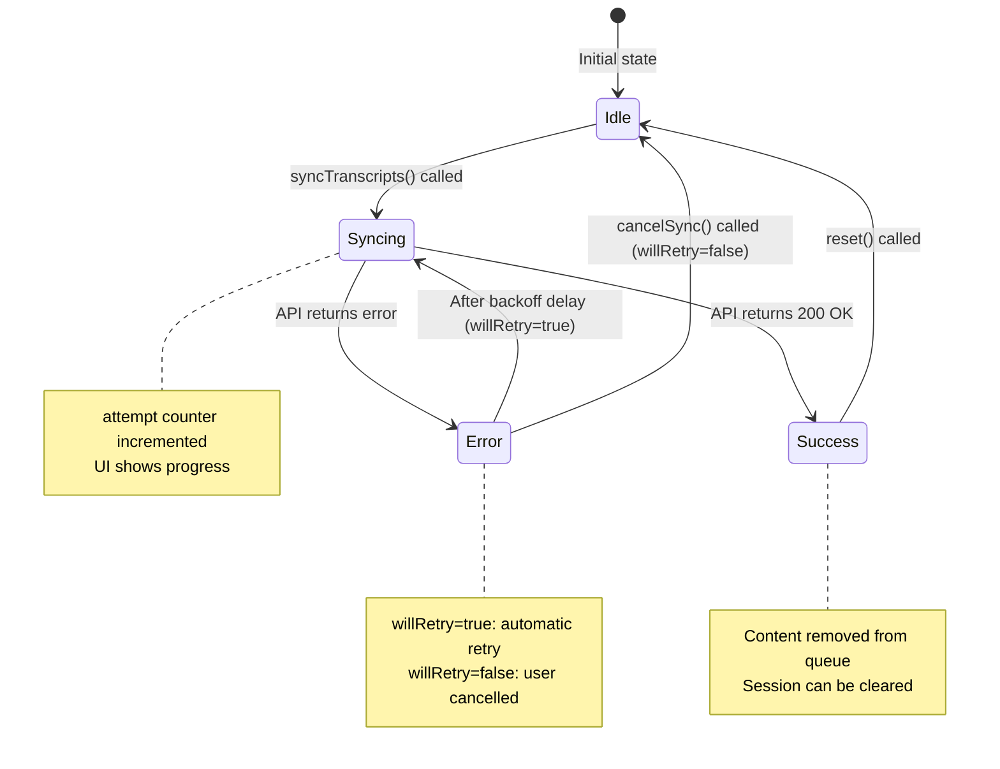
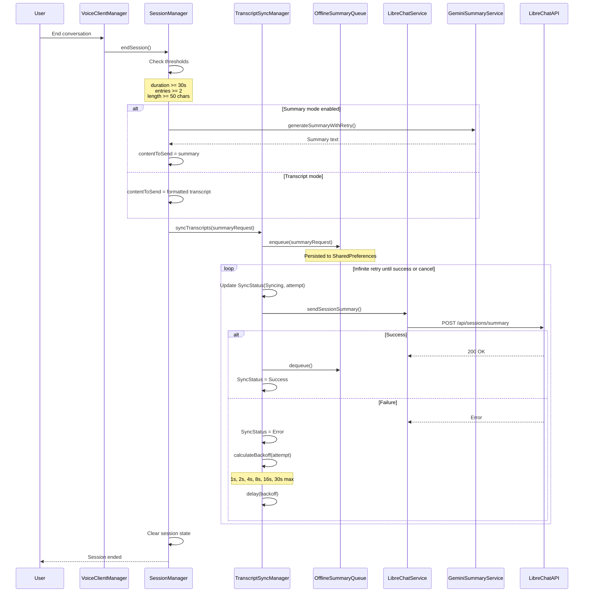

# TranscriptSyncManager Documentation

## Overview

The `TranscriptSyncManager` is an inner class of `SessionManager` responsible for reliable transcript and summary delivery to LibreChat with infinite retry capability. It ensures that conversation data is never lost, even in the face of network failures, app restarts, or other interruptions.

**Key Responsibilities:**
- Synchronize transcripts/summaries to LibreChat with infinite retry
- Implement exponential backoff to avoid overwhelming the server
- Persist pending items across app restarts using `OfflineSummaryQueue`
- Provide observable sync status for UI feedback
- Handle cancellation while preserving data for later retry

**Code Reference:** `SessionManager.kt:870-1059`

---

## Architecture

### Component Relationships

```
SessionManager
    └── TranscriptSyncManager (inner class)
            ├── Uses: OfflineSummaryQueue (persistence)
            ├── Uses: LibreChatService (network)
            └── Exposes: StateFlow<SyncStatus> (observable state)
```

### Design Principles

1. **Reliability First**: Never lose transcript data - retry infinitely until success
2. **Persistence**: Survive app process kills and restarts
3. **Backoff Strategy**: Exponential backoff prevents server overload
4. **Cancellable**: User can cancel sync, but data remains queued
5. **Observable**: UI can observe sync progress via StateFlow

---

## Infinite Retry Mechanism

### Overview

The TranscriptSyncManager implements an infinite retry loop that continues attempting to send transcripts/summaries until either:
1. **Success**: The content is successfully delivered to LibreChat
2. **Cancellation**: The user explicitly cancels the synchronization

### Retry Loop Flow

```kotlin
suspend fun syncTranscripts(summaryRequest: SummaryRequest): Result<Unit> {
    isCancelled = false
    var attempt = 0
    
    // Save to offline queue immediately for persistence
    offlineQueue.enqueue(summaryRequest)
    
    syncJob = scope.launch {
        while (!isCancelled) {
            attempt++
            _syncStatus.value = SyncStatus.Syncing(attempt)
            
            try {
                val result = libreChatService.sendSessionSummary(summaryRequest)
                
                if (result.isSuccess) {
                    // Remove from offline queue on success
                    offlineQueue.dequeue()
                    _syncStatus.value = SyncStatus.Success
                    return@launch
                } else {
                    // Calculate backoff and retry
                    _syncStatus.value = SyncStatus.Error(
                        message = error?.message ?: "Unknown error",
                        willRetry = true
                    )
                    val delay = calculateBackoff(attempt)
                    delay(delay)
                }
            } catch (e: Exception) {
                // Handle exception and retry
                _syncStatus.value = SyncStatus.Error(
                    message = e.message ?: "Unknown error",
                    willRetry = true
                )
                val delay = calculateBackoff(attempt)
                delay(delay)
            }
        }
        
        // Cancelled - content remains in queue
        if (isCancelled) {
            _syncStatus.value = SyncStatus.Error(
                message = "Synchronization cancelled - will retry later",
                willRetry = false
            )
        }
    }
    
    syncJob?.join()
    return if (_syncStatus.value is SyncStatus.Success) {
        Result.success(Unit)
    } else {
        Result.failure(Exception("Transcript sync failed or was cancelled"))
    }
}
```

**Code Reference:** `SessionManager.kt:920-1000`

### Key Characteristics

1. **Immediate Persistence**: Content is saved to `OfflineSummaryQueue` before the first attempt
2. **Infinite Loop**: `while (!isCancelled)` continues until success or cancellation
3. **Attempt Tracking**: Each attempt is numbered and reported via `SyncStatus.Syncing(attempt)`
4. **Error Recovery**: Both `Result.failure` and exceptions trigger retry with backoff
5. **Success Cleanup**: On success, content is removed from the offline queue
6. **Cancellation Safety**: Cancelled sync leaves content in queue for later retry

---

## Exponential Backoff Algorithm

### Overview

The exponential backoff algorithm prevents overwhelming the LibreChat server during network issues or server downtime. It progressively increases the delay between retry attempts.

### Algorithm Implementation

```kotlin
private fun calculateBackoff(attempt: Int): Long {
    val delay = (BASE_DELAY * Math.pow(BACKOFF_FACTOR, (attempt - 1).toDouble())).toLong()
    return delay.coerceAtMost(MAX_DELAY)
}
```

**Constants:**
- `BASE_DELAY = 1000L` (1 second)
- `BACKOFF_FACTOR = 2.0` (doubles each time)
- `MAX_DELAY = 30000L` (30 seconds cap)

**Code Reference:** `SessionManager.kt:1010-1014`

### Backoff Timing Table

| Attempt | Calculation | Delay (ms) | Delay (seconds) |
|---------|-------------|------------|-----------------|
| 1 | 1000 × 2^0 | 1,000 | 1s |
| 2 | 1000 × 2^1 | 2,000 | 2s |
| 3 | 1000 × 2^2 | 4,000 | 4s |
| 4 | 1000 × 2^3 | 8,000 | 8s |
| 5 | 1000 × 2^4 | 16,000 | 16s |
| 6 | 1000 × 2^5 | 32,000 → 30,000 | 30s (capped) |
| 7+ | 1000 × 2^n | 30,000 | 30s (capped) |

### Rationale

1. **Fast Initial Retries**: 1s, 2s, 4s allow quick recovery from transient network issues
2. **Progressive Backoff**: Prevents server overload during extended outages
3. **Maximum Cap**: 30s prevents excessive delays while still being respectful
4. **Predictable**: Deterministic timing makes behavior easy to understand and test

---

## OfflineSummaryQueue Persistence

### Overview

The `OfflineSummaryQueue` provides persistent storage for transcripts/summaries awaiting synchronization. It uses Android's `SharedPreferences` to survive app process kills and device restarts.

**Code Reference:** `OfflineSummaryQueue.kt:1-150`

### Storage Mechanism

**Technology:** Android SharedPreferences
- **File:** `offline_summaries.xml` (managed by Android)
- **Format:** JSON-serialized list of `SummaryRequest` objects
- **Persistence:** Survives app process kill, device restart, app updates

```kotlin
class OfflineSummaryQueue(context: Context) {
    private val prefs: SharedPreferences = context.getSharedPreferences(
        "offline_summaries",
        Context.MODE_PRIVATE
    )
    
    private val json = Json {
        ignoreUnknownKeys = true
        encodeDefaults = true
    }
}
```

### Queue Operations

#### Enqueue (Add to Queue)

```kotlin
fun enqueue(summary: SummaryRequest) {
    val queue = getQueue().toMutableList()
    
    // Enforce max queue size (FIFO - remove oldest if full)
    if (queue.size >= MAX_QUEUE_SIZE) {
        queue.removeAt(0)
        Log.w(TAG, "Queue full, removed oldest summary")
    }
    
    queue.add(summary)
    saveQueue(queue)
}
```

**Behavior:**
- Adds item to end of queue
- If queue is full (10 items), removes oldest item (FIFO)
- Immediately persists to SharedPreferences

**Code Reference:** `OfflineSummaryQueue.kt:30-45`

#### Dequeue (Remove from Queue)

```kotlin
fun dequeue(): SummaryRequest? {
    val queue = getQueue().toMutableList()
    if (queue.isEmpty()) {
        return null
    }
    
    val summary = queue.removeAt(0)
    saveQueue(queue)
    return summary
}
```

**Behavior:**
- Removes and returns oldest item (FIFO)
- Returns `null` if queue is empty
- Immediately persists updated queue

**Code Reference:** `OfflineSummaryQueue.kt:50-65`

### Survival Across App Restart

**Scenario 1: App Process Kill**
1. User ends session → content enqueued to SharedPreferences
2. Android kills app process (memory pressure)
3. User reopens app → `processOfflineQueue()` called on startup
4. Queue is loaded from SharedPreferences
5. Sync attempts resume from where they left off

**Scenario 2: Device Restart**
1. User ends session → content enqueued to SharedPreferences
2. Device is restarted
3. User opens app → `processOfflineQueue()` called on startup
4. Queue is loaded from SharedPreferences (survives reboot)
5. Sync attempts resume

**Scenario 3: App Update**
1. User ends session → content enqueued to SharedPreferences
2. App is updated via Play Store
3. User opens new version → `processOfflineQueue()` called on startup
4. Queue is loaded from SharedPreferences (survives update)
5. Sync attempts resume

### Queue Limits

- **Maximum Size:** 10 items (`MAX_QUEUE_SIZE`)
- **Overflow Behavior:** FIFO - oldest item is removed when queue is full
- **Rationale:** Prevents unbounded growth while preserving most recent data

---

## SyncStatus State Machine

### Overview

The `SyncStatus` sealed class represents the current state of transcript synchronization. It provides observable state for UI feedback and debugging.

### State Definitions

```kotlin
sealed class SyncStatus {
    object Idle : SyncStatus()
    data class Syncing(val attempt: Int) : SyncStatus()
    object Success : SyncStatus()
    data class Error(val message: String, val willRetry: Boolean) : SyncStatus()
}
```

**Code Reference:** `SessionManager.kt:75-80`

### State Descriptions

| State | Description | UI Implications |
|-------|-------------|-----------------|
| `Idle` | No sync in progress | Show normal UI |
| `Syncing(attempt)` | Sync in progress, attempt N | Show progress indicator with attempt count |
| `Success` | Sync completed successfully | Show success message, allow new session |
| `Error(message, willRetry=true)` | Sync failed, will retry | Show error with "retrying..." message |
| `Error(message, willRetry=false)` | Sync cancelled by user | Show "cancelled" message, allow new session |

### State Transition Diagram



### State Transitions

#### Idle → Syncing
- **Trigger:** `syncTranscripts()` called
- **Action:** Start retry loop, set attempt = 1
- **Observable:** `_syncStatus.value = SyncStatus.Syncing(1)`

#### Syncing → Success
- **Trigger:** `libreChatService.sendSessionSummary()` returns success
- **Action:** Remove from offline queue, exit retry loop
- **Observable:** `_syncStatus.value = SyncStatus.Success`

#### Syncing → Error (with retry)
- **Trigger:** API call fails or throws exception
- **Action:** Calculate backoff, delay, increment attempt
- **Observable:** `_syncStatus.value = SyncStatus.Error(message, willRetry=true)`

#### Error → Syncing (automatic retry)
- **Trigger:** Backoff delay completes
- **Action:** Increment attempt, retry API call
- **Observable:** `_syncStatus.value = SyncStatus.Syncing(attempt)`

#### Syncing → Error (cancelled)
- **Trigger:** `cancelSync()` called
- **Action:** Set `isCancelled = true`, exit retry loop
- **Observable:** `_syncStatus.value = SyncStatus.Error("Cancelled...", willRetry=false)`

#### Success → Idle
- **Trigger:** `reset()` called after successful sync
- **Action:** Clear sync job, reset flags
- **Observable:** `_syncStatus.value = SyncStatus.Idle`

#### Error → Idle
- **Trigger:** `reset()` called after cancellation
- **Action:** Clear sync job, reset flags
- **Observable:** `_syncStatus.value = SyncStatus.Idle`

### Observable State

The sync status is exposed as a `StateFlow` for UI observation:

```kotlin
val syncStatus: StateFlow<SyncStatus>
    get() = transcriptSyncManager.syncStatus
```

**Usage in UI:**
```kotlin
val syncStatus by sessionManager.syncStatus.collectAsState()

when (syncStatus) {
    is SyncStatus.Idle -> { /* Normal UI */ }
    is SyncStatus.Syncing -> { 
        Text("Syncing... attempt ${syncStatus.attempt}")
    }
    is SyncStatus.Success -> { 
        Text("✅ Synced successfully")
    }
    is SyncStatus.Error -> {
        if (syncStatus.willRetry) {
            Text("⚠️ ${syncStatus.message} - retrying...")
        } else {
            Text("🚫 ${syncStatus.message}")
        }
    }
}
```

---

## Cancellation Handling

### Overview

Users can cancel ongoing transcript synchronization, but the content is preserved in the offline queue for later retry. This ensures no data loss while giving users control.

### Cancellation Flow

```kotlin
fun cancelSync() {
    Log.w(TAG, "⚠️ Cancelling transcript synchronization")
    Log.d(TAG, "💾 Content will remain in offline queue for later retry")
    isCancelled = true
    syncJob?.cancel()
    _syncStatus.value = SyncStatus.Error(
        message = "Cancelled by user - will retry later",
        willRetry = false
    )
}
```

**Code Reference:** `SessionManager.kt:1005-1014`

### Cancellation Behavior

1. **User Action**: User clicks "Cancel" button in UI
2. **Flag Set**: `isCancelled = true` stops the retry loop
3. **Job Cancelled**: `syncJob?.cancel()` terminates the coroutine
4. **Status Updated**: `SyncStatus.Error(willRetry=false)` indicates cancellation
5. **Content Preserved**: Item remains in `OfflineSummaryQueue`
6. **Later Retry**: On next app start, `processOfflineQueue()` will retry

### Key Guarantees

✅ **No Data Loss**: Content remains in offline queue
✅ **Immediate Response**: Cancellation is immediate (no waiting for retry delay)
✅ **Clear Status**: UI shows "cancelled" state with `willRetry=false`
✅ **Automatic Retry**: Next app start will attempt to send queued content

### Usage in SessionManager

```kotlin
// In SessionManager
fun cancelTranscriptSync() {
    transcriptSyncManager.cancelSync()
}

// Check if sync is in progress (blocks new sessions)
fun isSyncInProgress(): Boolean {
    return syncStatus.value is SyncStatus.Syncing
}
```

**Code Reference:** `SessionManager.kt:835-845`

---

## Queue Processing on App Start

### Overview

When the app starts, any transcripts/summaries that failed to sync in previous sessions are automatically retried. This ensures eventual delivery of all conversation data.

### Process Flow

```kotlin
suspend fun processOfflineQueue(): Int {
    var processedCount = 0
    
    Log.d(TAG, "Starting queue processing, queue size: ${size()}")
    
    while (size() > 0) {
        val summary = dequeue() ?: break
        
        Log.d(TAG, "Processing queued summary for conversation: ${summary.conversationId}")
        
        val result = libreChatService.sendSessionSummary(summary)
        
        if (result.isSuccess) {
            processedCount++
            Log.d(TAG, "Successfully processed queued summary")
        } else {
            // Re-enqueue at front and stop processing
            Log.w(TAG, "Failed to process summary, re-enqueueing")
            reEnqueueAtFront(summary)
            break
        }
    }
    
    Log.d(TAG, "Queue processing complete, processed: $processedCount, remaining: ${size()}")
    return processedCount
}
```

**Code Reference:** `OfflineSummaryQueue.kt:90-120`

### Batch Processing Logic

1. **Check Queue Size**: Get number of pending items
2. **Process FIFO**: Dequeue oldest item first
3. **Attempt Send**: Try to send via `libreChatService`
4. **On Success**: Increment counter, continue to next item
5. **On Failure**: Re-enqueue at front, stop processing
6. **Return Count**: Number of successfully processed items

### Re-enqueue Strategy

When an item fails to send during batch processing:

```kotlin
private fun reEnqueueAtFront(summary: SummaryRequest) {
    val queue = getQueue().toMutableList()
    queue.add(0, summary)  // Add at front (highest priority)
    
    // Enforce max queue size from the end if needed
    if (queue.size > MAX_QUEUE_SIZE) {
        queue.removeAt(queue.size - 1)
        Log.w(TAG, "Queue full after re-enqueue, removed newest summary")
    }
    
    saveQueue(queue)
}
```

**Rationale:**
- Failed item gets highest priority (front of queue)
- Stops processing to avoid cascading failures
- Preserves queue order for remaining items
- Will retry on next app start or network change

**Code Reference:** `OfflineSummaryQueue.kt:125-140`

### Integration with SessionManager

```kotlin
// In SessionManager
suspend fun processOfflineQueue(): Int {
    return transcriptSyncManager.processOfflineQueue()
}
```

**Called from:**
- `MainActivity.onCreate()` - On app start
- Network connectivity change listener (future enhancement)
- Manual "Retry" button in UI (future enhancement)

**Code Reference:** `SessionManager.kt:850-852`

---

## Threading and Concurrency

### Coroutine Usage

All sync operations use Kotlin coroutines for non-blocking I/O:

```kotlin
private inner class TranscriptSyncManager {
    private var syncJob: Job? = null
    
    suspend fun syncTranscripts(summaryRequest: SummaryRequest): Result<Unit> {
        syncJob = scope.launch {
            // Retry loop runs in coroutine
            while (!isCancelled) {
                // Network call
                val result = libreChatService.sendSessionSummary(summaryRequest)
                // Delay (non-blocking)
                delay(calculateBackoff(attempt))
            }
        }
        syncJob?.join()  // Wait for completion
    }
}
```

### Thread Safety

| Component | Thread Safety | Mechanism |
|-----------|---------------|-----------|
| `syncStatus` | Thread-safe | `StateFlow` (thread-safe by design) |
| `isCancelled` | Single-threaded | Accessed only from sync coroutine |
| `syncJob` | Thread-safe | Coroutine `Job` (thread-safe) |
| `offlineQueue` | Thread-safe | SharedPreferences (thread-safe) |

### Dispatcher Usage

- **Network Calls**: `Dispatchers.IO` (via `libreChatService`)
- **Delay**: `Dispatchers.Default` (via `delay()`)
- **State Updates**: `Dispatchers.Main` (via `StateFlow` collection in UI)

---

## Error Handling

### Network Errors

| Error Type | Handling | Retry? |
|------------|----------|--------|
| Network timeout | Log, backoff, retry | Yes (infinite) |
| 429 Rate limit | Log, backoff, retry | Yes (infinite) |
| 500 Server error | Log, backoff, retry | Yes (infinite) |
| 401 Unauthorized | Log, backoff, retry | Yes (infinite) |
| Connection refused | Log, backoff, retry | Yes (infinite) |

**Rationale:** All network errors are treated as transient and retried infinitely. The exponential backoff prevents overwhelming the server.

### Queue Errors

| Error Type | Handling |
|------------|----------|
| JSON parse error | Log, clear corrupted queue |
| SharedPreferences write error | Log, continue (data lost) |
| Queue full | Remove oldest item (FIFO) |

### Cancellation

- **User Cancellation**: Not an error - normal operation
- **Status**: `SyncStatus.Error(willRetry=false)`
- **Data**: Preserved in queue for later retry

---

## Sequence Diagram: Complete Sync Flow

The following diagram shows the complete flow of transcript synchronization with infinite retry:



---

## Usage Examples

### Starting a Sync

```kotlin
// In SessionManager.endSession()
val summaryRequest = SummaryRequest(
    conversationId = session.conversationId,
    sessionSummary = contentToSend
)

val syncResult = transcriptSyncManager.syncTranscripts(summaryRequest)

if (syncResult.isSuccess) {
    Log.d(TAG, "✅ Session transcript synchronized successfully")
} else {
    Log.w(TAG, "⚠️ Transcript synchronization was cancelled or failed")
}
```

### Observing Sync Status in UI

```kotlin
@Composable
fun SyncStatusIndicator(sessionManager: SessionManager) {
    val syncStatus by sessionManager.syncStatus.collectAsState()
    
    when (syncStatus) {
        is SyncStatus.Idle -> {
            // No indicator needed
        }
        is SyncStatus.Syncing -> {
            Row {
                CircularProgressIndicator()
                Text("Syncing... attempt ${(syncStatus as SyncStatus.Syncing).attempt}")
            }
        }
        is SyncStatus.Success -> {
            Row {
                Icon(Icons.Default.Check, contentDescription = "Success")
                Text("✅ Synced successfully")
            }
        }
        is SyncStatus.Error -> {
            val error = syncStatus as SyncStatus.Error
            Row {
                Icon(Icons.Default.Warning, contentDescription = "Error")
                if (error.willRetry) {
                    Text("⚠️ ${error.message} - retrying...")
                } else {
                    Text("🚫 ${error.message}")
                }
            }
        }
    }
}
```

### Cancelling a Sync

```kotlin
// In UI button handler
Button(onClick = { sessionManager.cancelTranscriptSync() }) {
    Text("Cancel Sync")
}
```

### Processing Queue on App Start

```kotlin
// In MainActivity.onCreate()
lifecycleScope.launch {
    val processedCount = sessionManager.processOfflineQueue()
    if (processedCount > 0) {
        Log.d(TAG, "Processed $processedCount queued transcripts")
    }
}
```

---

## Testing Considerations

### Unit Tests

**Test Cases:**
1. Exponential backoff calculation
2. Queue enqueue/dequeue operations
3. Queue persistence (mock SharedPreferences)
4. State transitions
5. Cancellation behavior

### Integration Tests

**Test Scenarios:**
1. Successful sync on first attempt
2. Retry after network failure
3. Infinite retry until success
4. Cancellation preserves data
5. Queue processing on app start
6. Queue overflow (FIFO removal)

### Manual Testing

**Test Procedures:**
1. **Network Failure**: Turn off WiFi during sync, verify retry
2. **App Kill**: Kill app during sync, restart, verify queue processing
3. **Device Restart**: Restart device, verify queue survives
4. **Cancellation**: Cancel sync, verify data in queue
5. **Queue Overflow**: Queue 11 items, verify oldest removed

---

## Performance Considerations

### Memory Usage

- **Queue Size**: Limited to 10 items (prevents unbounded growth)
- **StateFlow**: Single value, minimal memory overhead
- **Coroutine**: Single job per sync, cancelled when complete

### Network Usage

- **Exponential Backoff**: Reduces network traffic during outages
- **Single Request**: One HTTP request per attempt
- **No Polling**: Event-driven, not polling-based

### Battery Usage

- **Efficient Delays**: Uses coroutine `delay()` (non-blocking)
- **No Wake Locks**: Sync happens when app is active
- **Batch Processing**: Processes queue efficiently on app start

---

## Future Enhancements

### Potential Improvements

1. **Network Monitoring**: Trigger queue processing when network becomes available
2. **Manual Retry Button**: Allow user to manually trigger queue processing
3. **Sync Progress UI**: Show detailed progress for each queued item
4. **Queue Inspection**: UI to view queued items
5. **Priority Queue**: Allow high-priority items to jump the queue
6. **Compression**: Compress large transcripts before sending
7. **Chunking**: Split very large transcripts into multiple requests

### Considerations

- **Complexity vs. Benefit**: Current implementation is simple and reliable
- **User Experience**: Most users won't need advanced features
- **Maintenance**: Keep code simple and maintainable

---

## Related Documentation

- [Session Pipelines](../domain/session-pipelines.md) - Complete session lifecycle
- [Components](components.md) - SessionManager component details
- [State Machines](../domain/state-machines.md) - SyncStatus state machine
- [Database Schema](../operations/database-schema.md) - SessionEntity and persistence

---

**Last Updated:** 2025-12-04
**Version:** 1.0

---

## Related Documentation

### Session Management
- [Session Pipelines](../domain/session-pipelines.md) - Complete session lifecycle
- [Components](components.md) - SessionManager component details
- [Context Builder](context-builder.md) - Conversation context building
- [Summary Generation](summary-generation.md) - AI-powered summaries

### State Management
- [State Machines](../domain/state-machine.md) - SyncStatus state machine
- [Domain Model](../domain/model.md) - Core domain objects and relationships

### Data & Persistence
- [Database Schema](../operations/database-schema.md) - SessionEntity and persistence

### Architecture
- [Architecture Overview](../project/architecture.md) - System architecture and components
