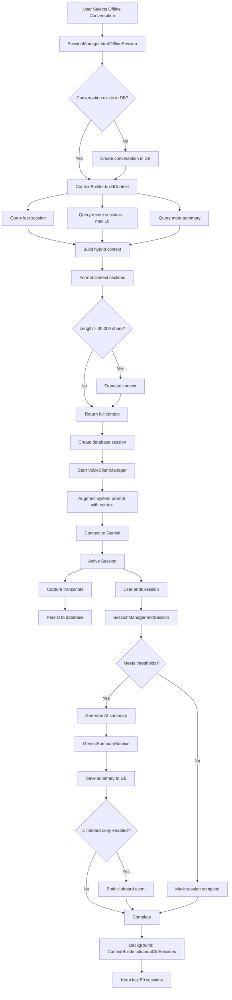
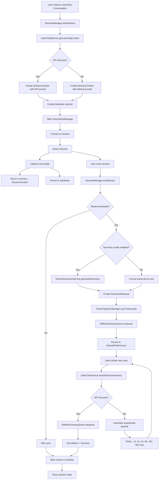

# System Architecture

**Source Documents:**
- VoiceClientManagerSimple.kt (actual wrapper used by MainActivity)
- audio/simple/VoiceClientManager.kt (simplified manager)
- audio/simple/AudioEngine.kt (simplified audio engine)
- Gemini Live API integration

**Last Updated:** 2025-12-13

---

## Overview

This document describes the system architecture of the Android Gemini Multimodal Live WebSocket Demo application. The application uses a **simplified architecture** that delegates most audio processing to the Gemini Live API. The complex state machine and audio pipeline have been replaced with a straightforward composition of GeminiClient, AudioEngine, and AudioDeviceHandler (~300 lines total).

---

## High-Level Architecture

```
┌─────────────────────────────────────────────────────────┐
│                    MainActivity                          │
│  - Lifecycle callbacks (onPause, onResume, onDestroy)  │
│  - Memory callbacks (onTrimMemory, onLowMemory)        │
└────────────────┬────────────────────────────────────────┘
                 │
                 ├──> VoiceClientManagerSimple (Wrapper)
                 │    └─> SimpleVoiceClientManager (~300 lines)
                 │         ├─> GeminiClient (WebSocket + Protocol)
                 │         ├─> AudioEngine (Recording + Playback)
                 │         └─> AudioDeviceHandler (Bluetooth routing)
                 │
                 ├──> SessionManager
                 │    - Transcript sync lifecycle
                 │    - Cleanup on destroy
                 │
                 └──> Services
                      ├─> VoiceService (Foreground)
                      │   - Background operation
                      │   - Wake lock management
                      │   - Notification management
                      │
                      └─> PorcupineService (Foreground)
                          - Wake word detection
                          - Independent audio processing
```

**Key Simplifications:**
- **No Complex State Machine** - Simple boolean flags instead
- **Gemini-Centric Processing** - Audio processing delegated to Gemini API
- **Direct Event Handling** - Events handled directly by Gemini client
- **Minimal Code** - ~300 lines vs ~3000 lines in old architecture

---

## Core Components

### 1. VoiceClientManagerSimple (Actual Implementation)

**Role:** Wrapper that provides compatibility with MainActivity while using simplified architecture.

**Location:** `VoiceClientManagerSimple.kt`

**Architecture:**
- **Wrapper Pattern:** Adapts SimpleVoiceClientManager to existing MainActivity interface
- **Simplified State:** Uses boolean flags instead of complex state machine
- **Direct Delegation:** Most operations delegated to SimpleVoiceClientManager

**Key Responsibilities:**
- API key validation and configuration
- System prompt setup from preferences
- Tool declarations configuration
- Error handling and UI state mapping
- Lifecycle management (start/stop/pause/resume)

### 2. SimpleVoiceClientManager (Core Implementation)

**Role:** Simplified voice client that coordinates GeminiClient, AudioEngine, and AudioDeviceHandler.

**Location:** `audio/simple/VoiceClientManager.kt`

**Architecture (~300 lines):**
- **GeminiClient** - WebSocket connection and protocol handling
- **AudioEngine** - Audio recording and playback
- **AudioDeviceHandler** - Bluetooth audio routing
- **Simple State** - Boolean flags (isConnected, isMuted, isBotSpeaking)

**Key Benefits:**
- **Minimal Complexity** - No state machine, direct event handling
- **Gemini-Centric** - Delegates processing to Gemini Live API
- **Easy Testing** - Simple composition, clear responsibilities
- **Fast Development** - Straightforward logic, fewer abstractions

**Code Reference:** `audio/simple/VoiceClientManager.kt`

### 3. AudioEngine (Simplified Component)

**Role:** Handles audio recording and playback with minimal complexity.

**Location:** `audio/simple/AudioEngine.kt`

**Key Simplifications:**
- **Direct Android Audio:** Uses AudioRecord/AudioTrack without complex buffering
- **Simple Operations:** start/stop recording, queue/play audio
- **No State Machine:** Boolean flags for recording/playing state
- **Gemini Integration:** Optimized for Gemini Live API requirements

**Responsibilities:**
- Audio recording from microphone (16kHz, mono, PCM 16-bit)
- Audio playback to speaker (24kHz, mono, PCM 16-bit)
- Audio level calculation for UI indicators
- Simple audio queue management
- Echo cancellation (when available)

**Configuration:**
- Input sample rate: 16000 Hz (Gemini Live requirement)
- Output sample rate: 24000 Hz (Gemini Live output)
- Audio format: PCM 16-bit
- Channel: Mono
- Buffer size: Android minimum * 2

**Code Reference:** `audio/simple/AudioEngine.kt`

### 4. GeminiClient (Integrated Component)

**Role:** Handles WebSocket connection and Gemini Live protocol.

**Location:** Part of `audio/simple/VoiceClientManager.kt`

**Responsibilities:**
- WebSocket connection to Gemini Live API
- Protocol message handling (setup, audio, text, tools)
- Connection state management
- Error handling and reconnection
- Tool calling integration

**Integration Benefits:**
- **Simplified Architecture:** No separate WebSocket abstraction
- **Direct Protocol Handling:** Gemini-specific message processing
- **Reduced Complexity:** Fewer components to coordinate

---

### 5. VoiceService

**Role:** Foreground service enabling background operation during active conversations.

**Responsibilities:**
- Persistent notification showing conversation status
- Wake lock management for screen-off operation
- Automatic lifecycle management
- Notification actions for ending conversation
- Service timeout management (max 2 hours)

**Wake Lock Configuration:**
- Type: PARTIAL_WAKE_LOCK (keeps CPU running, allows screen off)
- Timeout: 2 hours (safety measure)
- Automatically released on session end

**Service Lifecycle:**
1. Started when conversation begins
2. Runs as foreground service with notification
3. Acquires wake lock for screen-off operation
4. Auto-stops after 2 hour timeout
5. Stops when conversation ends or user terminates

**Code Reference:** `VoiceService.kt`

**Source:** README.md - Architecture, REFACTORING_PLAN.md - Phase 4

---

### 3. ReconnectionManager

**Role:** Handles automatic reconnection logic with user interaction.

**Reconnection Strategy:**
1. Attempt 1: Wait 1 second
2. Attempt 2: Wait 2 seconds
3. Attempt 3: Wait 4 seconds
4. Attempt 4: Wait 8 seconds
5. Attempt 5: Wait 16 seconds
6. After 5 attempts: Show dialog asking user to continue or end session

**User Options:**
- "Kontynuuj" - Resets counter and continues reconnection
- "Zakończ rozmowę" - Ends session and navigates to thread list

**Code Reference:** `VoiceClientManager.kt` (ReconnectionManager inner class)

**Source:** README.md - Architecture

---

### 4. SessionManager

**Role:** Manages conversation sessions and LibreChat integration.

**Responsibilities:**
- Session lifecycle management
- Transcript synchronization with LibreChat
- Offline conversation storage
- Session resumption handling
- Cleanup on app termination

**Transcript Sync:**
- Infinite retry with exponential backoff
- Progress indicator showing attempt count
- Blocks new conversations until sync completes
- User can cancel with warning

**Code Reference:** `SessionManager.kt`

**Source:** README.md - Architecture

---

### 5. ImageProcessor

**Role:** Validates, compresses, and resizes images before transmission.

**Image Processing Parameters:**
- Max raw size: 5MB (before processing)
- Compression quality: 85% JPEG
- Max dimension: 2300px (longest side, maintains aspect ratio)
- Max final size: ~7MB (after Base64 encoding)

**Processing Steps:**
1. Load image with efficient memory usage (inSampleSize)
2. Resize if longest dimension > 2300px
3. Compress to 85% JPEG quality
4. Validate final size
5. Queue for retry if connection lost during send

**Code Reference:** `utils/ImageProcessor.kt`

**Source:** README.md - Architecture

---

### 6. WebSocketErrorClassifier

**Role:** Classifies errors to determine appropriate response strategy.

**Error Categories:**

**RECOVERABLE** (triggers automatic reconnection):
- SocketTimeoutException - Network timeout
- UnknownHostException - DNS failure
- IOException - General I/O error
- ConnectException - Connection refused
- EOFException - Connection closed unexpectedly
- Ping-pong timeout errors

**FATAL** (shows error, no retry):
- SSLException - Certificate error
- ProtocolException - Protocol mismatch
- IllegalStateException - Programming error
- SecurityException - Permission denied

**UNKNOWN** (logged and treated as recoverable)

**Code Reference:** `utils/WebSocketErrorClassifier.kt`

**Source:** README.md - Architecture

---

### 7. PorcupineService

**Role:** Independent foreground service for wake word detection.

**Responsibilities:**
- Picovoice Porcupine integration
- Wake word detection (built-in and custom)
- Independent audio processing
- Service timeout management (max 8 hours)
- Auto-start on boot (with user consent)

**Wake Words:**
- Built-in: "ALEXA" (toggle microphone)
- Custom: User-defined wake words from .ppn files
- Rate limiting: 5 second minimum interval between detections

**Code Reference:** `PorcupineService.kt`

**Source:** README.md - Architecture, REFACTORING_PLAN.md - Phase 5

---

### 8. PicovoiceManager

**Role:** Manages Picovoice configuration and wake word associations.

**Responsibilities:**
- Enable/disable Picovoice
- Load system and custom wake words
- Manage wake word to thread associations
- Handle Picovoice lifecycle

**Code Reference:** `PicovoiceManager.kt`

**Source:** README.md - Code Structure

---

## UI Components

### ConnectionStatusIndicator

Shows current connection state in the conversation screen.

**States:**
- "Połączono" (green) - CONNECTED
- "Ponowne łączenie... próba X z 5" (yellow) - RECONNECTING
- "Rozłączono" (red) - DISCONNECTED

**Code Reference:** `ui/ConnectionStatusIndicator.kt`

**Source:** README.md - UI Components

---

### ReconnectionDialog

Appears after 5 failed reconnection attempts.

**Options:**
- "Kontynuuj" - Resets attempt counter and continues reconnection
- "Zakończ rozmowę" - Ends session and returns to thread list

**Code Reference:** `ui/ReconnectionDialog.kt`

**Source:** README.md - UI Components

---

### BackPressHandler

Manages back button behavior based on connection state.

**Behavior:**
- Active conversation (CONNECTED/RECONNECTING): Shows confirmation dialog
- Disconnected: Navigates to thread list without dialog
- Thread list screen: Exits app

**Code Reference:** `ui/BackPressHandler.kt`

**Source:** README.md - UI Components

---

### ImageProcessingIndicator

Shows progress during image processing.

**Display:**
- Progress bar
- Text: "Przetwarzanie obrazu..."
- Appears during compression and resize operations

**Code Reference:** `ui/ImageProcessingIndicator.kt`

**Source:** README.md - UI Components

---

## Data Flow

### Audio Streaming Flow (Simplified)

```
User Microphone
      ↓
AudioEngine.startRecording()
      ↓
AudioRecord (16kHz, 16-bit PCM, Mono)
      ↓
Audio Level Calculation
      ↓
GeminiClient.sendAudio() [if not muted]
      ↓
Base64 Encoding
      ↓
Gemini Live API
      ↓
WebSocket Response (Audio Chunks)
      ↓
AudioEngine.queueAudio()
      ↓
Base64 Decoding
      ↓
AudioTrack (24kHz, 16-bit PCM, Mono)
      ↓
Device Speakers/Bluetooth
```

**Key Simplifications:**
- **No State Machine:** Simple boolean checks (isMuted, isConnected)
- **Direct Processing:** Audio sent directly to Gemini without complex routing
- **Simple Queue:** Basic audio queue without generation tracking
- **Gemini Handles Complexity:** VAD, transcription, synthesis done server-side
- **Minimal Buffering:** Standard Android audio buffers only

---

### Offline Session Data Flow



**Key Components:**
- **ContextBuilder:** Builds hybrid context from database
- **SessionManager:** Orchestrates session lifecycle
- **GeminiSummaryService:** Generates AI summaries
- **Database:** Stores conversations, sessions, transcripts, summaries

**Data Storage:**
- **SharedPreferences:** Conversation definitions (title, prompt, settings)
- **Room Database:** Session history (transcripts, summaries, timestamps)

**Context Strategy:**
- Section 1: Conversation overview (meta-summary)
- Section 2: Recent sessions (summaries only, max 10)
- Section 3: Last session (full transcript)

---

### LibreChat Session Data Flow



**Key Components:**
- **LibreChatService:** API client for LibreChat integration
- **TranscriptSyncManager:** Handles reliable delivery with infinite retry
- **OfflineSummaryQueue:** Persistent queue surviving app restart
- **GeminiSummaryService:** Generates AI summaries

**Sync Strategy:**
- **Infinite Retry:** Never gives up until success or user cancels
- **Exponential Backoff:** 1s, 2s, 4s, 8s, 16s, 30s (max)
- **Persistence:** Queue stored in SharedPreferences
- **Recovery:** Queue processed on app start

**Thresholds:**
- Minimum duration: 30 seconds
- Minimum entries: 2 (user + bot)
- Minimum length: 50 characters

---

### Image Processing Flow

```
User Selects Image
      ↓
ImageProcessor.processImage()
      ↓
Load with inSampleSize (memory efficient)
      ↓
Resize if > 2300px (maintain aspect ratio)
      ↓
Compress to 85% JPEG
      ↓
Validate size < 7MB
      ↓
Base64 Encoding
      ↓
WebSocket Message
      ↓
Gemini Live API
```

**Source:** README.md - Architecture

---

### Reconnection Flow

```
Connection Lost
      ↓
WebSocketErrorClassifier
      ↓
[Is Recoverable?]
      ├─ YES → ReconnectionManager
      │         ↓
      │    Attempt 1 (1s delay)
      │         ↓
      │    Attempt 2 (2s delay)
      │         ↓
      │    Attempt 3 (4s delay)
      │         ↓
      │    Attempt 4 (8s delay)
      │         ↓
      │    Attempt 5 (16s delay)
      │         ↓
      │    [Success?]
      │    ├─ YES → Connected
      │    └─ NO → Show Dialog
      │              ├─ Continue → Reset & Retry
      │              └─ End → Disconnect
      │
      └─ NO → Show Error, No Retry
```

**Source:** README.md - Architecture

---

### Session Lifecycle

```
App Start
      ↓
MainActivity.onCreate()
      ↓
User Starts Conversation
      ↓
VoiceClientManager.start()
      ├─> WebSocket Connect
      ├─> AudioRecord Start
      ├─> Wake Lock Acquire
      └─> VoiceService Start
      ↓
[App Goes to Background]
      ↓
MainActivity.onPause()
      ├─> Audio Recording Paused
      └─> VoiceService Continues
      ↓
[App Returns to Foreground]
      ↓
MainActivity.onResume()
      └─> Audio Recording Resumed
      ↓
[User Ends Conversation OR Timeout]
      ↓
VoiceClientManager.stop()
      ├─> WebSocket Close
      ├─> AudioRecord Stop & Release
      ├─> AudioTrack Stop & Release
      ├─> Wake Lock Release
      └─> VoiceService Stop
      ↓
MainActivity.onDestroy()
      └─> Final Cleanup
```

**Source:** REFACTORING_PLAN.md - Phase 2

---

## Resource Management Architecture

### Proposed Resource Manager (Future Enhancement)

```
┌─────────────────────────────────────────────────────────┐
│                    MainActivity                          │
└────────────────┬────────────────────────────────────────┘
                 │
                 ├──> ResourceManager (Planned)
                 │    - Centralized resource tracking
                 │    - Automatic cleanup scheduling
                 │    - Leak detection
                 │    - Session timeout management
                 │
                 ├──> VoiceClientManager
                 │    - Registers wake locks
                 │    - Registers audio resources
                 │    - Registers WebSocket connections
                 │
                 └──> SessionManager
                      - Registers sync jobs
                      - Cleanup coordination
```

**Tracked Resources:**
- Wake locks (with acquisition time)
- Audio recorders (recording state)
- WebSocket connections (URL and state)
- Foreground services (service name)

**Anomaly Detection:**
- Wake lock held > 2 hours
- Multiple audio recorders active
- Multiple WebSocket connections
- Services running beyond timeout

**Source:** REFACTORING_PLAN.md - Phase 1

---

## Error Handling

### Gemini API Error Handling

The application handles various error types from the Gemini API with different strategies:

#### Error Classification

**RECOVERABLE ERRORS** (Trigger automatic retry):

| Error Type | HTTP Code | Handling Strategy | Retry? |
|------------|-----------|-------------------|--------|
| Network timeout | - | Exponential backoff reconnection | Yes |
| Connection refused | - | Exponential backoff reconnection | Yes |
| DNS failure | - | Exponential backoff reconnection | Yes |
| WebSocket close (unexpected) | - | Automatic reconnection | Yes |
| Rate limit exceeded | 429 | Longer backoff (30s), then retry | Yes |
| Server error | 500, 502, 503 | Exponential backoff, then retry | Yes |
| Service unavailable | 503 | Exponential backoff, then retry | Yes |

**PERMANENT FAILURES** (No retry, user notification):

| Error Type | HTTP Code | Handling Strategy | Retry? |
|------------|-----------|-------------------|--------|
| Invalid API key | 401 | Show error, prompt for valid key | No |
| Quota exceeded | 429 (quota) | Show error, inform user of quota limit | No |
| Safety ratings block | - | Log content, skip generation, continue | No |
| Invalid request format | 400 | Log error, show user message | No |
| SSL/Certificate error | - | Show error, check system time | No |
| Protocol error | - | Show error, update app | No |

#### Safety Ratings Handling

When Gemini blocks content due to safety ratings:

```kotlin
// In VoiceClientManager.handleTextMessage()
if (message.contains("\"finishReason\":\"SAFETY\"")) {
    Log.w(TAG, "Content blocked by safety ratings")
    // Don't retry - this is expected behavior
    // Continue conversation normally
    // User sees no response for this turn
}
```

**Behavior:**
- Content blocked silently (no error shown to user)
- Conversation continues normally
- Logged for debugging
- No retry attempted (safety decision is final)

#### Quota Exceeded Handling

When API quota is exhausted:

```kotlin
// In GeminiSummaryService
if (response.code == 429 && response.message.contains("quota")) {
    Log.e(TAG, "Gemini API quota exceeded")
    // Don't retry - quota won't reset immediately
    // Show user-friendly error
    return Result.failure(QuotaExceededException())
}
```

**Behavior:**
- Permanent failure (no retry)
- User notified with clear message
- Suggest waiting or upgrading quota
- Session continues without summary

#### Network Error Handling

**Transient Network Errors:**
- Handled by ReconnectionManager
- Exponential backoff: 1s, 2s, 4s, 8s, 16s
- Max 5 attempts, then user dialog
- User can choose to continue or end session

**WebSocket Errors:**
- Classified by WebSocketErrorClassifier
- Recoverable errors trigger reconnection
- Fatal errors show error message
- Connection state updated in UI

#### Summary Generation Errors

**Infinite Retry Strategy:**
```kotlin
// In GeminiSummaryService.generateSummaryWithRetry()
suspend fun generateSummaryWithRetry(transcript: String): Result<String> {
    var attempt = 0
    while (true) {
        attempt++
        val result = generateSummary(transcript)
        
        if (result.isSuccess) {
            return result
        }
        
        // Check if permanent failure
        if (isPermanentFailure(result)) {
            return result // Don't retry
        }
        
        // Exponential backoff for transient failures
        val delay = calculateBackoff(attempt)
        delay(delay)
    }
}
```

**Permanent Failures:**
- Invalid API key
- Quota exceeded
- Invalid request format

**Transient Failures:**
- Network timeout
- Server error (500, 502, 503)
- Rate limit (429, non-quota)

#### Error Logging

**Production Logging:**
- Error type and message
- Timestamp
- Conversation ID (if applicable)
- Retry attempt number
- No sensitive data (API keys, user content)

**Debug Logging:**
- Full error stack traces
- Request/response details
- WebSocket message content
- Audio processing metrics

#### User-Facing Error Messages

**Network Errors:**
- "Connection lost. Reconnecting..." (with attempt counter)
- "Unable to connect. Check your internet connection."

**API Errors:**
- "Invalid API key. Please check your settings."
- "API quota exceeded. Please try again later."
- "Service temporarily unavailable. Retrying..."

**Audio Errors:**
- "Microphone access denied. Please grant permission."
- "Audio device conflict. Close other apps using microphone."

#### Error Recovery

**Automatic Recovery:**
- Network errors: Automatic reconnection
- Transient API errors: Exponential backoff retry
- Audio device conflicts: Release and reacquire

**Manual Recovery:**
- Invalid API key: User must update in settings
- Quota exceeded: User must wait or upgrade
- Permission denied: User must grant in system settings

#### Error Metrics

**Tracked Metrics:**
- Reconnection success rate
- Average reconnection time
- Error frequency by type
- Quota usage
- Safety rating blocks

**Performance Targets:**
- Reconnection success rate: > 95%
- Average reconnection time: < 5 seconds
- Crash rate: < 0.5%

---

## Security Architecture

### Authentication Flow

```
User Login
      ↓
AuthManager.login()
      ↓
LibreChat API
      ↓
JWT Token Received
      ↓
EncryptedSharedPreferences
      ↓
[Token Used for API Calls]
```

**Security Measures:**
- Credentials stored in EncryptedSharedPreferences
- Tokens encrypted at rest
- Credentials excluded from cloud backup
- Session tokens validated before use

**Source:** REFACTORING_PLAN.md - Security section

---

### Privacy Protection

**Audio Recording:**
- Recording paused when app in background
- User always aware of recording state
- Visual indicator when recording active
- Wake word detection requires explicit consent

**Data Protection:**
- API keys stored securely
- No sensitive data in production logs
- Session handles validated
- Backup exclusion configured

**Source:** REFACTORING_PLAN.md - Phase 2, Phase 6

---

## Network Architecture

### WebSocket Configuration

```kotlin
OkHttpClient.Builder()
    .connectTimeout(30, TimeUnit.SECONDS)  // Increased from 10s
    .readTimeout(0, TimeUnit.SECONDS)      // Disabled for streaming
    .writeTimeout(30, TimeUnit.SECONDS)    // Increased from 10s
    .pingInterval(30, TimeUnit.SECONDS)    // Increased from 15s
    .retryOnConnectionFailure(true)        // Enabled
    .build()
```

**Health Monitoring:**
- WebSocket health check: 60 second timeout
- Ping-pong mechanism for connection validation
- Automatic reconnection on failure
- Error classification for appropriate handling

**Source:** AUDYT_GEMINI_LIVE_FULL_DUPLEX.md

---

## Deployment Architecture

### Build Configuration

- **Build System:** Gradle with Kotlin DSL
- **Min SDK:** 26 (Android 8.0)
- **Target SDK:** 35
- **Compile SDK:** 34
- **JVM Target:** 1.8

### Key Libraries

- `ai.pipecat:gemini-live-websocket-transport` (0.3.4) - Core Pipecat client
- Jetpack Compose BOM (2024.09.03) - UI framework
- AndroidX Core KTX, Lifecycle Runtime KTX
- Accompanist Permissions (0.34.0) - Runtime permissions
- Kotlinx Serialization JSON (1.7.1) - JSON handling

**Source:** README.md - Development

---

## Performance Architecture

### Target Metrics

- **Connection Stability**: Reconnection success rate > 95%
- **Reconnection Speed**: Average < 5 seconds
- **Image Processing**: < 2 seconds for typical images
- **Battery Usage**: < 5% per hour during conversation
- **Memory Usage**: Optimized for devices with 2GB+ RAM
- **Audio Latency**: < 500ms
- **Crash Rate**: < 0.5%

### Monitoring

Performance metrics logged automatically:
- Image processing time and size reduction
- Reconnection attempts and success rate
- Battery usage during background operation
- Memory usage during image processing
- Wake lock duration
- Service uptime

**Source:** README.md - Performance Metrics, REFACTORING_PLAN.md

---

## Threading Model

### Overview

The application uses Kotlin Coroutines for asynchronous operations with structured concurrency. All I/O operations (database, network, file) are executed on background threads to prevent Main Thread blocking.

### Coroutine Dispatchers

| Operation Type | Dispatcher | Rationale |
|----------------|------------|-----------|
| Database reads/writes | Dispatchers.IO | Blocking I/O operations |
| Network calls (LibreChat API) | Dispatchers.IO | Blocking I/O operations |
| Network calls (Gemini WebSocket) | Dispatchers.IO | WebSocket connection and message handling |
| Context building | Dispatchers.IO | Multiple database queries |
| Summary generation | Dispatchers.IO | Network call to Gemini API |
| File operations (image processing) | Dispatchers.IO | Blocking file I/O |
| UI state updates | Dispatchers.Main | Compose state mutations |
| Audio processing | Dedicated thread | Real-time requirements, low latency |

### Suspend Functions

All I/O operations in SessionManager and repositories are suspend functions to enable non-blocking execution:

**SessionManager:**
- `suspend fun startSession(conversationId: String): Result<SessionContext>`
- `suspend fun startOfflineSession(conversationId: String): Result<String>`
- `suspend fun endSession(): Result<Unit>`
- `suspend fun captureUserTranscript(text: String)` - Database write
- `suspend fun captureBotTranscript(text: String)` - Database write

**ContextBuilder:**
- `suspend fun buildContext(conversationId: String): String` - Multiple DB queries
- `suspend fun getContextStats(conversationId: String): ContextStats` - DB queries
- `suspend fun cleanupOldSessions(conversationId: String): Int` - DB deletes

**TranscriptSyncManager:**
- `suspend fun syncTranscripts(summaryRequest: SummaryRequest)` - Network + DB
- Uses infinite retry loop with delay() for exponential backoff

**Repositories:**
- All repository methods are suspend functions
- Room automatically handles threading for suspend functions
- No explicit Dispatchers.IO needed in repository layer

### Coroutine Scopes

| Component | Scope | Lifecycle | Cancellation |
|-----------|-------|-----------|--------------|
| VoiceClientManager | `scope: CoroutineScope?` | Created on start(), cancelled on stop() | Cancels all audio and monitoring jobs |
| SessionManager | Passed from MainActivity | Lives for app lifetime | Cancelled on app destroy |
| OfflineConversationManager | `SupervisorJob() + Dispatchers.IO` | Lives for app lifetime | Never cancelled (singleton) |
| TranscriptSyncManager | Uses SessionManager scope | Lives for app lifetime | Cancelled on sync cancel or app destroy |

### Thread Safety

**Compose State:**
- All UI state is Compose mutable state
- Updates must occur on Main thread
- StateFlow used for reactive updates (e.g., syncStatus)

**Concurrent Access:**
- `currentSession: SessionContext?` - Accessed from single coroutine scope (SessionManager)
- `transcripts: MutableList<TranscriptEntry>` - Accessed sequentially, no concurrent modification
- `syncStatus: StateFlow<SyncStatus>` - Thread-safe by design
- `OfflineSummaryQueue` - SharedPreferences is thread-safe
- `audioQueue: MutableList<Pair<Int, ByteArray>>` - Protected by Mutex in VoiceClientManager

**Database Access:**
- Room handles threading automatically for suspend functions
- All database operations use Dispatchers.IO
- No explicit synchronization needed

### Audio Threading

**AudioRecord Thread:**
- Dedicated thread created by AudioRecord.startRecording()
- Reads audio data in tight loop
- Minimal processing on audio thread (just read and queue)
- Base64 encoding happens on IO thread

**AudioTrack Thread:**
- Dedicated thread created by AudioTrack.play()
- Writes audio data from queue
- Playback managed by Android AudioTrack
- Queue operations protected by Mutex

**Coordination:**
- Audio threads coordinate via shared state (botIsTalking)
- Half-duplex mode prevents simultaneous recording/playback
- No explicit synchronization needed due to half-duplex design

### Memory Management

**Transcript Limits:**
- Hard limit: 10,000 TranscriptEntry objects per session
- Enforced during active recording via FIFO pruning
- Prevents memory overflow during long sessions
- Oldest entries removed when limit exceeded

**Audio Queue:**
- Limited size to prevent memory buildup
- Generation ID used to invalidate old chunks
- Queue cleared on bot interruption

**Context Building:**
- Max context length: 30,000 characters
- Truncation applied if exceeded
- Prevents excessive memory usage in system prompt

### Blocking Operations

**Avoided on Main Thread:**
- ❌ Database queries
- ❌ Network calls
- ❌ File I/O
- ❌ Image processing
- ❌ JSON serialization/deserialization

**Allowed on Main Thread:**
- ✅ UI rendering (Compose)
- ✅ State updates (Compose state)
- ✅ Event handling (button clicks)
- ✅ Navigation

### Error Handling in Coroutines

**Structured Concurrency:**
- Child coroutines inherit parent scope
- Cancellation propagates to children
- Exceptions propagate to parent (unless SupervisorJob)

**Exception Handling:**
- Network errors caught and logged
- Database errors caught and logged
- Retry logic for transient failures
- User notified of permanent failures

**Cancellation:**
- Cooperative cancellation via isActive checks
- Cleanup in finally blocks
- Resources released on cancellation

### Performance Considerations

**Dispatcher Selection:**
- Dispatchers.IO for I/O-bound operations (database, network, file)
- Dispatchers.Default for CPU-bound operations (not used currently)
- Dispatchers.Main for UI updates only

**Coroutine Overhead:**
- Minimal overhead for suspend functions
- No thread creation per operation
- Thread pool managed by Dispatchers.IO

**Optimization:**
- Batch database operations where possible
- Async operations don't block UI
- Background cleanup (old sessions) doesn't impact UX

---

## Scalability Considerations

### Current Limitations

1. **Single Session:** Only one active conversation at a time
2. **AudioRecord Conflict:** Cannot run Picovoice and Gemini audio simultaneously
3. **Memory Constraints:** Optimized for 2GB+ RAM devices
4. **Network Dependency:** Requires stable internet connection

### Future Scalability

1. **Shared AudioRecord:** Single AudioRecord for both Picovoice and VoiceClientManager
2. **Resource Pooling:** Reuse audio buffers and connections
3. **Adaptive Quality:** Adjust audio quality based on network conditions
4. **Offline Mode:** Enhanced offline capabilities with local processing

**Source:** AUDYT_GEMINI_LIVE_FULL_DUPLEX.md, REFACTORING_PLAN.md

---

## Technology Stack

### Core Technologies

- **Language:** Kotlin
- **UI Framework:** Jetpack Compose with Material3
- **Networking:** OkHttp WebSocket
- **Audio:** Android AudioRecord/AudioTrack
- **Wake Word:** Picovoice Porcupine
- **Storage:** EncryptedSharedPreferences, Room (for conversations)
- **Concurrency:** Kotlin Coroutines
- **Serialization:** Kotlinx Serialization

### Architecture Patterns

- **State Management:** Compose mutable state with reactive updates
- **Background Operation:** Foreground services with wake locks
- **Client Architecture:** Manager pattern for WebSocket and audio
- **Event Callbacks:** Observer pattern for real-time updates
- **Lifecycle Management:** Android lifecycle observers
- **UI Pattern:** Single-activity architecture with Compose

**Source:** README.md - Code Structure

---

## Architectural Decisions

### AD-1: Half-Duplex Audio Mode

**Decision:** Implement half-duplex mode (no audio sent while bot speaking)

**Rationale:**
- Prevents acoustic echo and feedback loops
- Avoids VAD false positives from Gemini API
- Ensures bot completes responses without interruption

**Trade-offs:**
- User cannot interrupt bot mid-sentence
- Not true full-duplex conversation
- Workaround for Gemini API limitation

**Status:** Implemented

**Source:** AUDYT_GEMINI_LIVE_FULL_DUPLEX.md

---

### AD-2: Foreground Services for Background Operation

**Decision:** Use foreground services (VoiceService, PorcupineService) for background operation

**Rationale:**
- Android requires foreground service for background audio
- Persistent notification keeps user informed
- Prevents system from killing process
- Complies with Android background execution limits

**Trade-offs:**
- Requires persistent notification (cannot be dismissed)
- Uses more battery than background service
- Requires FOREGROUND_SERVICE permission

**Status:** Implemented

**Source:** README.md - Background Operation

---

### AD-3: Exponential Backoff for Reconnection

**Decision:** Use exponential backoff (1s, 2s, 4s, 8s, 16s) with max 5 attempts

**Rationale:**
- Reduces server load during outages
- Gives network time to recover
- Prevents battery drain from constant retries
- User dialog after 5 attempts provides control

**Trade-offs:**
- Longer wait times for later attempts
- May not reconnect immediately when network recovers
- User must manually continue after 5 attempts

**Status:** Implemented

**Source:** README.md - Architecture

---

### AD-4: Image Compression Before Sending

**Decision:** Compress images to 85% JPEG, max 2300px, max 7MB

**Rationale:**
- Reduces bandwidth usage
- Faster transmission
- Prevents WebSocket message size limits
- Maintains acceptable quality

**Trade-offs:**
- Processing time (< 2 seconds)
- Quality loss from compression
- May not work for very large images

**Status:** Implemented

**Source:** README.md - Architecture

---

## Diagrams

### Component Interaction Diagram

```
┌──────────────┐
│  MainActivity│
└──────┬───────┘
       │
       ├─────────────────────────────────────┐
       │                                     │
       ▼                                     ▼
┌──────────────────┐              ┌──────────────────┐
│VoiceClientManager│◄────────────►│  SessionManager  │
└────────┬─────────┘              └──────────────────┘
         │                                  │
         │                                  │
         ▼                                  ▼
┌──────────────────┐              ┌──────────────────┐
│  VoiceService    │              │ LibreChatService │
└──────────────────┘              └──────────────────┘
         │
         │
         ▼
┌──────────────────┐
│ PorcupineService │
└──────────────────┘
```

---

### State Machine Diagram

```
[DISCONNECTED]
      │
      │ start()
      ▼
[CONNECTING]
      │
      ├─ success ──→ [CONNECTED]
      │                   │
      │                   │ connection lost
      │                   ▼
      │              [RECONNECTING]
      │                   │
      │                   ├─ success ──→ [CONNECTED]
      │                   │
      │                   └─ max attempts ──→ [Show Dialog]
      │                                            │
      │                                            ├─ continue ──→ [RECONNECTING]
      │                                            │
      │                                            └─ end ──→ [DISCONNECTING]
      │
      └─ failure ──→ [DISCONNECTING]
                          │
                          ▼
                    [DISCONNECTED]
```

**Source:** README.md - Architecture

---

## References

- [Gemini Live API Documentation](https://ai.google.dev/gemini-api/docs/live-api)
- [Pipecat Android Client](https://github.com/pipecat-ai/pipecat-client-android)
- [Picovoice Porcupine](https://picovoice.ai/platform/porcupine/)
- [Android Foreground Services](https://developer.android.com/develop/background-work/services/foreground-services)
- [OkHttp WebSocket](https://square.github.io/okhttp/features/websockets/)

---

---

## Related Documentation

### Core Architecture
- [Domain Model](../domain/model.md) - Core domain objects and relationships
- [State Machines](../domain/state-machine.md) - State transitions and lifecycle
- [Components](../implementation/components.md) - Detailed component documentation

### Session Management
- [Session Pipelines](../domain/session-pipelines.md) - Complete session lifecycle flows
- [Context Builder](../implementation/context-builder.md) - Conversation context building
- [Transcript Sync](../implementation/transcript-sync.md) - LibreChat synchronization
- [Summary Generation](../implementation/summary-generation.md) - AI-powered summaries

### Data & Persistence
- [Database Schema](../operations/database-schema.md) - Database entities and schema

### Implementation Details
- [Interactions](../implementation/interactions.md) - Component interaction sequences
- [Lifecycle Management](../implementation/lifecycle.md) - Activity and service lifecycle

---

**Document Status:** ACTIVE  
**Review Cycle:** Quarterly  
**Next Review:** 2026-03-01
